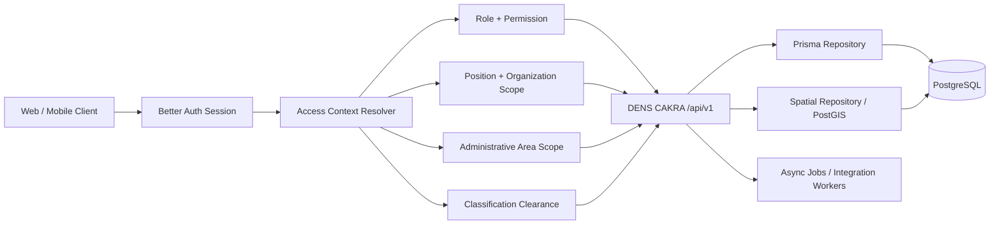
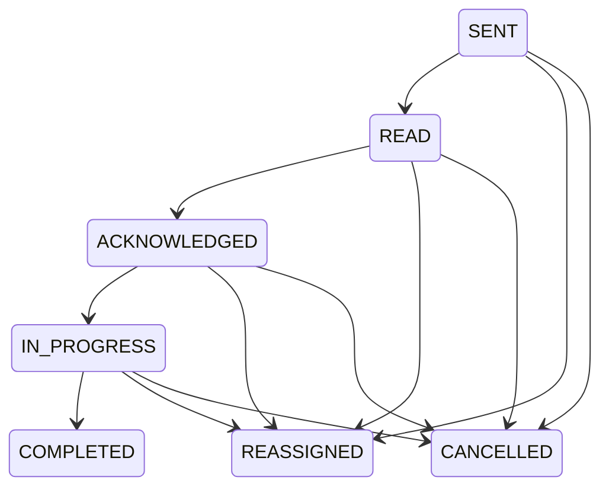
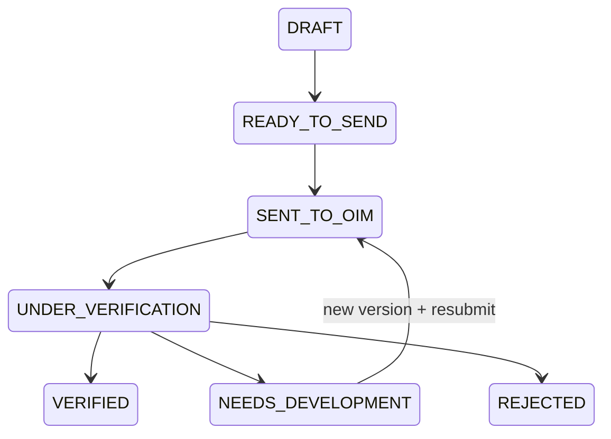
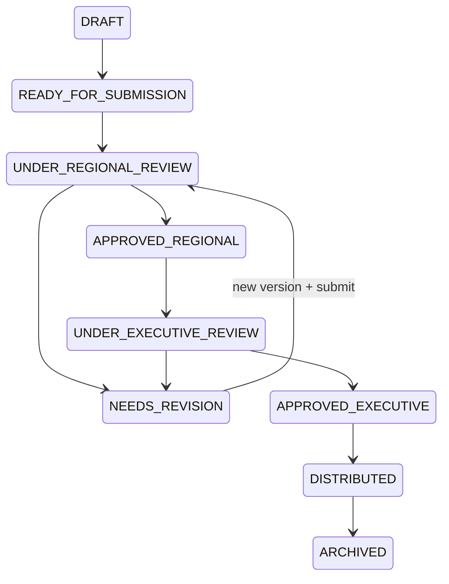

# DENS CAKRA API Contract & Endpoint Architecture

| Field | Value |
|---|---|
| Document | API Contract & Endpoint Architecture |
| Product | DENS CAKRA |
| Version | v1.0 |
| Date | 11 July 2026 |
| Author | Product Architect Pro — System Analyst |
| Status | Draft for Technical Review |
| Baseline | Final Prisma Schema supplied by user + Better Auth coarse business roles |
| API Style | REST/JSON, OpenAPI 3.0.3 |
| Domain Endpoint Count | 286 |

## Revision History

| Version | Date | Description |
|---|---|---|
| v1.0 | 11 July 2026 | Initial complete API contract derived from the final DENS CAKRA schema and agreed workflows. |

## 1. Purpose and Contract Boundary

This document defines the complete domain API surface for DENS CAKRA, including endpoint inventory, request parameters, request bodies, response contracts, authorization requirements, business rules, query logic, spatial logic, state transitions, audit requirements, and implementation sequence.

Better Auth remains responsible for authentication routes such as sign-in, sign-out, session retrieval, password management, account ban/unban, and session revocation. DENS CAKRA SHALL NOT duplicate those handlers. The domain API starts at `/api/v1` and consumes the Better Auth session as the first authorization layer.

### 1.1 Better Auth Boundary

| Responsibility | Owner | Rule |
|---|---|---|
| Credential validation, session cookie, account/provider records | Better Auth | Use the configured Better Auth handlers. |
| Coarse business role | Better Auth `User.role` | One of `admin_system`, `executive`, `regional_commander`, `operational_intelligence_manager`, `field_coordinator`, `field_officer`. |
| Functional permissions | DENS CAKRA Role/Permission | Evaluated for every domain request. |
| Position, reporting line, organization branch | DENS CAKRA | Derived from active primary `PositionAssignment`. |
| Geographic scope | DENS CAKRA | Derived from `PositionAreaScope`, unit coverage, and area closure. |
| Classification/clearance | DENS CAKRA | Resource classification rank must not exceed user clearance rank. |

## 2. API Architecture



## 3. Global API Standards

### 3.1 Base URL and Versioning

```text
/api/v1
```

- Breaking changes SHALL create `/api/v2`.
- Additive response fields MAY be introduced within v1.
- Clients SHALL ignore unknown response fields.
- Deprecated endpoints SHALL return `Deprecation` and `Sunset` headers before removal.

### 3.2 Authentication and Required Headers

| Header | Required | Purpose |
|---|---:|---|
| `Cookie` | Protected endpoints | Better Auth session. |
| `Content-Type: application/json` | JSON mutations | Request serialization. |
| `X-Request-Id` | Recommended | End-to-end tracing. Server generates one if absent. |
| `Idempotency-Key` | Required for critical create/action endpoints | Prevent duplicate submission, publish, approval, distribution, emergency creation, and webhook processing. |
| `If-Match` | Required for selected mutable drafts | Optimistic concurrency using an ETag derived from `updatedAt` or version token. |

### 3.3 Standard Success Envelope

```json
{
  "success": true,
  "data": {
    "id": "uuid"
  },
  "message": "Operation completed",
  "meta": {
    "pagination": {
      "page": 1,
      "limit": 20,
      "total": 100,
      "totalPages": 5
    },
    "filters": {
      "areaId": "uuid"
    }
  },
  "requestId": "req_01...",
  "timestamp": "2026-07-11T10:00:00.000Z"
}
```

### 3.4 Standard Error Envelope

```json
{
  "success": false,
  "error": {
    "code": "AREA_OUTSIDE_SCOPE",
    "message": "Selected area is outside the active assignment scope.",
    "fields": [
      {
        "field": "areaId",
        "code": "OUTSIDE_SCOPE",
        "message": "Area is not permitted."
      }
    ],
    "details": {
      "requiredPermission": "area.scope.manage"
    }
  },
  "requestId": "req_01...",
  "timestamp": "2026-07-11T10:00:00.000Z"
}
```

### 3.5 HTTP Status Rules

| Status | Usage |
|---:|---|
| 200 | Successful read or action returning a resource. |
| 201 | Resource created synchronously. |
| 202 | Accepted for asynchronous processing. |
| 204 | Successful delete/soft-delete with no response body. |
| 400 | Malformed syntax or invalid query format. |
| 401 | No valid Better Auth session. |
| 403 | Authenticated but lacks module/action permission where existence is not sensitive. |
| 404 | Resource absent or intentionally masked by need-to-know scope. |
| 409 | Duplicate, stale state, uniqueness conflict, or illegal concurrent state. |
| 422 | Business rule violation with valid syntax. |
| 423 | Account/profile operationally locked. |
| 428 | Required `If-Match` missing. |
| 429 | Rate limit exceeded. |
| 500 | Unhandled internal error. |
| 503 | Required dependency unavailable or readiness failed. |

### 3.6 Pagination and Filtering

- Administrative tables use `page`, `limit`, `sortBy`, and `sortOrder`; default `limit=20`, maximum `100`.
- High-volume event feeds use `cursor` and `limit`; cursor SHALL encode `(timestamp,id)` and remain opaque.
- `areaId` filters SHALL include all descendants by default unless `includeDescendants=false` is explicitly supported.
- Search terms SHALL be trimmed, normalized, minimum two characters, and maximum 100 characters.
- Date ranges SHALL use UTC ISO 8601 and SHALL reject `from > to`.

## 4. Global Authorization Rules

| ID | Rule |
|---|---|
| BR-API-AUTH-001 | Every protected request SHALL resolve Better Auth user, active UserProfile, primary active PositionAssignment, Position, Role, OrganizationUnit, area scopes, permissions, and clearance. |
| BR-API-AUTH-002 | Better Auth coarse role SHALL match the RoleCode of the active primary assignment. A mismatch SHALL deny access and create a security audit event. |
| BR-API-AUTH-003 | Role alone SHALL NOT grant resource access. Permission, reporting line, unit scope, area scope, classification, and workflow membership SHALL also pass. |
| BR-API-AUTH-004 | Classified resource existence MAY be masked as 404 instead of 403. |
| BR-API-AUTH-005 | ADMIN_SYSTEM SHALL not automatically read operational intelligence content unless explicitly granted a separate operational permission. |
| BR-API-SCOPE-001 | Area-scoped queries SHALL use AdministrativeAreaClosure so a parent filter includes descendant reports. |
| BR-API-SCOPE-002 | Organization-scoped queries SHALL use OrganizationUnitClosure or an equivalent recursive CTE. |
| BR-API-SCOPE-003 | FIELD_COORDINATOR can belong to Directorate or Binda. Branch is derived from organization ancestors and reporting line, not from role. |
| BR-API-STATE-001 | Workflow status SHALL be changed only by action endpoints, never by generic PATCH. |
| BR-API-VERSION-001 | Published/submitted/approved versions SHALL be immutable. Corrections create a new version. |
| BR-API-AUDIT-001 | Critical read, create, update, submit, verify, approve, distribute, export, lock, and spatial override actions SHALL be audited. |
| BR-API-IDEMP-001 | Webhook ingestion and critical commands SHALL be idempotent. |
| BR-API-TIME-001 | All persisted timestamps and API timestamps SHALL be UTC. |
| BR-API-DELETE-001 | Operational evidence SHALL use soft delete/archive; hard delete is prohibited. |

### 4.1 Access Context Query

```text
Better Auth Session
→ User not banned
→ UserProfile.status = ACTIVE
→ operational lock inactive
→ primary PositionAssignment active at request time
→ Position and OrganizationUnit active
→ auth role matches domain RoleCode
→ Permission exists
→ Organization scope matches
→ Area scope matches via closure
→ Clearance rank >= resource classification rank
→ Resource ownership/workflow membership matches
```

## 5. Reusable Query Logic

### 5.1 Geographic Scope Predicate

```sql
EXISTS (
  SELECT 1
  FROM "PositionAreaScope" pas
  JOIN "AdministrativeAreaClosure" aac
    ON aac."ancestorId" = pas."areaId"
  WHERE pas."positionAssignmentId" = :activeAssignmentId
    AND (pas."validUntil" IS NULL OR pas."validUntil" > now())
    AND aac."descendantId" = resource."eventAreaId"
)
```

### 5.2 Parent Area Dashboard Filter

```sql
JOIN "AdministrativeAreaClosure" filter_area
  ON filter_area."descendantId" = resource."eventAreaId"
WHERE filter_area."ancestorId" = :selectedAreaId
```

### 5.3 Organization Branch Predicate

```sql
EXISTS (
  SELECT 1
  FROM "OrganizationUnitClosure" ouc
  WHERE ouc."ancestorId" = :callerUnitId
    AND ouc."descendantId" = resource."ownerUnitId"
)
```

### 5.4 Coordinate Resolution

```sql
SELECT aa.id, aa.name, aa.level
FROM "AdministrativeAreaBoundary" aab
JOIN "AdministrativeArea" aa ON aa.id = aab."areaId"
WHERE aab."isActive" = true
  AND aab."qualityStatus" <> 'INVALID'
  AND ST_Covers(
    aab.boundary,
    ST_SetSRID(ST_MakePoint(:longitude, :latitude), 4326)
  )
ORDER BY CASE aa.level
  WHEN 'RT' THEN 1
  WHEN 'RW' THEN 2
  WHEN 'VILLAGE' THEN 3
  WHEN 'URBAN_VILLAGE' THEN 3
  WHEN 'DISTRICT' THEN 4
  WHEN 'CITY' THEN 5
  WHEN 'REGENCY' THEN 5
  WHEN 'PROVINCE' THEN 6
  WHEN 'COUNTRY' THEN 7
END
LIMIT 1;
```

### 5.5 Current Version Join

For versioned roots, list/detail queries SHALL join the version whose `versionNumber = currentVersionNumber`. Historical endpoints SHALL query the requested exact version and SHALL NOT silently substitute the current one.

## 6. Endpoint Portfolio Summary

| Module | Wave | Endpoint Count |
|---|---|---:|
| 01. Identity Context & Authorization | Foundation | 5 |
| 02. User Provisioning & Access Administration | Foundation | 11 |
| 03. Roles, Permissions & Policies | Foundation | 6 |
| 04. Organization Structure | Foundation | 10 |
| 05. Positions & Assignments | Foundation | 15 |
| 06. Administrative Areas & Spatial Services | Foundation | 18 |
| 07. File Assets | Foundation | 5 |
| 08. Directives | Operational Core | 14 |
| 09. UUK/STR | Operational Core | 10 |
| 10. Tasks & Execution Cascade | Operational Core | 18 |
| 11. Jaring Management | Operational Core | 13 |
| 12. WhatsApp Intake & Routing | Operational Core | 12 |
| 13. Baket | Operational Core | 20 |
| 14. Formal Verification | Operational Core | 11 |
| 15. Analysis Workspace | Intelligence Processing | 15 |
| 16. Product Types & Templates | Intelligence Processing | 8 |
| 17. Intelligence Products | Intelligence Processing | 15 |
| 18. Approval Workflow | Intelligence Processing | 10 |
| 19. Product Distribution | Intelligence Processing | 8 |
| 20. Dashboard & Geospatial Analytics | Decision Support | 12 |
| 21. Emergency Incidents | Decision Support | 10 |
| 22. Alerts | Decision Support | 10 |
| 23. Notifications | Foundation | 4 |
| 24. Audit & Compliance | Foundation | 4 |
| 25. Personnel Location | Decision Support | 5 |
| 26. Integration Administration | Foundation | 10 |
| 27. System Administration & Reference Data | Foundation | 7 |
| **Total** |  | **286** |

## 7. Complete Endpoint Catalog

Each endpoint row is normative. `Permission` denotes the minimum domain permission; all global authorization rules still apply.

### 01. Identity Context & Authorization

| ID | Method & Path | Purpose | Permission | Request / Params | Success Response | Query / Service Logic | Rules & Main Errors |
|---|---|---|---|---|---|---|---|
| API-CTX-001 | `GET /me` | Ambil identitas dan profil pengguna aktif | `authenticated` | Tidak ada body. Query opsional: include=primaryAssignment,unit,areaScopes | `200` MeResponse | Resolve Better Auth session; join User→UserProfile→primary active PositionAssignment→Position→Role→OrganizationUnit. | Tolak 401 jika session invalid; 423 jika banned/locked; 403 jika profile bukan ACTIVE. |
| API-CTX-002 | `GET /me/authorization-context` | Ambil konteks authorization efektif | `authenticated` | Tidak ada body | `200` AuthorizationContextResponse | Hitung coarse auth role, domain role, permission set, command branch, unit ancestors, area scopes, clearance rank. | Response tidak boleh memuat secret permission implementation details di luar kebutuhan UI. |
| API-CTX-003 | `GET /me/permissions` | Ambil permission code efektif | `authenticated` | Query: resourceType?, resourceId? | `200` PermissionListResponse | Join RolePermission; jika resource diberikan, evaluasi ownership, org scope, area scope, classification dan workflow membership. | Permission UI hanya hint; backend tetap wajib mengotorisasi setiap endpoint. |
| API-CTX-004 | `GET /me/area-scopes` | Ambil wilayah yang dapat diakses pengguna | `authenticated` | Query: includeDescendants=false\|true, level? | `200` AreaScopeListResponse | Baca PositionAreaScope aktif; perluas melalui AdministrativeAreaClosure jika includeDescendants=true. | Hanya active assignment dan scope dengan validUntil NULL/masih berlaku. |
| API-CTX-005 | `POST /me/revoke-other-sessions` | Cabut semua session lain | `authenticated` | {"reason":"string optional"} | `200` ActionResultResponse | Delegasikan ke Better Auth session revocation; pertahankan session saat ini. | Catat AUTH.REVOKE_OTHER_SESSIONS pada AuditLog; idempotent. |

### 02. User Provisioning & Access Administration

| ID | Method & Path | Purpose | Permission | Request / Params | Success Response | Query / Service Logic | Rules & Main Errors |
|---|---|---|---|---|---|---|---|
| API-USR-001 | `GET /user-profiles` | Daftar user profile | `user.read` | Query: page,limit,search,status,roleCode,positionCode,unitId,areaId,includeArchived=false | `200` Paged<UserProfileSummary> | Filter profile; join primary assignment. areaId menggunakan closure descendant match. Default deletedAt IS NULL. | Admin melihat seluruh; pimpinan hanya subordinate chain jika diberi permission. |
| API-USR-002 | `POST /user-profiles/provision` | Provision akun, profile, jabatan dan scope secara atomik | `user.provision` | {"auth":{"name":"...","email":"...","password":"...","role":"field_officer"},"profile":{"username":"...","fullName":"...","phone":"...","clearanceLevel":"TERBATAS"},"assignment":{"positionId":"uuid","validFrom":"ISO"},"areaScopeIds":["uuid"]} | `201` 201 UserProfileDetail | Transaction: create Better Auth user→UserProfile PENDING→validate role-position→create assignment→create scopes→set ACTIVE→revoke initial stale sessions if any. | Email/username unique; auth role harus match RoleCode assignment; tidak ada public self-registration; Idempotency-Key wajib. |
| API-USR-003 | `GET /user-profiles/{userProfileId}` | Detail user profile | `user.read` | Path: userProfileId; Query: include=assignments,scopes,auditSummary | `200` UserProfileDetail | Load profile dan assignment history dengan access scope. | Resource di luar command chain dikembalikan 404 untuk mencegah enumeration. |
| API-USR-004 | `PATCH /user-profiles/{userProfileId}` | Ubah metadata profile | `user.update` | {"username?":"...","fullName?":"...","phone?":"...","clearanceLevel?":"RAHASIA"} | `200` UserProfileDetail | Update field mutable saja; clearance change memerlukan permission khusus dan audit before/after. | Tidak boleh mengubah auth role, status, assignment atau scope melalui endpoint ini. |
| API-USR-005 | `POST /user-profiles/{userProfileId}/activate` | Aktifkan profile setelah provisioning | `user.activate` | {"reason":"string"} | `200` ActionResultResponse | Pastikan ada primary active assignment, role match, position aktif, area scope memenuhi policy; set status ACTIVE. | 409 jika sudah ACTIVE; 422 jika provisioning belum lengkap. |
| API-USR-006 | `POST /user-profiles/{userProfileId}/suspend` | Suspend akses operasional | `user.suspend` | {"reason":"string","until":"ISO optional","revokeSessions":true} | `200` ActionResultResponse | Set profile SUSPENDED, optional operational lock, revoke sessions; assignment history tidak dihapus. | Reason wajib; tidak boleh suspend diri sendiri kecuali break-glass policy. |
| API-USR-007 | `POST /user-profiles/{userProfileId}/archive` | Arsipkan personel | `user.archive` | {"reason":"string","effectiveAt":"ISO"} | `200` ActionResultResponse | Close all active assignments/scopes; status ARCHIVED; deletedAt opsional sesuai kebijakan; revoke sessions. | Tidak melakukan hard delete. |
| API-USR-008 | `POST /user-profiles/{userProfileId}/lock` | Operational security lock | `user.lock` | {"reason":"string","lockedUntil":"ISO optional"} | `200` ActionResultResponse | Set operationalLockedAt/reason/until dan revoke sessions. | 423 untuk akses berikutnya; semua lock harus diaudit. |
| API-USR-009 | `POST /user-profiles/{userProfileId}/unlock` | Lepas operational lock | `user.unlock` | {"reason":"string"} | `200` ActionResultResponse | Clear operational lock fields; tidak otomatis mengubah SUSPENDED menjadi ACTIVE. | Audit wajib. |
| API-USR-010 | `POST /user-profiles/{userProfileId}/change-primary-assignment` | Mutasi jabatan utama | `assignment.transfer` | {"newPositionId":"uuid","areaScopeIds":["uuid"],"effectiveAt":"ISO","reason":"string"} | `201` PositionAssignmentDetail | Single transaction: validate branch/reporting line→close old assignment/scopes→create new assignment/scopes→sync Better Auth role→revoke sessions. | Tidak boleh menghasilkan dua primary assignment aktif; Idempotency-Key wajib. |
| API-USR-011 | `GET /user-profiles/{userProfileId}/assignments` | Riwayat penugasan jabatan | `assignment.read` | Query: activeOnly=false | `200` List<PositionAssignmentDetail> | Query by userProfileId order validFrom desc. | Scope view mengikuti command chain. |

### 03. Roles, Permissions & Policies

| ID | Method & Path | Purpose | Permission | Request / Params | Success Response | Query / Service Logic | Rules & Main Errors |
|---|---|---|---|---|---|---|---|
| API-RBAC-001 | `GET /roles` | Daftar role domain | `role.read` | Query: isActive? | `200` List<RoleResponse> | Read Role plus permission count and position count. | RoleCode fixed; no delete. |
| API-RBAC-002 | `GET /roles/{roleId}` | Detail role dan permission | `role.read` | Path: roleId | `200` RoleDetail | Join RolePermission→Permission. | Tidak memuat pengguna. |
| API-RBAC-003 | `PUT /roles/{roleId}/permissions` | Ganti permission role | `role.permission.manage` | {"permissionCodes":["directive.read","task.assign"]} | `200` RoleDetail | Validate all codes; replace junction rows in transaction; invalidate authorization cache. | Admin System only; audit before/after; tidak boleh menghapus permission minimum ADMIN_SYSTEM. |
| API-RBAC-004 | `GET /permissions` | Daftar permission catalog | `permission.read` | Query: search?,module? | `200` List<PermissionResponse> | Filter Permission.code/name. | Read-only kecuali deployment seed. |
| API-RBAC-005 | `GET /position-area-policies` | Daftar kebijakan level wilayah per posisi | `area.policy.read` | Query: positionCode?,isActive? | `200` List<PositionAreaPolicyResponse> | Query PositionAreaPolicy. | Digunakan saat validasi assignment/scope. |
| API-RBAC-006 | `PUT /position-area-policies/{policyId}` | Ubah policy area posisi | `area.policy.manage` | {"scopeMode":"EXPLICIT","minimumAreas":1,"maximumAreas":5,"isActive":true} | `200` PositionAreaPolicyResponse | Update policy dan jalankan impact preview terhadap assignment aktif. | 409 jika perubahan membuat assignment aktif invalid kecuali force=true dan remediation plan. |

### 04. Organization Structure

| ID | Method & Path | Purpose | Permission | Request / Params | Success Response | Query / Service Logic | Rules & Main Errors |
|---|---|---|---|---|---|---|---|
| API-ORG-001 | `GET /organization-units` | Daftar unit organisasi | `organization.read` | Query: page,limit,search,type,parentId,isActive,branchType? | `200` Paged<OrganizationUnitSummary> | Apply organization scope via OrganizationUnitClosure; optional direct children by parentId. | Default deletedAt IS NULL. |
| API-ORG-002 | `POST /organization-units` | Buat unit organisasi | `organization.create` | {"code":"...","name":"...","type":"SUBDIRECTORATE","parentId":"uuid"} | `201` 201 OrganizationUnitDetail | Validate allowed parent-child type; insert unit and closure self/ancestor paths in transaction. | Code unique; cycle impossible on create. |
| API-ORG-003 | `GET /organization-units/{unitId}` | Detail unit | `organization.read` | Query: include=parent,children,positions,coverages | `200` OrganizationUnitDetail | Load scoped unit and requested relations. | Return 404 if outside scope. |
| API-ORG-004 | `PATCH /organization-units/{unitId}` | Ubah metadata unit | `organization.update` | {"name?":"...","isActive?":true} | `200` OrganizationUnitDetail | Update mutable fields only. | parentId tidak boleh diubah di endpoint ini. |
| API-ORG-005 | `POST /organization-units/{unitId}/move` | Pindahkan unit dalam hierarchy | `organization.move` | {"newParentId":"uuid","reason":"string"} | `200` OrganizationUnitDetail | Validate type compatibility and no cycle; rebuild affected OrganizationUnitClosure paths transactionally. | Tolak jika active workflow/assignment akan kehilangan valid branch tanpa remediation. |
| API-ORG-006 | `GET /organization-units/{unitId}/ancestors` | Ambil rantai atasan unit | `organization.read` | Query: includeSelf=true | `200` List<OrganizationUnitSummary> | Join OrganizationUnitClosure where descendantId=unitId order depth desc/asc sesuai output. | Scoped. |
| API-ORG-007 | `GET /organization-units/{unitId}/descendants` | Ambil unit turunan | `organization.read` | Query: depth?,type?,includeSelf=false | `200` List<OrganizationUnitSummary> | Join closure where ancestorId=unitId and optional depth/type. | Scoped. |
| API-ORG-008 | `GET /organization-units/{unitId}/tree` | Ambil subtree organisasi | `organization.read` | Query: maxDepth=5,includePositions=false | `200` OrganizationTreeResponse | Fetch descendants once and assemble tree in service. | Limit maxDepth untuk mencegah payload berlebih. |
| API-ORG-009 | `GET /organization-units/{unitId}/area-coverages` | Coverage wilayah unit | `organization.coverage.read` | Query: activeOnly=true,includeDescendants=false | `200` List<OrganizationAreaCoverageResponse> | Read coverage aktif; optional expand via area closure. | Hanya area dalam scope caller. |
| API-ORG-010 | `PUT /organization-units/{unitId}/area-coverages` | Ganti coverage wilayah unit | `organization.coverage.manage` | {"areas":[{"areaId":"uuid","isPrimary":true}],"effectiveAt":"ISO","reason":"string"} | `200` List<OrganizationAreaCoverageResponse> | Close existing active coverage and insert replacements in transaction; validate subset of parent unit coverage. | Minimal satu primary bila policy membutuhkan. |

### 05. Positions & Assignments

| ID | Method & Path | Purpose | Permission | Request / Params | Success Response | Query / Service Logic | Rules & Main Errors |
|---|---|---|---|---|---|---|---|
| API-POS-001 | `GET /positions` | Daftar seat/jabatan | `position.read` | Query: page,limit,search,code,roleCode,unitId,reportsToPositionId,isActive | `200` Paged<PositionSummary> | Filter Position and join role/unit/current occupant. | Apply org scope. |
| API-POS-002 | `POST /positions` | Buat seat/jabatan | `position.create` | {"code":"KORWIL","title":"Korwil Pekanbaru","roleId":"uuid","organizationUnitId":"uuid","reportsToPositionId":"uuid"} | `201` 201 PositionDetail | Validate PositionCode↔RoleCode and branch-specific reporting line. | KORWIL can be DIRECTORATE or BINDA branch but reportsTo must be KASUBDIT/KABAGOPS respectively. |
| API-POS-003 | `GET /positions/{positionId}` | Detail position | `position.read` | Query: include=occupant,subordinates,reportingChain | `200` PositionDetail | Join role, unit, active occupant. | Scoped. |
| API-POS-004 | `PATCH /positions/{positionId}` | Ubah title/status position | `position.update` | {"title?":"...","isActive?":true} | `200` PositionDetail | Update mutable metadata. | Role/unit/reporting line change uses dedicated endpoints to ensure validation. |
| API-POS-005 | `POST /positions/{positionId}/change-reporting-line` | Ubah atasan jabatan | `position.reporting.manage` | {"reportsToPositionId":"uuid","reason":"string"} | `200` PositionDetail | Validate no reporting cycle, role/branch compatibility, same or allowed organization branch. | Audit mandatory. |
| API-POS-006 | `GET /positions/{positionId}/subordinates` | Daftar bawahan langsung/berjenjang | `position.read` | Query: recursive=false,depth? | `200` List<PositionSummary> | Direct query reportsToPositionId or recursive traversal. | Only accessible command chain. |
| API-POS-007 | `GET /positions/{positionId}/reporting-chain` | Rantai komando position | `position.read` | Tidak ada body | `200` List<PositionSummary> | Recursive CTE on reportsToPositionId with cycle guard. | Used by routing and approval. |
| API-ASG-001 | `GET /position-assignments` | Daftar assignment | `assignment.read` | Query: page,limit,userProfileId,positionId,unitId,isActive,validAt | `200` Paged<PositionAssignmentDetail> | Filter assignment and joins. | Scoped by organization chain. |
| API-ASG-002 | `POST /position-assignments` | Buat assignment non-mutasi | `assignment.create` | {"userProfileId":"uuid","positionId":"uuid","isPrimary":false,"validFrom":"ISO","validUntil":"ISO optional","areaScopeIds":["uuid"]} | `201` 201 PositionAssignmentDetail | Validate user status, role match, seat vacancy, time overlap and area policy; insert assignment/scopes transactionally. | Primary role must match Better Auth role. |
| API-ASG-003 | `GET /position-assignments/{assignmentId}` | Detail assignment | `assignment.read` | Query: include=areaScopes,user,position | `200` PositionAssignmentDetail | Load scoped assignment. | 404 if inaccessible. |
| API-ASG-004 | `POST /position-assignments/{assignmentId}/close` | Tutup assignment | `assignment.close` | {"validUntil":"ISO","reason":"string"} | `200` ActionResultResponse | Set validUntil/isActive=false and close active area scopes. | Cannot close last active primary assignment without suspending user or replacement. |
| API-ASG-005 | `POST /position-assignments/{assignmentId}/set-primary` | Jadikan assignment utama | `assignment.manage` | {"reason":"string"} | `200` PositionAssignmentDetail | Transaction unset old primary, set target primary, sync auth role, revoke sessions. | Target must be active. |
| API-ASG-006 | `GET /position-assignments/{assignmentId}/area-scopes` | Ambil scope assignment | `area.scope.read` | Query: activeOnly=true,expand=false | `200` List<PositionAreaScopeResponse> | Read scopes and optional descendants. | No out-of-scope leakage. |
| API-ASG-007 | `PUT /position-assignments/{assignmentId}/area-scopes` | Ganti scope assignment | `area.scope.manage` | {"areas":[{"areaId":"uuid","isPrimary":true}],"effectiveAt":"ISO","reason":"string"} | `200` List<PositionAreaScopeResponse> | Validate allowed levels, minimum/maximum, subset of unit/parent scope; close old and insert new. | Transaction + audit. |
| API-ASG-008 | `POST /position-assignments/{assignmentId}/area-scopes/validate` | Preview validasi scope | `area.scope.manage` | {"areaIds":["uuid"]} | `200` AreaScopeValidationResponse | Run policy, closure and branch checks without persistence. | Returns violations and warnings. |

### 06. Administrative Areas & Spatial Services

| ID | Method & Path | Purpose | Permission | Request / Params | Success Response | Query / Service Logic | Rules & Main Errors |
|---|---|---|---|---|---|---|---|
| API-AREA-001 | `GET /administrative-areas` | Daftar/filter wilayah | `area.read` | Query: page,limit,search,level,parentId,isActive,withinScope=true | `200` Paged<AdministrativeAreaSummary> | Filter area; intersect caller scope through AdministrativeAreaClosure. | Default only accessible areas. |
| API-AREA-002 | `GET /administrative-areas/tree` | Cascading tree wilayah | `area.read` | Query: rootId?,maxDepth=3,levels?,includeBoundaryStatus=true | `200` AdministrativeAreaTreeResponse | Fetch closure descendants; annotate boundary availability and childCount. | Payload depth capped. |
| API-AREA-003 | `GET /administrative-areas/{areaId}` | Detail wilayah | `area.read` | Query: include=parent,children,ancestors,boundaryMeta | `200` AdministrativeAreaDetail | Load scoped area and requested relations. | No raw geometry unless requested via boundary endpoint. |
| API-AREA-004 | `GET /administrative-areas/{areaId}/children` | Anak wilayah untuk cascading filter | `area.read` | Query: level?,search?,limit=1000 | `200` List<AdministrativeAreaSummary> | Query parentId=areaId; order by name/code. | Used for Provinsi→Kab/Kota→Kecamatan→Desa→RW→RT. |
| API-AREA-005 | `GET /administrative-areas/{areaId}/ancestors` | Breadcrumb administratif | `area.read` | Query: includeSelf=true | `200` List<AdministrativeAreaSummary> | Closure where descendantId=areaId ordered highest to lowest. | Scoped. |
| API-AREA-006 | `GET /administrative-areas/{areaId}/descendants` | Turunan wilayah | `area.read` | Query: level?,maxDepth?,includeSelf=false,page,limit | `200` Paged<AdministrativeAreaSummary> | Closure where ancestorId=areaId and optional filters. | Used by filters and scope selectors. |
| API-AREA-007 | `GET /administrative-areas/search` | Search wilayah berdasarkan nama/kode | `area.read` | Query: q(min2),level?,parentId?,limit<=50 | `200` List<AdministrativeAreaSearchResult> | ILIKE/trigram on name, officialCode, code; boost exact code and ancestor context. | Apply accessible scope. |
| API-AREA-008 | `GET /administrative-areas/{areaId}/boundary` | Ambil boundary GeoJSON | `area.read` | Query: version=active\|number,format=geojson,simplifyMeters?,bboxOnly=false | `200` GeoJsonFeatureResponse | SpatialRepository uses ST_AsGeoJSON; optional ST_SimplifyPreserveTopology; return metadata. | Never return INVALID boundary; simplification capped by zoom. |
| API-AREA-009 | `GET /administrative-areas/boundaries` | Boundary berdasarkan viewport | `area.read` | Query: bbox=minLng,minLat,maxLng,maxLat,level,zoom,limit | `200` GeoJsonFeatureCollectionResponse | GiST ST_Intersects against envelope; choose simplification by zoom. | Reject overly large bbox without coarse level. |
| API-AREA-010 | `POST /administrative-areas/resolve-coordinate` | Resolve koordinat ke wilayah paling spesifik | `area.resolve` | {"latitude":-6.2,"longitude":106.8,"levels":["RT","RW","URBAN_VILLAGE","VILLAGE","DISTRICT","CITY","REGENCY","PROVINCE"],"effectiveAt":"ISO optional"} | `200` CoordinateResolutionResponse | Build Point(4326); query active boundaries with ST_Covers; rank most specific; return ancestor chain and confidence/fallback. | Does not persist; coordinate ranges mandatory. |
| API-AREA-011 | `POST /administrative-areas` | Buat wilayah manual | `area.manage` | {"code":"...","officialCode":"...","name":"...","level":"RW","parentId":"uuid","centroidLatitude":null,"centroidLongitude":null} | `201` 201 AdministrativeAreaDetail | Validate level-parent pair; insert area and closure paths. | Admin only; officialCode unique if provided. |
| API-AREA-012 | `PATCH /administrative-areas/{areaId}` | Ubah metadata wilayah | `area.manage` | {"name?":"...","isActive?":true,"centroidLatitude?":0,"centroidLongitude?":0} | `200` AdministrativeAreaDetail | Update non-hierarchy fields. | parentId/level change forbidden here. |
| API-AREA-013 | `POST /administrative-areas/{areaId}/move` | Pindahkan area hierarchy | `area.manage` | {"newParentId":"uuid","reason":"string"} | `200` AdministrativeAreaDetail | Validate no cycle and level compatibility; rebuild closure affected paths. | High-risk admin action; dryRun query parameter supported. |
| API-AREA-014 | `POST /administrative-areas/{areaId}/boundaries` | Tambah versi boundary | `area.boundary.manage` | {"dataSourceId":"uuid optional","versionNumber":2,"geoJson":{},"qualityStatus":"VERIFIED","simplificationToleranceMeters":0,"effectiveFrom":"ISO","activate":true} | `201` 201 AdministrativeAreaBoundaryResponse | Convert GeoJSON via ST_GeomFromGeoJSON→ST_Multi→SRID 4326; validate geometry; calculate centroid/bbox/hash; deactivate prior active boundary atomically if activate. | Geometry must be valid MultiPolygon and match area context. |
| API-AREA-015 | `POST /administrative-area-boundaries/{boundaryId}/activate` | Aktifkan boundary version | `area.boundary.manage` | {"effectiveFrom":"ISO","reason":"string"} | `200` AdministrativeAreaBoundaryResponse | Deactivate current active boundary and activate target in transaction. | Only one active boundary per area. |
| API-AREA-016 | `POST /administrative-area-boundaries/{boundaryId}/invalidate` | Tandai boundary invalid | `area.boundary.manage` | {"reason":"string"} | `200` AdministrativeAreaBoundaryResponse | Set qualityStatus INVALID/isActive false/effectiveUntil now. | If no active replacement, spatial resolution falls back to parent. |
| API-AREA-017 | `POST /administrative-area-imports` | Import dataset wilayah/boundary | `area.import` | multipart file + metadata {name,sourceType,referenceUrl,versionLabel,effectiveDate,mode:VALIDATE\|UPSERT} | `202` 202 ImportJobResponse | Store source metadata; parse asynchronously; validate hierarchy/codes/geometries; upsert in batches; rebuild closure. | Requires ImportJob persistence/queue; checksum idempotency. |
| API-AREA-018 | `GET /administrative-area-imports/{jobId}` | Status import | `area.import` | Path jobId | `200` ImportJobResponse | Read job progress/error summary. | Job data retained for audit. |

### 07. File Assets

| ID | Method & Path | Purpose | Permission | Request / Params | Success Response | Query / Service Logic | Rules & Main Errors |
|---|---|---|---|---|---|---|---|
| API-FILE-001 | `POST /files/presign` | Minta signed upload URL | `file.create` | {"originalName":"photo.jpg","mimeType":"image/jpeg","fileType":"PHOTO","sizeBytes":12345,"checksumSha256":"...","context":"BAKET"} | `201` 201 PresignedUploadResponse | Validate MIME, size, extension, caller permission; reserve storage key and pending metadata. | Idempotency by checksum+context; malware scan required before usable. |
| API-FILE-002 | `POST /files/complete` | Konfirmasi upload selesai | `file.create` | {"uploadToken":"...","storageKey":"..."} | `201` 201 FileAssetResponse | HEAD object; verify size/checksum; create FileAsset; enqueue malware scan. | File cannot attach until scan status clean; schema may require scan metadata extension. |
| API-FILE-003 | `GET /files/{fileId}` | Metadata file | `file.read` | Path fileId | `200` FileAssetResponse | Authorize through references/owner/need-to-know before returning metadata. | No storageKey exposure to client unless signed URL generation. |
| API-FILE-004 | `GET /files/{fileId}/access-url` | Signed download/view URL | `file.read` | Query: disposition=inline\|attachment,ttlSeconds<=300 | `200` FileAccessResponse | Authorize then generate short-lived URL. | Audit sensitive downloads/exports. |
| API-FILE-005 | `DELETE /files/{fileId}` | Soft delete file tidak terpakai | `file.delete` | Header If-Match optional | `200` 204 | Check no active references; set deletedAt; object lifecycle deletes later. | 409 if referenced; no hard delete evidence. |

### 08. Directives

| ID | Method & Path | Purpose | Permission | Request / Params | Success Response | Query / Service Logic | Rules & Main Errors |
|---|---|---|---|---|---|---|---|
| API-DIR-001 | `GET /directives` | Daftar direktif | `directive.read` | Query: page,limit,status,ownerUnitId,areaId,classification,from,to,search,assignedToMe | `200` Paged<DirectiveSummary> | Join current version; apply recipient/unit/position, org/area scope and clearance filters. | Only current version fields in summary. |
| API-DIR-002 | `POST /directives` | Buat directive dan versi awal | `directive.create` | {"ownerUnitId":"uuid","version":{"commandNumber":"...","classification":"RAHASIA","commandSource":"...","commandIssuer":"...","commandDate":"ISO","dueDate":"ISO","strategicIssue":"...","commandDescription":"...","targetAreaIds":["uuid"],"recipients":[{"targetUnitId":"uuid"}]}} | `201` 201 DirectiveDetail | Transaction create root+version1+targets+recipients draft; validate clearance and recipient target exactly-one. | Executive/authorized issuer only; commandNumber SHALL remain identical across revisions by service invariant until moved to Directive root. |
| API-DIR-003 | `GET /directives/{directiveId}` | Detail directive current version | `directive.read` | Query: include=recipients,targets,versions,tracking | `200` DirectiveDetail | Load root, current version and relations under security filter. | Classified inaccessible resource returns 404. |
| API-DIR-004 | `GET /directives/{directiveId}/versions` | Riwayat versi directive | `directive.read` | Query: page,limit | `200` Paged<DirectiveVersionSummary> | Order versionNumber desc. | Published versions immutable. |
| API-DIR-005 | `POST /directives/{directiveId}/versions` | Buat versi revisi | `directive.update` | {"basedOnVersionId":"uuid","changeReason":"string","patch":{"dueDate":"ISO","strategicIssue":"...","commandDescription":"...","targetAreaIds":[],"recipients":[]}} | `201` 201 DirectiveVersionDetail | Lock root; clone latest; apply patch; increment currentVersionNumber; insert new relations. | Allowed only before completion/cancel; preserve prior version. |
| API-DIR-006 | `GET /directive-versions/{versionId}` | Detail versi directive | `directive.read` | Tidak ada body | `200` DirectiveVersionDetail | Read exact immutable snapshot. | Security based on directive scope/classification. |
| API-DIR-007 | `PATCH /directive-versions/{versionId}` | Edit versi draft | `directive.update` | {"dueDate?":"ISO","strategicIssue?":"...","commandDescription?":"..."} | `200` DirectiveVersionDetail | Only current version while Directive.status=DRAFT. | Use If-Match/updated token; published version 409. |
| API-DIR-008 | `PUT /directive-versions/{versionId}/target-areas` | Ganti target area draft | `directive.update` | {"areaIds":["uuid"],"primaryAreaId":"uuid optional"} | `200` List<AreaSummary> | Validate target areas within issuer scope and no redundant descendants unless intentional. | Draft only. |
| API-DIR-009 | `PUT /directive-versions/{versionId}/recipients` | Ganti penerima draft | `directive.update` | {"recipients":[{"targetUnitId":"uuid"},{"targetPositionId":"uuid"}]} | `200` List<DirectiveRecipientResponse> | Validate exactly one target per recipient, clearance, command chain and target area overlap. | Draft only; no duplicate target. |
| API-DIR-010 | `POST /directive-versions/{versionId}/publish` | Publish directive | `directive.publish` | {"confirmation":"PUBLISH","note":"string optional"} | `200` DirectiveDetail | Validate mandatory fields, at least one target/recipient, clearance; set status PUBLISHED; freeze version; create audit. | Idempotency-Key; cannot unpublish. |
| API-DIR-011 | `POST /directive-versions/{versionId}/distribute` | Distribusikan directive | `directive.distribute` | {"sendNotifications":true,"scheduledAt":"ISO optional"} | `200` DistributionActionResponse | Create/send recipient deliveries, set status DISTRIBUTED; enqueue notifications/read tracking. | Only published current version; retry safe via idempotency. |
| API-DIR-012 | `POST /directive-recipients/{recipientId}/acknowledge` | Acknowledgement penerima | `directive.acknowledge` | {"note":"string optional"} | `200` DirectiveRecipientResponse | Ensure caller occupies target position/unit; set delivered/read/acknowledged timestamps monotonically. | Idempotent. |
| API-DIR-013 | `GET /directives/{directiveId}/tracking` | Tracking pelaksanaan direktif | `directive.track` | Query: areaId?,unitId?,includeTasks=true | `200` DirectiveTrackingResponse | Aggregate recipient status, descendant tasks, assignments, progress and linked Baket by area/unit. | Counts must use same scoped filter as detail. |
| API-DIR-014 | `POST /directives/{directiveId}/cancel` | Batalkan directive | `directive.cancel` | {"reason":"string"} | `200` DirectiveDetail | Set CANCELLED; cancel only not-completed descendant tasks where permitted; notify recipients. | Cannot erase historical work. |

### 09. UUK/STR

| ID | Method & Path | Purpose | Permission | Request / Params | Success Response | Query / Service Logic | Rules & Main Errors |
|---|---|---|---|---|---|---|---|
| API-UUK-001 | `GET /uuk-strs` | Daftar UUK/STR | `uuk.read` | Query: page,limit,status,ownerUnitId,directiveId,search | `200` Paged<UukStrSummary> | Join current version and directive security scope. | Clearance inherited from directive. |
| API-UUK-002 | `POST /uuk-strs` | Buat UUK/STR versi awal | `uuk.create` | {"directiveVersionId":"uuid","ownerUnitId":"uuid","title":"...","sections":[{"sectionType":"BASIS_BACKGROUND","title":"...","items":[{"itemCode":"1","content":"...","orderNumber":1}]}]} | `201` 201 UukStrDetail | Create root/version1/9 sections/items transactionally; validate directive current/published as policy. | All mandatory section types required before publish. |
| API-UUK-003 | `GET /uuk-strs/{uukStrId}` | Detail UUK/STR | `uuk.read` | Query: include=versions,sections,tasks | `200` UukStrDetail | Load current version and scoped relations. | No access beyond directive scope. |
| API-UUK-004 | `GET /uuk-strs/{uukStrId}/versions` | Riwayat versi UUK/STR | `uuk.read` | Query: page,limit | `200` Paged<UukStrVersionSummary> | Order version desc. | Immutable after publish. |
| API-UUK-005 | `POST /uuk-strs/{uukStrId}/versions` | Buat revisi UUK/STR | `uuk.update` | {"basedOnVersionId":"uuid","title":"...","changeReason":"...","sections":[...]} | `201` 201 UukStrVersionDetail | Clone or replace all sections/items; increment current version. | Preserve original UUK/PIR wording where required. |
| API-UUK-006 | `GET /uuk-str-versions/{versionId}` | Detail versi UUK/STR | `uuk.read` | Tidak ada body | `200` UukStrVersionDetail | Load exact version with ordered sections/items. | Scoped. |
| API-UUK-007 | `PATCH /uuk-str-versions/{versionId}` | Edit judul versi draft | `uuk.update` | {"title":"...","changeReason?":"..."} | `200` UukStrVersionDetail | Current DRAFT only. | Sections use dedicated PUT. |
| API-UUK-008 | `PUT /uuk-str-versions/{versionId}/sections` | Ganti seluruh section draft | `uuk.update` | {"sections":[{"sectionType":"...","title":"...","orderNumber":1,"items":[...]}]} | `200` UukStrVersionDetail | Validate unique sectionType/order and required nine sections. | Atomic replace; draft only. |
| API-UUK-009 | `POST /uuk-str-versions/{versionId}/publish` | Publish UUK/STR | `uuk.publish` | {"confirmation":"PUBLISH"} | `200` UukStrDetail | Validate completeness; set status PUBLISHED; freeze version; notify relevant chain. | Idempotency-Key. |
| API-UUK-010 | `POST /uuk-strs/{uukStrId}/cancel` | Batalkan UUK/STR | `uuk.cancel` | {"reason":"string"} | `200` UukStrDetail | Set CANCELLED and preserve linked tasks/history. | Cannot cancel after all linked tasks completed without executive override. |

### 10. Tasks & Execution Cascade

| ID | Method & Path | Purpose | Permission | Request / Params | Success Response | Query / Service Logic | Rules & Main Errors |
|---|---|---|---|---|---|---|---|
| API-TASK-001 | `GET /tasks` | Daftar tugas | `task.read` | Query: page,limit,status,priority,ownerUnitId,assigneeAssignmentId,areaId,dueBefore,dueAfter,parentTaskId,directiveId,uukStrId,overdue? | `200` Paged<TaskSummary> | Apply command chain, assignments, org/area scope and classification; current user's assigned/created/managed tasks. | Overdue computed from dueDate and status. |
| API-TASK-002 | `POST /tasks` | Buat tugas | `task.create` | {"parentTaskId":"uuid optional","directiveVersionId":"uuid optional","uukStrVersionId":"uuid optional","ownerUnitId":"uuid","title":"...","description":"...","classification":"TERBATAS","priority":"HIGH","dueDate":"ISO","targetAreaIds":["uuid"],"attachmentFileIds":[]} | `201` 201 TaskDetail | Validate creator can task downward; source consistency; target areas subset of parent; dueDate <= parent dueDate. | At least one source or explicit standalone reason. |
| API-TASK-003 | `POST /tasks/{taskId}/child-tasks` | Buat tugas turunan | `task.create` | {"ownerUnitId":"uuid","title":"...","description":"...","dueDate":"ISO","targetAreaIds":[]} | `201` 201 TaskDetail | Inherit classification/source; enforce downward reporting chain and area subset. | Cannot lower classification without redaction workflow. |
| API-TASK-004 | `GET /tasks/{taskId}` | Detail tugas | `task.read` | Query: include=assignments,targetAreas,attachments,parent,children | `200` TaskDetail | Load scoped task and relations. | Classified 404 masking. |
| API-TASK-005 | `PATCH /tasks/{taskId}` | Edit tugas draft | `task.update` | {"title?":"...","description?":"...","priority?":"URGENT","dueDate?":"ISO"} | `200` TaskDetail | Only DRAFT and creator/owner authorized. | Status not patchable. |
| API-TASK-006 | `PUT /tasks/{taskId}/target-areas` | Ganti target area tugas | `task.update` | {"areaIds":["uuid"]} | `200` List<AreaSummary> | Validate scope and parent subset. | Only before assignment or with controlled change version/audit. |
| API-TASK-007 | `POST /tasks/{taskId}/assignments` | Assign tugas ke personel | `task.assign` | {"assignments":[{"assigneeAssignmentId":"uuid","dueDate":"ISO","assignmentNote":"..."}]} | `201` 201 List<TaskAssignmentDetail> | Validate direct/subordinate chain, active assignment, area overlap, clearance, workload policy; create assignment and notifications. | No self-assign unless allowed; duplicate active assignment conflict. |
| API-TASK-008 | `GET /tasks/{taskId}/assignments` | Daftar assignment tugas | `task.read` | Query: status?,page,limit | `200` Paged<TaskAssignmentDetail> | Query by taskId with scoped visibility. | Managers see subordinates; assignee sees own. |
| API-TASK-009 | `GET /task-assignments/{assignmentId}` | Detail task assignment | `task.read` | Query: include=progress,bakets | `200` TaskAssignmentDetail | Authorize assignee/assigner/command chain. | 404 if inaccessible. |
| API-TASK-010 | `POST /task-assignments/{assignmentId}/mark-read` | Tandai tugas dibaca | `task.execute` | Tidak ada body | `200` TaskAssignmentDetail | Set readAt once; SENT→READ. | Assignee only; idempotent. |
| API-TASK-011 | `POST /task-assignments/{assignmentId}/acknowledge` | Terima tugas | `task.execute` | {"note":"string optional"} | `200` TaskAssignmentDetail | Set acknowledgedAt; status READ/SENT→ACKNOWLEDGED. | Assignee only. |
| API-TASK-012 | `POST /task-assignments/{assignmentId}/start` | Mulai pengerjaan | `task.execute` | Tidak ada body | `200` TaskAssignmentDetail | Set startedAt; status ACKNOWLEDGED→IN_PROGRESS; update parent task aggregate. | Must acknowledge first unless policy auto-ack. |
| API-TASK-013 | `POST /task-assignments/{assignmentId}/progress` | Tambah progress log | `task.execute` | {"progressPercent":60,"note":"...","status":"IN_PROGRESS"} | `201` 201 TaskProgressLogResponse | Insert append-only progress log; update assignment status/timestamps if valid transition. | Percent 0..100; cannot decrease without correction reason. |
| API-TASK-014 | `POST /task-assignments/{assignmentId}/complete` | Selesaikan assignment | `task.execute` | {"note":"...","completionEvidenceFileIds":[]} | `200` TaskAssignmentDetail | Validate required outputs/Baket as task policy; set COMPLETED/100%; recalc task completion. | Cannot complete cancelled/reassigned. |
| API-TASK-015 | `POST /task-assignments/{assignmentId}/reassign` | Alihkan assignment | `task.reassign` | {"newAssigneeAssignmentId":"uuid","reason":"string","dueDate":"ISO optional"} | `201` 201 TaskAssignmentDetail | Transaction mark old REASSIGNED, create new linked reassignedFromId, copy task, notify both. | Validate chain/scope; idempotency. |
| API-TASK-016 | `POST /tasks/{taskId}/cancel` | Batalkan tugas | `task.cancel` | {"reason":"string","cascade":false} | `200` TaskDetail | Set task CANCELLED; cancel eligible active assignments; optional cascade to child tasks. | Completed assignments remain immutable. |
| API-TASK-017 | `GET /tasks/{taskId}/cascade` | Visualisasi cascade tugas | `task.read` | Query: includeAssignments=true,maxDepth=10 | `200` TaskCascadeResponse | Recursive CTE task hierarchy plus assignments. | Scoped and depth-capped. |
| API-TASK-018 | `GET /tasks/{taskId}/progress-summary` | Ringkasan progress | `task.read` | Query: groupBy=unit\|area\|position | `200` TaskProgressSummaryResponse | Aggregate assignment statuses, overdue, latest progress by group. | Same security filter as task list. |

### 11. Jaring Management

| ID | Method & Path | Purpose | Permission | Request / Params | Success Response | Query / Service Logic | Rules & Main Errors |
|---|---|---|---|---|---|---|---|
| API-JAR-001 | `GET /jaring` | Daftar Jaring | `jaring.read` | Query: page,limit,search,status,caretakerAssignmentId,areaId,hasRecentMessage? | `200` Paged<JaringSummary> | Filter by caretaker/area closure and caller command chain. | Alias/phone field-level redaction by permission. |
| API-JAR-002 | `POST /jaring` | Daftarkan Jaring | `jaring.create` | {"code":"...","aliasName":"...","whatsappNumber":"628...","notes":"...","caretakerAssignmentId":"uuid","areaCoverages":[{"areaId":"uuid","isPrimary":true}]} | `201` 201 JaringDetail | Normalize phone; validate unique active number; validate caretaker is active FIELD_OFFICER and coverage subset; transaction create all. | Jaring has no auth account. |
| API-JAR-003 | `GET /jaring/{jaringId}` | Detail Jaring | `jaring.read` | Query: include=caretakers,coverages,stats | `200` JaringDetail | Scoped by caretaker/command chain/area. | Sensitive identity redacted based on permission. |
| API-JAR-004 | `PATCH /jaring/{jaringId}` | Ubah metadata Jaring | `jaring.update` | {"aliasName?":"...","notes?":"...","whatsappNumber?":"628..."} | `200` JaringDetail | Normalize/validate phone; mutable while not ARCHIVED. | Caretaker/coverage/status not changed here. |
| API-JAR-005 | `POST /jaring/{jaringId}/activate` | Aktifkan Jaring | `jaring.manage` | {"reason":"string"} | `200` JaringDetail | Validate active caretaker and unique number; set ACTIVE. | Archived may require reactivation permission. |
| API-JAR-006 | `POST /jaring/{jaringId}/deactivate` | Nonaktifkan Jaring | `jaring.manage` | {"reason":"string","effectiveAt":"ISO"} | `200` JaringDetail | Set INACTIVE/deactivatedAt; preserve messages/history. | Does not delete. |
| API-JAR-007 | `POST /jaring/{jaringId}/archive` | Arsipkan Jaring | `jaring.manage` | {"reason":"string"} | `200` JaringDetail | Close caretaker/coverages; set ARCHIVED/deletedAt optional. | No hard delete. |
| API-JAR-008 | `GET /jaring/{jaringId}/caretakers` | Riwayat caretaker | `jaring.read` | Query: activeOnly=false | `200` List<JaringCaretakerAssignmentResponse> | Order validFrom desc. | Scoped. |
| API-JAR-009 | `POST /jaring/{jaringId}/caretaker-transfer` | Transfer pengelola Field Officer | `jaring.transfer` | {"newFieldOfficerAssignmentId":"uuid","effectiveAt":"ISO","reason":"string"} | `201` 201 JaringCaretakerAssignmentResponse | Transaction close old caretaker and create new; validate role, area overlap and command branch. | Exactly one active caretaker. |
| API-JAR-010 | `GET /jaring/{jaringId}/area-coverages` | Coverage Jaring | `jaring.read` | Query: activeOnly=true,expand=false | `200` List<JaringAreaCoverageResponse> | Read coverages. | Sensitive scope visibility restricted. |
| API-JAR-011 | `PUT /jaring/{jaringId}/area-coverages` | Ganti coverage Jaring | `jaring.coverage.manage` | {"areas":[{"areaId":"uuid","isPrimary":true}],"effectiveAt":"ISO","reason":"string"} | `200` List<JaringAreaCoverageResponse> | Validate local levels and subset of caretaker assignment scope; close/insert transaction. | At least one primary area. |
| API-JAR-012 | `GET /jaring/{jaringId}/messages` | Pesan WhatsApp milik Jaring | `whatsapp.read` | Query: cursor,limit,status,from,to | `200` CursorPage<WhatsAppMessageSummary> | Filter jaringId and scope; order receivedAt desc. | Raw payload not included. |
| API-JAR-013 | `GET /jaring/{jaringId}/bakets` | Baket terkait Jaring | `baket.read` | Query: page,limit,status | `200` Paged<BaketSummary> | Query primaryJaringId or source messages linked to Jaring. | Need-to-know applies. |

### 12. WhatsApp Intake & Routing

| ID | Method & Path | Purpose | Permission | Request / Params | Success Response | Query / Service Logic | Rules & Main Errors |
|---|---|---|---|---|---|---|---|
| API-WA-001 | `POST /webhooks/whatsapp/{channelCode}` | Terima webhook WhatsApp | `public-signed` | Headers provider signature, Idempotency-Key optional; raw provider payload | `202` 202 WebhookAckResponse | Verify signature/channel; persist IntegrationWebhookEvent raw; dedupe external event; enqueue parsing; return quickly. | No business processing synchronously; rate limit and replay protection. |
| API-WA-002 | `GET /whatsapp-messages` | Inbox pesan WhatsApp | `whatsapp.read` | Query: cursor,limit,status,validationStatus,jaringId,routedToAssignmentId,resolvedAreaId,from,to,hasGps?,unknownSender? | `200` CursorPage<WhatsAppMessageSummary> | Apply routing assignment/command chain/area scope; no rawPayload by default. | Cursor based on receivedAt,id. |
| API-WA-003 | `GET /whatsapp-messages/{messageId}` | Detail pesan WhatsApp | `whatsapp.read` | Query: include=media,routingLogs,rawPayload(false) | `200` WhatsAppMessageDetail | Authorize via routed Field Officer, caretaker, command chain; fetch media and area breadcrumb. | rawPayload requires whatsapp.raw.read and audit. |
| API-WA-004 | `POST /whatsapp-messages/{messageId}/link-jaring` | Hubungkan unknown sender ke Jaring | `whatsapp.route` | {"jaringId":"uuid"} | `200` WhatsAppMessageDetail | Validate normalized senderPhone equals Jaring number or privileged override with reason. | Raw message remains immutable; only relation/status changes. |
| API-WA-005 | `POST /whatsapp-messages/{messageId}/validate` | Validasi format laporan | `whatsapp.validate` | {"forceRevalidate":false} | `200` WhatsAppValidationResponse | Check title, photo media, GPS pair, content; persist summary/issues per final schema; set validationStatus. | One message may have multiple issues; endpoint should return all. |
| API-WA-006 | `POST /whatsapp-messages/{messageId}/resolve-area` | Resolve GPS ke area | `whatsapp.resolve` | {"force":false} | `200` CoordinateResolutionResponse | Use locationPoint or lat/lng; ST_Covers active boundaries; update resolvedAreaId/method/confidence/time. | Do not discard original coordinates. |
| API-WA-007 | `POST /whatsapp-messages/{messageId}/route` | Route pesan ke Field Officer | `whatsapp.route` | {"fieldOfficerAssignmentId":"uuid optional","mode":"AUTO\|MANUAL","note":"string optional"} | `200` WhatsAppMessageDetail | AUTO: active Jaring caretaker then area coverage fallback; MANUAL validates active FIELD_OFFICER and scope; append routing log. | Field Coordinator is not mandatory bottom-up hop; route target is Field Officer. |
| API-WA-008 | `POST /whatsapp-messages/{messageId}/mark-spam` | Tandai spam | `whatsapp.moderate` | {"reason":"string"} | `200` WhatsAppMessageDetail | Set SPAM and routing log; no delete. | Cannot mark linked processed Baket as spam without supervisor review. |
| API-WA-009 | `POST /whatsapp-messages/{messageId}/mark-duplicate` | Tandai duplikat | `whatsapp.moderate` | {"canonicalMessageId":"uuid","reason":"string"} | `200` WhatsAppMessageDetail | Set DUPLICATE and record canonical reference in metadata/routing note. | Canonical must be accessible and not self. |
| API-WA-010 | `GET /whatsapp-messages/{messageId}/routing-logs` | Riwayat routing | `whatsapp.read` | Tidak ada body | `200` List<WhatsAppRoutingLogResponse> | Query messageId order createdAt. | Append-only. |
| API-WA-011 | `POST /whatsapp-messages/{messageId}/create-baket` | Buat Baket dari pesan | `baket.create` | {"title":"... optional","taskAssignmentId":"uuid optional","additionalMessageIds":[]} | `201` 201 BaketDetail | Validate caller Field Officer is routed caretaker; create Baket/version1/source links; copy original content/GPS/area; do not mutate message. | Idempotency prevents duplicate Baket for same request. |
| API-WA-012 | `GET /whatsapp-inbox/summary` | Ringkasan inbox | `whatsapp.read` | Query: areaId?,from?,to? | `200` WhatsAppInboxSummaryResponse | Aggregate counts by status/validation/unknown sender/routing SLA under identical scope. | No global count leakage. |

### 13. Baket

| ID | Method & Path | Purpose | Permission | Request / Params | Success Response | Query / Service Logic | Rules & Main Errors |
|---|---|---|---|---|---|---|---|
| API-BAK-001 | `GET /bakets` | Daftar Baket | `baket.read` | Query: page,limit,status,urgency,createdByAssignmentId,taskAssignmentId,jaringId,areaId,from,to,search,coverageStatus | `200` Paged<BaketSummary> | Join current version; apply owner/recipient OIM chain, area scope, org scope and classification if inherited. | areaId includes descendants. |
| API-BAK-002 | `POST /bakets` | Buat Baket manual/from task | `baket.create` | {"taskAssignmentId":"uuid optional","primaryJaringId":"uuid optional","sourceMessageIds":[],"version":{"title":"...","originalContent":"...","normalizedContent":"...","eventTime":"ISO","latitude":0,"longitude":0,"urgency":"NORMAL","fieldOfficerNote":"..."},"attachmentFileIds":[]} | `201` 201 BaketDetail | Only FIELD_OFFICER; require source message or task assignment per rule; resolve area and coverage; create version1/links/attachments. | Field Officer cannot set A-F/1-6. |
| API-BAK-003 | `GET /bakets/{baketId}` | Detail Baket current version | `baket.read` | Query: include=versions,sources,attachments,revisionRequests,verification | `200` BaketDetail | Load root/current version/traceability under access context. | Verified data read-only for lower unit. |
| API-BAK-004 | `GET /bakets/{baketId}/versions` | Riwayat versi Baket | `baket.read` | Query: page,limit | `200` Paged<BaketVersionSummary> | Order version desc. | Submitted versions immutable. |
| API-BAK-005 | `POST /bakets/{baketId}/versions` | Buat versi revisi Baket | `baket.update` | {"basedOnVersionId":"uuid","revisionReason":"string","patch":{"title":"...","originalContent":"...","normalizedContent":"...","eventTime":"ISO","latitude":0,"longitude":0,"fieldOfficerNote":"..."}} | `201` 201 BaketVersionDetail | Clone prior, apply correction, resolve area/coverage, increment current version. | Allowed owner Field Officer only when DRAFT or NEEDS_DEVELOPMENT. |
| API-BAK-006 | `GET /baket-versions/{versionId}` | Detail versi Baket | `baket.read` | Tidak ada body | `200` BaketVersionDetail | Read exact snapshot with area breadcrumb. | Scoped. |
| API-BAK-007 | `PATCH /baket-versions/{versionId}` | Edit versi draft | `baket.update` | {"title?":"...","originalContent?":"...","normalizedContent?":"...","eventTime?":"ISO","latitude?":0,"longitude?":0,"urgency?":"HIGH","fieldOfficerNote?":"..."} | `200` BaketVersionDetail | Only current version while Baket DRAFT/NEEDS_DEVELOPMENT and not submitted. | Coordinates must be pair; any change reruns resolution. |
| API-BAK-008 | `PUT /bakets/{baketId}/source-messages` | Ganti/tambah sumber pesan draft | `baket.update` | {"messageIds":["uuid"]} | `200` List<WhatsAppMessageSummary> | Validate caller access to messages; replace links only before submit. | At least one source if no task assignment. |
| API-BAK-009 | `PUT /bakets/{baketId}/attachments` | Ganti lampiran draft | `baket.update` | {"attachments":[{"fileId":"uuid","caption":"..."}]} | `200` List<FileAssetResponse> | Validate clean files and ownership; replace links. | Evidence preserved after submit. |
| API-BAK-010 | `POST /baket-versions/{versionId}/resolve-area` | Resolve ulang area Baket | `baket.update` | {"force":false} | `200` CoordinateResolutionResponse | ST_Covers coordinate; update eventAreaId/method/confidence/time. | Cannot alter submitted version except system correction policy creates new version. |
| API-BAK-011 | `POST /baket-versions/{versionId}/manual-area-override` | Override area hasil spatial | `baket.update` | {"eventAreaId":"uuid","reason":"string"} | `200` BaketVersionDetail | Validate selected area contains point or record warning; set MANUAL_CONFIRMATION and reason. | Reason mandatory; audit. |
| API-BAK-012 | `POST /baket-versions/{versionId}/validate-coverage` | Validasi coverage berlapis | `baket.update` | {"scopeTypes":["JARING","FIELD_OFFICER","FIELD_COORDINATOR","ORGANIZATION_UNIT"]} | `200` CoverageValidationResponse | Compare eventArea against active coverages via closure; return per-layer detail and persist summary. | Out-of-scope does not auto-reject. |
| API-BAK-013 | `POST /bakets/{baketId}/submit` | Kirim Baket ke OIM | `baket.submit` | {"confirmation":"SUBMIT"} | `200` BaketDetail | Validate current version completeness, source/task, coordinates/area warning, attachments policy; set SENT_TO_OIM; resolve target OIM from reporting branch; notify. | Field Officer only; idempotency. |
| API-BAK-014 | `POST /bakets/{baketId}/resubmit` | Kirim ulang setelah revisi | `baket.submit` | {"versionId":"uuid","revisionRequestId":"uuid"} | `200` BaketDetail | Ensure new version resolves open request; set RESUBMITTED/request IN_PROGRESS→RESUBMITTED and Baket SENT_TO_OIM. | Version must be newer than requested-against. |
| API-BAK-015 | `GET /bakets/{baketId}/revision-requests` | Daftar permintaan revisi | `baket.read` | Query: status? | `200` List<BaketRevisionRequestResponse> | Query by baketId order createdAt desc. | Scoped. |
| API-BAK-016 | `POST /bakets/{baketId}/revision-requests` | Minta pengembangan/revisi | `baket.request-development` | {"requestedAgainstVersionId":"uuid","reason":"string","requiredInformation":"string","dueDate":"ISO optional"} | `201` 201 BaketRevisionRequestResponse | OIM only; create request, set Baket NEEDS_DEVELOPMENT, notify original Field Officer. | Only one open canonical request unless explicitly parallel. |
| API-BAK-017 | `POST /baket-revision-requests/{requestId}/resolve` | Tutup permintaan revisi | `baket.request-development` | {"resolvedByVersionId":"uuid","note":"string optional"} | `200` BaketRevisionRequestResponse | Validate version belongs to Baket and is newer; set RESOLVED/resolvedAt. | OIM or system after accepted resubmission. |
| API-BAK-018 | `POST /baket-revision-requests/{requestId}/cancel` | Batalkan permintaan revisi | `baket.request-development` | {"reason":"string"} | `200` BaketRevisionRequestResponse | Set CANCELLED; recalc Baket state based on remaining open requests. | Audit. |
| API-BAK-019 | `GET /bakets/{baketId}/timeline` | Timeline Baket | `baket.read` | Tidak ada body | `200` TimelineResponse | Merge versions, status events, revision requests, verification, audit events sorted time. | Field-level redaction. |
| API-BAK-020 | `GET /bakets/{baketId}/traceability` | Traceability sumber-ke-produk | `baket.read` | Tidak ada body | `200` BaketTraceabilityResponse | Graph source messages→versions→verification→analysis→products→approvals/distributions. | Only nodes caller can access; report redacted node counts if policy allows. |

### 14. Formal Verification

| ID | Method & Path | Purpose | Permission | Request / Params | Success Response | Query / Service Logic | Rules & Main Errors |
|---|---|---|---|---|---|---|---|
| API-VER-001 | `GET /verifications` | Daftar verification | `verification.read` | Query: page,limit,status,verifiedByAssignmentId,baketId,areaId,from,to,reliability,credibility | `200` Paged<VerificationSummary> | Join BaketVersion/Baket current context; OIM branch/area scope. | Only OIM and authorized leaders. |
| API-VER-002 | `POST /baket-versions/{versionId}/verification` | Buat canonical verification | `verification.create` | {"summary":"string optional"} | `201` 201 VerificationDetail | Validate Baket SENT_TO_OIM/UNDER_VERIFICATION, caller OIM for branch, no canonical verification exists; set Baket UNDER_VERIFICATION. | One canonical verification per BaketVersion. |
| API-VER-003 | `GET /verifications/{verificationId}` | Detail verification | `verification.read` | Query: include=checks,crossReferences,baket | `200` VerificationDetail | Load scoped verification. | Source identity redaction as needed. |
| API-VER-004 | `POST /verifications/{verificationId}/start` | Mulai verification | `verification.update` | Tidak ada body | `200` VerificationDetail | DRAFT→IN_PROGRESS; startedAt if absent. | Verifier assignment only or delegated OIM. |
| API-VER-005 | `PATCH /verifications/{verificationId}` | Edit draft/in-progress verification | `verification.update` | {"sourceReliability?":"A","informationCredibility?":"ONE","summary?":"..."} | `200` VerificationDetail | Update score/summary only before completed. | A-F/1-6 only OIM. |
| API-VER-006 | `PUT /verifications/{verificationId}/checks` | Ganti verification checklist | `verification.update` | {"checks":[{"code":"SOURCE_IDENTITY","label":"...","status":"PASS","note":"..."}]} | `200` List<VerificationCheckResponse> | Validate required check codes; atomic upsert/replace. | IN_PROGRESS only. |
| API-VER-007 | `PUT /verifications/{verificationId}/cross-references` | Ganti cross references | `verification.update` | {"references":[{"relatedBaketId":"uuid optional","externalRef":"string optional","description":"..."}]} | `200` List<VerificationCrossReferenceResponse> | Each item requires relatedBaketId or externalRef; validate access. | IN_PROGRESS only. |
| API-VER-008 | `POST /verifications/{verificationId}/complete` | Selesaikan verification valid | `verification.complete` | {"decision":"VERIFIED","summary":"..."} | `200` VerificationDetail | Validate all mandatory checks, sourceReliability and informationCredibility; set VERIFIED/completedAt; Baket VERIFIED; notify/create analysis eligibility. | Immutable after complete; idempotency. |
| API-VER-009 | `POST /verifications/{verificationId}/needs-development` | Kembalikan untuk pengembangan | `verification.complete` | {"reason":"...","requiredInformation":"...","dueDate":"ISO optional"} | `200` VerificationDetail | Set NEEDS_DEVELOPMENT/completedAt; create BaketRevisionRequest; set Baket NEEDS_DEVELOPMENT; notify Field Officer. | Transactional. |
| API-VER-010 | `POST /verifications/{verificationId}/reject` | Tolak Baket | `verification.complete` | {"reason":"string"} | `200` VerificationDetail | Set REJECTED/completedAt and Baket REJECTED. | Requires explicit reason and elevated permission. |
| API-VER-011 | `GET /verifications/{verificationId}/score` | Ringkasan Neraca Penilaian | `verification.read` | Tidak ada body | `200` VerificationScoreResponse | Return A-F,1-6, matrix label and interpretation from controlled reference mapping. | Interpretation is descriptive, not auto intelligence conclusion. |

### 15. Analysis Workspace

| ID | Method & Path | Purpose | Permission | Request / Params | Success Response | Query / Service Logic | Rules & Main Errors |
|---|---|---|---|---|---|---|---|
| API-ANL-001 | `GET /analysis-cases` | Daftar analysis case | `analysis.read` | Query: page,limit,status,ownerUnitId,periodFrom,periodTo,search,areaId? | `200` Paged<AnalysisCaseSummary> | Filter owner unit via org closure and source Baket areas if area filter. | OIM and authorized leaders. |
| API-ANL-002 | `POST /analysis-cases` | Buat analysis case | `analysis.create` | {"ownerUnitId":"uuid","title":"...","periodStart":"ISO optional","periodEnd":"ISO optional","verificationIds":["uuid"]} | `201` 201 AnalysisCaseDetail | Validate all verifications VERIFIED and accessible; create case/version1 optional. | At least one source recommended/required by policy. |
| API-ANL-003 | `GET /analysis-cases/{caseId}` | Detail analysis case | `analysis.read` | Query: include=sources,versions,graphSummary | `200` AnalysisCaseDetail | Load scoped case. | Clearance from highest source classification. |
| API-ANL-004 | `PATCH /analysis-cases/{caseId}` | Ubah metadata case draft | `analysis.update` | {"title?":"...","periodStart?":"ISO","periodEnd?":"ISO"} | `200` AnalysisCaseDetail | Only DRAFT/IN_REVIEW. | Validate period order. |
| API-ANL-005 | `PUT /analysis-cases/{caseId}/sources` | Ganti sumber verification | `analysis.update` | {"verificationIds":["uuid"]} | `200` List<VerificationSummary> | Validate VERIFIED/access; replace source junction. | Cannot remove source already cited by validated version without new version. |
| API-ANL-006 | `GET /analysis-cases/{caseId}/versions` | Riwayat analysis versions | `analysis.read` | Query: page,limit | `200` Paged<AnalysisVersionSummary> | Order version desc. | Validated versions immutable. |
| API-ANL-007 | `POST /analysis-cases/{caseId}/versions` | Buat versi analisis | `analysis.update` | {"basedOnVersionId":"uuid optional","indications":"...","analysis":"...","impact":"...","efforts":"...","recommendations":"...","aiDraft":{} optional} | `201` 201 AnalysisVersionDetail | Create new version, optionally clone entities/relationships; increment current version. | AI draft must be marked and human validated before use. |
| API-ANL-008 | `GET /analysis-versions/{versionId}` | Detail versi analisis | `analysis.read` | Query: include=entities,relationships | `200` AnalysisVersionDetail | Load exact version. | Scoped. |
| API-ANL-009 | `PATCH /analysis-versions/{versionId}` | Edit versi analisis belum tervalidasi | `analysis.update` | {"indications?":"...","analysis?":"...","impact?":"...","efforts?":"...","recommendations?":"...","aiDraft?":{}} | `200` AnalysisVersionDetail | Only current unvalidated version. | validatedAt not patchable. |
| API-ANL-010 | `PUT /analysis-versions/{versionId}/entities` | Ganti entities | `analysis.update` | {"entities":[{"clientKey":"e1","entityType":"PERSON","name":"...","normalizedName":"...","metadata":{}}]} | `200` List<AnalysisEntityResponse> | Atomic replace/upsert with client keys for relationship mapping. | Unvalidated version only. |
| API-ANL-011 | `PUT /analysis-versions/{versionId}/relationships` | Ganti relationships | `analysis.update` | {"relationships":[{"fromEntityId":"uuid","toEntityId":"uuid","relationshipType":"...","description":"...","confidence":80}]} | `200` List<AnalysisRelationshipResponse> | Validate both entities belong to same version; confidence 0..100. | Unvalidated only. |
| API-ANL-012 | `POST /analysis-versions/{versionId}/validate` | Human validation analisis | `analysis.validate` | {"decision":"VALIDATE","note":"string optional"} | `200` AnalysisVersionDetail | Ensure completeness/source traceability; set validatedBy/At and case VALIDATED. | Validator may be distinct from creator per policy. |
| API-ANL-013 | `GET /analysis-cases/{caseId}/graph` | Graph entities/relationships | `analysis.read` | Query: version=current\|number,entityType?,minConfidence? | `200` AnalysisGraphResponse | Query entities/relationships for selected version. | No raw AI-only nodes unless accepted. |
| API-ANL-014 | `GET /analysis-cases/{caseId}/traceability` | Traceability analysis | `analysis.read` | Tidak ada body | `200` AnalysisTraceabilityResponse | Return verification→Baket→messages and downstream product links. | Redact inaccessible source nodes. |
| API-ANL-015 | `POST /analysis-cases/{caseId}/archive` | Arsipkan case | `analysis.archive` | {"reason":"string"} | `200` AnalysisCaseDetail | Set ARCHIVED; no deletion. | Cannot archive active product dependency without warning/override. |

### 16. Product Types & Templates

| ID | Method & Path | Purpose | Permission | Request / Params | Success Response | Query / Service Logic | Rules & Main Errors |
|---|---|---|---|---|---|---|---|
| API-TPL-001 | `GET /product-types` | Daftar jenis produk intelijen | `product.template.read` | Query: isActive? | `200` List<ProductTypeResponse> | Read ProductTypeDefinition with active template version. | Available to product creators. |
| API-TPL-002 | `POST /product-types` | Buat jenis produk | `product.template.manage` | {"code":"...","name":"...","formatNo":"...","description":"..."} | `201` 201 ProductTypeResponse | Insert unique code. | Admin/template manager only. |
| API-TPL-003 | `PATCH /product-types/{productTypeId}` | Ubah metadata jenis produk | `product.template.manage` | {"name?":"...","formatNo?":"...","description?":"...","isActive?":true} | `200` ProductTypeResponse | Update metadata, not code if already used. | Deactivation does not invalidate existing products. |
| API-TPL-004 | `GET /product-types/{productTypeId}/templates` | Daftar versi template | `product.template.read` | Query: activeOnly=false | `200` List<ProductTemplateSummary> | Order versionNumber desc. | Template used by product remains readable. |
| API-TPL-005 | `POST /product-types/{productTypeId}/templates` | Buat template version | `product.template.manage` | {"name":"...","sections":[{"code":"SUMMARY","title":"Ringkasan","orderNumber":1,"isRepeatable":false,"fields":[{"code":"content","label":"Isi","dataType":"richtext","isRequired":true,"orderNumber":1,"validation":{}}]}],"activate":true} | `201` 201 ProductTemplateDetail | Create next version with sections/fields atomically; optionally deactivate prior active. | Template version immutable once used by ProductVersion. |
| API-TPL-006 | `GET /product-templates/{templateId}` | Detail template | `product.template.read` | Tidak ada body | `200` ProductTemplateDetail | Load ordered sections/fields. | Scoped by active product type. |
| API-TPL-007 | `POST /product-templates/{templateId}/activate` | Aktifkan template | `product.template.manage` | {"reason":"string"} | `200` ProductTemplateDetail | Deactivate other active templates of type and activate target. | One active template per product type. |
| API-TPL-008 | `POST /product-templates/{templateId}/validate-content` | Validasi payload produk terhadap template | `product.create` | {"content":{}} | `200` TemplateValidationResponse | Apply required/dataType/validation JSON rules. | No persistence; returns all field errors. |

### 17. Intelligence Products

| ID | Method & Path | Purpose | Permission | Request / Params | Success Response | Query / Service Logic | Rules & Main Errors |
|---|---|---|---|---|---|---|---|
| API-PRD-001 | `GET /products` | Daftar produk intelijen | `product.read` | Query: page,limit,status,productTypeId,ownerUnitId,classification,areaId,periodFrom,periodTo,search,createdByAssignmentId | `200` Paged<IntelligenceProductSummary> | Join current version/type; apply org/area/clearance/workflow/distribution scope. | Only approved/distributed visibility for broader audiences. |
| API-PRD-002 | `POST /products` | Buat produk dan versi awal | `product.create` | {"productTypeId":"uuid","ownerUnitId":"uuid","classification":"RAHASIA","productNumber":"...","title":"...","periodStart":"ISO","periodEnd":"ISO","version":{"templateId":"uuid","routingTo":"...","routingFrom":"...","routingCc":"...","subject":"...","content":{},"sourceVerificationIds":[],"sourceAnalysisVersionIds":[],"attachmentFileIds":[]}} | `201` 201 IntelligenceProductDetail | OIM only; validate template content, source access/status, classification >= sources; create root/version1/junctions. | At least one verified source or validated analysis. |
| API-PRD-003 | `GET /products/{productId}` | Detail produk current version | `product.read` | Query: include=versions,sources,approval,distribution,attachments | `200` IntelligenceProductDetail | Load scoped product. | Clearance and need-to-know. |
| API-PRD-004 | `GET /products/{productId}/versions` | Riwayat versi produk | `product.read` | Query: page,limit | `200` Paged<ProductVersionSummary> | Order desc. | Submitted/approved versions immutable. |
| API-PRD-005 | `POST /products/{productId}/versions` | Buat versi revisi produk | `product.update` | {"basedOnVersionId":"uuid","changeReason":"string","patch":{"templateId":"uuid","routingTo":"...","subject":"...","content":{},"sourceVerificationIds":[],"sourceAnalysisVersionIds":[],"attachmentFileIds":[]}} | `201` 201 ProductVersionDetail | Clone current, apply patch, validate template/sources/classification, increment currentVersionNumber. | Allowed DRAFT/NEEDS_REVISION only. |
| API-PRD-006 | `GET /product-versions/{versionId}` | Detail versi produk | `product.read` | Tidak ada body | `200` ProductVersionDetail | Load exact version and source references. | Scoped. |
| API-PRD-007 | `PATCH /product-versions/{versionId}` | Edit product version draft | `product.update` | {"routingTo?":"...","routingFrom?":"...","routingCc?":"...","subject?":"...","content?":{}} | `200` ProductVersionDetail | Current version and product DRAFT/NEEDS_REVISION only; validate template. | No status patch. |
| API-PRD-008 | `PUT /product-versions/{versionId}/source-verifications` | Ganti source verifications | `product.update` | {"verificationIds":["uuid"]} | `200` List<VerificationSummary> | Validate VERIFIED and accessible; preserve traceability. | Draft only. |
| API-PRD-009 | `PUT /product-versions/{versionId}/source-analyses` | Ganti source analyses | `product.update` | {"analysisVersionIds":["uuid"]} | `200` List<AnalysisVersionSummary> | Validate human-validated analysis. | Draft only. |
| API-PRD-010 | `PUT /product-versions/{versionId}/attachments` | Ganti lampiran | `product.update` | {"attachments":[{"fileId":"uuid","caption":"..."}]} | `200` List<FileAssetResponse> | Validate clean files and classification handling. | Draft only. |
| API-PRD-011 | `POST /product-versions/{versionId}/validate` | Validasi kesiapan submit | `product.update` | Tidak ada body | `200` ProductValidationResponse | Check template, sources, classification, routing metadata, period, traceability. | Returns warnings/errors; no state change. |
| API-PRD-012 | `POST /products/{productId}/submit` | Submit ke approval regional | `product.submit` | {"versionId":"uuid","confirmation":"SUBMIT"} | `200` ApprovalWorkflowDetail | Validate current version; resolve routeType from creator branch; create approval workflow/steps Regional→Executive; set UNDER_REGIONAL_REVIEW. | OIM only; idempotency. |
| API-PRD-013 | `GET /products/{productId}/traceability` | Traceability produk | `product.read` | Tidak ada body | `200` ProductTraceabilityResponse | Graph product→sources→Baket→messages plus approval/distribution. | Redacted by access. |
| API-PRD-014 | `GET /products/{productId}/timeline` | Timeline produk | `product.read` | Tidak ada body | `200` TimelineResponse | Merge versions, workflow steps, decisions, distributions, audit. | Scoped. |
| API-PRD-015 | `POST /products/{productId}/archive` | Arsipkan produk | `product.archive` | {"reason":"string"} | `200` IntelligenceProductDetail | Set ARCHIVED after distribution lifecycle or authorized override. | No delete. |

### 18. Approval Workflow

| ID | Method & Path | Purpose | Permission | Request / Params | Success Response | Query / Service Logic | Rules & Main Errors |
|---|---|---|---|---|---|---|---|
| API-APR-001 | `GET /approval-inbox` | Inbox approval pengguna | `approval.read` | Query: page,limit,stage,status,routeType,classification,areaId,from,to | `200` Paged<ApprovalInboxItem> | Find ACTIVE/WAITING steps whose targetPosition currently occupied by caller assignment; apply clearance/scope. | No approval based solely on role. |
| API-APR-002 | `POST /product-versions/{versionId}/approval-workflow` | Buat ulang workflow jika belum ada | `approval.create` | {"routeType":"DIRECTORATE\|BINDA","regionalTargetPositionId":"uuid","executiveTargetPositionId":"uuid"} | `201` 201 ApprovalWorkflowDetail | Validate version current/submittable; target positions match branch and reporting chain. | Usually internal from product submit; direct call admin recovery only. |
| API-APR-003 | `GET /approval-workflows/{workflowId}` | Detail workflow approval | `approval.read` | Query: include=steps,product | `200` ApprovalWorkflowDetail | Load workflow and ordered steps. | Scoped. |
| API-APR-004 | `GET /approval-steps/{stepId}` | Detail approval step | `approval.read` | Tidak ada body | `200` ApprovalStepDetail | Authorize target occupant, creator chain, prior approvers or executive read. | Decision notes redacted if policy. |
| API-APR-005 | `POST /approval-steps/{stepId}/approve` | Approve step | `approval.decide` | {"note":"string optional","confirmation":"APPROVE"} | `200` ApprovalWorkflowDetail | Lock workflow; verify step ACTIVE and caller occupies targetPosition; persist decision/decider/time; activate next step or complete; update ProductStatus. | One decision only; idempotency. |
| API-APR-006 | `POST /approval-steps/{stepId}/request-revision` | Kembalikan produk untuk revisi | `approval.decide` | {"note":"string","requiredChanges":["..."]} | `200` ApprovalWorkflowDetail | Set step/workflow NEEDS_REVISION; product NEEDS_REVISION; notify OIM; do not mutate version. | Note mandatory. |
| API-APR-007 | `POST /approval-steps/{stepId}/reject` | Tolak produk | `approval.decide` | {"note":"string","confirmation":"REJECT"} | `200` ApprovalWorkflowDetail | Set step REJECTED/workflow CANCELLED or terminal policy; product NEEDS_REVISION/ARCHIVED per rule. | Elevated permission; reason mandatory. |
| API-APR-008 | `POST /approval-steps/{stepId}/request-clarification` | Minta klarifikasi tanpa final decision | `approval.decide` | {"note":"string","dueAt":"ISO optional"} | `200` ApprovalWorkflowDetail | Record decision REQUEST_CLARIFICATION or dedicated event; keep step ACTIVE; notify creator. | Schema may need clarification event history to avoid overwriting. |
| API-APR-009 | `POST /approval-workflows/{workflowId}/cancel` | Batalkan workflow | `approval.cancel` | {"reason":"string"} | `200` ApprovalWorkflowDetail | Cancel only before final approval; set pending steps SKIPPED/cancelled and product status appropriate. | Audit. |
| API-APR-010 | `GET /approval-workflows/{workflowId}/timeline` | Timeline approval | `approval.read` | Tidak ada body | `200` TimelineResponse | Return step activations, decisions, revision cycles and notifications. | Immutable history. |

### 19. Product Distribution

| ID | Method & Path | Purpose | Permission | Request / Params | Success Response | Query / Service Logic | Rules & Main Errors |
|---|---|---|---|---|---|---|---|
| API-DST-001 | `GET /distributions` | Daftar distribusi | `distribution.read` | Query: page,limit,productId,status,targetUnitId,targetPositionId,targetUserProfileId,from,to | `200` Paged<ProductDistributionSummary> | Filter sender/target/command chain and clearance. | Only accessible distributions. |
| API-DST-002 | `POST /product-versions/{versionId}/distributions` | Distribusikan produk ke satu atau banyak target | `distribution.create` | {"targets":[{"targetUnitId":"uuid"},{"targetPositionId":"uuid"},{"targetUserProfileId":"uuid"}],"classification":"RAHASIA","message":"string optional"} | `201` 201 List<ProductDistributionDetail> | Validate product APPROVED_EXECUTIVE, exactly-one target each, recipient clearance/need-to-know, no duplicates; create queued rows and enqueue delivery. | Executive/authorized distributor; Idempotency-Key. |
| API-DST-003 | `GET /distributions/{distributionId}` | Detail distribusi | `distribution.read` | Tidak ada body | `200` ProductDistributionDetail | Authorize sender/target occupant/user/unit chain. | Scoped. |
| API-DST-004 | `POST /distributions/{distributionId}/mark-delivered` | Callback delivery berhasil | `distribution.system` | {"deliveredAt":"ISO","providerReceipt":"string optional"} | `200` ProductDistributionDetail | Internal/provider signed endpoint; SENT→DELIVERED monotonic. | Idempotent; no backward transition. |
| API-DST-005 | `POST /distributions/{distributionId}/mark-read` | Tandai dibaca penerima | `distribution.read-own` | Tidak ada body | `200` ProductDistributionDetail | Verify caller matches target user/occupies target position/belongs target unit; set readAt/READ. | Idempotent. |
| API-DST-006 | `POST /distributions/{distributionId}/retry` | Retry distribusi gagal | `distribution.retry` | {"reason":"string"} | `200` ProductDistributionDetail | FAILED→QUEUED; enqueue job; increment retry metadata (schema/job store). | Max retry policy. |
| API-DST-007 | `POST /distributions/{distributionId}/revoke` | Cabut akses distribusi | `distribution.revoke` | {"reason":"string"} | `200` ProductDistributionDetail | Set REVOKED/revokedAt; revoke active access link; cannot erase recipient audit. | Authorized sender/executive. |
| API-DST-008 | `GET /products/{productId}/distribution-summary` | Ringkasan distribusi produk | `distribution.read` | Tidak ada body | `200` DistributionSummaryResponse | Aggregate queued/sent/delivered/read/failed/revoked and recipient categories. | Respect visibility. |

### 20. Dashboard & Geospatial Analytics

| ID | Method & Path | Purpose | Permission | Request / Params | Success Response | Query / Service Logic | Rules & Main Errors |
|---|---|---|---|---|---|---|---|
| API-DASH-001 | `GET /dashboard/overview` | Overview dashboard sesuai role | `dashboard.read` | Query: areaId?,from,to,ownerUnitId?,classificationMax? | `200` DashboardOverviewResponse | Resolve access context; aggregate report/task/directive/product/alert metrics using same scope CTE and time range. | All widgets must use identical filter context. |
| API-DASH-002 | `GET /dashboard/kpis` | KPI operasional | `dashboard.read` | Query: areaId?,from,to,compareWithPrevious=true | `200` DashboardKpiResponse | Aggregate counts, completion rates, verification SLA, approval backlog; compute comparison window. | No count leakage outside scope. |
| API-DASH-003 | `GET /dashboard/trends` | Tren laporan/alert/status | `dashboard.read` | Query: metric=bakets\|alerts\|products\|tasks,interval=day\|week\|month,areaId?,from,to,groupBy? | `200` TimeSeriesResponse | DATE_TRUNC interval over scoped dataset; fill zero buckets. | Range/interval caps. |
| API-DASH-004 | `GET /dashboard/area-breakdown` | Agregasi per wilayah | `dashboard.read` | Query: metric=bakets\|alerts\|emergencies,areaId,childLevel,from,to,limit | `200` AreaBreakdownResponse | Find direct children/selected level via closure; group events by resolved descendant ancestor. | Supports cascading filter. |
| API-DASH-005 | `GET /dashboard/task-performance` | Kinerja tugas | `dashboard.read` | Query: areaId?,unitId?,from,to,groupBy=unit\|position\|area | `200` TaskPerformanceResponse | Aggregate assignment statuses, overdue, avg completion time and workload. | Only managerial command chain. |
| API-DASH-006 | `GET /dashboard/directive-progress` | Progress direktif | `dashboard.read` | Query: directiveId?,areaId?,unitId? | `200` DirectiveProgressDashboardResponse | Aggregate recipients/child tasks/Baket outputs by directive. | Scoped. |
| API-DASH-007 | `GET /dashboard/verification-quality` | Kualitas verification | `dashboard.read` | Query: areaId?,unitId?,from,to | `200` VerificationQualityResponse | Aggregate A-F/1-6 distribution, needs-development rate, turnaround time. | Interpret cautiously; source identity hidden. |
| API-DASH-008 | `GET /dashboard/product-status` | Pipeline produk | `dashboard.read` | Query: areaId?,ownerUnitId?,from,to | `200` ProductPipelineResponse | Aggregate ProductStatus and approval aging. | Classification filter. |
| API-MAP-001 | `GET /map/reports` | Marker laporan pada viewport | `map.read` | Query: bbox,zoom,areaId?,from,to,status?,urgency?,limit<=5000 | `200` MapReportFeatureCollection | Spatial query locationPoint ST_Intersects viewport; also area closure filter; return minimal popup properties. | At low zoom require clusters instead of raw markers. |
| API-MAP-002 | `GET /map/clusters` | Cluster laporan | `map.read` | Query: bbox,zoom,areaId?,from,to,status?,urgency? | `200` MapClusterFeatureCollection | Use ST_SnapToGrid/geohash or clustering extension; count and centroid per cell under scope. | No sensitive attributes in clusters. |
| API-MAP-003 | `GET /map/heatmap` | Heatmap laporan | `map.read` | Query: bbox,zoom,areaId?,from,to,metric=count\|urgencyWeight,status? | `200` HeatmapResponse | Aggregate weighted points into tiles/grid; scoped. | Cache by role-scope hash+filters; small-cell suppression for confidentiality. |
| API-MAP-004 | `GET /map/area-summary` | Summary area terpilih | `map.read` | Query: areaId,from,to | `200` MapAreaSummaryResponse | Aggregate all descendant events and return boundary/centroid plus KPI. | Uses AdministrativeAreaClosure. |

### 21. Emergency Incidents

| ID | Method & Path | Purpose | Permission | Request / Params | Success Response | Query / Service Logic | Rules & Main Errors |
|---|---|---|---|---|---|---|---|
| API-EMG-001 | `GET /emergency-incidents` | Daftar insiden darurat | `emergency.read` | Query: cursor,limit,status,severity,areaId,from,to,reportedByAssignmentId | `200` CursorPage<EmergencyIncidentSummary> | Apply command chain/area scope; order severity and createdAt. | Emergency visibility may bypass normal path only for designated leaders. |
| API-EMG-002 | `POST /emergency-incidents` | Buat laporan cepat | `emergency.create` | {"title":"...","severity":"CRITICAL","latitude":0,"longitude":0,"situation":"...","actionTaken":"...","needs":"...","attachmentFileIds":[]} | `201` 201 EmergencyIncidentDetail | Resolve area; create incident; notify vertical and parallel command targets; optionally create alert. | Minimal SITUATION-ACTION-NEEDS; Idempotency-Key. |
| API-EMG-003 | `GET /emergency-incidents/{incidentId}` | Detail insiden | `emergency.read` | Query: include=attachments,alerts,timeline | `200` EmergencyIncidentDetail | Load scoped incident. | Sensitive coordinates only to authorized command. |
| API-EMG-004 | `PATCH /emergency-incidents/{incidentId}` | Update fakta operasional | `emergency.update` | {"situation?":"...","actionTaken?":"...","needs?":"...","severity?":"EMERGENCY"} | `200` EmergencyIncidentDetail | Append audit; update mutable current situation. | Status transitions dedicated actions. |
| API-EMG-005 | `POST /emergency-incidents/{incidentId}/acknowledge` | Acknowledge insiden | `emergency.manage` | {"note":"string optional"} | `200` EmergencyIncidentDetail | NEW→ACKNOWLEDGED. | Authorized command/picket. |
| API-EMG-006 | `POST /emergency-incidents/{incidentId}/verify` | Verifikasi cepat | `emergency.verify` | {"note":"string","verifiedSeverity":"CRITICAL"} | `200` EmergencyIncidentDetail | ACKNOWLEDGED/NEW→VERIFIED; record verifier in audit (schema may add field). | Fast verification does not replace later formal report. |
| API-EMG-007 | `POST /emergency-incidents/{incidentId}/start-response` | Mulai penanganan | `emergency.manage` | {"actionPlan":"string optional"} | `200` EmergencyIncidentDetail | VERIFIED/ACKNOWLEDGED→IN_PROGRESS. | Notify involved positions. |
| API-EMG-008 | `POST /emergency-incidents/{incidentId}/mark-controlled` | Tandai situasi terkendali | `emergency.manage` | {"note":"string"} | `200` EmergencyIncidentDetail | IN_PROGRESS→CONTROLLED. | Reason/note required. |
| API-EMG-009 | `POST /emergency-incidents/{incidentId}/resolve` | Selesaikan insiden | `emergency.manage` | {"resolution":"string","resolvedAt":"ISO optional"} | `200` EmergencyIncidentDetail | CONTROLLED/IN_PROGRESS→RESOLVED; set resolvedAt. | Open critical alerts must be resolved/linked. |
| API-EMG-010 | `POST /emergency-incidents/{incidentId}/cancel` | Batalkan false alarm/duplicate | `emergency.manage` | {"reason":"string"} | `200` EmergencyIncidentDetail | Eligible non-resolved states→CANCELLED. | No delete. |

### 22. Alerts

| ID | Method & Path | Purpose | Permission | Request / Params | Success Response | Query / Service Logic | Rules & Main Errors |
|---|---|---|---|---|---|---|---|
| API-ALT-001 | `GET /alerts` | Daftar alert | `alert.read` | Query: cursor,limit,status,severity,areaId,assignedPositionId,sourceBaketId,sourceIncidentId,from,to | `200` CursorPage<AlertSummary> | Apply target assignment/command chain/area scope. | Order unresolved severity desc, createdAt desc. |
| API-ALT-002 | `POST /alerts` | Buat alert manual/system | `alert.create` | {"title":"...","description":"...","severity":"WARNING","areaId":"uuid optional","latitude":0,"longitude":0,"sourceBaketId":"uuid optional","sourceIncidentId":"uuid optional","assignedPositionId":"uuid optional"} | `201` 201 AlertDetail | Validate exactly one or allowable source combination; resolve area if coordinates; notify target. | System-generated alerts identify actor=system in audit. |
| API-ALT-003 | `GET /alerts/{alertId}` | Detail alert | `alert.read` | Tidak ada body | `200` AlertDetail | Load scoped alert and source summaries. | Source detail separate authorization. |
| API-ALT-004 | `PATCH /alerts/{alertId}` | Edit alert sebelum resolved | `alert.update` | {"title?":"...","description?":"...","severity?":"CRITICAL"} | `200` AlertDetail | Update mutable fields; audit. | Status action endpoints. |
| API-ALT-005 | `POST /alerts/{alertId}/acknowledge` | Acknowledge alert | `alert.execute` | {"note":"string optional"} | `200` AlertDetail | NEW→ACKNOWLEDGED; set acknowledgedAt. | Assigned/command position. |
| API-ALT-006 | `POST /alerts/{alertId}/assign` | Assign alert | `alert.assign` | {"positionId":"uuid","note":"string optional"} | `200` AlertDetail | Validate position active and area/branch overlap; set ASSIGNED. | Notify occupant. |
| API-ALT-007 | `POST /alerts/{alertId}/start` | Mulai tindak lanjut alert | `alert.execute` | Tidak ada body | `200` AlertDetail | ACKNOWLEDGED/ASSIGNED→IN_PROGRESS. | Occupant only. |
| API-ALT-008 | `POST /alerts/{alertId}/resolve` | Selesaikan alert | `alert.execute` | {"resolution":"string"} | `200` AlertDetail | IN_PROGRESS/ACKNOWLEDGED→RESOLVED; set resolvedAt. | Resolution mandatory. |
| API-ALT-009 | `POST /alerts/{alertId}/cancel` | Batalkan alert | `alert.execute` | {"reason":"string"} | `200` AlertDetail | Non-resolved→CANCELLED. | Audit. |
| API-ALT-010 | `GET /alerts/summary` | Ringkasan alert | `alert.read` | Query: areaId?,from,to | `200` AlertSummaryResponse | Aggregate open alerts by severity/status/area within scope. | No leakage. |

### 23. Notifications

| ID | Method & Path | Purpose | Permission | Request / Params | Success Response | Query / Service Logic | Rules & Main Errors |
|---|---|---|---|---|---|---|---|
| API-NOT-001 | `GET /notifications` | Notifikasi pengguna | `notification.read-own` | Query: cursor,limit,type,unreadOnly=false,from,to | `200` CursorPage<NotificationResponse> | Filter userProfileId=current user; order createdAt desc. | No cross-user access. |
| API-NOT-002 | `GET /notifications/unread-count` | Jumlah unread | `notification.read-own` | Tidak ada body | `200` UnreadCountResponse | COUNT where userProfileId and readAt NULL. | Cache short-lived. |
| API-NOT-003 | `POST /notifications/{notificationId}/read` | Tandai satu notifikasi dibaca | `notification.read-own` | Tidak ada body | `200` NotificationResponse | Set readAt if owned. | Idempotent. |
| API-NOT-004 | `POST /notifications/read-all` | Tandai semua dibaca | `notification.read-own` | {"before":"ISO optional","types":["TASK","ALERT"] optional} | `200` ActionResultResponse | Bulk update owned notifications matching filter. | Return affectedCount. |

### 24. Audit & Compliance

| ID | Method & Path | Purpose | Permission | Request / Params | Success Response | Query / Service Logic | Rules & Main Errors |
|---|---|---|---|---|---|---|---|
| API-AUD-001 | `GET /audit-logs` | Cari audit log | `audit.read` | Query: cursor,limit,actorUserProfileId,actorAssignmentId,action,entityType,entityId,from,to,ipAddress | `200` CursorPage<AuditLogResponse> | Append-only query with strict admin/compliance scope; index on entity and actor. | Never expose secret before/after fields without permission. |
| API-AUD-002 | `GET /audit-logs/{auditLogId}` | Detail audit event | `audit.read` | Tidak ada body | `200` AuditLogDetail | Load event; redact secrets and credentials recursively. | Audit read itself may be audited. |
| API-AUD-003 | `GET /entities/{entityType}/{entityId}/audit-trail` | Audit trail resource | `audit.read` | Query: cursor,limit | `200` CursorPage<AuditLogResponse> | Filter entity type/id; verify caller can access resource. | No existence leakage. |
| API-AUD-004 | `POST /audit-exports` | Minta export audit | `audit.export` | {"filters":{},"format":"CSV\|JSON","reason":"string"} | `202` 202 ExportJobResponse | Create async export job, apply same scope/redaction, encrypt output, short TTL. | Requires ExportJob model/job store; every download audited. |

### 25. Personnel Location

| ID | Method & Path | Purpose | Permission | Request / Params | Success Response | Query / Service Logic | Rules & Main Errors |
|---|---|---|---|---|---|---|---|
| API-LOC-001 | `POST /personnel-location-pings` | Kirim ping lokasi personel | `location.write-own` | {"positionAssignmentId":"uuid","latitude":0,"longitude":0,"gpsAccuracyMeters":10,"coordinateSource":"DEVICE_GPS","capturedAt":"ISO","isStealth":false} | `201` 201 PersonnelLocationPingResponse | Verify assignment belongs to session user and active; create Point; resolve area; append-only insert. | Rate limit/device integrity; no update/delete. |
| API-LOC-002 | `GET /personnel-location-pings/me/latest` | Lokasi terbaru diri sendiri | `location.read-own` | Tidak ada body | `200` PersonnelLocationPingResponse | Latest by capturedAt for user's active assignment. | Own only. |
| API-LOC-003 | `GET /personnel-location-pings/{assignmentId}/latest` | Lokasi terbaru bawahan | `location.read` | Tidak ada body | `200` PersonnelLocationPingResponse | Verify direct command chain, permission, retention and stealth policy; latest index query. | Every access audited. |
| API-LOC-004 | `GET /personnel-location-pings/{assignmentId}/history` | Riwayat lokasi bawahan | `location.read-history` | Query: from,to,cursor,limit<=1000 | `200` CursorPage<PersonnelLocationPingResponse> | Range query by assignment/capturedAt. | Strict purpose/reason header may be required; retention cap. |
| API-LOC-005 | `GET /personnel-location-map` | Peta lokasi personel terbaru | `location.read` | Query: areaId?,unitId?,capturedAfter?,includeStealth=false | `200` PersonnelMapFeatureCollection | For authorized direct command chain, select DISTINCT ON assignment latest ping; apply area closure. | Stealth requires explicit permission; small group masking. |

### 26. Integration Administration

| ID | Method & Path | Purpose | Permission | Request / Params | Success Response | Query / Service Logic | Rules & Main Errors |
|---|---|---|---|---|---|---|---|
| API-INT-001 | `GET /integration-channels` | Daftar channel integrasi | `integration.read` | Query: status?,channelType? | `200` List<IntegrationChannelSummary> | Read metadata; config secrets redacted. | Admin System only. |
| API-INT-002 | `POST /integration-channels` | Buat channel | `integration.manage` | {"code":"...","name":"...","channelType":"WHATSAPP","config":{},"status":"INACTIVE"} | `201` 201 IntegrationChannelResponse | Encrypt/separate secrets; insert channel. | Never return secret values. |
| API-INT-003 | `GET /integration-channels/{channelId}` | Detail channel | `integration.read` | Tidak ada body | `200` IntegrationChannelResponse | Return redacted config and health. | Admin only. |
| API-INT-004 | `PATCH /integration-channels/{channelId}` | Ubah channel | `integration.manage` | {"name?":"...","configPatch?":{} } | `200` IntegrationChannelResponse | Patch config via secret manager reference; audit. | Status uses actions. |
| API-INT-005 | `POST /integration-channels/{channelId}/activate` | Aktifkan channel | `integration.manage` | {"reason":"string"} | `200` IntegrationChannelResponse | Run health check/signature config validation then ACTIVE. | Fail 422 if unhealthy. |
| API-INT-006 | `POST /integration-channels/{channelId}/deactivate` | Nonaktifkan channel | `integration.manage` | {"reason":"string"} | `200` IntegrationChannelResponse | Set INACTIVE; stop consumers safely. | Pending events retained. |
| API-INT-007 | `POST /integration-channels/{channelId}/test` | Tes koneksi | `integration.manage` | {"mode":"HEALTH\|SEND_TEST","target":"string optional"} | `200` IntegrationTestResponse | Call provider adapter, update lastHealthAt/status. | Rate limited; no secrets in logs. |
| API-INT-008 | `GET /integration-channels/{channelId}/webhook-events` | Daftar webhook event | `integration.read` | Query: cursor,limit,eventType,success,from,to | `200` CursorPage<WebhookEventSummary> | Query channelId; raw payload omitted. | Admin/integration operator. |
| API-INT-009 | `GET /webhook-events/{eventId}` | Detail webhook event | `integration.read` | Query: includePayload=false | `200` WebhookEventDetail | Load event; raw payload permission + redaction. | Payload read audited. |
| API-INT-010 | `POST /webhook-events/{eventId}/retry` | Retry event gagal | `integration.retry` | {"reason":"string"} | `202` 202 WebhookEventDetail | Check prior failed/not processed; enqueue idempotent processing. | No duplicate domain message. |

### 27. System Administration & Reference Data

| ID | Method & Path | Purpose | Permission | Request / Params | Success Response | Query / Service Logic | Rules & Main Errors |
|---|---|---|---|---|---|---|---|
| API-SYS-001 | `GET /reference-data/enums` | Enum/reference untuk UI | `authenticated` | Query: names=RoleCode,PositionCode,... | `200` ReferenceDataResponse | Serve allowlisted enum values and labels; cache. | Do not expose internal-only enums unless requested. |
| API-SYS-002 | `GET /system/settings` | Daftar settings | `system.setting.read` | Query: search?,includeSecrets=false | `200` List<SystemSettingResponse> | Read settings; secret values always redacted. | Admin only. |
| API-SYS-003 | `GET /system/settings/{key}` | Detail setting | `system.setting.read` | Tidak ada body | `200` SystemSettingResponse | Load by key with redaction. | No secret plaintext. |
| API-SYS-004 | `PUT /system/settings/{key}` | Upsert setting | `system.setting.manage` | {"value":{},"description":"...","isSecret":false} | `200` SystemSettingResponse | Validate key schema; encrypt/store secret reference if secret; invalidate cache. | Audit before/after with redaction. |
| API-SYS-005 | `GET /health/live` | Liveness probe | `public-internal` | Tidak ada body | `200` HealthResponse | Process alive only; no DB dependency. | No sensitive info. |
| API-SYS-006 | `GET /health/ready` | Readiness probe | `public-internal` | Tidak ada body | `200` HealthResponse | Check DB, PostGIS extension, queue, object storage and critical integrations with timeouts. | Return 503 if not ready. |
| API-SYS-007 | `GET /system/diagnostics` | Diagnostics administratif | `system.diagnostics.read` | Query: include=database,queue,integrations | `200` DiagnosticsResponse | Aggregate sanitized health/version/migration status. | Admin only; no credentials. |

## 8. Detailed Critical Contracts

The catalog above defines all operations. This section expands the highest-risk operations with canonical request and response examples.

### 8.1 Provision User

#### `POST /api/v1/user-profiles/provision`

```json
{
  "auth": {
    "name": "Petugas Organik Pekanbaru 03",
    "email": "petugas03@example.internal",
    "password": "temporary-secret",
    "role": "field_officer"
  },
  "profile": {
    "username": "po-pku-03",
    "fullName": "Petugas Organik Pekanbaru 03",
    "phone": "6281234567890",
    "clearanceLevel": "TERBATAS"
  },
  "assignment": {
    "positionId": "2d3b0a63-0000-4000-8000-000000000001",
    "validFrom": "2026-07-11T00:00:00.000Z"
  },
  "areaScopeIds": [
    "2d3b0a63-0000-4000-8000-000000000101"
  ]
}
```

Transaction sequence: create Better Auth user → create PENDING profile → validate role-position mapping → create assignment → validate and create area scope → activate profile → audit. Any failure SHALL roll back domain writes and compensate Better Auth user creation if Better Auth storage is not in the same transaction.

### 8.2 Resolve Coordinate

#### `POST /api/v1/administrative-areas/resolve-coordinate`

```json
{
  "latitude": 0.5071,
  "longitude": 101.4478,
  "levels": [
    "RT",
    "RW",
    "URBAN_VILLAGE",
    "VILLAGE",
    "DISTRICT",
    "CITY",
    "REGENCY",
    "PROVINCE"
  ]
}
```

```json
{
  "success": true,
  "data": {
    "point": {
      "type": "Point",
      "coordinates": [
        101.4478,
        0.5071
      ]
    },
    "resolvedArea": {
      "id": "uuid-rt",
      "code": "002",
      "name": "RT 002",
      "level": "RT"
    },
    "ancestors": [
      {
        "id": "uuid-rw",
        "name": "RW 004",
        "level": "RW"
      },
      {
        "id": "uuid-kel",
        "name": "Tangkerang Tengah",
        "level": "URBAN_VILLAGE"
      },
      {
        "id": "uuid-kec",
        "name": "Marpoyan Damai",
        "level": "DISTRICT"
      },
      {
        "id": "uuid-city",
        "name": "Pekanbaru",
        "level": "CITY"
      },
      {
        "id": "uuid-prov",
        "name": "Riau",
        "level": "PROVINCE"
      }
    ],
    "method": "POLYGON_MATCH",
    "confidence": 100,
    "boundaryVersion": 3
  },
  "requestId": "req_...",
  "timestamp": "2026-07-11T10:00:00.000Z"
}
```

### 8.3 Create and Publish Directive

#### `POST /api/v1/directives`

```json
{
  "ownerUnitId": "uuid-deputi-ii",
  "version": {
    "commandNumber": "STR/001/VII/2026",
    "classification": "RAHASIA",
    "commandSource": "Kepala BIN",
    "commandIssuer": "Deputi II",
    "commandDate": "2026-07-11T00:00:00.000Z",
    "dueDate": "2026-07-20T23:59:59.000Z",
    "strategicIssue": "Pemantauan eskalasi isu wilayah",
    "commandDescription": "Laksanakan pengumpulan keterangan sesuai UUK.",
    "targetAreaIds": [
      "uuid-riau"
    ],
    "recipients": [
      {
        "targetPositionId": "uuid-direktur-wilayah"
      },
      {
        "targetPositionId": "uuid-kabinda"
      }
    ]
  }
}
```

Publishing SHALL validate classification, at least one target area, at least one recipient, exactly one recipient target field, recipient clearance, issuer scope, and required command content. Distribution is separate so scheduled delivery and retry remain observable.

### 8.4 Assign and Execute Task

#### `POST /api/v1/tasks/{taskId}/assignments`

```json
{
  "assignments": [
    {
      "assigneeAssignmentId": "uuid-field-coordinator-assignment",
      "dueDate": "2026-07-18T17:00:00.000Z",
      "assignmentNote": "Koordinasikan pelaksanaan pada wilayah Pekanbaru."
    }
  ]
}
```

The service SHALL verify the assignee is an active subordinate in the same Directorate/Binda branch, has sufficient clearance, and has an area scope intersecting the task targets. Due date SHALL not exceed the parent task or directive due date.

### 8.5 WhatsApp Webhook and Routing

Webhook processing SHALL be split into fast acknowledgement and asynchronous domain processing:

```text
verify signature
→ persist immutable IntegrationWebhookEvent
→ deduplicate provider event/message
→ parse text/media/GPS
→ match normalized sender to active Jaring
→ validate required format
→ resolve coordinate to AdministrativeArea
→ route to active Jaring caretaker Field Officer
→ append routing log
→ notify Field Officer
```

### 8.6 Create Baket

#### `POST /api/v1/bakets`

```json
{
  "taskAssignmentId": "uuid-task-assignment",
  "primaryJaringId": "uuid-jaring",
  "sourceMessageIds": [
    "uuid-wa-message"
  ],
  "version": {
    "title": "Aktivitas menonjol di wilayah X",
    "originalContent": "Isi laporan asli...",
    "normalizedContent": "Normalisasi 5W+1H...",
    "eventTime": "2026-07-11T08:30:00.000Z",
    "latitude": 0.5071,
    "longitude": 101.4478,
    "urgency": "HIGH",
    "fieldOfficerNote": "Koordinat dikonfirmasi melalui komunikasi ulang."
  },
  "attachmentFileIds": [
    "uuid-photo"
  ]
}
```

The original WhatsApp coordinates remain immutable. The Baket version stores the coordinates used by the Field Officer. A correction SHALL create a new BaketVersion after submission.

### 8.7 Complete Formal Verification

#### `POST /api/v1/verifications/{verificationId}/complete`

```json
{
  "decision": "VERIFIED",
  "summary": "Sumber dinilai dapat dipercaya dan informasi terkonfirmasi silang."
}
```

Completion SHALL fail with 422 unless source reliability A–F, information credibility 1–6, all mandatory checks, and at least the required cross-reference evidence are present. The action updates the canonical verification and Baket state in one transaction.

### 8.8 Submit Product and Build Approval Route

#### `POST /api/v1/products/{productId}/submit`

```json
{
  "versionId": "uuid-product-version",
  "confirmation": "SUBMIT"
}
```

Route calculation:

```text
Creator position KASUBDIT
→ routeType DIRECTORATE
→ Regional step target DIREKTUR_WILAYAH
→ Executive step target DEPUTI_II

Creator position KABAGOPS
→ routeType BINDA
→ Regional step target KABINDA
→ Executive step target DEPUTI_II
```

FIELD_COORDINATOR is not an approval step.

### 8.9 Approve Product

#### `POST /api/v1/approval-steps/{stepId}/approve`

```json
{
  "note": "Disetujui untuk diteruskan.",
  "confirmation": "APPROVE"
}
```

The workflow row and current active step SHALL be locked with a database transaction. Only the active occupant of the exact target Position may decide. Role equality alone is insufficient.

### 8.10 Distribute Product

#### `POST /api/v1/product-versions/{versionId}/distributions`

```json
{
  "classification": "RAHASIA",
  "targets": [
    {
      "targetUnitId": "uuid-unit"
    },
    {
      "targetPositionId": "uuid-position"
    },
    {
      "targetUserProfileId": "uuid-profile"
    }
  ],
  "message": "Produk intelijen final untuk ditindaklanjuti sesuai kewenangan."
}
```

Each target object SHALL contain exactly one target field. The service SHALL validate recipient clearance and need-to-know before creating any distribution rows. Bulk creation SHALL be atomic unless `allowPartial=true` is explicitly introduced later.

### 8.11 Map Reports

#### `GET /api/v1/map/reports?bbox=100,-1,102,2&zoom=12&areaId={id}&from=...&to=...`

At low zoom levels, the endpoint SHALL reject raw marker requests with `422 USE_CLUSTER_ENDPOINT` and direct the client to `/map/clusters`. At higher zoom, it returns a GeoJSON FeatureCollection containing only minimal popup data.

### 8.12 Emergency Incident

#### `POST /api/v1/emergency-incidents`

```json
{
  "title": "Kondisi darurat di wilayah X",
  "severity": "EMERGENCY",
  "latitude": 0.5071,
  "longitude": 101.4478,
  "situation": "Terjadi gangguan keamanan...",
  "actionTaken": "Petugas mengamankan perimeter.",
  "needs": "Bantuan personel dan evakuasi.",
  "attachmentFileIds": [
    "uuid-photo"
  ]
}
```

Emergency creation prioritizes transmission speed but SHALL still store immutable coordinates, resolve area, create audit data, and notify the designated vertical and parallel command chain.

## 9. Core Response DTOs

| DTO | Required Fields |
|---|---|
| `MeResponse` | user{id,name,email,authRole}; profile{id,username,fullName,clearance,status}; primaryAssignment; position; role; unit; branch; primaryAreas |
| `AuthorizationContextResponse` | permissions[]; authRole; domainRole; positionCode; branch; unitIds[]; areaScopeIds[]; clearanceRank; restrictions[] |
| `AdministrativeAreaSummary` | id; code; officialCode; name; level; parentId; centroid; hasActiveBoundary; childCount |
| `CoordinateResolutionResponse` | point; resolvedArea; ancestors[]; method; confidence; boundaryVersion; warnings[] |
| `DirectiveSummary` | id; status; currentVersionNumber; commandNumber; classification; ownerUnit; dueDate; targetAreaSummary; recipientProgress |
| `TaskSummary` | id; title; status; priority; classification; dueDate; ownerUnit; targetAreas; assignmentStatusSummary |
| `WhatsAppMessageSummary` | id; senderDisplay/redacted; jaringId; title; hasMedia; hasGps; resolvedArea; status; validationSummary; receivedAt |
| `BaketSummary` | id; status; currentVersion; title; eventTime; area; urgency; creator; coverageSummary; verificationSummary |
| `VerificationSummary` | id; baketVersionId; status; sourceReliability; informationCredibility; verifier; startedAt; completedAt |
| `AnalysisCaseSummary` | id; title; status; ownerUnit; period; currentVersionNumber; sourceCount |
| `IntelligenceProductSummary` | id; productNumber; title; type; classification; status; ownerUnit; period; approvalSummary |
| `ApprovalInboxItem` | stepId; workflowId; productSummary; stage; routeType; dueAt; activatedAt |
| `ProductDistributionSummary` | id; productVersionId; targetType; targetDisplay; classification; status; sentAt; readAt |
| `EmergencyIncidentSummary` | id; title; severity; status; area; coordinates(redacted as needed); createdAt |
| `AlertSummary` | id; title; severity; status; area; assignedPosition; sourceType; createdAt |
| `AuditLogResponse` | id; actorSummary; action; entityType; entityId; redactedDiff; ipAddress(redacted); createdAt |

## 10. State Machines

### 10.1 Task Assignment



### 10.2 Baket



### 10.3 Product Approval



## 11. Blocking Schema Dependencies Discovered During API Design

| ID | Required Decision / Change |
|---|---|
| P0-API-DB-001 | WhatsApp validation can return multiple simultaneous issues, but the schema stores one enum. Add `WhatsAppValidationIssue` or store an immutable JSON issue array. |
| P0-API-DB-002 | Coverage validation is layered (Jaring, Field Officer, Field Coordinator, Unit), but one summary enum cannot preserve all results. Add `BaketCoverageCheck`. |
| P0-API-DB-003 | `BaketRevisionRequest` should reference the version being corrected and the version resolving it. Add `requestedAgainstVersionId` and `resolvedByVersionId`. |
| P0-API-DB-004 | Canonical formal verification requires a unique `BaketVerification.baketVersionId`, or an explicit canonical flag plus unique partial index. |
| P0-API-DB-005 | Baket source messages and attachments are linked to the Baket root, not a version. Exact version traceability requires version-level junctions, or the API must enforce append-only union semantics and accept reduced precision. |
| P0-API-DB-006 | Multi-channel WhatsApp idempotency is safer with `integrationChannelId` on `WhatsAppMessage` and unique `(integrationChannelId, externalMessageId)`. |
| P0-API-DB-007 | Asynchronous area import and audit export require persistent `ImportJob` and `ExportJob` models or an equivalent durable job store. |
| P0-API-DB-008 | File upload security requires scan status, scan result, and quarantine metadata not currently represented in FileAsset. |
| P0-API-DB-009 | Approval clarification must be historical. Add an approval event/comment table instead of overwriting the single decision fields. |
| P0-API-DB-010 | `UserProfile.status` and `isActive` need a database invariant or one field should be removed. |
| P0-API-DB-011 | Directive `commandNumber` is currently version-level. The service must enforce invariance across versions, or move it to the Directive root. |
| P1-API-DB-012 | Panca Gatra/thematic dashboard filters require a controlled taxonomy and report/topic tagging model, which is not present in the current schema. |

Endpoints depending on these items may be implemented behind a feature flag, but SHALL NOT be declared production-complete until the persistence contract is finalized.

## 12. Error Code Catalog

| Code | HTTP | Meaning |
|---|---:|---|
| `AUTH_REQUIRED` | 401 | No valid Better Auth session. |
| `ACCOUNT_BANNED` | 423 | Better Auth user is banned. |
| `PROFILE_NOT_ACTIVE` | 403 | Domain profile is not active. |
| `OPERATIONAL_LOCKED` | 423 | Operational security lock is active. |
| `AUTH_DOMAIN_ROLE_MISMATCH` | 403 | Better Auth role differs from primary domain role. |
| `PERMISSION_DENIED` | 403 | Required permission absent. |
| `RESOURCE_NOT_FOUND` | 404 | Resource absent or masked by scope. |
| `AREA_OUTSIDE_SCOPE` | 422 | Area is not within active assignment/unit scope. |
| `ORGANIZATION_OUTSIDE_SCOPE` | 422 | Organization unit is outside command scope. |
| `CLEARANCE_INSUFFICIENT` | 404 | Classification exceeds clearance; masked. |
| `INVALID_STATE_TRANSITION` | 409 | Action not allowed from current state. |
| `STALE_VERSION` | 409 | If-Match/version token is stale. |
| `DUPLICATE_ACTIVE_ASSIGNMENT` | 409 | An active primary assignment already exists. |
| `POSITION_OCCUPIED` | 409 | Position already has an active occupant. |
| `DUPLICATE_ACTIVE_CARETAKER` | 409 | Jaring already has an active caretaker. |
| `INVALID_REPORTING_LINE` | 422 | Position reporting line violates branch rules. |
| `INVALID_AREA_HIERARCHY` | 422 | Administrative parent/child levels are invalid. |
| `COORDINATE_INVALID` | 422 | Latitude/longitude are invalid or incomplete. |
| `AREA_UNRESOLVED` | 422 | No supported boundary/fallback could resolve coordinate. |
| `BOUNDARY_INVALID` | 422 | PostGIS geometry is invalid. |
| `TEMPLATE_VALIDATION_FAILED` | 422 | Product content does not satisfy template. |
| `VERIFICATION_INCOMPLETE` | 422 | Formal verification requirements are incomplete. |
| `IDEMPOTENCY_CONFLICT` | 409 | Same idempotency key used with different payload. |
| `USE_CLUSTER_ENDPOINT` | 422 | Map zoom is too low for raw marker response. |
| `RATE_LIMIT_EXCEEDED` | 429 | Request rate exceeded. |
| `DEPENDENCY_UNAVAILABLE` | 503 | Database, queue, storage, or provider unavailable. |

## 13. Non-Functional API Requirements

| ID | Requirement |
|---|---|
| NFR-API-001 | P95 read endpoint latency SHALL be < 500 ms excluding large GeoJSON and export jobs. |
| NFR-API-002 | P95 standard mutation latency SHALL be < 1 second excluding external provider calls. |
| NFR-API-003 | Webhook acknowledgement SHALL complete within 2 seconds and move processing to a queue. |
| NFR-API-004 | Map viewport queries SHALL use GiST indexes and SHALL not scan all report rows. |
| NFR-API-005 | All critical mutation endpoints SHALL be idempotent. |
| NFR-API-006 | Every response SHALL contain requestId and UTC timestamp. |
| NFR-API-007 | All logs SHALL redact passwords, tokens, provider secrets, raw classified content, and signed URLs. |
| NFR-API-008 | AuditLog, raw webhook payload, raw WhatsApp message, and submitted versions SHALL be append-only. |
| NFR-API-009 | Authorization tests SHALL cover role, permission, branch, area, clearance, state, and ownership combinations. |
| NFR-API-010 | OpenAPI contract tests SHALL run in CI and reject undocumented endpoints or incompatible response changes. |

## 14. Implementation Waves

### Wave 0 — Foundation

Identity context, user provisioning, RBAC, organization, position, assignments, administrative areas, PostGIS spatial repository, file assets, notifications, audit, integration channels, and health endpoints.

### Wave 1 — Operational Core

Directives, UUK/STR, task cascade, Jaring, WhatsApp intake/routing, Baket, and formal verification.

### Wave 2 — Intelligence Processing

Analysis, product templates, intelligence products, approval workflow, and distribution.

### Wave 3 — Decision Support

Dashboard, map clusters/heatmap, emergencies, alerts, and personnel location.

## 15. API QA Exit Criteria

1. Every endpoint has an operation ID, permission, request contract, success response, error mapping, and query/service logic.
2. Every mutation has explicit preconditions and allowed state transitions.
3. All list endpoints apply the same authorization predicates to data and count queries.
4. Every area filter includes descendants unless explicitly documented otherwise.
5. Every classified response is tested against clearance and need-to-know.
6. All critical create/action endpoints pass duplicate request/idempotency tests.
7. All PostGIS queries use spatial indexes and are verified with EXPLAIN ANALYZE on representative data.
8. OpenAPI validation passes and generated client types compile.
9. Clean database migration and seed pass before endpoint implementation is considered complete.

## 16. Glossary

| Term | Definition |
|---|---|
| Coarse Authorization | First-layer module access based on Better Auth business role. |
| Fine-Grained Authorization | Permission plus position, branch, area, clearance, ownership, and workflow checks. |
| Command Branch | Directorate or Binda route derived from organization hierarchy. |
| Area Closure | Ancestor/descendant table used for hierarchical filtering and scope checks. |
| Spatial Resolution | Mapping a GPS Point to the most specific administrative boundary. |
| Canonical Verification | The single formal verification record governing one BaketVersion. |
| Need-to-Know | Access principle limiting information to users with operational necessity. |

---

End of document.