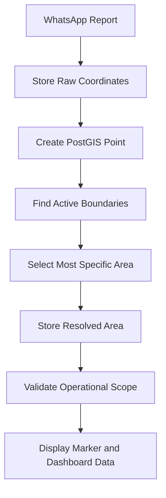

# DENS CAKRA — Complete Database Schema and Business Rules

| Field | Value |
|---|---|
| Document | Database Schema & Business Rules |
| Product | DENS CAKRA |
| Version | 1.1 |
| Date | 11 July 2026 |
| Author | System Analyst |
| Status | Revised Draft for Technical Review |

## Revision History

| Version | Date | Description |
|---|---|---|
| 1.0 | 11 July 2026 | Complete schema for role, organization, area, workflow, and reporting |
| 1.1 | 11 July 2026 | Added PostGIS, administrative boundaries, spatial resolution, map filtering, coordinate preservation, and spatial scope rules |

## 1. Purpose

Dokumen ini menjadi baseline database sebelum implementasi backend. Skema dirancang untuk mendukung:

- Enam role aplikasi.
- Perbedaan role, position, unit, dan reporting line.
- Jalur Direktorat dan jalur Binda.
- Wilayah administratif dari nasional sampai RT.
- Boundary polygon atau multipolygon untuk setiap wilayah.
- Penyimpanan koordinat asli laporan.
- Spatial resolution dari GPS ke wilayah administratif.
- Filtering peta, tabel, grafik, dan KPI berdasarkan wilayah.
- Direktorat dengan beberapa provinsi.
- Binda dengan satu provinsi.
- Korwil pada kabupaten/kota.
- Field Officer sampai kecamatan, desa/kelurahan, RW, dan RT.
- Jaring sebagai external actor tanpa akun.
- Intake WhatsApp.
- Baket dan versioning.
- Verifikasi formal serta Neraca Penilaian A–F dan 1–6.
- Form Penjabaran UUK/STR.
- Task cascading.
- Analisis intelijen.
- Produk Intelijen terstruktur.
- Persetujuan regional dan executive.
- Distribusi, read receipt, notifikasi, audit, dan kondisi darurat.

## 2. Prisma Schema

```prisma
generator client {
  provider = "prisma-client-js"
}

datasource db {
  provider = "postgresql"
  url      = env("DATABASE_URL")
}

/* =========================================================
 * ENUMS
 * =======================================================*/

enum RoleCode {
  ADMIN_SYSTEM
  EXECUTIVE
  REGIONAL_COMMANDER
  OPERATIONAL_INTELLIGENCE_MANAGER
  FIELD_OPERATOR
  FIELD_OFFICER
}

enum PositionCode {
  ADMIN
  DEPUTI_II
  DIREKTUR_WILAYAH
  KABINDA
  KASUBDIT
  KABAGOPS
  STAF_SUBDIT
  KORWIL
  PETUGAS_ORGANIK
}

enum OrganizationType {
  DEPUTI
  DIRECTORATE
  SUBDIRECTORATE
  BINDA
  BAGOPS
  FIELD_COORDINATION_UNIT
  OTHER
}

enum AdministrativeLevel {
  COUNTRY
  PROVINCE
  REGENCY
  CITY
  DISTRICT
  VILLAGE
  URBAN_VILLAGE
  RW
  RT
}

enum CoordinateSource {
  WHATSAPP_LOCATION
  DEVICE_GPS
  MANUAL_PIN
  MANUAL_COORDINATE
  CORRECTED_BY_FIELD_OFFICER
  SYSTEM_DERIVED
}

enum AreaResolutionMethod {
  POLYGON_MATCH
  PARENT_POLYGON_MATCH
  NEAREST_CENTROID
  MANUAL_CONFIRMATION
  UNRESOLVED
}

enum CoverageValidationStatus {
  NOT_CHECKED
  WITHIN_SCOPE
  OUTSIDE_JARING_SCOPE
  OUTSIDE_FIELD_OFFICER_SCOPE
  OUTSIDE_FIELD_OPERATOR_SCOPE
  OUTSIDE_UNIT_SCOPE
  BORDER_AMBIGUOUS
}

enum BoundaryQualityStatus {
  VERIFIED
  PARTIAL
  SIMPLIFIED
  MISSING
  INVALID
}

enum AreaScopeMode {
  NATIONAL
  INHERIT_UNIT
  INHERIT_PARENT_POSITION
  EXPLICIT
}

enum Classification {
  SANGAT_RAHASIA
  RAHASIA
  TERBATAS
  BIASA
}

enum PriorityLevel {
  LOW
  NORMAL
  HIGH
  URGENT
}

enum DirectiveStatus {
  DRAFT
  PUBLISHED
  DISTRIBUTED
  IN_PROGRESS
  COMPLETED
  CANCELLED
}

enum RecipientStatus {
  SENT
  DELIVERED
  READ
  ACKNOWLEDGED
  FAILED
}

enum UukStrStatus {
  DRAFT
  READY
  PUBLISHED
  REVISED
  CANCELLED
}

enum UukStrSectionType {
  BASIS_BACKGROUND
  INVESTIGATION_TARGETS
  EEI_PIR
  COLLECTION_PLAN
  THREAT_RISK_ANALYSIS
  IMPLEMENTATION_MECHANISM
  COORDINATION_REPORTING
  RECOMMENDATION
  AUTHENTICATION
}

enum TaskStatus {
  DRAFT
  ASSIGNED
  IN_PROGRESS
  COMPLETED
  CANCELLED
}

enum TaskAssignmentStatus {
  SENT
  READ
  ACKNOWLEDGED
  IN_PROGRESS
  COMPLETED
  OVERDUE
  REASSIGNED
  CANCELLED
}

enum JaringStatus {
  ACTIVE
  INACTIVE
  TRANSFERRED
  ARCHIVED
}

enum WhatsAppMessageStatus {
  RECEIVED
  UNKNOWN_SENDER
  ROUTED
  UNDER_REVIEW
  PROCESSED
  DUPLICATE
  SPAM
  ERROR
}

enum WhatsAppValidationStatus {
  NOT_CHECKED
  COMPLETE
  MISSING_TITLE
  MISSING_PHOTO
  MISSING_GPS
  MISSING_CONTENT
  INVALID_FORMAT
}

enum FileType {
  PHOTO
  VIDEO
  DOCUMENT
  AUDIO
  OTHER
}

enum BaketStatus {
  DRAFT
  READY_TO_SEND
  SENT_TO_OIM
  UNDER_VERIFICATION
  NEEDS_DEVELOPMENT
  VERIFIED
  REJECTED
}

enum RevisionRequestStatus {
  OPEN
  IN_PROGRESS
  RESUBMITTED
  RESOLVED
  CANCELLED
}

enum VerificationStatus {
  DRAFT
  IN_PROGRESS
  VERIFIED
  NEEDS_DEVELOPMENT
  REJECTED
}

enum VerificationCheckStatus {
  PASS
  FAIL
  WARNING
  NOT_APPLICABLE
}

enum SourceReliability {
  A
  B
  C
  D
  E
  F
}

enum InformationCredibility {
  ONE
  TWO
  THREE
  FOUR
  FIVE
  SIX
}

enum AnalysisStatus {
  DRAFT
  IN_REVIEW
  VALIDATED
  ARCHIVED
}

enum IntelEntityType {
  PERSON
  ORGANIZATION
  LOCATION
  EVENT
  ISSUE
  ASSET
  OTHER
}

enum ProductStatus {
  DRAFT
  READY_FOR_SUBMISSION
  UNDER_REGIONAL_REVIEW
  NEEDS_REVISION
  APPROVED_REGIONAL
  UNDER_EXECUTIVE_REVIEW
  APPROVED_EXECUTIVE
  DISTRIBUTED
  ARCHIVED
}

enum ApprovalStage {
  REGIONAL
  EXECUTIVE
}

enum ApprovalWorkflowStatus {
  PENDING
  IN_PROGRESS
  NEEDS_REVISION
  APPROVED
  CANCELLED
}

enum ApprovalStepStatus {
  WAITING
  ACTIVE
  APPROVED
  NEEDS_REVISION
  REJECTED
  SKIPPED
}

enum ApprovalDecision {
  APPROVE
  NEEDS_REVISION
  REJECT
  REQUEST_CLARIFICATION
}

enum DistributionStatus {
  QUEUED
  SENT
  DELIVERED
  READ
  FAILED
  REVOKED
}

enum NotificationType {
  DIRECTIVE
  TASK
  WHATSAPP_REPORT
  BAKET
  VERIFICATION
  PRODUCT
  APPROVAL
  REVISION
  ALERT
  SYSTEM
}

enum AuditAction {
  CREATE
  READ
  UPDATE
  DELETE
  LOGIN
  LOGOUT
  ASSIGN
  ACKNOWLEDGE
  VERIFY
  APPROVE
  REJECT
  DISTRIBUTE
  EXPORT
  PRINT
}

enum EmergencyStatus {
  NEW
  ACKNOWLEDGED
  VERIFIED
  IN_PROGRESS
  CONTROLLED
  RESOLVED
  CANCELLED
}

enum AlertSeverity {
  INFO
  ATTENTION
  WARNING
  CRITICAL
  EMERGENCY
}

enum AlertStatus {
  NEW
  ACKNOWLEDGED
  ASSIGNED
  IN_PROGRESS
  RESOLVED
  CANCELLED
}

enum IntegrationStatus {
  ACTIVE
  INACTIVE
  DEGRADED
  ERROR
}

/* =========================================================
 * AUTHORIZATION, USER, ORGANIZATION, POSITION
 * =======================================================*/

model Role {
  id          String   @id @default(uuid()) @db.Uuid
  code        RoleCode @unique
  name        String   @db.VarChar(100)
  description String?  @db.Text
  isActive    Boolean  @default(true)
  createdAt   DateTime @default(now())
  updatedAt   DateTime @updatedAt

  positions  Position[]
  permissions RolePermission[]
}

model Permission {
  id          String   @id @default(uuid()) @db.Uuid
  code        String   @unique @db.VarChar(120)
  name        String   @db.VarChar(150)
  description String?  @db.Text
  createdAt   DateTime @default(now())
  updatedAt   DateTime @updatedAt

  roles RolePermission[]
}

model RolePermission {
  roleId       String @db.Uuid
  permissionId String @db.Uuid

  role       Role       @relation(fields: [roleId], references: [id], onDelete: Cascade)
  permission Permission @relation(fields: [permissionId], references: [id], onDelete: Cascade)

  @@id([roleId, permissionId])
  @@index([permissionId])
}

model User {
  id              String         @id @default(uuid()) @db.Uuid
  username        String         @unique @db.VarChar(100)
  passwordHash    String         @db.VarChar(255)
  fullName        String         @db.VarChar(180)
  email           String?        @unique @db.VarChar(180)
  phone           String?        @db.VarChar(30)
  clearanceLevel  Classification @default(TERBATAS)
  isActive        Boolean        @default(true)
  lockedAt        DateTime?
  lastLoginAt     DateTime?
  deletedAt       DateTime?
  createdAt       DateTime       @default(now())
  updatedAt       DateTime       @updatedAt

  positionAssignments PositionAssignment[]
  sessions            UserSession[]
  notifications       Notification[]
  auditLogs           AuditLog[]            @relation("AuditActor")
  receivedDistributions ProductDistribution[] @relation("DistributionTargetUser")

  @@index([isActive, deletedAt])
}

model UserSession {
  id           String   @id @default(uuid()) @db.Uuid
  userId       String   @db.Uuid
  tokenHash    String   @unique @db.VarChar(255)
  ipAddress    String?  @db.VarChar(64)
  deviceInfo   String?  @db.Text
  createdAt    DateTime @default(now())
  expiresAt    DateTime
  revokedAt    DateTime?

  user User @relation(fields: [userId], references: [id], onDelete: Cascade)

  @@index([userId, expiresAt])
}

model OrganizationUnit {
  id          String           @id @default(uuid()) @db.Uuid
  code        String           @unique @db.VarChar(80)
  name        String           @db.VarChar(180)
  type        OrganizationType
  parentId    String?          @db.Uuid
  isActive    Boolean          @default(true)
  deletedAt   DateTime?
  createdAt   DateTime         @default(now())
  updatedAt   DateTime         @updatedAt

  parent   OrganizationUnit?  @relation("OrganizationHierarchy", fields: [parentId], references: [id], onDelete: Restrict)
  children OrganizationUnit[] @relation("OrganizationHierarchy")

  positions             Position[]
  areaCoverages         OrganizationAreaCoverage[]
  directives            Directive[]              @relation("DirectiveOwnerUnit")
  uukStrs               UukStr[]                  @relation("UukOwnerUnit")
  tasks                 Task[]                    @relation("TaskOwnerUnit")
  analysisCases         AnalysisCase[]
  intelligenceProducts IntelligenceProduct[]
  directiveRecipients  DirectiveRecipient[]      @relation("DirectiveRecipientUnit")
  productDistributions ProductDistribution[]     @relation("DistributionTargetUnit")

  @@index([parentId])
  @@index([type, isActive])
}

model Position {
  id                  String       @id @default(uuid()) @db.Uuid
  code                PositionCode
  title               String       @db.VarChar(180)
  roleId              String       @db.Uuid
  organizationUnitId  String       @db.Uuid
  reportsToPositionId String?      @db.Uuid
  isActive            Boolean      @default(true)
  createdAt           DateTime     @default(now())
  updatedAt           DateTime     @updatedAt

  role             Role             @relation(fields: [roleId], references: [id], onDelete: Restrict)
  organizationUnit OrganizationUnit @relation(fields: [organizationUnitId], references: [id], onDelete: Restrict)
  reportsTo        Position?        @relation("PositionReportingLine", fields: [reportsToPositionId], references: [id], onDelete: Restrict)
  subordinates     Position[]       @relation("PositionReportingLine")

  assignments          PositionAssignment[]
  directiveRecipients  DirectiveRecipient[]  @relation("DirectiveRecipientPosition")
  approvalSteps         ProductApprovalStep[] @relation("ApprovalTargetPosition")
  productDistributions ProductDistribution[] @relation("DistributionTargetPosition")
  assignedAlerts        Alert[]               @relation("AlertAssignedPosition")

  @@index([organizationUnitId, code])
  @@index([reportsToPositionId])
}

model PositionAssignment {
  id         String   @id @default(uuid()) @db.Uuid
  userId     String   @db.Uuid
  positionId String   @db.Uuid
  isPrimary  Boolean  @default(true)
  isActive   Boolean  @default(true)
  validFrom  DateTime @default(now())
  validUntil DateTime?
  createdAt  DateTime @default(now())
  updatedAt  DateTime @updatedAt

  user     User     @relation(fields: [userId], references: [id], onDelete: Restrict)
  position Position @relation(fields: [positionId], references: [id], onDelete: Restrict)

  areaScopes                  PositionAreaScope[]
  filesCreated                FileAsset[]
  directivesCreated           Directive[]                 @relation("DirectiveCreatedBy")
  directiveVersionsCreated    DirectiveVersion[]          @relation("DirectiveVersionCreatedBy")
  uukStrsCreated              UukStr[]                     @relation("UukCreatedBy")
  uukStrVersionsCreated       UukStrVersion[]              @relation("UukVersionCreatedBy")
  tasksCreated                Task[]                       @relation("TaskCreatedBy")
  taskAssignmentsGiven        TaskAssignment[]             @relation("TaskAssignedBy")
  taskAssignmentsReceived     TaskAssignment[]             @relation("TaskAssignedTo")
  taskProgressCreated         TaskProgressLog[]
  jaringCreated               Jaring[]                     @relation("JaringCreatedBy")
  jaringCaretakerAssignments  JaringCaretakerAssignment[]
  routedWhatsAppMessages      WhatsAppMessage[]            @relation("WhatsAppRoutedTo")
  whatsappRoutingLogs         WhatsAppRoutingLog[]
  baketsCreated               Baket[]                      @relation("BaketCreatedBy")
  baketVersionsCreated        BaketVersion[]               @relation("BaketVersionCreatedBy")
  baketRevisionRequests       BaketRevisionRequest[]
  verifications              Verification[]
  analysisCasesCreated        AnalysisCase[]               @relation("AnalysisCaseCreatedBy")
  analysisVersionsCreated     AnalysisVersion[]            @relation("AnalysisVersionCreatedBy")
  analysisVersionsValidated   AnalysisVersion[]            @relation("AnalysisVersionValidatedBy")
  productsCreated             IntelligenceProduct[]        @relation("ProductCreatedBy")
  productVersionsCreated      ProductVersion[]             @relation("ProductVersionCreatedBy")
  approvalDecisions           ProductApprovalStep[]        @relation("ApprovalDecidedBy")
  productDistributionsSent    ProductDistribution[]        @relation("DistributionSentBy")
  emergencyReportsCreated     EmergencyIncident[]          @relation("EmergencyReportedBy")
  auditLogs                   AuditLog[]                   @relation("AuditAssignment")
  locationPings               PersonnelLocationPing[]

  @@index([userId, isActive])
  @@index([positionId, isActive])
}

model PositionAreaPolicy {
  id                  String              @id @default(uuid()) @db.Uuid
  positionCode        PositionCode
  administrativeLevel AdministrativeLevel
  scopeMode           AreaScopeMode       @default(EXPLICIT)
  minimumAreas        Int                 @default(1)
  maximumAreas        Int?
  isActive            Boolean             @default(true)
  createdAt           DateTime            @default(now())
  updatedAt           DateTime            @updatedAt

  @@unique([positionCode, administrativeLevel])
}

model PositionAreaScope {
  id                   String   @id @default(uuid()) @db.Uuid
  positionAssignmentId String   @db.Uuid
  areaId               String   @db.Uuid
  isPrimary            Boolean  @default(false)
  validFrom            DateTime @default(now())
  validUntil           DateTime?
  createdAt            DateTime @default(now())

  assignment PositionAssignment @relation(fields: [positionAssignmentId], references: [id], onDelete: Cascade)
  area       AdministrativeArea @relation(fields: [areaId], references: [id], onDelete: Restrict)

  @@unique([positionAssignmentId, areaId, validFrom])
  @@index([areaId, validUntil])
  @@index([positionAssignmentId, validUntil])
}

/* =========================================================
 * ADMINISTRATIVE AREA AND COVERAGE
 * =======================================================*/

model AdministrativeArea {
  id                  String              @id @default(uuid()) @db.Uuid
  code                String              @db.VarChar(50)
  officialCode        String?             @unique @db.VarChar(30)
  name                String              @db.VarChar(180)
  level               AdministrativeLevel
  parentId            String?             @db.Uuid
  centroidLatitude    Decimal?            @db.Decimal(10, 7)
  centroidLongitude   Decimal?            @db.Decimal(10, 7)
  isActive            Boolean             @default(true)
  deletedAt           DateTime?
  createdAt           DateTime            @default(now())
  updatedAt           DateTime            @updatedAt

  parent   AdministrativeArea?  @relation("AdministrativeAreaHierarchy", fields: [parentId], references: [id], onDelete: Restrict)
  children AdministrativeArea[] @relation("AdministrativeAreaHierarchy")

  ancestorLinks   AdministrativeAreaClosure[] @relation("AreaClosureAncestor")
  descendantLinks AdministrativeAreaClosure[] @relation("AreaClosureDescendant")

  boundaries               AdministrativeAreaBoundary[]
  organizationCoverages    OrganizationAreaCoverage[]
  positionScopes           PositionAreaScope[]
  directiveTargets         DirectiveTargetArea[]
  taskTargets              TaskTargetArea[]
  jaringCoverages          JaringAreaCoverage[]
  resolvedWhatsAppMessages WhatsAppMessage[]                @relation("WhatsAppResolvedArea")
  baketVersions            BaketVersion[]
  emergencyIncidents       EmergencyIncident[]
  alerts                   Alert[]
  personnelLocationPings   PersonnelLocationPing[]

  @@unique([parentId, level, code])
  @@index([parentId, level])
  @@index([name])
  @@index([level, isActive])
}

model AdministrativeAreaClosure {
  ancestorId   String @db.Uuid
  descendantId String @db.Uuid
  depth        Int

  ancestor   AdministrativeArea @relation("AreaClosureAncestor", fields: [ancestorId], references: [id], onDelete: Cascade)
  descendant AdministrativeArea @relation("AreaClosureDescendant", fields: [descendantId], references: [id], onDelete: Cascade)

  @@id([ancestorId, descendantId])
  @@index([descendantId, depth])
  @@index([ancestorId, depth])
}

model AdministrativeAreaDataSource {
  id             String   @id @default(uuid()) @db.Uuid
  name           String   @db.VarChar(200)
  sourceType     String   @db.VarChar(80)
  referenceUrl   String?  @db.VarChar(500)
  versionLabel   String?  @db.VarChar(100)
  effectiveDate  DateTime?
  importedAt     DateTime @default(now())
  checksumSha256 String?  @db.VarChar(64)
  notes          String?  @db.Text

  boundaries AdministrativeAreaBoundary[]

  @@index([name, versionLabel])
}

model AdministrativeAreaBoundary {
  id                            String                @id @default(uuid()) @db.Uuid
  areaId                        String                @db.Uuid
  dataSourceId                  String?               @db.Uuid
  versionNumber                 Int
  boundary                      Unsupported("geometry(MultiPolygon,4326)")
  centroid                      Unsupported("geometry(Point,4326)")?
  minLatitude                   Decimal?              @db.Decimal(10, 7)
  minLongitude                  Decimal?              @db.Decimal(10, 7)
  maxLatitude                   Decimal?              @db.Decimal(10, 7)
  maxLongitude                  Decimal?              @db.Decimal(10, 7)
  qualityStatus                 BoundaryQualityStatus @default(VERIFIED)
  simplificationToleranceMeters Decimal?              @db.Decimal(12, 2)
  geometryHash                  String?               @db.VarChar(64)
  effectiveFrom                 DateTime
  effectiveUntil                DateTime?
  isActive                      Boolean               @default(true)
  createdAt                     DateTime              @default(now())
  updatedAt                     DateTime              @updatedAt

  area       AdministrativeArea            @relation(fields: [areaId], references: [id], onDelete: Cascade)
  dataSource AdministrativeAreaDataSource? @relation(fields: [dataSourceId], references: [id], onDelete: SetNull)

  @@unique([areaId, versionNumber])
  @@index([areaId, isActive, effectiveFrom])
  @@index([dataSourceId])
}

model OrganizationAreaCoverage {
  id                 String   @id @default(uuid()) @db.Uuid
  organizationUnitId String   @db.Uuid
  areaId             String   @db.Uuid
  isPrimary          Boolean  @default(false)
  validFrom          DateTime @default(now())
  validUntil         DateTime?
  createdAt          DateTime @default(now())

  organizationUnit OrganizationUnit  @relation(fields: [organizationUnitId], references: [id], onDelete: Cascade)
  area             AdministrativeArea @relation(fields: [areaId], references: [id], onDelete: Restrict)

  @@unique([organizationUnitId, areaId, validFrom])
  @@index([areaId, validUntil])
}

/* =========================================================
 * FILE STORAGE
 * =======================================================*/

model FileAsset {
  id                    String   @id @default(uuid()) @db.Uuid
  storageKey            String   @unique @db.VarChar(500)
  originalName          String?  @db.VarChar(255)
  mimeType              String   @db.VarChar(120)
  fileType              FileType
  sizeBytes             BigInt
  checksumSha256        String   @db.VarChar(64)
  createdByAssignmentId String?  @db.Uuid
  createdAt             DateTime @default(now())
  deletedAt             DateTime?

  createdByAssignment PositionAssignment? @relation(fields: [createdByAssignmentId], references: [id], onDelete: SetNull)

  whatsAppMedia       WhatsAppMessageMedia[]
  taskAttachments     TaskAttachment[]
  baketAttachments    BaketAttachment[]
  productAttachments  ProductAttachment[]
  emergencyAttachments EmergencyAttachment[]

  @@index([createdAt])
}

/* =========================================================
 * DIRECTIVE AND UUK/STR
 * =======================================================*/

model Directive {
  id                    String          @id @default(uuid()) @db.Uuid
  ownerUnitId           String          @db.Uuid
  createdByAssignmentId String          @db.Uuid
  status                DirectiveStatus @default(DRAFT)
  currentVersionNumber  Int             @default(1)
  createdAt             DateTime        @default(now())
  updatedAt             DateTime        @updatedAt
  deletedAt             DateTime?

  ownerUnit          OrganizationUnit  @relation("DirectiveOwnerUnit", fields: [ownerUnitId], references: [id], onDelete: Restrict)
  createdByAssignment PositionAssignment @relation("DirectiveCreatedBy", fields: [createdByAssignmentId], references: [id], onDelete: Restrict)

  versions DirectiveVersion[]

  @@index([ownerUnitId, status])
}

model DirectiveVersion {
  id                    String         @id @default(uuid()) @db.Uuid
  directiveId           String         @db.Uuid
  versionNumber         Int
  commandNumber         String         @db.VarChar(120)
  classification        Classification
  commandSource         String         @db.VarChar(250)
  commandIssuer         String         @db.VarChar(250)
  commandDate           DateTime
  dueDate               DateTime?
  strategicIssue        String?        @db.Text
  commandDescription    String         @db.Text
  createdByAssignmentId String         @db.Uuid
  changeReason          String?        @db.Text
  createdAt             DateTime       @default(now())

  directive           Directive          @relation(fields: [directiveId], references: [id], onDelete: Cascade)
  createdByAssignment PositionAssignment @relation("DirectiveVersionCreatedBy", fields: [createdByAssignmentId], references: [id], onDelete: Restrict)

  targetAreas DirectiveTargetArea[]
  recipients DirectiveRecipient[]
  uukStrs     UukStr[]
  tasks       Task[]

  @@unique([directiveId, versionNumber])
  @@unique([commandNumber, versionNumber])
  @@index([classification, commandDate])
}

model DirectiveTargetArea {
  directiveVersionId String  @db.Uuid
  areaId             String  @db.Uuid
  isPrimary          Boolean @default(false)

  directiveVersion DirectiveVersion  @relation(fields: [directiveVersionId], references: [id], onDelete: Cascade)
  area             AdministrativeArea @relation(fields: [areaId], references: [id], onDelete: Restrict)

  @@id([directiveVersionId, areaId])
  @@index([areaId])
}

model DirectiveRecipient {
  id                 String          @id @default(uuid()) @db.Uuid
  directiveVersionId String          @db.Uuid
  targetUnitId       String?         @db.Uuid
  targetPositionId   String?         @db.Uuid
  status             RecipientStatus @default(SENT)
  sentAt             DateTime        @default(now())
  deliveredAt        DateTime?
  readAt             DateTime?
  acknowledgedAt     DateTime?
  failureReason      String?         @db.Text

  directiveVersion DirectiveVersion @relation(fields: [directiveVersionId], references: [id], onDelete: Cascade)
  targetUnit       OrganizationUnit? @relation("DirectiveRecipientUnit", fields: [targetUnitId], references: [id], onDelete: Restrict)
  targetPosition   Position?         @relation("DirectiveRecipientPosition", fields: [targetPositionId], references: [id], onDelete: Restrict)

  @@index([targetUnitId, status])
  @@index([targetPositionId, status])
}

model UukStr {
  id                    String       @id @default(uuid()) @db.Uuid
  directiveVersionId    String       @db.Uuid
  ownerUnitId           String       @db.Uuid
  createdByAssignmentId String       @db.Uuid
  status                UukStrStatus @default(DRAFT)
  currentVersionNumber  Int          @default(1)
  createdAt             DateTime     @default(now())
  updatedAt             DateTime     @updatedAt
  deletedAt             DateTime?

  directiveVersion    DirectiveVersion  @relation(fields: [directiveVersionId], references: [id], onDelete: Restrict)
  ownerUnit           OrganizationUnit  @relation("UukOwnerUnit", fields: [ownerUnitId], references: [id], onDelete: Restrict)
  createdByAssignment PositionAssignment @relation("UukCreatedBy", fields: [createdByAssignmentId], references: [id], onDelete: Restrict)

  versions UukStrVersion[]

  @@index([ownerUnitId, status])
}

model UukStrVersion {
  id                    String   @id @default(uuid()) @db.Uuid
  uukStrId              String   @db.Uuid
  versionNumber         Int
  title                 String   @db.VarChar(300)
  createdByAssignmentId String   @db.Uuid
  changeReason          String?  @db.Text
  createdAt             DateTime @default(now())

  uukStr              UukStr             @relation(fields: [uukStrId], references: [id], onDelete: Cascade)
  createdByAssignment PositionAssignment @relation("UukVersionCreatedBy", fields: [createdByAssignmentId], references: [id], onDelete: Restrict)

  sections UukStrSection[]
  tasks    Task[]

  @@unique([uukStrId, versionNumber])
}

model UukStrSection {
  id              String                @id @default(uuid()) @db.Uuid
  uukStrVersionId String                @db.Uuid
  sectionType     UukStrSectionType
  title           String                @db.VarChar(250)
  orderNumber     Int

  uukStrVersion UukStrVersion      @relation(fields: [uukStrVersionId], references: [id], onDelete: Cascade)
  items         UukStrSectionItem[]

  @@unique([uukStrVersionId, sectionType])
  @@unique([uukStrVersionId, orderNumber])
}

model UukStrSectionItem {
  id            String @id @default(uuid()) @db.Uuid
  sectionId     String @db.Uuid
  itemCode      String @db.VarChar(30)
  content       String @db.Text
  orderNumber   Int

  section UukStrSection @relation(fields: [sectionId], references: [id], onDelete: Cascade)

  @@unique([sectionId, orderNumber])
}

/* =========================================================
 * TASK CASCADE
 * =======================================================*/

model Task {
  id                    String       @id @default(uuid()) @db.Uuid
  parentTaskId          String?      @db.Uuid
  directiveVersionId    String?      @db.Uuid
  uukStrVersionId       String?      @db.Uuid
  ownerUnitId           String       @db.Uuid
  createdByAssignmentId String       @db.Uuid
  title                 String       @db.VarChar(300)
  description           String       @db.Text
  classification        Classification
  priority              PriorityLevel @default(NORMAL)
  dueDate               DateTime?
  status                TaskStatus    @default(DRAFT)
  createdAt             DateTime      @default(now())
  updatedAt             DateTime      @updatedAt
  deletedAt             DateTime?

  parentTask          Task?              @relation("TaskHierarchy", fields: [parentTaskId], references: [id], onDelete: Restrict)
  childTasks          Task[]             @relation("TaskHierarchy")
  directiveVersion    DirectiveVersion?  @relation(fields: [directiveVersionId], references: [id], onDelete: Restrict)
  uukStrVersion       UukStrVersion?     @relation(fields: [uukStrVersionId], references: [id], onDelete: Restrict)
  ownerUnit           OrganizationUnit   @relation("TaskOwnerUnit", fields: [ownerUnitId], references: [id], onDelete: Restrict)
  createdByAssignment PositionAssignment @relation("TaskCreatedBy", fields: [createdByAssignmentId], references: [id], onDelete: Restrict)

  targetAreas  TaskTargetArea[]
  assignments  TaskAssignment[]
  attachments  TaskAttachment[]

  @@index([parentTaskId])
  @@index([ownerUnitId, status])
  @@index([dueDate, status])
}

model TaskTargetArea {
  taskId    String  @db.Uuid
  areaId    String  @db.Uuid
  isPrimary Boolean @default(false)

  task Task               @relation(fields: [taskId], references: [id], onDelete: Cascade)
  area AdministrativeArea @relation(fields: [areaId], references: [id], onDelete: Restrict)

  @@id([taskId, areaId])
  @@index([areaId])
}

model TaskAssignment {
  id                    String               @id @default(uuid()) @db.Uuid
  taskId                String               @db.Uuid
  assignerAssignmentId  String               @db.Uuid
  assigneeAssignmentId  String               @db.Uuid
  status                TaskAssignmentStatus @default(SENT)
  assignedAt            DateTime             @default(now())
  readAt                DateTime?
  acknowledgedAt        DateTime?
  startedAt             DateTime?
  completedAt           DateTime?
  dueDate               DateTime?
  assignmentNote        String?              @db.Text

  task       Task               @relation(fields: [taskId], references: [id], onDelete: Cascade)
  assigner   PositionAssignment @relation("TaskAssignedBy", fields: [assignerAssignmentId], references: [id], onDelete: Restrict)
  assignee   PositionAssignment @relation("TaskAssignedTo", fields: [assigneeAssignmentId], references: [id], onDelete: Restrict)

  progressLogs TaskProgressLog[]
  bakets       Baket[]

  @@index([assigneeAssignmentId, status])
  @@index([taskId, status])
}

model TaskProgressLog {
  id                    String               @id @default(uuid()) @db.Uuid
  taskAssignmentId      String               @db.Uuid
  status                TaskAssignmentStatus
  progressPercent       Int?
  note                  String?              @db.Text
  createdByAssignmentId String               @db.Uuid
  createdAt             DateTime             @default(now())

  taskAssignment      TaskAssignment     @relation(fields: [taskAssignmentId], references: [id], onDelete: Cascade)
  createdByAssignment PositionAssignment @relation(fields: [createdByAssignmentId], references: [id], onDelete: Restrict)

  @@index([taskAssignmentId, createdAt])
}

model TaskAttachment {
  taskId String @db.Uuid
  fileId String @db.Uuid

  task Task      @relation(fields: [taskId], references: [id], onDelete: Cascade)
  file FileAsset @relation(fields: [fileId], references: [id], onDelete: Restrict)

  @@id([taskId, fileId])
}

/* =========================================================
 * JARING AND WHATSAPP INTAKE
 * =======================================================*/

model Jaring {
  id                    String       @id @default(uuid()) @db.Uuid
  code                  String       @unique @db.VarChar(80)
  aliasName             String?      @db.VarChar(150)
  whatsappNumber        String       @unique @db.VarChar(30)
  status                JaringStatus @default(ACTIVE)
  createdByAssignmentId String       @db.Uuid
  notes                 String?      @db.Text
  registeredAt          DateTime     @default(now())
  deactivatedAt         DateTime?
  deletedAt             DateTime?
  createdAt             DateTime     @default(now())
  updatedAt             DateTime     @updatedAt

  createdByAssignment PositionAssignment @relation("JaringCreatedBy", fields: [createdByAssignmentId], references: [id], onDelete: Restrict)

  caretakerAssignments JaringCaretakerAssignment[]
  areaCoverages        JaringAreaCoverage[]
  messages             WhatsAppMessage[]
  primaryBakets        Baket[]                    @relation("BaketPrimaryJaring")

  @@index([status, deletedAt])
}

model JaringCaretakerAssignment {
  id                       String   @id @default(uuid()) @db.Uuid
  jaringId                 String   @db.Uuid
  fieldOfficerAssignmentId String   @db.Uuid
  isActive                 Boolean  @default(true)
  validFrom                DateTime @default(now())
  validUntil               DateTime?
  transferReason           String?  @db.Text
  createdAt                DateTime @default(now())

  jaring                 Jaring             @relation(fields: [jaringId], references: [id], onDelete: Restrict)
  fieldOfficerAssignment PositionAssignment @relation(fields: [fieldOfficerAssignmentId], references: [id], onDelete: Restrict)

  @@index([jaringId, isActive])
  @@index([fieldOfficerAssignmentId, isActive])
}

model JaringAreaCoverage {
  id         String   @id @default(uuid()) @db.Uuid
  jaringId   String   @db.Uuid
  areaId     String   @db.Uuid
  isPrimary  Boolean  @default(false)
  validFrom  DateTime @default(now())
  validUntil DateTime?

  jaring Jaring             @relation(fields: [jaringId], references: [id], onDelete: Cascade)
  area   AdministrativeArea @relation(fields: [areaId], references: [id], onDelete: Restrict)

  @@unique([jaringId, areaId, validFrom])
  @@index([areaId, validUntil])
}

model WhatsAppMessage {
  id                               String                   @id @default(uuid()) @db.Uuid
  externalMessageId                String                   @unique @db.VarChar(255)
  senderPhone                      String                   @db.VarChar(30)
  jaringId                         String?                  @db.Uuid
  routedToFieldOfficerAssignmentId String?                  @db.Uuid
  title                            String?                  @db.VarChar(300)
  content                          String?                  @db.Text
  latitude                         Decimal?                 @db.Decimal(10, 7)
  longitude                        Decimal?                 @db.Decimal(10, 7)
  locationPoint                    Unsupported("geometry(Point,4326)")?
  gpsAccuracyMeters                Decimal?                 @db.Decimal(10, 2)
  locationCapturedAt               DateTime?
  coordinateSource                 CoordinateSource?
  resolvedAreaId                   String?                  @db.Uuid
  areaResolutionMethod             AreaResolutionMethod    @default(UNRESOLVED)
  areaResolutionConfidence         Decimal?                 @db.Decimal(5, 2)
  areaResolvedAt                   DateTime?
  status                           WhatsAppMessageStatus    @default(RECEIVED)
  validationStatus                 WhatsAppValidationStatus @default(NOT_CHECKED)
  rawPayload                       Json
  contentChecksum                  String?                  @db.VarChar(64)
  receivedAt                       DateTime
  processedAt                      DateTime?
  createdAt                        DateTime                 @default(now())

  jaring                         Jaring?              @relation(fields: [jaringId], references: [id], onDelete: SetNull)
  routedToFieldOfficerAssignment PositionAssignment? @relation("WhatsAppRoutedTo", fields: [routedToFieldOfficerAssignmentId], references: [id], onDelete: SetNull)
  resolvedArea                   AdministrativeArea?  @relation("WhatsAppResolvedArea", fields: [resolvedAreaId], references: [id], onDelete: Restrict)

  media       WhatsAppMessageMedia[]
  routingLogs WhatsAppRoutingLog[]
  baketLinks  BaketSourceMessage[]

  @@index([senderPhone, receivedAt])
  @@index([routedToFieldOfficerAssignmentId, status])
  @@index([jaringId, receivedAt])
  @@index([resolvedAreaId, receivedAt])
}

model WhatsAppMessageMedia {
  messageId String  @db.Uuid
  fileId    String  @db.Uuid
  caption   String? @db.Text
  orderNo   Int     @default(1)

  message WhatsAppMessage @relation(fields: [messageId], references: [id], onDelete: Cascade)
  file    FileAsset       @relation(fields: [fileId], references: [id], onDelete: Restrict)

  @@id([messageId, fileId])
}

model WhatsAppRoutingLog {
  id                    String   @id @default(uuid()) @db.Uuid
  messageId             String   @db.Uuid
  routedToAssignmentId  String?  @db.Uuid
  action                String   @db.VarChar(80)
  note                  String?  @db.Text
  createdAt             DateTime @default(now())

  message            WhatsAppMessage     @relation(fields: [messageId], references: [id], onDelete: Cascade)
  routedToAssignment PositionAssignment? @relation(fields: [routedToAssignmentId], references: [id], onDelete: SetNull)

  @@index([messageId, createdAt])
}

/* =========================================================
 * BAKET AND FORMAL VERIFICATION
 * =======================================================*/

model Baket {
  id                               String      @id @default(uuid()) @db.Uuid
  createdByFieldOfficerAssignmentId String      @db.Uuid
  taskAssignmentId                 String?     @db.Uuid
  primaryJaringId                  String?     @db.Uuid
  status                           BaketStatus @default(DRAFT)
  currentVersionNumber             Int         @default(1)
  createdAt                        DateTime    @default(now())
  updatedAt                        DateTime    @updatedAt
  deletedAt                        DateTime?

  createdByFieldOfficerAssignment PositionAssignment @relation("BaketCreatedBy", fields: [createdByFieldOfficerAssignmentId], references: [id], onDelete: Restrict)
  taskAssignment                  TaskAssignment?     @relation(fields: [taskAssignmentId], references: [id], onDelete: Restrict)
  primaryJaring                   Jaring?             @relation("BaketPrimaryJaring", fields: [primaryJaringId], references: [id], onDelete: SetNull)

  versions         BaketVersion[]
  sourceMessages   BaketSourceMessage[]
  attachments      BaketAttachment[]
  revisionRequests BaketRevisionRequest[]
  relatedCrossReferences VerificationCrossReference[] @relation("RelatedBaketCrossReference")
  alerts           Alert[]

  @@index([createdByFieldOfficerAssignmentId, status])
  @@index([taskAssignmentId])
}

model BaketVersion {
  id                       String                   @id @default(uuid()) @db.Uuid
  baketId                  String                   @db.Uuid
  versionNumber            Int
  title                    String                   @db.VarChar(300)
  originalContent          String                   @db.Text
  normalizedContent        String?                  @db.Text
  eventTime                DateTime?
  eventAreaId              String?                  @db.Uuid
  latitude                 Decimal?                 @db.Decimal(10, 7)
  longitude                Decimal?                 @db.Decimal(10, 7)
  locationPoint            Unsupported("geometry(Point,4326)")?
  gpsAccuracyMeters        Decimal?                 @db.Decimal(10, 2)
  locationCapturedAt       DateTime?
  coordinateSource         CoordinateSource?
  areaResolutionMethod     AreaResolutionMethod     @default(UNRESOLVED)
  areaResolutionConfidence Decimal?                 @db.Decimal(5, 2)
  areaResolvedAt           DateTime?
  manualAreaOverrideReason String?                  @db.Text
  coverageValidationStatus CoverageValidationStatus @default(NOT_CHECKED)
  coverageValidationNote   String?                  @db.Text
  coverageValidatedAt      DateTime?
  urgency                  PriorityLevel            @default(NORMAL)
  fieldOfficerNote         String?                  @db.Text
  createdByAssignmentId    String                   @db.Uuid
  revisionReason           String?                  @db.Text
  createdAt                DateTime                 @default(now())

  baket               Baket               @relation(fields: [baketId], references: [id], onDelete: Cascade)
  eventArea           AdministrativeArea? @relation(fields: [eventAreaId], references: [id], onDelete: Restrict)
  createdByAssignment PositionAssignment  @relation("BaketVersionCreatedBy", fields: [createdByAssignmentId], references: [id], onDelete: Restrict)

  verifications Verification[]

  @@unique([baketId, versionNumber])
  @@index([eventAreaId, eventTime])
  @@index([coverageValidationStatus, createdAt])
}

model BaketSourceMessage {
  baketId   String @db.Uuid
  messageId String @db.Uuid

  baket   Baket           @relation(fields: [baketId], references: [id], onDelete: Cascade)
  message WhatsAppMessage @relation(fields: [messageId], references: [id], onDelete: Restrict)

  @@id([baketId, messageId])
}

model BaketAttachment {
  baketId String @db.Uuid
  fileId  String @db.Uuid
  caption String? @db.Text

  baket Baket     @relation(fields: [baketId], references: [id], onDelete: Cascade)
  file  FileAsset @relation(fields: [fileId], references: [id], onDelete: Restrict)

  @@id([baketId, fileId])
}

model BaketRevisionRequest {
  id                    String                @id @default(uuid()) @db.Uuid
  baketId               String                @db.Uuid
  requestedByAssignmentId String              @db.Uuid
  reason                String                @db.Text
  requiredInformation   String                @db.Text
  dueDate               DateTime?
  status                RevisionRequestStatus @default(OPEN)
  resolvedAt            DateTime?
  createdAt             DateTime              @default(now())
  updatedAt             DateTime              @updatedAt

  baket                 Baket              @relation(fields: [baketId], references: [id], onDelete: Cascade)
  requestedByAssignment PositionAssignment @relation(fields: [requestedByAssignmentId], references: [id], onDelete: Restrict)

  @@index([baketId, status])
}

model Verification {
  id                     String                 @id @default(uuid()) @db.Uuid
  baketVersionId         String                 @db.Uuid
  verifiedByAssignmentId String                 @db.Uuid
  status                 VerificationStatus     @default(DRAFT)
  sourceReliability      SourceReliability?
  informationCredibility InformationCredibility?
  summary                String?                @db.Text
  startedAt              DateTime               @default(now())
  completedAt            DateTime?
  createdAt              DateTime               @default(now())
  updatedAt              DateTime               @updatedAt

  baketVersion         BaketVersion       @relation(fields: [baketVersionId], references: [id], onDelete: Restrict)
  verifiedByAssignment PositionAssignment @relation(fields: [verifiedByAssignmentId], references: [id], onDelete: Restrict)

  checks          VerificationCheck[]
  crossReferences VerificationCrossReference[]
  productSources  ProductSourceVerification[]
  analysisSources AnalysisSourceVerification[]

  @@index([verifiedByAssignmentId, status])
  @@index([baketVersionId, createdAt])
}

model VerificationCheck {
  id             String                  @id @default(uuid()) @db.Uuid
  verificationId String                  @db.Uuid
  code           String                  @db.VarChar(80)
  label          String                  @db.VarChar(200)
  status         VerificationCheckStatus
  note           String?                 @db.Text

  verification Verification @relation(fields: [verificationId], references: [id], onDelete: Cascade)

  @@unique([verificationId, code])
}

model VerificationCrossReference {
  id             String  @id @default(uuid()) @db.Uuid
  verificationId String  @db.Uuid
  relatedBaketId String? @db.Uuid
  externalRef    String? @db.VarChar(500)
  description    String? @db.Text

  verification Verification @relation(fields: [verificationId], references: [id], onDelete: Cascade)
  relatedBaket Baket?       @relation("RelatedBaketCrossReference", fields: [relatedBaketId], references: [id], onDelete: SetNull)

  @@index([relatedBaketId])
}

/* =========================================================
 * ANALYSIS WORKSPACE
 * =======================================================*/

model AnalysisCase {
  id                    String         @id @default(uuid()) @db.Uuid
  ownerUnitId           String         @db.Uuid
  createdByAssignmentId String         @db.Uuid
  title                 String         @db.VarChar(300)
  status                AnalysisStatus @default(DRAFT)
  periodStart           DateTime?
  periodEnd             DateTime?
  currentVersionNumber  Int            @default(1)
  createdAt             DateTime       @default(now())
  updatedAt             DateTime       @updatedAt

  ownerUnit           OrganizationUnit  @relation(fields: [ownerUnitId], references: [id], onDelete: Restrict)
  createdByAssignment PositionAssignment @relation("AnalysisCaseCreatedBy", fields: [createdByAssignmentId], references: [id], onDelete: Restrict)

  sources  AnalysisSourceVerification[]
  versions AnalysisVersion[]

  @@index([ownerUnitId, status])
}

model AnalysisSourceVerification {
  analysisCaseId String @db.Uuid
  verificationId String @db.Uuid

  analysisCase AnalysisCase @relation(fields: [analysisCaseId], references: [id], onDelete: Cascade)
  verification Verification @relation(fields: [verificationId], references: [id], onDelete: Restrict)

  @@id([analysisCaseId, verificationId])
}

model AnalysisVersion {
  id                      String   @id @default(uuid()) @db.Uuid
  analysisCaseId          String   @db.Uuid
  versionNumber           Int
  indications             String?  @db.Text
  analysis                String?  @db.Text
  impact                  String?  @db.Text
  efforts                 String?  @db.Text
  recommendations         String?  @db.Text
  aiDraft                 Json?
  createdByAssignmentId   String   @db.Uuid
  validatedByAssignmentId String?  @db.Uuid
  validatedAt             DateTime?
  createdAt               DateTime @default(now())

  analysisCase          AnalysisCase       @relation(fields: [analysisCaseId], references: [id], onDelete: Cascade)
  createdByAssignment   PositionAssignment @relation("AnalysisVersionCreatedBy", fields: [createdByAssignmentId], references: [id], onDelete: Restrict)
  validatedByAssignment PositionAssignment? @relation("AnalysisVersionValidatedBy", fields: [validatedByAssignmentId], references: [id], onDelete: Restrict)

  entities       AnalysisEntity[]
  relationships  AnalysisRelationship[]
  productSources ProductSourceAnalysis[]

  @@unique([analysisCaseId, versionNumber])
}

model AnalysisEntity {
  id                String          @id @default(uuid()) @db.Uuid
  analysisVersionId String          @db.Uuid
  entityType        IntelEntityType
  name              String          @db.VarChar(250)
  normalizedName    String?         @db.VarChar(250)
  metadata          Json?

  analysisVersion AnalysisVersion       @relation(fields: [analysisVersionId], references: [id], onDelete: Cascade)
  outgoingLinks   AnalysisRelationship[] @relation("AnalysisRelationshipFrom")
  incomingLinks   AnalysisRelationship[] @relation("AnalysisRelationshipTo")

  @@index([analysisVersionId, entityType])
}

model AnalysisRelationship {
  id                String  @id @default(uuid()) @db.Uuid
  analysisVersionId String  @db.Uuid
  fromEntityId      String  @db.Uuid
  toEntityId        String  @db.Uuid
  relationshipType  String  @db.VarChar(120)
  description       String? @db.Text
  confidence        Decimal? @db.Decimal(5, 2)

  analysisVersion AnalysisVersion @relation(fields: [analysisVersionId], references: [id], onDelete: Cascade)
  fromEntity      AnalysisEntity  @relation("AnalysisRelationshipFrom", fields: [fromEntityId], references: [id], onDelete: Cascade)
  toEntity        AnalysisEntity  @relation("AnalysisRelationshipTo", fields: [toEntityId], references: [id], onDelete: Cascade)

  @@index([analysisVersionId])
  @@index([fromEntityId, toEntityId])
}

/* =========================================================
 * INTELLIGENCE PRODUCT TEMPLATE AND PRODUCT
 * =======================================================*/

model ProductTypeDefinition {
  id          String   @id @default(uuid()) @db.Uuid
  code        String   @unique @db.VarChar(80)
  name        String   @db.VarChar(180)
  formatNo    String?  @db.VarChar(30)
  description String?  @db.Text
  isActive    Boolean  @default(true)
  createdAt   DateTime @default(now())
  updatedAt   DateTime @updatedAt

  templates ProductTemplate[]
  products  IntelligenceProduct[]
}

model ProductTemplate {
  id            String   @id @default(uuid()) @db.Uuid
  productTypeId String   @db.Uuid
  versionNumber Int
  name          String   @db.VarChar(180)
  isActive      Boolean  @default(true)
  createdAt     DateTime @default(now())

  productType ProductTypeDefinition @relation(fields: [productTypeId], references: [id], onDelete: Restrict)
  sections    ProductTemplateSection[]
  versions    ProductVersion[]

  @@unique([productTypeId, versionNumber])
}

model ProductTemplateSection {
  id           String  @id @default(uuid()) @db.Uuid
  templateId   String  @db.Uuid
  code         String  @db.VarChar(100)
  title        String  @db.VarChar(200)
  orderNumber  Int
  isRepeatable Boolean @default(false)

  template ProductTemplate       @relation(fields: [templateId], references: [id], onDelete: Cascade)
  fields   ProductTemplateField[]

  @@unique([templateId, code])
  @@unique([templateId, orderNumber])
}

model ProductTemplateField {
  id          String  @id @default(uuid()) @db.Uuid
  sectionId   String  @db.Uuid
  code        String  @db.VarChar(100)
  label       String  @db.VarChar(200)
  dataType    String  @db.VarChar(50)
  isRequired  Boolean @default(false)
  orderNumber Int
  validation  Json?

  section ProductTemplateSection @relation(fields: [sectionId], references: [id], onDelete: Cascade)

  @@unique([sectionId, code])
  @@unique([sectionId, orderNumber])
}

model IntelligenceProduct {
  id                    String        @id @default(uuid()) @db.Uuid
  productTypeId         String        @db.Uuid
  ownerUnitId           String        @db.Uuid
  createdByAssignmentId String        @db.Uuid
  classification        Classification
  productNumber         String        @unique @db.VarChar(150)
  title                 String        @db.VarChar(300)
  status                ProductStatus @default(DRAFT)
  currentVersionNumber  Int           @default(1)
  periodStart           DateTime?
  periodEnd             DateTime?
  createdAt             DateTime      @default(now())
  updatedAt             DateTime      @updatedAt
  deletedAt             DateTime?

  productType        ProductTypeDefinition @relation(fields: [productTypeId], references: [id], onDelete: Restrict)
  ownerUnit          OrganizationUnit      @relation(fields: [ownerUnitId], references: [id], onDelete: Restrict)
  createdByAssignment PositionAssignment    @relation("ProductCreatedBy", fields: [createdByAssignmentId], references: [id], onDelete: Restrict)

  versions ProductVersion[]

  @@index([ownerUnitId, status])
  @@index([productTypeId, createdAt])
}

model ProductVersion {
  id                     String                 @id @default(uuid()) @db.Uuid
  productId              String                 @db.Uuid
  templateId             String                 @db.Uuid
  versionNumber          Int
  routingTo              String?                @db.Text
  routingFrom            String?                @db.Text
  routingCc              String?                @db.Text
  subject                String?                @db.VarChar(500)
  sourceReliability      SourceReliability?
  informationCredibility InformationCredibility?
  content                Json
  createdByAssignmentId  String                 @db.Uuid
  changeReason           String?                @db.Text
  createdAt              DateTime               @default(now())

  product             IntelligenceProduct @relation(fields: [productId], references: [id], onDelete: Cascade)
  template            ProductTemplate      @relation(fields: [templateId], references: [id], onDelete: Restrict)
  createdByAssignment PositionAssignment   @relation("ProductVersionCreatedBy", fields: [createdByAssignmentId], references: [id], onDelete: Restrict)

  sourceVerifications ProductSourceVerification[]
  sourceAnalyses      ProductSourceAnalysis[]
  attachments         ProductAttachment[]
  approvalWorkflow    ProductApprovalWorkflow?
  distributions       ProductDistribution[]

  @@unique([productId, versionNumber])
}

model ProductSourceVerification {
  productVersionId String @db.Uuid
  verificationId   String @db.Uuid

  productVersion ProductVersion @relation(fields: [productVersionId], references: [id], onDelete: Cascade)
  verification   Verification   @relation(fields: [verificationId], references: [id], onDelete: Restrict)

  @@id([productVersionId, verificationId])
}

model ProductSourceAnalysis {
  productVersionId String @db.Uuid
  analysisVersionId String @db.Uuid

  productVersion ProductVersion  @relation(fields: [productVersionId], references: [id], onDelete: Cascade)
  analysisVersion AnalysisVersion @relation(fields: [analysisVersionId], references: [id], onDelete: Restrict)

  @@id([productVersionId, analysisVersionId])
}

model ProductAttachment {
  productVersionId String @db.Uuid
  fileId           String @db.Uuid
  caption          String? @db.Text

  productVersion ProductVersion @relation(fields: [productVersionId], references: [id], onDelete: Cascade)
  file           FileAsset      @relation(fields: [fileId], references: [id], onDelete: Restrict)

  @@id([productVersionId, fileId])
}

/* =========================================================
 * APPROVAL AND DISTRIBUTION
 * =======================================================*/

model ProductApprovalWorkflow {
  id                 String                 @id @default(uuid()) @db.Uuid
  productVersionId   String                 @unique @db.Uuid
  status             ApprovalWorkflowStatus @default(PENDING)
  currentStepNumber  Int                    @default(1)
  startedAt          DateTime               @default(now())
  completedAt        DateTime?
  cancelledAt        DateTime?

  productVersion ProductVersion        @relation(fields: [productVersionId], references: [id], onDelete: Restrict)
  steps          ProductApprovalStep[]
}

model ProductApprovalStep {
  id                    String             @id @default(uuid()) @db.Uuid
  workflowId            String             @db.Uuid
  stepNumber            Int
  stage                 ApprovalStage
  targetPositionId      String             @db.Uuid
  status                ApprovalStepStatus @default(WAITING)
  decision              ApprovalDecision?
  decisionNote          String?            @db.Text
  dueAt                 DateTime?
  activatedAt           DateTime?
  decidedAt             DateTime?
  decidedByAssignmentId String?            @db.Uuid

  workflow            ProductApprovalWorkflow @relation(fields: [workflowId], references: [id], onDelete: Cascade)
  targetPosition      Position                @relation("ApprovalTargetPosition", fields: [targetPositionId], references: [id], onDelete: Restrict)
  decidedByAssignment PositionAssignment?     @relation("ApprovalDecidedBy", fields: [decidedByAssignmentId], references: [id], onDelete: Restrict)

  @@unique([workflowId, stepNumber])
  @@index([targetPositionId, status])
}

model ProductDistribution {
  id                   String             @id @default(uuid()) @db.Uuid
  productVersionId     String             @db.Uuid
  sentByAssignmentId   String             @db.Uuid
  targetUnitId         String?            @db.Uuid
  targetPositionId     String?            @db.Uuid
  targetUserId         String?            @db.Uuid
  classification       Classification
  status               DistributionStatus @default(QUEUED)
  sentAt               DateTime?
  deliveredAt          DateTime?
  readAt               DateTime?
  revokedAt            DateTime?
  failureReason        String?            @db.Text

  productVersion   ProductVersion     @relation(fields: [productVersionId], references: [id], onDelete: Restrict)
  sentByAssignment PositionAssignment @relation("DistributionSentBy", fields: [sentByAssignmentId], references: [id], onDelete: Restrict)
  targetUnit       OrganizationUnit?  @relation("DistributionTargetUnit", fields: [targetUnitId], references: [id], onDelete: Restrict)
  targetPosition   Position?          @relation("DistributionTargetPosition", fields: [targetPositionId], references: [id], onDelete: Restrict)
  targetUser       User?              @relation("DistributionTargetUser", fields: [targetUserId], references: [id], onDelete: Restrict)

  @@index([productVersionId, status])
  @@index([targetUserId, status])
}

/* =========================================================
 * EMERGENCY, ALERT, NOTIFICATION, AUDIT, INTEGRATION
 * =======================================================*/

model EmergencyIncident {
  id                     String               @id @default(uuid()) @db.Uuid
  title                  String               @db.VarChar(300)
  status                 EmergencyStatus      @default(NEW)
  severity               AlertSeverity
  areaId                 String?              @db.Uuid
  latitude               Decimal?             @db.Decimal(10, 7)
  longitude              Decimal?             @db.Decimal(10, 7)
  locationPoint          Unsupported("geometry(Point,4326)")?
  gpsAccuracyMeters      Decimal?             @db.Decimal(10, 2)
  locationCapturedAt     DateTime?
  coordinateSource       CoordinateSource?
  areaResolutionMethod   AreaResolutionMethod @default(UNRESOLVED)
  situation              String               @db.Text
  actionTaken            String?              @db.Text
  needs                  String?              @db.Text
  reportedByAssignmentId String               @db.Uuid
  createdAt              DateTime             @default(now())
  updatedAt              DateTime             @updatedAt
  resolvedAt             DateTime?

  area                 AdministrativeArea? @relation(fields: [areaId], references: [id], onDelete: Restrict)
  reportedByAssignment PositionAssignment  @relation("EmergencyReportedBy", fields: [reportedByAssignmentId], references: [id], onDelete: Restrict)

  attachments EmergencyAttachment[]
  alerts      Alert[]

  @@index([status, severity])
  @@index([areaId, createdAt])
}

model EmergencyAttachment {
  incidentId String @db.Uuid
  fileId     String @db.Uuid

  incident EmergencyIncident @relation(fields: [incidentId], references: [id], onDelete: Cascade)
  file     FileAsset         @relation(fields: [fileId], references: [id], onDelete: Restrict)

  @@id([incidentId, fileId])
}

model Alert {
  id                 String        @id @default(uuid()) @db.Uuid
  title              String        @db.VarChar(300)
  description        String        @db.Text
  severity           AlertSeverity
  status             AlertStatus   @default(NEW)
  areaId             String?       @db.Uuid
  latitude           Decimal?      @db.Decimal(10, 7)
  longitude          Decimal?      @db.Decimal(10, 7)
  locationPoint      Unsupported("geometry(Point,4326)")?
  sourceBaketId      String?       @db.Uuid
  sourceIncidentId   String?       @db.Uuid
  assignedPositionId String?       @db.Uuid
  createdAt          DateTime      @default(now())
  acknowledgedAt     DateTime?
  resolvedAt         DateTime?

  area             AdministrativeArea? @relation(fields: [areaId], references: [id], onDelete: Restrict)
  sourceBaket      Baket?              @relation(fields: [sourceBaketId], references: [id], onDelete: SetNull)
  sourceIncident   EmergencyIncident?  @relation(fields: [sourceIncidentId], references: [id], onDelete: SetNull)
  assignedPosition Position?           @relation("AlertAssignedPosition", fields: [assignedPositionId], references: [id], onDelete: SetNull)

  @@index([status, severity])
  @@index([areaId, createdAt])
}

model PersonnelLocationPing {
  id                   String               @id @default(uuid()) @db.Uuid
  positionAssignmentId String               @db.Uuid
  areaId               String?              @db.Uuid
  latitude             Decimal              @db.Decimal(10, 7)
  longitude            Decimal              @db.Decimal(10, 7)
  locationPoint        Unsupported("geometry(Point,4326)")
  gpsAccuracyMeters    Decimal?             @db.Decimal(10, 2)
  coordinateSource     CoordinateSource
  areaResolutionMethod AreaResolutionMethod @default(UNRESOLVED)
  capturedAt           DateTime
  receivedAt           DateTime             @default(now())
  isStealth            Boolean              @default(false)

  positionAssignment PositionAssignment @relation(fields: [positionAssignmentId], references: [id], onDelete: Cascade)
  area               AdministrativeArea? @relation(fields: [areaId], references: [id], onDelete: Restrict)

  @@index([positionAssignmentId, capturedAt])
  @@index([areaId, capturedAt])
}

model Notification {
  id        String           @id @default(uuid()) @db.Uuid
  userId    String           @db.Uuid
  type      NotificationType
  title     String           @db.VarChar(250)
  message   String           @db.Text
  link      String?          @db.VarChar(500)
  createdAt DateTime         @default(now())
  readAt    DateTime?

  user User @relation(fields: [userId], references: [id], onDelete: Cascade)

  @@index([userId, readAt, createdAt])
}

model AuditLog {
  id                   String      @id @default(uuid()) @db.Uuid
  actorUserId          String?     @db.Uuid
  actorAssignmentId    String?     @db.Uuid
  action               AuditAction
  entityType           String      @db.VarChar(120)
  entityId             String?     @db.VarChar(100)
  beforeData           Json?
  afterData            Json?
  ipAddress            String?     @db.VarChar(64)
  deviceInfo           String?     @db.Text
  createdAt            DateTime    @default(now())

  actorUser       User?               @relation("AuditActor", fields: [actorUserId], references: [id], onDelete: SetNull)
  actorAssignment PositionAssignment? @relation("AuditAssignment", fields: [actorAssignmentId], references: [id], onDelete: SetNull)

  @@index([entityType, entityId, createdAt])
  @@index([actorUserId, createdAt])
}

model IntegrationChannel {
  id           String            @id @default(uuid()) @db.Uuid
  code         String            @unique @db.VarChar(80)
  name         String            @db.VarChar(180)
  channelType  String            @db.VarChar(80)
  status       IntegrationStatus @default(INACTIVE)
  config       Json
  lastHealthAt DateTime?
  createdAt    DateTime          @default(now())
  updatedAt    DateTime          @updatedAt

  webhookEvents IntegrationWebhookEvent[]
}

model IntegrationWebhookEvent {
  id             String   @id @default(uuid()) @db.Uuid
  channelId      String   @db.Uuid
  externalEventId String?  @db.VarChar(255)
  eventType      String   @db.VarChar(120)
  payload        Json
  receivedAt     DateTime @default(now())
  processedAt    DateTime?
  success        Boolean?
  errorMessage   String?  @db.Text

  channel IntegrationChannel @relation(fields: [channelId], references: [id], onDelete: Cascade)

  @@index([channelId, receivedAt])
  @@index([success, processedAt])
}

model SystemSetting {
  id          String   @id @default(uuid()) @db.Uuid
  key         String   @unique @db.VarChar(150)
  value       Json
  description String?  @db.Text
  isSecret    Boolean  @default(false)
  createdAt   DateTime @default(now())
  updatedAt   DateTime @updatedAt
}
```

## 3. Core Data Model

### 3.1 Separation of Concerns

```text
Role
= kemampuan dan permission

Position
= jabatan aktual

Organization Unit
= unit tempat position berada

Position Assignment
= pengguna yang menempati position pada periode tertentu

Administrative Area
= wilayah administratif

Area Scope
= wilayah yang boleh ditangani suatu assignment
```

Role tidak cukup untuk menentukan routing. Backend SHALL membaca position, unit, reporting line, dan area scope.

### 3.2 Role and Position Mapping

```text
ADMIN_SYSTEM
└── ADMIN

EXECUTIVE
└── DEPUTI_II

REGIONAL_COMMANDER
├── DIREKTUR_WILAYAH
└── KABINDA

OPERATIONAL_INTELLIGENCE_MANAGER
├── KASUBDIT
└── KABAGOPS

FIELD_OPERATOR
├── STAF_SUBDIT
└── KORWIL

FIELD_OFFICER
└── PETUGAS_ORGANIK
```

## 4. Organization Rules

### BR-ORG-001 — Unit Hierarchy

Struktur unit yang diizinkan:

```text
DEPUTI
├── DIRECTORATE
│   └── SUBDIRECTORATE
│       └── FIELD_COORDINATION_UNIT (optional)
└── BINDA
    └── BAGOPS
        └── FIELD_COORDINATION_UNIT (optional)
```

Backend SHALL menolak hubungan berikut:

- `SUBDIRECTORATE` tanpa parent `DIRECTORATE`.
- `BAGOPS` tanpa parent `BINDA`.
- `DIRECTORATE` atau `BINDA` di bawah `SUBDIRECTORATE`.
- Circular hierarchy.

### BR-ORG-002 — Role–Position Compatibility

Backend SHALL memastikan position memiliki role berikut:

- `DEPUTI_II` → `EXECUTIVE`.
- `DIREKTUR_WILAYAH`, `KABINDA` → `REGIONAL_COMMANDER`.
- `KASUBDIT`, `KABAGOPS` → `OPERATIONAL_INTELLIGENCE_MANAGER`.
- `STAF_SUBDIT`, `KORWIL` → `FIELD_OPERATOR`.
- `PETUGAS_ORGANIK` → `FIELD_OFFICER`.
- `ADMIN` → `ADMIN_SYSTEM`.

### BR-ORG-003 — Position–Unit Compatibility

- `DIREKTUR_WILAYAH` SHALL berada pada `DIRECTORATE`.
- `KABINDA` SHALL berada pada `BINDA`.
- `KASUBDIT` SHALL berada pada `SUBDIRECTORATE`.
- `KABAGOPS` SHALL berada pada `BAGOPS`.
- `STAF_SUBDIT` SHALL berada pada `SUBDIRECTORATE` atau unit koordinasi di bawahnya.
- `KORWIL` SHALL berada pada `BAGOPS` atau unit koordinasi di bawahnya.
- `PETUGAS_ORGANIK` MAY berada pada unit operasional di bawah Subdit atau Bagops.

### BR-ORG-004 — Reporting Line

```text
Kasubdit → Direktur Wilayah
Kabagops → Kabinda
Staf Subdit → Kasubdit
Korwil → Kabagops
Petugas Organik → Staf Subdit atau Korwil
Direktur Wilayah/Kabinda → Executive
```

Backend SHALL menolak approval atau assignment yang melompati reporting line, kecuali permission khusus emergency escalation tersedia.

### BR-ORG-005 — Active Position Assignment

- Satu user SHALL memiliki maksimal satu primary active assignment.
- Satu position strategis seperti `KABINDA`, `DIREKTUR_WILAYAH`, `KASUBDIT`, dan `KABAGOPS` SHALL memiliki maksimal satu active occupant.
- Riwayat assignment tidak boleh dihapus.
- Mutasi SHALL menutup assignment lama melalui `validUntil`.

## 5. Administrative Area Rules

### 5.1 Area Hierarchy

```text
COUNTRY
└── PROVINCE
    ├── REGENCY
    │   └── DISTRICT
    │       ├── VILLAGE
    │       │   └── RW
    │       │       └── RT
    │       └── URBAN_VILLAGE
    │           └── RW
    │               └── RT
    └── CITY
        └── DISTRICT
            ├── VILLAGE
            └── URBAN_VILLAGE
```

### BR-AREA-001 — Valid Parent Level

- `COUNTRY` SHALL NOT memiliki parent.
- `PROVINCE` SHALL memiliki parent `COUNTRY`.
- `REGENCY` dan `CITY` SHALL memiliki parent `PROVINCE`.
- `DISTRICT` SHALL memiliki parent `REGENCY` atau `CITY`.
- `VILLAGE` dan `URBAN_VILLAGE` SHALL memiliki parent `DISTRICT`.
- `RW` SHALL memiliki parent `VILLAGE` atau `URBAN_VILLAGE`.
- `RT` SHALL memiliki parent `RW`.

Validasi ini dilakukan pada service layer karena Prisma schema tidak dapat memaksa kombinasi enum parent-child.

### BR-AREA-002 — Area Code

- `officialCode` digunakan untuk kode resmi wilayah.
- `code` digunakan untuk kode lokal.
- Kombinasi `parentId + level + code` SHALL unik.
- RW/RT dengan nomor sama diperbolehkan jika parent berbeda.

### BR-AREA-003 — Closure Table

`AdministrativeAreaClosure` SHALL berisi:

- Self-row dengan `depth = 0`.
- Relasi ke seluruh ancestor.
- Relasi ke seluruh descendant.

Saat area ditambahkan atau dipindahkan, backend SHALL memperbarui closure table dalam transaksi yang sama.

## 6. Role–Area Rules

### Admin System

Admin dapat mengelola seluruh master area, tetapi tidak otomatis memperoleh akses isi intelijen.

### Executive

```text
Position: DEPUTI_II
Allowed level: COUNTRY
Scope mode: NATIONAL
Cardinality: 1
```

### Direktur Wilayah

```text
Allowed level: PROVINCE
Scope mode: EXPLICIT
Cardinality: 1..N
```

Satu Direktorat dapat mencakup beberapa provinsi.

### Kabinda

```text
Allowed level: PROVINCE
Scope mode: EXPLICIT
Cardinality: tepat 1
```

Satu Binda hanya mencakup satu provinsi aktif.

### Kasubdit

```text
Allowed level: PROVINCE
Scope mode: INHERIT_UNIT atau EXPLICIT
Cardinality: 1..N
```

Coverage Kasubdit SHALL menjadi subset coverage Direktorat.

### Kabagops

```text
Allowed level: PROVINCE
Scope mode: INHERIT_UNIT
Cardinality: tepat 1
```

Coverage Kabagops SHALL sama dengan coverage Binda.

### Staf Subdit

```text
Allowed level: PROVINCE, REGENCY, CITY
Scope mode: INHERIT_PARENT_POSITION atau EXPLICIT
Cardinality: 1..N
```

Coverage SHALL berada di dalam coverage Kasubdit.

### Korwil

```text
Allowed level: REGENCY, CITY
Scope mode: EXPLICIT
Cardinality: 1..N
```

Coverage SHALL berada di dalam provinsi Binda.

### Field Officer

```text
Allowed level:
DISTRICT, VILLAGE, URBAN_VILLAGE, RW, RT

Scope mode:
EXPLICIT

Cardinality:
1..N
```

Coverage SHALL berada di dalam area Field Operator atau unit operasionalnya.

### Jaring

Jaring bukan role. Coverage Jaring dapat berada pada:

- DISTRICT.
- VILLAGE.
- URBAN_VILLAGE.
- RW.
- RT.

Coverage Jaring SHOULD berada di dalam coverage Field Officer pembina. Lokasi laporan MAY berada di luar coverage dan harus ditandai sebagai out-of-coverage.

## 7. Organization Coverage Rules

### BR-COV-001 — Directorate

Satu `DIRECTORATE` SHALL memiliki satu atau lebih coverage `PROVINCE`.

### BR-COV-002 — Binda

Satu `BINDA` SHALL memiliki tepat satu coverage `PROVINCE` aktif.

### BR-COV-003 — Subdirectorate

Coverage `SUBDIRECTORATE` SHALL:

- Mengikuti Direktorat; atau
- Menjadi subset coverage Direktorat.

### BR-COV-004 — Bagops

Coverage `BAGOPS` SHALL mengikuti coverage Binda.

### BR-COV-005 — Descendant Validation

Area assignment dinyatakan valid jika area tersebut:

- Sama dengan area coverage induk; atau
- Merupakan descendant area coverage induk.

Validasi menggunakan `AdministrativeAreaClosure`.

## 8. Directive and UUK/STR Rules

### 8.1 Directive Input

`DirectiveVersion` menampung panel kiri:

- Nomor Perintah.
- Klasifikasi.
- Sumber Perintah.
- Pemberi Perintah.
- Tanggal Perintah.
- Batas Waktu.
- Wilayah Sasaran.
- Isu Strategis.
- Uraian Perintah.

### 8.2 UUK/STR Output

`UukStrVersion`, `UukStrSection`, dan `UukStrSectionItem` menampung:

1. Dasar dan Latar Belakang.
2. Sasaran Penyelidikan.
3. EEI dan PIR.
4. Rencana Pengumpulan.
5. Analisis Ancaman dan Risiko.
6. Mekanisme Pelaksanaan.
7. Koordinasi dan Pelaporan.
8. Saran Tindak.
9. Otentikasi.

### BR-UUK-001 — Versioning

- Direktif yang sudah dipublikasikan SHALL NOT diedit langsung.
- Perubahan SHALL membuat `DirectiveVersion` baru.
- UUK/STR yang sudah dipublikasikan SHALL membuat `UukStrVersion` baru saat direvisi.
- Versi lama SHALL tetap dapat dibaca.

### BR-UUK-002 — Required Sections

Sebelum status UUK/STR menjadi `PUBLISHED`, seluruh sembilan section SHALL tersedia.

### BR-UUK-003 — Target Area

Wilayah sasaran SHALL:

- Berada dalam scope penerima; atau
- Memiliki explicit cross-region authorization.

## 9. Task Cascade Rules

### BR-TASK-001 — Top-Down Route

```text
Executive
→ Regional Commander
→ Operational Intelligence Manager
→ Field Operator
→ Field Officer
→ Jaring melalui komunikasi Field Officer
```

### BR-TASK-002 — Parent Task

Setiap subtask SHOULD memiliki `parentTaskId` agar seluruh rantai dapat ditelusuri.

### BR-TASK-003 — Assignment Validation

Backend SHALL memeriksa:

- Assigner merupakan atasan langsung atau memiliki permission delegasi.
- Assignee aktif.
- Assignee berada dalam reporting line.
- Target area berada dalam scope assignee.
- Due date subtask tidak boleh melewati due date parent task tanpa approval.

### BR-TASK-004 — Read Receipt

Setiap assignment SHALL menyimpan:

- Waktu dikirim.
- Waktu dibaca.
- Waktu acknowledgement.
- Waktu mulai.
- Waktu selesai.

## 10. Jaring and WhatsApp Rules

### BR-JRG-001 — External Actor

Jaring tidak memiliki user account.

### BR-JRG-002 — Caretaker

- Satu Field Officer dapat membina banyak Jaring.
- Satu Jaring SHALL memiliki maksimal satu caretaker aktif.
- Pergantian pembina SHALL membuat assignment history baru.
- History tidak boleh dihapus.

### BR-JRG-003 — Delete Policy

- Jaring tanpa riwayat laporan MAY dihapus sesuai permission.
- Jaring dengan riwayat laporan SHALL dinonaktifkan atau diarsipkan.
- Hard delete dilarang setelah memiliki pesan atau Baket.

### BR-WA-001 — Required WhatsApp Format

Laporan Jaring wajib memiliki:

1. Judul.
2. Minimal satu foto.
3. Koordinat GPS.
4. Isi laporan.

### BR-WA-002 — Routing

```text
Nomor WhatsApp
→ Jaring aktif
→ Caretaker aktif
→ Kotak Masuk Field Officer
```

Nomor tidak dikenal SHALL masuk status `UNKNOWN_SENDER`.

### BR-WA-003 — Immutable Raw Message

`rawPayload`, external message ID, waktu, media, dan sender SHALL disimpan tanpa ditimpa.

### BR-WA-004 — Duplicate Detection

Backend SHOULD menggunakan:

- External message ID.
- Content checksum.
- Sender.
- Waktu.
- Koordinat.

Pesan terduplikasi SHALL ditandai, bukan langsung dihapus.

## 11. Baket Rules

### BR-BAK-001 — Creator

Hanya active assignment dengan position `PETUGAS_ORGANIK` yang dapat membuat Baket.

### BR-BAK-002 — Source

Baket SHALL memiliki minimal satu sumber:

- WhatsApp message; atau
- Bukti lapangan yang dibuat Field Officer.

### BR-BAK-003 — Event Area

Baket SHALL menyimpan:

- `eventAreaId`.
- Latitude.
- Longitude.

Jika GPS tersedia, backend SHOULD melakukan reverse geocoding dan meminta Field Officer mengonfirmasi area administratif.

### BR-BAK-004 — Bottom-Up Route

```text
Jaring
→ Field Officer
→ Operational Intelligence Manager
```

Baket tidak melewati Field Operator.

### BR-BAK-005 — Version Lock

- Baket yang berstatus `VERIFIED` SHALL read-only bagi Field Officer.
- Revisi SHALL membuat `BaketVersion` baru.
- Verification selalu menunjuk ke satu versi Baket tertentu.

## 12. Verification and Neraca Penilaian Rules

### BR-VER-001 — Authorized Role

Hanya Operational Intelligence Manager yang dapat menyelesaikan Verification.

### BR-VER-002 — Neraca Penilaian

Verification yang berstatus `VERIFIED` SHALL memiliki:

- `sourceReliability` A–F.
- `informationCredibility` ONE–SIX.
- Summary.
- Pemeriksaan field wajib.

### BR-VER-003 — Formal Checks

Minimum check codes:

- SOURCE_IDENTITY.
- TITLE_COMPLETENESS.
- PHOTO_VALIDITY.
- GPS_VALIDITY.
- CONTENT_COMPLETENESS.
- TASK_RELEVANCE.
- UUK_RELEVANCE.
- DUPLICATE_CHECK.
- TIME_CONSISTENCY.
- LOCATION_CONSISTENCY.
- CROSS_REFERENCE.

### BR-VER-004 — Revision

Status `NEEDS_DEVELOPMENT` SHALL membuat `BaketRevisionRequest`.

Revision request SHALL memuat:

- Alasan.
- Informasi yang dibutuhkan.
- Deadline jika ada.

## 13. Analysis Rules

### BR-ANL-001 — Source

Analysis Case SHALL menggunakan Verification yang sudah `VERIFIED`.

### BR-ANL-002 — Human-in-the-Loop

- AI MAY menghasilkan `aiDraft`.
- Hasil AI tidak boleh menjadi output final sebelum validasi manusia.
- `validatedByAssignmentId` dan `validatedAt` SHALL diisi sebelum analisis digunakan pada produk final.

### BR-ANL-003 — Structured Analysis

Analysis Version mendukung:

- Indikasi.
- Analisis.
- Dampak.
- Upaya.
- Saran Tindak.
- Entitas.
- Hubungan antarentitas.

## 14. Product Template Rules

Semua Produk Intelijen menggunakan template terstruktur. `ProductVersion.content` SHALL divalidasi terhadap `ProductTemplateSection` dan `ProductTemplateField`.

### Seed Product Types

| Code | Format | Main Sections |
|---|---:|---|
| JURNAL_INFORMASI | 1 | Items |
| LAPORAN_INFORMASI | 2 | Fakta, Catatan, Lampiran |
| LAPORAN_INTELIJEN | 4 | Indikasi, Analisis, Dampak, Upaya, Saran Tindak |
| BASIC_DESCRIPTIVE_INTELLIGENCE | 6 | Pendahuluan, Kedalaman, Anteseden, Spot Intelijen, Pustaka |
| LAPORAN_HARIAN_INTELIJEN | 8 | Situasi Dalam Negeri, Situasi Luar Negeri |
| LAPORAN_INTELIJEN_KHUSUS | 9 | Indikasi, Analisis, Dampak, Upaya, Saran Tindak |
| PERKIRAAN_INTELIJEN_SITUASI | 20 | Indikasi, Analisis, Upaya, Saran Tindak |

### BR-PROD-001 — Creator

Operational Intelligence Manager menjadi primary creator Produk Intelijen.

### BR-PROD-002 — Sources

Produk SHALL memiliki minimal satu:

- Verification; atau
- Analysis Version.

### BR-PROD-003 — Common Fields

Produk menyimpan:

- Klasifikasi.
- Unit kerja.
- Nomor produk.
- Judul.
- Kepada.
- Dari.
- Tembusan.
- Hal.
- Nilai, jika format membutuhkannya.
- Content terstruktur.
- Lampiran.
- Source traceability.

### BR-PROD-004 — Versioning

Produk yang sudah diajukan atau disetujui SHALL NOT diedit langsung. Perubahan membuat `ProductVersion` baru.

### BR-PROD-005 — Numbering

`productNumber` SHALL unik. Numbering service SHOULD menggunakan:

```text
Kode Klasifikasi
+ Kode Produk
+ Nomor Urut
+ Bulan
+ Tahun
```

## 15. Approval Rules

### BR-APR-001 — Directorate Route

```text
Kasubdit
→ Direktur Wilayah
→ Executive
```

### BR-APR-002 — Binda Route

```text
Kabagops
→ Kabinda
→ Executive
```

### BR-APR-003 — Route Snapshot

Saat workflow dibuat, target position setiap step SHALL disimpan agar perubahan organisasi di masa depan tidak mengubah histori approval.

### BR-APR-004 — Decision

Return atau revision SHALL memiliki `decisionNote`.

### BR-APR-005 — Approved Version

Approval hanya berlaku untuk satu `ProductVersion`. Versi baru membutuhkan workflow baru.

## 16. Distribution Rules

- Hanya product version yang sudah memperoleh approval sesuai workflow yang dapat didistribusikan.
- Setiap target SHALL berupa satu dari: unit, position, atau user.
- Backend SHALL mencatat sent, delivered, read, failed, dan revoked.
- Akses target SHALL sesuai clearance dan scope.
- Pembukaan produk berklasifikasi SHALL tercatat di AuditLog.

## 17. Security and Audit Rules

### BR-SEC-001 — Need-to-Know

Akses data SHALL memenuhi seluruh kondisi:

1. Permission role.
2. Active position assignment.
3. Clearance.
4. Organization scope.
5. Administrative area scope.
6. Assignment atau distribution membership jika diperlukan.

### BR-SEC-002 — Admin Limitation

Admin Sistem dapat mengelola struktur dan akun, tetapi tidak otomatis dapat membaca isi Baket, Verification, Analysis, atau Produk Intelijen.

### BR-SEC-003 — Audit

Audit minimal untuk:

- Login dan logout.
- Perubahan user, role, permission, position, unit, dan scope.
- Pembukaan data sensitif.
- Assignment.
- Verification.
- Approval.
- Distribution.
- Export.
- Print.
- Delete atau archive.

Audit log SHALL immutable pada application layer.

### BR-SEC-004 — Soft Delete

Entity historis seperti User, Organization Unit, Administrative Area, Jaring, Directive, Baket, dan Product menggunakan `deletedAt`.

## 18. Transaction Rules

Operasi berikut SHALL berjalan dalam database transaction:

- Membuat area dan closure rows.
- Memindahkan area ke parent baru.
- Mengganti active position assignment.
- Mengganti caretaker Jaring.
- Menerbitkan directive version.
- Mengirim task assignment.
- Mengirim Baket ke OIM.
- Menyelesaikan Verification.
- Membuat product version.
- Menentukan approval workflow.
- Menyetujui approval step.
- Mendistribusikan product.

## 19. Required Seed Data

Backend perlu menyediakan seed:

- Role.
- Permission.
- RolePermission.
- PositionAreaPolicy.
- Root COUNTRY.
- Organization types melalui enum.
- ProductTypeDefinition.
- ProductTemplate beserta section dan field.
- Verification check codes.
- System settings.
- WA Center integration channel.

## 20. Indexing Notes

Index penting sudah disediakan pada:

- Parent area dan level.
- Area closure.
- Unit coverage.
- Active position assignment.
- Position area scope.
- Directive recipient.
- Task assignee dan status.
- WhatsApp sender dan received time.
- Baket creator dan status.
- Baket event area.
- Verification status.
- Product owner unit dan status.
- Approval target position.
- Alert area dan severity.
- Audit entity dan actor.

PostgreSQL PostGIS SHALL diaktifkan. Geometry menggunakan SRID 4326. Latitude dan longitude tetap disimpan sebagai `Decimal(10,7)` untuk traceability dan akses sederhana melalui Prisma Client. Spatial index dibuat melalui raw SQL migration.

## 21. Implementation Order

```text
1. Enable PostgreSQL PostGIS
2. Administrative Area + Closure
3. Administrative Boundary + Spatial Index
4. Organization Unit + Coverage
5. Role + Permission
6. Position + Reporting Line
7. Position Assignment + Area Scope
8. User Authentication
9. Directive + UUK/STR
10. Task Cascade
11. Jaring Management
12. WA Center Intake + GPS Resolution
13. Baket + Versioning + Coverage Validation
14. Verification + Neraca Penilaian
15. Analysis Workspace
16. Product Template + Product
17. Approval
18. Distribution
19. Map Dashboard + Cascading Filter
20. Alerts, Emergency, Notification
21. Audit and Security Hardening
```

## 22. Known Database Constraints Requiring Service Validation

Prisma/PostgreSQL schema ini belum dapat memaksa seluruh rule berikut hanya melalui declarative FK:

- Exactly one active primary assignment per user.
- Exactly one active occupant for strategic positions.
- Exactly one active caretaker per Jaring.
- Exactly one target type on recipient/distribution.
- Parent-child administrative level combinations.
- Position-area level compatibility.
- Coverage subset validation.
- Due date inheritance.
- Clearance ranking.
- Approved entity immutability.
- One active boundary per area and effective date.
- Coordinate-to-geometry synchronization.
- Boundary fallback and resolution method.
- Map filter restricted by active area scope.

Backend service SHALL memvalidasi rule tersebut. Untuk rule kritis, PostgreSQL partial unique index atau trigger MAY ditambahkan melalui raw SQL migration.

## 23. Geospatial Architecture

### 23.1 Objective

Modul geospasial SHALL memungkinkan sistem:

- Menyimpan koordinat asli laporan.
- Menampilkan setiap laporan sebagai marker.
- Menentukan wilayah administratif dari koordinat.
- Menampilkan boundary wilayah.
- Melakukan filter bertingkat.
- Menghitung laporan berdasarkan parent area dan descendant.
- Membatasi hasil berdasarkan scope pengguna.
- Menandai laporan di luar coverage.
- Menjaga riwayat perubahan boundary.

### 23.2 Geographic Data Layers

```text
Administrative hierarchy
→ hubungan parent dan child

Administrative boundary
→ polygon atau multipolygon batas wilayah

Report coordinate
→ titik GPS asli dari laporan

Spatial resolution
→ pencocokan titik dengan boundary

Closure table
→ agregasi parent dan descendant

Area scope
→ pembatasan data berdasarkan jabatan dan wilayah
```

### 23.3 Coordinate Storage Principle

Koordinat tidak boleh dibuang setelah wilayah ditemukan.

```text
WhatsAppMessage
→ koordinat asli dari Jaring
→ immutable evidence

BaketVersion
→ koordinat operasional versi Baket
→ dapat dikoreksi melalui versi baru

AdministrativeArea
→ centroid untuk default map center

AdministrativeAreaBoundary
→ geometry batas wilayah

PersonnelLocationPing
→ posisi personel sesuai permission
```

### BR-GEO-001 — Original Coordinate Preservation

`WhatsAppMessage.latitude` dan `WhatsAppMessage.longitude` SHALL menyimpan koordinat asli.

Nilai tersebut SHALL NOT ditimpa oleh koreksi Field Officer.

### BR-GEO-002 — Baket Coordinate Versioning

Koordinat pada `BaketVersion` adalah koordinat yang digunakan pada versi tersebut.

Koreksi koordinat SHALL:

- Membuat versi Baket baru.
- Menyimpan alasan koreksi.
- Mencatat actor pada audit log.
- Tidak mengubah raw WhatsApp message.

### BR-GEO-003 — Coordinate Metadata

Jika tersedia, sistem SHALL menyimpan:

- GPS accuracy.
- Waktu capture.
- Sumber koordinat.
- Waktu resolution.
- Confidence resolution.

### BR-GEO-004 — Geometry Standard

Seluruh geometry SHALL menggunakan:

```text
Database: PostgreSQL
Extension: PostGIS
SRID: 4326
Point: geometry(Point,4326)
Boundary: geometry(MultiPolygon,4326)
```

### BR-GEO-005 — MultiPolygon

Boundary wilayah SHALL menggunakan `MultiPolygon`.

Alasannya:

- Wilayah dapat terdiri dari beberapa pulau.
- Wilayah dapat memiliki beberapa bagian terpisah.
- Polygon tunggal tidak selalu cukup.

## 24. Administrative Boundary Rules

### BR-BND-001 — Boundary Versioning

Setiap perubahan boundary SHALL membuat `AdministrativeAreaBoundary` baru.

Versi lama SHALL tetap disimpan.

### BR-BND-002 — Active Boundary

Pada satu waktu, satu area SHOULD memiliki maksimal satu boundary aktif.

Boundary dipilih berdasarkan:

- `isActive = true`.
- `effectiveFrom <= waktu kejadian`.
- `effectiveUntil` kosong atau lebih besar dari waktu kejadian.

### BR-BND-003 — Boundary Source

Setiap import boundary SHALL mencatat:

- Nama sumber.
- Jenis sumber.
- Referensi.
- Versi.
- Tanggal efektif.
- Checksum.
- Catatan kualitas.

### BR-BND-004 — Boundary Quality

Status kualitas:

| Status | Meaning |
|---|---|
| VERIFIED | Terverifikasi |
| PARTIAL | Belum lengkap |
| SIMPLIFIED | Disederhanakan |
| MISSING | Tidak tersedia |
| INVALID | Tidak valid |

### BR-BND-005 — Boundary Deletion

Boundary historis SHALL NOT dihapus jika sudah digunakan untuk spatial resolution atau audit.

Gunakan `effectiveUntil` dan `isActive`.

### BR-BND-006 — Boundary Parent Consistency

Boundary child SHOULD berada di dalam atau berpotongan secara sah dengan boundary parent.

Pelanggaran SHALL masuk quality review.

## 25. Spatial Resolution Workflow

### 25.1 Processing Flow



### BR-RES-001 — Point Creation

Jika latitude dan longitude valid, backend SHALL membentuk `locationPoint`.

Formula:

```sql
ST_SetSRID(ST_MakePoint(longitude, latitude), 4326)
```

Longitude harus menjadi parameter pertama.

### BR-RES-002 — Point-in-Polygon

Backend SHALL menggunakan `ST_Covers`.

`ST_Covers` dipilih agar titik pada garis boundary tetap dianggap tercakup.

### BR-RES-003 — Most Specific Area

Jika satu titik cocok dengan banyak boundary, sistem SHALL memilih level paling detail:

```text
RT
RW
VILLAGE atau URBAN_VILLAGE
DISTRICT
REGENCY atau CITY
PROVINCE
COUNTRY
```

### BR-RES-004 — Resolution Time

Boundary yang digunakan SHOULD sesuai waktu kejadian.

Jika `eventTime` tersedia, gunakan boundary efektif pada waktu tersebut.

Jika tidak tersedia, gunakan boundary aktif saat laporan diterima.

### BR-RES-005 — Fallback

Jika polygon paling detail tidak tersedia:

```text
1. Cari RT
2. Cari RW
3. Cari Desa/Kelurahan
4. Cari Kecamatan
5. Cari Kabupaten/Kota
6. Cari Provinsi
7. Gunakan nearest centroid jika diizinkan
8. Minta konfirmasi manual
```

Method disimpan pada `AreaResolutionMethod`.

### BR-RES-006 — Manual Override

Field Officer atau OIM MAY mengoreksi wilayah hasil resolution.

Koreksi SHALL:

- Memiliki alasan.
- Membuat versi Baket baru.
- Dicatat pada audit log.
- Tidak mengubah raw GPS.

### BR-RES-007 — Border Ambiguity

Jika titik berada dekat boundary atau cocok dengan beberapa boundary setara:

- Tandai `BORDER_AMBIGUOUS`.
- Tampilkan kandidat wilayah.
- Minta konfirmasi pengguna berwenang.

### BR-RES-008 — Unresolved Location

Laporan tanpa area resolution tetap dapat disimpan.

Status SHALL menjadi `UNRESOLVED`.

Laporan tersebut masuk queue pemeriksaan lokasi.

## 26. Coverage Validation Rules

### 26.1 Validation Order

```text
Resolved event area
→ Jaring coverage
→ Field Officer scope
→ Field Operator scope
→ OIM unit scope
→ Regional Commander scope
```

### BR-CVG-001 — Scope Comparison

Area dianggap dalam scope jika:

- Sama dengan area scope; atau
- Merupakan descendant area scope.

Validasi menggunakan `AdministrativeAreaClosure`.

### BR-CVG-002 — Outside Scope

Laporan di luar scope SHALL NOT langsung ditolak.

Sistem SHALL:

- Menyimpan laporan.
- Menyimpan koordinat.
- Menandai status coverage.
- Mengirim notifikasi pemeriksaan.
- Mempertahankan traceability.

### BR-CVG-003 — Jaring Scope

Jaring dapat melaporkan di luar coverage pembinaannya.

Status menjadi `OUTSIDE_JARING_SCOPE`.

### BR-CVG-004 — Field Officer Scope

Jika lokasi berada di luar scope Field Officer, status menjadi `OUTSIDE_FIELD_OFFICER_SCOPE`.

### BR-CVG-005 — Field Operator Scope

Jika lokasi berada di luar kabupaten/kota Field Operator, status menjadi `OUTSIDE_FIELD_OPERATOR_SCOPE`.

### BR-CVG-006 — Unit Scope

Jika lokasi berada di luar coverage Direktorat atau Binda, status menjadi `OUTSIDE_UNIT_SCOPE`.

### BR-CVG-007 — Executive Scope

Executive memiliki scope nasional dan dapat melihat seluruh area sesuai clearance.

## 27. Final Role and Spatial Scope

| Role | Position | Area Level | Cardinality |
|---|---|---|---:|
| Admin System | Admin | Master data | — |
| Executive | Deputi II | Country | 1 |
| Regional Commander | Direktur Wilayah | Province | 1..N |
| Regional Commander | Kabinda | Province | 1 |
| OIM | Kasubdit | Province | 1..N |
| OIM | Kabagops | Province | 1 |
| Field Operator | Staf Subdit | Province/Regency/City | 1..N |
| Field Operator | Korwil | Regency/City | 1..N |
| Field Officer | Petugas Organik | District–RT | 1..N |
| External Actor | Jaring | District–RT | 1..N |

### BR-SCOPE-001 — Admin System

Admin dapat mengelola master wilayah dan boundary.

Admin SHALL NOT otomatis memperoleh akses isi laporan.

### BR-SCOPE-002 — Executive

Deputi II menggunakan mode `NATIONAL`.

Root scope adalah `COUNTRY`.

### BR-SCOPE-003 — Directorate

Direktur Wilayah dapat memiliki beberapa provinsi.

Filter hanya menampilkan coverage Direktorat beserta seluruh descendant.

### BR-SCOPE-004 — Binda

Kabinda memiliki tepat satu provinsi aktif.

Filter hanya menampilkan provinsi Binda dan descendant-nya.

### BR-SCOPE-005 — Kasubdit

Coverage Kasubdit SHALL menjadi subset coverage Direktorat.

### BR-SCOPE-006 — Kabagops

Coverage Kabagops SHALL sama dengan coverage Binda.

### BR-SCOPE-007 — Korwil

Korwil hanya dapat memiliki `REGENCY` atau `CITY`.

Seluruh kecamatan, desa/kelurahan, RW, dan RT di bawah area tersebut menjadi descendant scope.

### BR-SCOPE-008 — Field Officer

Field Officer dapat memiliki:

- District.
- Village.
- Urban village.
- RW.
- RT.

Area SHALL berada di dalam scope Field Operator atau unit induknya.

### BR-SCOPE-009 — Multiple Scope

Satu assignment dapat memiliki banyak area.

Backend SHALL menggabungkan seluruh descendant area tanpa menghasilkan duplicate report.

## 28. Dashboard Map and Filtering Rules

### 28.1 Cascading Filter

```text
Provinsi
→ Kabupaten/Kota
→ Kecamatan
→ Desa/Kelurahan
→ RW
→ RT
```

Setiap pilihan hanya menampilkan child area yang valid.

### BR-MAP-001 — Marker

Setiap laporan dengan koordinat valid SHALL tampil sebagai marker.

Marker menggunakan koordinat pada BaketVersion yang aktif.

Raw WhatsApp coordinate tetap tersedia untuk audit.

### BR-MAP-002 — Marker Detail

Popup marker dapat menampilkan:

- Judul.
- Waktu kejadian.
- Wilayah administratif.
- Urgensi.
- Status Baket.
- Foto sesuai permission.
- Link detail.

Identitas Jaring mengikuti need-to-know.

### BR-MAP-003 — Descendant Filter

Memilih parent area SHALL menyertakan seluruh descendant.

Contoh:

```text
Filter Provinsi Riau
→ seluruh Kabupaten/Kota
→ seluruh Kecamatan
→ seluruh Desa/Kelurahan
→ seluruh RW
→ seluruh RT
```

### BR-MAP-004 — Unified Filter State

Peta, tabel, grafik, KPI, dan counter SHALL menggunakan filter yang sama.

### BR-MAP-005 — Map View Modes

Dashboard MAY menyediakan:

- Marker.
- Cluster.
- Heatmap.
- Administrative boundary.
- Early warning overlay.

### BR-MAP-006 — Zoom Behavior

Saat area dipilih:

- Peta zoom ke bounding box boundary.
- Boundary area aktif ditampilkan.
- Marker luar area disembunyikan.
- Statistik dihitung ulang.

### BR-MAP-007 — Scope-Safe Options

Frontend hanya menampilkan area yang diizinkan.

Backend tetap SHALL memvalidasi scope pada setiap request.

### BR-MAP-008 — Pagination and Map

Jumlah marker dan hasil tabel SHALL berasal dari query filter yang konsisten.

Jika map menggunakan sampling atau clustering, UI SHALL menampilkan bahwa data dipadatkan.

## 29. Spatial Query Requirements

### Resolve Area from Coordinate

```sql
SELECT
  a.id,
  a.name,
  a.level
FROM "AdministrativeArea" a
JOIN "AdministrativeAreaBoundary" b
  ON b."areaId" = a.id
WHERE b."isActive" = true
  AND b."effectiveFrom" <= COALESCE(:event_time, NOW())
  AND (
    b."effectiveUntil" IS NULL
    OR b."effectiveUntil" > COALESCE(:event_time, NOW())
  )
  AND ST_Covers(
    b.boundary,
    ST_SetSRID(ST_MakePoint(:longitude, :latitude), 4326)
  )
ORDER BY CASE a.level
  WHEN 'RT' THEN 1
  WHEN 'RW' THEN 2
  WHEN 'VILLAGE' THEN 3
  WHEN 'URBAN_VILLAGE' THEN 3
  WHEN 'DISTRICT' THEN 4
  WHEN 'REGENCY' THEN 5
  WHEN 'CITY' THEN 5
  WHEN 'PROVINCE' THEN 6
  WHEN 'COUNTRY' THEN 7
END
LIMIT 1;
```

### Filter Reports by Area and Descendants

```sql
SELECT bv.*
FROM "BaketVersion" bv
JOIN "AdministrativeAreaClosure" c
  ON c."descendantId" = bv."eventAreaId"
WHERE c."ancestorId" = :selected_area_id;
```

### Check Scope

```sql
SELECT EXISTS (
  SELECT 1
  FROM "PositionAreaScope" s
  JOIN "AdministrativeAreaClosure" c
    ON c."ancestorId" = s."areaId"
  WHERE s."positionAssignmentId" = :assignment_id
    AND c."descendantId" = :event_area_id
    AND s."validFrom" <= NOW()
    AND (
      s."validUntil" IS NULL
      OR s."validUntil" > NOW()
    )
);
```

## 30. PostGIS Migration Requirements

Prisma menggunakan `Unsupported("geometry(...)")`.

PostGIS dan spatial index SHALL dibuat melalui raw SQL migration.

Urutan deployment:

```text
1. Enable PostGIS
2. Apply Prisma relational schema
3. Create geometry columns if not generated
4. Create GIST indexes
5. Create coordinate sync triggers
6. Create partial unique indexes
7. Seed area and boundary data
8. Build closure table
9. Run spatial validation
```

### Required Spatial Indexes

```text
AdministrativeAreaBoundary.boundary
WhatsAppMessage.locationPoint
BaketVersion.locationPoint
EmergencyIncident.locationPoint
Alert.locationPoint
PersonnelLocationPing.locationPoint
```

### Raw SQL Migration

Lihat file:

```text
DENS_CAKRA_postgis_migration_v1.1.sql
```

## 31. Geospatial API Requirements

Endpoint minimum:

```text
GET /administrative-areas
GET /administrative-areas/{id}
GET /administrative-areas/{id}/children
GET /administrative-areas/{id}/descendants
GET /administrative-areas/{id}/boundary
POST /administrative-areas/resolve-coordinate
GET /bakets/map
GET /bakets?areaId={id}&includeDescendants=true
GET /dashboard/area-summary
```

### Resolve Coordinate Request

```json
{
  "latitude": 0.5071,
  "longitude": 101.4478,
  "eventTime": "2026-07-11T08:30:00+07:00"
}
```

### Resolve Coordinate Response

```json
{
  "area": {
    "id": "area-id",
    "name": "RT 002",
    "level": "RT"
  },
  "hierarchy": [
    {"level": "PROVINCE", "name": "Riau"},
    {"level": "CITY", "name": "Pekanbaru"},
    {"level": "DISTRICT", "name": "Marpoyan Damai"},
    {"level": "URBAN_VILLAGE", "name": "Tangkerang Tengah"},
    {"level": "RW", "name": "RW 004"},
    {"level": "RT", "name": "RT 002"}
  ],
  "method": "POLYGON_MATCH",
  "confidence": 100
}
```

## 32. Geospatial Acceptance Criteria

- `AC-GEO-001` Koordinat asli WhatsApp tersimpan tanpa perubahan.
- `AC-GEO-002` Koordinat Baket tersimpan per versi.
- `AC-GEO-003` Point PostGIS terbentuk dari koordinat valid.
- `AC-GEO-004` Sistem memilih wilayah paling spesifik.
- `AC-GEO-005` Boundary efektif dipilih berdasarkan waktu.
- `AC-GEO-006` Parent filter menyertakan seluruh descendant.
- `AC-GEO-007` Marker muncul pada koordinat Baket.
- `AC-GEO-008` Map, tabel, grafik, dan KPI menggunakan filter sama.
- `AC-GEO-009` Area filter dibatasi oleh active position scope.
- `AC-GEO-010` Out-of-scope report tetap tersimpan dan ditandai.
- `AC-GEO-011` Manual correction menghasilkan versi baru.
- `AC-GEO-012` Seluruh perubahan lokasi tercatat pada audit.
- `AC-GEO-013` Query point-in-polygon memakai spatial index.
- `AC-GEO-014` Boundary lama tetap tersedia untuk audit historis.

## 33. Final Geospatial Baseline

```text
GPS asli
→ tetap disimpan

Point PostGIS
→ digunakan untuk spatial query

Boundary MultiPolygon
→ menentukan pembagian wilayah

AdministrativeArea
→ menyimpan identitas dan hierarki

AdministrativeAreaClosure
→ menyimpan ancestor dan descendant

Spatial resolution
→ menentukan laporan berada di wilayah mana

PositionAreaScope
→ membatasi data berdasarkan jabatan

Cascading filter
→ Provinsi sampai RT

Dashboard
→ marker, cluster, heatmap, boundary, KPI wilayah
```
