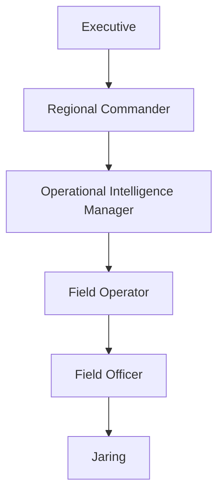
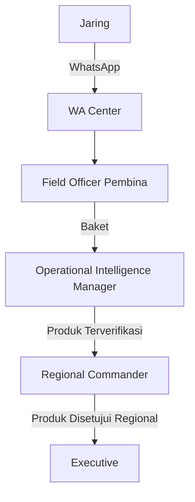

# DENS CAKRA — Final Role & Navigation Baseline

| Field | Value |
|---|---|
| Document | Final Role & Navigation Baseline |
| Product | DENS CAKRA |
| Version | 1.0 |
| Date | 10 July 2026 |
| Author | System Analyst |
| Status | Approved Baseline for Database & Backend Design |

## Revision History

| Version | Date | Description |
|---|---|---|
| 1.0 | 10 July 2026 | Finalisasi role, workflow, Jaring, WA Center, dan sidebar |

## 1. Purpose

Dokumen ini menjadi baseline final sebelum perancangan database dan backend. Dokumen mengunci role, jabatan, organisasi, reporting line, alur top-down, alur bottom-up, pengelolaan Jaring, format laporan WhatsApp, proses Baket, verifikasi, Neraca Penilaian, serta struktur sidebar setiap role.


## 2. Final Role Model

```text
ADMIN_SYSTEM
EXECUTIVE
REGIONAL_COMMANDER
OPERATIONAL_INTELLIGENCE_MANAGER
FIELD_OPERATOR
FIELD_OFFICER
```

Jaring bukan role aplikasi.

```text
JARING
= External actor
= Tidak memiliki akun
= Tidak login
= Mengirim laporan melalui WhatsApp
```

### 2.1 Role and Position Mapping

```text
ADMIN_SYSTEM
└── Administrator Sistem

EXECUTIVE
└── Deputi II

REGIONAL_COMMANDER
├── Direktur Wilayah
└── Kabinda

OPERATIONAL_INTELLIGENCE_MANAGER
├── Kasubdit
└── Kabagops

FIELD_OPERATOR
├── Staf Subdit
└── Korwil

FIELD_OFFICER
└── Petugas Organik
```

### 2.2 Core Principle

```text
Role = fitur dan tindakan
Position = jabatan pengguna
Organization = unit kerja
Reporting Line = tujuan tugas dan laporan
Scope = data yang boleh dilihat
```

Direktur Wilayah dan Kabinda menggunakan role yang sama, tetapi dibedakan oleh position, organization type, unit, dan reporting line. Hal yang sama berlaku untuk Kasubdit dan Kabagops.


## 3. Organizational Routing

### 3.1 Directorate Route

```text
Top-Down:
Executive
→ Regional Commander: Direktur Wilayah
→ Operational Intelligence Manager: Kasubdit
→ Field Operator: Staf Subdit
→ Field Officer
→ Jaring

Bottom-Up:
Jaring
→ Field Officer
→ Operational Intelligence Manager: Kasubdit
→ Regional Commander: Direktur Wilayah
→ Executive
```

### 3.2 Binda Route

```text
Top-Down:
Executive
→ Regional Commander: Kabinda
→ Operational Intelligence Manager: Kabagops
→ Field Operator: Korwil
→ Field Officer
→ Jaring

Bottom-Up:
Jaring
→ Field Officer
→ Operational Intelligence Manager: Kabagops
→ Regional Commander: Kabinda
→ Executive
```

### 3.3 Mandatory Routing Rules

```text
Kasubdit → Direktur Wilayah atasannya
Kabagops → Kabinda atasannya
Staf Subdit → menerima tugas dari Kasubdit
Korwil → menerima tugas dari Kabagops
```

Routing tidak boleh ditentukan hanya dari role.


## 4. Top-Down Workflow



### Executive

Membuat direktif strategis berisi KIQ, UUK/PIR, sasaran, wilayah, prioritas, klasifikasi, deadline, target hasil, dan lampiran. Direktif dapat dikirim kepada satu unit, beberapa unit, seluruh Direktorat Wilayah, seluruh Binda, atau kombinasi unit tertentu.

### Regional Commander

Menerima dan menjabarkan direktif, menetapkan fokus wilayah, target operasional, serta menugaskan Operational Intelligence Manager.

### Operational Intelligence Manager

Menyusun kebutuhan informasi operasional, mempertahankan pertanyaan UUK asli, menentukan sasaran, wilayah, Field Operator, deadline, prioritas, dan format jawaban.

### Field Operator

Mendistribusikan tugas kepada Field Officer, memantau acknowledgement, progres, deadline, workload, hambatan, dan reassignment. Field Operator tidak menjadi jalur wajib laporan bottom-up.

### Field Officer

Menerima tugas, memilih Jaring yang relevan, memberikan arahan, memantau respons, dan meminta pengembangan informasi.


## 5. Bottom-Up Workflow



```text
Jaring
→ WhatsApp
→ WA Center
→ Field Officer
→ Operational Intelligence Manager
→ Regional Commander
→ Executive
```

Field Operator tidak berada pada jalur laporan ke atas.


## 6. Jaring Management

### 6.1 Jaring as External Actor

Jaring tidak memiliki akun, password, dashboard, sidebar, akses status internal, akses Neraca Penilaian, atau akses Produk Intelijen.

### 6.2 Relationship

```text
1 Field Officer → banyak Jaring
1 Jaring → 1 Field Officer pembina aktif
```

### 6.3 Stored Data

- Jaring ID.
- Kode Jaring.
- Nama alias.
- Nomor WhatsApp.
- Field Officer pembina.
- Unit Field Officer.
- Wilayah coverage.
- Status.
- Tanggal mulai pembinaan.
- Catatan internal.
- Waktu terakhir aktif.
- Jumlah laporan.
- Riwayat pembina.

Identitas asli dipisahkan dari data operasional dan dienkripsi.

### 6.4 Registration

Field Officer dapat mendaftarkan Jaring melalui menu **Jaring Binaan**.

Input:

- Kode Jaring.
- Nama alias.
- Nomor WhatsApp.
- Wilayah coverage.
- Kategori atau spesialisasi.
- Tanggal mulai.
- Catatan internal.
- Status aktif.

Validasi:

- Nomor WhatsApp wajib.
- Nomor WhatsApp unik di antara Jaring aktif.
- Kode Jaring unik.
- Field Officer hanya mendaftarkan Jaring dalam scope-nya.
- Satu Jaring hanya memiliki satu pembina aktif.

### 6.5 Deletion

```text
Belum pernah mengirim laporan
→ dapat dihapus sesuai permission

Sudah pernah mengirim laporan
→ hanya dapat dinonaktifkan atau diarsipkan
```

Status: Aktif, Nonaktif, Dipindahkan, Diarsipkan.


## 7. WhatsApp Report Format

Format laporan Jaring:

```text
1. Judul
2. Foto
3. Koordinat GPS
4. Isi Laporan
```

### Rules

- Judul wajib.
- Foto wajib minimal satu.
- GPS wajib.
- Isi laporan wajib.
- Sistem mengekstrak latitude dan longitude.
- Pesan asli disimpan immutable.

### Automatic Metadata

- Message ID.
- Nomor pengirim.
- Waktu pengiriman.
- Waktu diterima.
- Media ID.
- Jenis media.
- Caption.
- Raw payload.
- File hash.
- Parsing status.
- Delivery status.


## 8. WhatsApp Routing

```text
Nomor WhatsApp masuk
→ cari Jaring aktif
→ temukan Field Officer pembina
→ masukkan ke Kotak Masuk Jaring
```

Nomor yang tidak dikenali masuk ke quarantine queue.

Aksi terhadap unknown sender:

- Hubungkan ke Jaring.
- Daftarkan sebagai Jaring baru.
- Tandai spam.
- Tolak pesan.
- Alihkan kepada Field Officer yang tepat.


## 9. Field Officer Initial Verification

Field Officer memeriksa:

- Pengirim valid.
- Judul tersedia.
- Foto tersedia.
- GPS tersedia.
- Isi tersedia.
- Relevansi terhadap tugas.
- Duplikasi.
- Kesesuaian foto.
- Kesesuaian lokasi.
- Kebutuhan pengembangan.

Aksi:

- Terima.
- Minta pengembangan.
- Tandai belum lengkap.
- Tandai duplikat.
- Tandai tidak relevan.
- Gabungkan pesan.
- Hubungkan ke tugas.
- Jadikan Baket.

Field Officer tidak mengisi Neraca Penilaian.


## 10. Baket Creation

```text
Pesan WhatsApp
→ Pemeriksaan Field Officer
→ Baket
```

Data otomatis:

- Judul.
- Foto.
- GPS.
- Isi asli.
- Kode Jaring.
- Waktu pesan.
- Pesan sumber.

Data tambahan:

- Tugas terkait.
- UUK/PIR.
- Judul normalisasi.
- Kategori isu.
- Lokasi administratif.
- Waktu kejadian.
- Urgensi awal.
- Catatan Field Officer.
- Hasil klarifikasi.
- Bukti tambahan.

Status:

```text
Draft
→ Siap Dikirim
→ Dikirim ke OIM
→ Dalam Verifikasi
→ Perlu Pengembangan
→ Terverifikasi
atau
→ Ditolak
```

Baket terverifikasi menjadi read-only bagi Field Officer.


## 11. Formal Verification

Operational Intelligence Manager melakukan:

- Pemeriksaan kelengkapan.
- Pemeriksaan UUK/PIR.
- Pemeriksaan sumber.
- Pemeriksaan fakta.
- Pemeriksaan foto.
- Pemeriksaan GPS.
- Cross-reference.
- Duplicate checking.
- Pemeriksaan waktu.
- Pemeriksaan potensi disinformasi.
- Penilaian sumber A–F.
- Penilaian isi 1–6.
- Catatan verifikator.
- Keputusan verifikasi.

Hanya Operational Intelligence Manager yang dapat menetapkan Neraca Penilaian.


## 12. Revision Workflow

```text
OIM menemukan kekurangan
→ Baket dikembalikan ke Field Officer
→ Field Officer menerima catatan
→ Field Officer meminta pengembangan ke Jaring
→ Jaring mengirim informasi tambahan
→ Field Officer memperbarui Baket
→ Baket dikirim ulang ke OIM
```

Catatan revisi wajib memuat kekurangan, informasi yang dibutuhkan, bagian yang harus diperbaiki, deadline, dan catatan tambahan.


# 13. Final Sidebar Navigation

## 13.1 Admin System

```text
Dashboard Sistem
Organisasi & Wilayah
Pengguna
Role & Hak Akses
Jabatan & Reporting Line
Integrasi WA Center
Master Data
Keamanan & Audit
Konfigurasi Sistem
```

### Dashboard Sistem

- Status layanan.
- User aktif.
- Akun terkunci.
- Status WA Center.
- Pesan gagal diproses.
- Storage usage.
- Security alert.
- Aktivitas admin.

### Organisasi & Wilayah

- Membuat organisasi dan unit.
- Mengatur tipe unit.
- Mengatur parent unit.
- Mengatur wilayah.
- Mengaktifkan atau menonaktifkan unit.
- Melihat struktur organisasi.

### Pengguna

- Membuat user.
- Mengaktifkan atau menonaktifkan user.
- Menetapkan role, position, unit, atasan, dan wilayah.
- Reset MFA.
- Mengunci atau membuka akun.
- Mencabut session.

### Role & Hak Akses

- Permission.
- Menu visibility.
- Create, read, update, approve.
- Akses klasifikasi.
- Scope unit.
- Scope wilayah.

### Jabatan & Reporting Line

- Membuat position.
- Menghubungkan atasan dan bawahan.
- Menentukan jalur Direktorat.
- Menentukan jalur Binda.
- Mengatur masa berlaku jabatan.

### Integrasi WA Center

- Nomor WA Center.
- Connection status.
- Webhook.
- Queue.
- Failed parsing.
- Unknown sender.
- Retry.
- File limit.
- Retention.
- Template balasan.

### Master Data

- Klasifikasi.
- Jenis Produk Intelijen.
- Kode produk.
- Panca Gatra.
- Kategori isu.
- Status workflow.
- Jenis evidence.
- Prioritas.
- Wilayah administratif.
- Format nomor.
- Kode organisasi.

### Keamanan & Audit

- Audit log.
- Security event.
- Failed login.
- Suspicious access.
- Unknown device.
- Permission change.
- Export activity.
- Session activity.
- Data access log.

Audit tidak dapat diubah atau dihapus Admin Sistem.

### Konfigurasi Sistem

- Notification policy.
- Session policy.
- MFA policy.
- Upload policy.
- Retention policy.
- Maintenance mode.
- Feature flag.
- Integration configuration.


## 13.2 Executive

```text
Beranda Eksekutif
Situasi Nasional
├── Peta Kerawanan
└── Peringatan Dini
Pusat Komando
├── Direktif Strategis
└── Operasi Darurat
Monitoring Nasional
Produk Intelijen
Persetujuan Eksekutif
Kinerja & Evaluasi
Laporan & Briefing
```

### Menu Functions

- **Beranda Eksekutif:** situasi nasional, progress UUK/PIR, produk prioritas, alert, approval queue, executive summary.
- **Situasi Nasional:** heatmap, Panca Gatra, aksi massa, hotspot, blind spot, early warning, drill-down.
- **Pusat Komando:** membuat dan broadcast direktif, read receipt, monitoring progres, arahan tambahan, operasi darurat.
- **Monitoring Nasional:** wilayah, tugas, pipeline laporan, personel agregat, alert.
- **Produk Intelijen:** membaca produk, Neraca Penilaian, sumber, versi, dan Baket.
- **Persetujuan Eksekutif:** setujui, kembalikan, klarifikasi, catatan, deadline, distribusi.
- **Kinerja & Evaluasi:** UUK, wilayah, laporan, personel, blind spot, tren.
- **Laporan & Briefing:** kompilasi produk dan executive summary.


## 13.3 Regional Commander

```text
Beranda
Komando Regional
Direktif & Penjabaran UUK/STR
Monitoring Tugas
Laporan & Produk Intelijen
Persetujuan Regional
Peta & Peringatan Dini
Personel & Jaring
KPI & Evaluasi
```

### Menu Functions

- **Beranda:** ringkasan wilayah, tugas, produk menunggu review, alert, KPI.
- **Komando Regional:** kendali operasi, arahan wilayah, isu prioritas, hambatan.
- **Direktif & Penjabaran UUK/STR:** direktif sumber, fokus wilayah, target, unit, deadline, prioritas.
- **Monitoring Tugas:** status, deadline, unit pelaksana, progress, read receipt, overdue.
- **Laporan & Produk Intelijen:** produk dari OIM, Baket sumber, Neraca Penilaian, analisis, lampiran, versi.
- **Persetujuan Regional:** setujui, kembalikan, klarifikasi, catatan, revisi, deadline, rekomendasi.
- **Peta & Peringatan Dini:** peta wilayah, hotspot, aksi massa, personel, blind spot, alert.
- **Personel & Jaring:** monitoring agregat Field Officer dan Jaring.
- **KPI & Evaluasi:** pemenuhan UUK, waktu respons, validasi, produktivitas, coverage.

Regional Commander tidak mendaftarkan Jaring.


## 13.4 Operational Intelligence Manager

```text
Beranda
Direktif & Tugas
Laporan Masuk
Verifikasi & Neraca Penilaian
Analisis Intelijen
Produk Intelijen
├── Daftar Produk
└── Buat Produk
Pengajuan Persetujuan
Monitoring Lapangan
Peta Situasi
```

### Menu Functions

- **Beranda:** Baket baru, antrian verifikasi, draft, revisi, deadline, workload.
- **Direktif & Tugas:** menerima dan menjabarkan kebutuhan informasi, memilih Field Operator.
- **Laporan Masuk:** menerima Baket, melihat sumber, tugas, foto, GPS, isi, prioritas.
- **Verifikasi & Neraca Penilaian:** nilai A–F, nilai 1–6, alasan, cross-reference, validasi foto/GPS/UUK, keputusan.
- **Analisis Intelijen:** indikasi, analisis, dampak, upaya, saran tindak, entitas, timeline, AI, validasi manusia.
- **Produk Intelijen:** daftar, buat, draft, review, revisi, versioning, traceability.
- **Pengajuan Persetujuan:** validasi field, routing otomatis, catatan, kirim ke Regional Commander.
- **Monitoring Lapangan:** Field Operator, Field Officer, progress, deadline, coverage.
- **Peta Situasi:** lokasi Baket, lokasi tugas, hotspot, coverage, validasi koordinat.

Format Produk Intelijen:

- Jurnal Informasi.
- Laporan Informasi.
- Laporan Intelijen.
- Basic Descriptive Intelligence.
- Laporan Harian Intelijen.
- Laporan Intelijen Khusus.
- Perkiraan Intelijen Situasi.


## 13.5 Field Operator

```text
Beranda
Tugas Operasional
Penugasan Field Officer
Monitoring Tugas
Personel Lapangan
Peta Lapangan
Laporan Darurat
```

### Menu Functions

- **Beranda:** tugas diterima, belum dibagi, aktif, terlambat, personel tersedia.
- **Tugas Operasional:** membaca tugas, UUK/PIR, wilayah, sasaran, deadline, acknowledgement.
- **Penugasan Field Officer:** Field Officer, tugas, wilayah, target, deadline, prioritas, instruksi, lampiran.
- **Monitoring Tugas:** acknowledgement, progress, deadline, reassign, supervisi, hambatan.
- **Personel Lapangan:** daftar Field Officer, status, workload, availability, assignment.
- **Peta Lapangan:** lokasi tugas, posisi sesuai izin, coverage, alert.
- **Laporan Darurat:** alert, koordinasi, bantuan, timeline insiden.


## 13.6 Field Officer

```text
Beranda
Tugas Saya
Jaring Binaan
Kotak Masuk Jaring
Buat Baket
Laporan Saya
Peta Tugas
Laporan Darurat
```

### Menu Functions

- **Beranda:** tugas baru, tugas aktif, deadline, pesan Jaring baru, revisi Baket, quick action.
- **Tugas Saya:** melihat tugas, acknowledgement, UUK/PIR, sasaran, deadline, update progres.
- **Jaring Binaan:** daftar, tambah, edit, nonaktifkan, arsipkan, pindahkan pembinaan, aktivitas.
- **Kotak Masuk Jaring:** menerima Judul, Foto, GPS, Isi, cek kelengkapan, minta pengembangan, duplikat, hubungkan tugas, jadikan Baket.
- **Buat Baket:** tugas, UUK/PIR, kode Jaring, judul, isi asli, judul normalisasi, kategori, waktu, lokasi, GPS, urgensi, catatan, foto, bukti, pesan sumber.
- **Laporan Saya:** draft, dikirim, diverifikasi, perlu pengembangan, terverifikasi, ditolak, feedback.
- **Peta Tugas:** sasaran, area, titik laporan, lokasi, alert.
- **Laporan Darurat:** situasi, lokasi, tindakan, kebutuhan, foto, alert.


## 14. Product Input Ownership

```text
Jaring
→ Judul, Foto, GPS, Isi melalui WhatsApp

Field Officer
→ verifikasi awal dan membuat Baket

Field Operator
→ membagi dan memonitor tugas

Operational Intelligence Manager
→ verifikasi formal
→ Neraca Penilaian
→ analisis
→ membuat Produk Intelijen

Regional Commander
→ review dan approval regional

Executive
→ review strategis dan approval eksekutif

Admin Sistem
→ organisasi, user, permission, reporting line, dan integrasi
```


## 15. Core Business Rules

### Jaring

- `BR-JRG-001` Jaring tidak memiliki akun.
- `BR-JRG-002` Satu Field Officer dapat membina banyak Jaring.
- `BR-JRG-003` Satu Jaring hanya memiliki satu pembina aktif.
- `BR-JRG-004` Field Officer hanya mengelola Jaring binaannya.
- `BR-JRG-005` Nomor WhatsApp Jaring aktif harus unik.
- `BR-JRG-006` Jaring dengan riwayat laporan tidak boleh hard delete.

### WhatsApp

- `BR-WA-001` Laporan wajib memiliki Judul, Foto, GPS, dan Isi.
- `BR-WA-002` Pesan asli harus immutable.
- `BR-WA-003` Pesan dihubungkan berdasarkan nomor pengirim.
- `BR-WA-004` Nomor tidak dikenal masuk quarantine.

### Baket

- `BR-BAK-001` Field Officer membentuk Baket.
- `BR-BAK-002` Field Officer tidak menetapkan Neraca Penilaian.
- `BR-BAK-003` Baket terverifikasi read-only bagi Field Officer.

### Verification

- `BR-VER-001` Neraca Penilaian hanya ditetapkan OIM.
- `BR-VER-002` Revisi wajib memiliki feedback.
- `BR-VER-003` Verifikasi harus terhubung ke Baket.

### Routing

- `BR-ROUTE-001` Kasubdit hanya mengajukan ke Direktur Wilayah atasannya.
- `BR-ROUTE-002` Kabagops hanya mengajukan ke Kabinda atasannya.
- `BR-ROUTE-003` Routing ditentukan oleh position dan reporting line.

### Admin

- `BR-ADM-001` Admin mengelola user dan organisasi.
- `BR-ADM-002` Admin tidak otomatis melihat isi intelijen.
- `BR-ADM-003` Audit log tidak dapat diubah Admin.
- `BR-ADM-004` Perubahan permission harus tercatat.


## 16. Backend Domain Preview

```text
User
Role
Permission
Position
Organization
Organizational Unit
Reporting Line
Region Scope

Field Officer
Jaring
Jaring Assignment
Jaring Status History

WhatsApp Account
WhatsApp Message
WhatsApp Media
WhatsApp Location
WhatsApp Processing Log
Unknown Sender Queue

Directive
UUK/PIR
Task
Task Assignment
Task Progress

Baket
Baket Source Message
Baket Evidence
Baket Location
Baket Revision

Verification
Neraca Penilaian
Cross Reference

Intelligence Product
Product Template
Product Version
Approval
Distribution

Notification
Audit Log
System Configuration
```


## 17. Recommended Implementation Order

```text
1. Organization, Position, and Reporting Line
2. User, Role, Permission, and Scope
3. Admin System Module
4. Field Officer–Jaring Management
5. WA Center Integration
6. WhatsApp Parsing and Routing
7. Field Officer Inbox
8. Baket Creation
9. OIM Verification and Neraca Penilaian
10. Intelligence Product Forms
11. Regional Approval
12. Executive Approval
13. Dashboard and Analytics
```

## 18. Final Baseline

```text
Admin Sistem
= organisasi, user, permission, reporting line, dan integrasi

Executive
= direktif, monitoring strategis, dan approval eksekutif

Regional Commander
= penjabaran direktif, kendali wilayah, dan approval regional

Operational Intelligence Manager
= menerima Baket, memverifikasi, memberi Neraca Penilaian,
  menganalisis, dan membuat Produk Intelijen

Field Operator
= mendistribusikan dan memonitor tugas

Field Officer
= mengelola Jaring, menerima WhatsApp, verifikasi awal, dan membuat Baket

Jaring
= sumber eksternal yang mengirim Judul, Foto, GPS, dan Isi melalui WhatsApp
```
