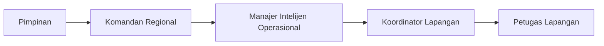
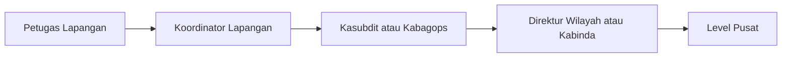

# Role-Based Navigation Specification — DENS CAKRA

| Field | Value |
|---|---|
| Document | Role-Based Navigation Specification |
| Product | DENS CAKRA |
| Version | 1.0 |
| Date | 10 July 2026 |
| Author | System Analyst |
| Status | Draft for Review |

## Revision History

| Version | Date | Description |
|---|---|---|
| 1.0 | 10 July 2026 | Initial role-based navigation mapping |

## 1. Purpose

Dokumen ini mendefinisikan struktur sidebar dan pembagian fitur per role untuk aplikasi DENS CAKRA.

Struktur menu disusun berdasarkan:

- Alur direktif dari pimpinan ke lapangan.
- Pengumpulan Bahan Keterangan atau Baket.
- Verifikasi dan Neraca Penilaian.
- Analisis manual dan AI offline.
- Penyusunan Produk Intelijen.
- Persetujuan berjenjang.
- Monitoring operasi, personel, dan wilayah.
- Pemetaan kerawanan dan peringatan dini.
- Penanganan kondisi darurat.
- Prinsip keamanan `need-to-know` dan `need-to-access`.
- Referensi mockup DENS CAKRA pada `https://denscakra.netkrida-x.net/login`.

Dokumen ini hanya mencakup role berikut:

1. Eksekutif — Kabinda.
2. Komandan Regional — Direktur Wilayah atau Kabinda.
3. Manajer Intelijen Operasional — Kasubdit atau Kabagops.
4. Koordinator Lapangan — Korwil.
5. Petugas Lapangan — Petugas Organik.

Role Admin Sistem, Deputi II, Deputi IX, Kepala BIN, Wakil Kepala BIN, dan Jaring Agen tidak dibuat sebagai sidebar tersendiri dalam dokumen ini karena tidak termasuk daftar role yang ditetapkan.

---

## 2. Executive Decision

Struktur navigasi yang direkomendasikan **mampu mencakup kebutuhan utama dokumen**, dengan ketentuan berikut:

1. Setiap role memiliki dashboard, data, dan tindakan sesuai scope kewenangannya.
2. Sidebar maksimal menggunakan dua tingkat navigasi.
3. Filter, status, tab, sorting, quick action, dan detail data ditempatkan di dalam halaman.
4. Submenu hanya digunakan jika satu domain memiliki dua pekerjaan utama yang benar-benar berbeda.
5. Status workflow tidak dijadikan submenu.
6. Jenis Produk Intelijen tidak dijadikan menu terpisah.
7. Notifikasi ditempatkan pada ikon lonceng di header, bukan menu utama.
8. Pengaturan akun dan perangkat ditempatkan pada user menu.
9. Audit log tetap berjalan otomatis walaupun tidak selalu terlihat pada sidebar.
10. Kabinda menggunakan satu akun dengan dua workspace: **Mode Eksekutif** dan **Mode Komando Regional**.

---

## 3. Navigation Design Principles

### 3.1 Navigation vs In-Page Feature

Sebuah fungsi dijadikan menu atau submenu hanya apabila:

- Memiliki tujuan pengguna yang berbeda.
- Memiliki kumpulan data sendiri.
- Memiliki workflow sendiri.
- Digunakan secara rutin.
- Membutuhkan URL dan akses permission tersendiri.

Fungsi berikut tetap berada di dalam halaman:

- Filter tanggal, wilayah, status, klasifikasi, dan prioritas.
- Search dan sorting.
- Tab status seperti Baru, Diproses, Revisi, Disetujui, dan Arsip.
- Tombol Buat, Verifikasi, Kembalikan, Setujui, Kirim, dan Ekspor.
- Lampiran foto, video, dokumen, dan GPS.
- Catatan, komentar, dan riwayat status.
- Ringkasan AI dan detail entity extraction.
- Daftar penerima dan read receipt.
- Panel detail yang dibuka dari tabel atau peta.

### 3.2 Maximum Depth

```text
Level 1: Menu utama
└── Level 2: Submenu, hanya jika diperlukan
```

Tidak direkomendasikan membuat submenu tingkat ketiga.

### 3.3 Common Utilities

Fungsi global berikut tidak perlu memenuhi sidebar:

- Global Search.
- Notification Center.
- Profile.
- Device Management.
- Security Session.
- Bantuan dan SOP.
- Logout.

Fungsi tersebut ditempatkan pada topbar atau user menu.

---

## 4. Final Navigation by Role

# 4.1 Executive Workspace — Kabinda

## Objective

Mendukung pengambilan keputusan, pemantauan situasi, pemberian arahan, persetujuan laporan, dan evaluasi kinerja Binda.

## Sidebar

```text
Beranda Eksekutif
Situasi Strategis
├── Peta Kerawanan
└── Peringatan Dini
Pusat Komando
├── Direktif
└── Operasi Darurat
Produk Intelijen
Persetujuan
Kinerja & Evaluasi
```

## Page Specifications

### NAV-EXE-001 — Beranda Eksekutif

**Purpose:** Menjadi `single source of truth` untuk kondisi wilayah dan keputusan Kabinda.

Fitur di dalam halaman:

- Ringkasan tingkat kerawanan wilayah.
- Jumlah laporan hari ini.
- Laporan prioritas.
- Status pemenuhan UUK/PIR.
- Laporan menunggu persetujuan.
- Operasi aktif.
- Personel aktif dan tidak aktif.
- Ringkasan AI.
- Isu prioritas.
- Blind spot wilayah.
- Kejadian darurat.
- Quick action untuk membuka laporan, memberi arahan, atau membuat direktif.

### NAV-EXE-002 — Situasi Strategis

Submenu diperlukan karena peta dan alert memiliki mode kerja berbeda.

#### Peta Kerawanan

Fitur di dalam halaman:

- Heatmap ancaman.
- Layer Ideologi, Politik, Ekonomi, Sosial Budaya, Pertahanan, dan Keamanan.
- Aksi massa.
- Tuntutan utama.
- Aktor dan organisasi.
- Sebaran laporan.
- Drill-down provinsi, kabupaten/kota, kecamatan, dan detail laporan.
- Korelasi kejadian.
- Blind spot.

#### Peringatan Dini

Fitur di dalam halaman:

- Alert eskalasi.
- Deteksi anomali.
- Tren isu.
- Ranking risiko.
- Alert berdasarkan wilayah.
- Alert belum ditindaklanjuti.
- Catatan tindak lanjut.
- Status Selesai atau Dalam Penanganan.

### NAV-EXE-003 — Pusat Komando

Submenu diperlukan karena direktif dan insiden darurat mempunyai workflow berbeda.

#### Direktif

Fitur di dalam halaman:

- Direktif masuk.
- Direktif yang diterbitkan.
- UUK/PIR terkait.
- Penugasan unit.
- Broadcast ke wilayah atau unit.
- Read receipt.
- Status Not Started, In Progress, Pending Review, dan Completed.
- Deadline.
- Catatan supervisi.
- Riwayat perubahan.

#### Operasi Darurat

Fitur di dalam halaman:

- Panic alert.
- Peta insiden.
- Situasi, Tindakan, dan Kebutuhan.
- Unit terdekat.
- Permintaan bantuan.
- Instruksi cepat.
- Eskalasi ke level pusat.
- Timeline penanganan.
- Penutupan insiden.

### NAV-EXE-004 — Produk Intelijen

Fitur di dalam halaman:

- Daftar Produk Intelijen.
- Filter jenis produk.
- Filter klasifikasi.
- Detail produk.
- Ringkasan eksekutif.
- Bukti pendukung.
- Sumber laporan.
- Riwayat versi.
- Distribusi dan tembusan.
- Arsip.

Tab internal:

- Semua.
- Menunggu Tindakan.
- Disahkan.
- Dikembalikan.
- Arsip.

Jenis produk tidak dibuat sebagai submenu. Sistem menggunakan filter atau selector jenis produk.

### NAV-EXE-005 — Persetujuan

Fitur di dalam halaman:

- Antrian persetujuan.
- Detail laporan.
- Perbandingan versi.
- Neraca Penilaian read-only.
- Catatan analis.
- Setujui.
- Kembalikan untuk revisi.
- Catatan revisi wajib.
- Tanda tangan elektronik.
- Riwayat persetujuan.
- Status distribusi.

### NAV-EXE-006 — Kinerja & Evaluasi

Fitur di dalam halaman:

- Pemenuhan UUK/PIR.
- Produktivitas unit.
- Produktivitas personel dan jaring.
- Kecepatan respons.
- Validasi laporan.
- Jumlah revisi.
- Coverage wilayah.
- Blind spot.
- Laporan triwulan.
- Laporan tahunan.
- Drill-down ke unit dan personel sesuai permission.

## Executive Access Restrictions

- Kabinda hanya melihat data Binda yang menjadi kewenangannya.
- Data lintas Binda tidak ditampilkan kecuali ada penugasan atau kewenangan khusus.
- Kabinda dapat menyetujui laporan Binda, tetapi bukan persetujuan akhir tingkat Deputi II.
- Neraca Penilaian dapat dilihat tetapi tidak diubah pada tahap persetujuan.
- Identitas asli jaring hanya tampil sesuai `need-to-know`.

---

# 4.2 Regional Commander Workspace — Direktur Wilayah / Kabinda

## Objective

Mendukung pengendalian operasi, penjabaran direktif, distribusi penugasan, monitoring laporan, dan supervisi wilayah.

## Sidebar

```text
Beranda
Komando Regional
Direktif & Penjabaran UUK/STR
Monitoring Tugas
Jawaban Lapangan
Laporan Intelijen
Peta & Peringatan Dini
Personel & Jaring
KPI & Evaluasi
```

## Page Specifications

### NAV-REG-001 — Beranda

Fitur di dalam halaman:

- Operasi aktif.
- Tugas terlambat.
- Laporan masuk.
- Tingkat validasi.
- Rata-rata waktu respons.
- Peta ringkas.
- Executive summary.
- Wilayah prioritas.
- Alert terbaru.
- Produk menunggu tindakan.

### NAV-REG-002 — Komando Regional

Fitur di dalam halaman:

- Ringkasan seluruh operasi wilayah.
- Status Binda atau unit subordinat.
- Operasi prioritas.
- Isu wilayah.
- Status dukungan.
- Hambatan operasi.
- Quick action untuk memberi arahan.
- Drill-down ke operasi, unit, dan personel.

### NAV-REG-003 — Direktif & Penjabaran UUK/STR

Menu ini mempertahankan pola mockup **Penjabaran UK/STR**, tetapi label direkomendasikan menjadi **UUK/STR** agar konsisten dengan dokumen.

Fitur di dalam halaman:

- Direktif masuk.
- Daftar UUK/PIR.
- Penyusunan STR.
- Nomor perintah.
- Sumber dan pemberi perintah.
- Klasifikasi.
- Wilayah sasaran.
- Batas waktu.
- Dasar dan latar belakang.
- Sasaran penyelidikan.
- EEI/PIR.
- Rencana pengumpulan.
- Saran tindak.
- Generate draft berbasis AI.
- Perbaikan bahasa.
- Preview.
- Terbitkan.
- Distribusi multi-wilayah.
- Read receipt.
- Riwayat versi.

Tab internal:

- Direktif Masuk.
- Draft.
- Diterbitkan.
- Selesai.
- Dibatalkan.

### NAV-REG-004 — Monitoring Tugas

Fitur di dalam halaman:

- Daftar penugasan.
- Status progres.
- Deadline.
- Unit pelaksana.
- Petugas pelaksana.
- Read receipt.
- Beban kerja.
- Tugas terlambat.
- Supervisi.
- Perintah tambahan.
- Timeline aktivitas.

View internal:

- Tabel.
- Kanban.
- Timeline.
- Peta.

### NAV-REG-005 — Jawaban Lapangan

Fitur di dalam halaman:

- Baket dari aplikasi.
- Baket dari WA Center.
- Laporan cepat.
- Status kelengkapan.
- Bukti foto, video, dokumen, dan GPS.
- Sumber dengan kode atau pseudonym.
- Hubungan ke UUK/PIR.
- Status verifikasi.
- Catatan pengembangan.
- Detail lokasi.
- Ringkasan AI.
- Eskalasi ke Manajer Intelijen Operasional.

Tab internal:

- Baru.
- Diproses.
- Perlu Pengembangan.
- Terverifikasi.
- Ditolak.

### NAV-REG-006 — Laporan Intelijen

Fitur di dalam halaman:

- Daftar Produk Intelijen.
- Draft.
- Menunggu persetujuan.
- Disahkan.
- Dikembalikan.
- Arsip.
- Detail Neraca Penilaian.
- Catatan analisis.
- Lampiran.
- Riwayat versi.
- Persetujuan.
- Distribusi.
- Tembusan.

Aksi `Setujui` dan `Kembalikan` berada di halaman detail, bukan submenu terpisah.

### NAV-REG-007 — Peta & Peringatan Dini

Fitur di dalam halaman:

- Peta kerawanan.
- Peta aksi massa.
- Peta tuntutan.
- Sebaran personel.
- Sebaran laporan.
- Hotspot.
- Blind spot.
- Tren eskalasi.
- Alert.
- Layer Panca Gatra.
- Drill-down lokasi.
- Detail laporan dari titik peta.

Tab internal:

- Peta Situasi.
- Aksi Massa.
- Personel.
- Blind Spot.
- Alert.

### NAV-REG-008 — Personel & Jaring

Fitur di dalam halaman:

- Korwil.
- Petugas Organik.
- Jaring Agen dengan pseudonym.
- Status aktif.
- Posisi terakhir.
- Tugas aktif.
- Produktivitas.
- Coverage area.
- Beban kerja.
- Mode stealth.
- Riwayat penugasan.

Data identitas asli jaring harus dibatasi secara ketat.

### NAV-REG-009 — KPI & Evaluasi

Fitur di dalam halaman:

- Pemenuhan UUK.
- Jumlah laporan.
- Tingkat validasi.
- Waktu respons.
- Revisi laporan.
- Produktivitas wilayah.
- Produktivitas personel.
- Coverage.
- Blind spot.
- Laporan triwulan.
- Laporan tahunan.

---

# 4.3 Operational Intelligence Manager — Kasubdit / Kabagops

## Objective

Mendukung pemeriksaan Baket, verifikasi, Neraca Penilaian, analisis, penyusunan Produk Intelijen, dan pengajuan persetujuan.

## Sidebar

```text
Beranda
Direktif & Tugas
Laporan Masuk
Verifikasi & Neraca Penilaian
Analisis Intelijen
Produk Intelijen
Monitoring Lapangan
Peta Situasi
```

## Page Specifications

### NAV-OIM-001 — Beranda

Fitur di dalam halaman:

- Laporan baru.
- Antrian verifikasi.
- Tugas mendekati deadline.
- Laporan perlu revisi.
- Produk dalam draft.
- Produk menunggu persetujuan.
- Alert lapangan.
- Ringkasan workload.
- Ringkasan AI.

### NAV-OIM-002 — Direktif & Tugas

Fitur di dalam halaman:

- Direktif yang diterima.
- UUK/PIR.
- Target informasi.
- Deadline.
- Unit pelaksana.
- Status pemenuhan.
- Read receipt.
- Catatan pimpinan.
- Penjabaran menjadi tugas teknis.
- Distribusi kepada Korwil atau tim.

Tab internal:

- Aktif.
- Menunggu Pembagian.
- Berjalan.
- Selesai.
- Terlambat.

### NAV-OIM-003 — Laporan Masuk

Fitur di dalam halaman:

- Intake aplikasi.
- Intake WA Center.
- Laporan darurat.
- Pemeriksaan metadata.
- Pemeriksaan lampiran.
- Hubungan ke tugas.
- Duplicate detection.
- Detail sumber.
- Detail GPS.
- Ringkasan AI awal.
- Assign ke verifikator.
- Kembalikan untuk kelengkapan.

Tab internal:

- Baru.
- Belum Lengkap.
- Siap Diverifikasi.
- Darurat.
- Duplikat.

### NAV-OIM-004 — Verifikasi & Neraca Penilaian

Fitur di dalam halaman:

- Pemeriksaan 5W+1H.
- Pemeriksaan jawaban terhadap UUK.
- Kepercayaan sumber A–F.
- Kebenaran informasi 1–6.
- Cross-reference.
- Evidence validation.
- Pemeriksaan lokasi.
- Pemeriksaan waktu.
- Catatan verifikator.
- Status Valid, Perlu Pengembangan, atau Ditolak.
- Lock data setelah diverifikasi.
- Riwayat perubahan.
- Validasi hasil AI.

Tab internal:

- Antrian.
- Sedang Diverifikasi.
- Perlu Pengembangan.
- Terverifikasi.
- Ditolak.

### NAV-OIM-005 — Analisis Intelijen

Fitur di dalam halaman:

- Data terverifikasi.
- Entity extraction.
- Topic clustering.
- Sentiment analysis.
- Link analysis.
- Timeline kejadian.
- Korelasi lintas laporan.
- Deteksi anomali.
- Blind spot.
- Analisis dampak.
- Upaya.
- Saran tindak.
- Human-in-the-loop validation.
- Catatan analis.

### NAV-OIM-006 — Produk Intelijen

Fitur di dalam halaman:

- Buat Produk Intelijen.
- Pilih jenis produk.
- Pilih sumber laporan.
- Template baku.
- Metadata dan klasifikasi.
- Fakta atau indikasi.
- Analisis.
- Dampak.
- Upaya.
- Saran tindak.
- Neraca Penilaian.
- Lampiran.
- Preview.
- Versioning.
- Ajukan persetujuan.
- Terima catatan revisi.
- Perbaiki dan kirim ulang.

Tab internal:

- Draft.
- Siap Diajukan.
- Menunggu Persetujuan.
- Revisi.
- Disahkan.
- Arsip.

### NAV-OIM-007 — Monitoring Lapangan

Fitur di dalam halaman:

- Progres tugas.
- Status Korwil.
- Status Petugas Lapangan.
- Deadline.
- Coverage.
- Beban kerja.
- Posisi terakhir.
- Kebutuhan dukungan.
- Eskalasi keterlambatan.
- Supervisi.

### NAV-OIM-008 — Peta Situasi

Fitur di dalam halaman:

- Lokasi laporan.
- Lokasi tugas.
- Lokasi personel sesuai izin.
- Hotspot.
- Aksi massa.
- Layer ancaman.
- Detail Baket.
- Validasi koordinat.
- Coverage gap.

---

# 4.4 Field Coordinator — Korwil

## Objective

Mendukung penerimaan tugas, pembagian tugas, pengawasan petugas, pemeriksaan awal laporan, dan koordinasi darurat.

## Sidebar

```text
Beranda
Tugas Lapangan
├── Tugas Diterima
└── Penugasan Tim
Laporan Lapangan
Peta Lapangan
Personel & Jaring
Laporan Darurat
```

## Page Specifications

### NAV-FCO-001 — Beranda

Fitur di dalam halaman:

- Tugas aktif.
- Tugas belum dibaca.
- Tugas terlambat.
- Laporan tim hari ini.
- Laporan perlu perbaikan.
- Personel aktif.
- Alert wilayah.
- Peta ringkas.

### NAV-FCO-002 — Tugas Lapangan

Submenu diperlukan karena Korwil bertindak sebagai penerima tugas dan pemberi tugas teknis.

#### Tugas Diterima

Fitur di dalam halaman:

- Direktif teknis.
- UUK/PIR terkait.
- Sasaran.
- Deadline.
- Klasifikasi.
- Konfirmasi penerimaan.
- Catatan atasan.
- Status progres.
- Lampiran panduan.

#### Penugasan Tim

Fitur di dalam halaman:

- Buat tugas.
- Pilih Petugas Organik.
- Pilih jaring berdasarkan kode.
- Sasaran dan wilayah.
- Instruksi teknis.
- Deadline.
- Prioritas.
- Read receipt.
- Monitoring progres.
- Reassign.
- Perintah tambahan.

### NAV-FCO-003 — Laporan Lapangan

Fitur di dalam halaman:

- Laporan dari Petugas Organik.
- Laporan dari jaring.
- Pemeriksaan kelengkapan awal.
- Bukti pendukung.
- Koordinat.
- Hubungan ke tugas.
- Catatan pengembangan.
- Kembalikan ke petugas.
- Teruskan ke Kabagops atau Kasubdit.
- Status laporan.

Tab internal:

- Baru.
- Perlu Dilengkapi.
- Siap Diteruskan.
- Sudah Diteruskan.
- Revisi.

### NAV-FCO-004 — Peta Lapangan

Fitur di dalam halaman:

- Wilayah tugas.
- Lokasi sasaran.
- Lokasi kejadian.
- Posisi petugas sesuai izin.
- Coverage.
- Titik laporan.
- Rute.
- Alert sekitar.
- Mode stealth.

### NAV-FCO-005 — Personel & Jaring

Fitur di dalam halaman:

- Petugas Organik.
- Jaring berdasarkan kode.
- Status tersedia.
- Tugas aktif.
- Beban kerja.
- Coverage area.
- Produktivitas.
- Kontak aman.
- Riwayat tugas.

### NAV-FCO-006 — Laporan Darurat

Fitur di dalam halaman:

- Alert masuk.
- Buat laporan darurat.
- Situasi.
- Tindakan.
- Kebutuhan.
- Lokasi.
- Bukti cepat.
- Eskalasi paralel.
- Permintaan bantuan.
- Timeline penanganan.
- Penutupan insiden.

---

# 4.5 Field Officer — Petugas Organik

## Objective

Mendukung penerimaan tugas, pengumpulan Baket, pengiriman bukti, tindak lanjut revisi, dan pelaporan darurat.

## Sidebar

```text
Beranda
Tugas Saya
Kirim Baket
Laporan Saya
Peta Tugas
Laporan Darurat
```

## Page Specifications

### NAV-FO-001 — Beranda

Fitur di dalam halaman:

- Tugas baru.
- Tugas aktif.
- Deadline terdekat.
- Laporan perlu revisi.
- Status laporan terakhir.
- Alert keamanan.
- Quick action Kirim Baket.
- Quick action Laporan Darurat.

### NAV-FO-002 — Tugas Saya

Fitur di dalam halaman:

- Daftar tugas.
- Detail UUK yang relevan.
- Sasaran.
- Profil dasar sasaran.
- Wilayah tugas.
- Deadline.
- Prioritas.
- Konfirmasi penerimaan.
- Status progres.
- Catatan Koordinator.
- Lampiran panduan.
- Tombol Kirim Baket.

Tab internal:

- Baru.
- Aktif.
- Menunggu Review.
- Selesai.
- Terlambat.

### NAV-FO-003 — Kirim Baket

Menu ini harus tetap menjadi menu utama karena merupakan tugas paling sering dan paling kritis bagi Petugas Lapangan.

Fitur di dalam halaman:

- Pilih tugas terkait.
- Judul.
- Waktu kejadian.
- Lokasi GPS.
- Fakta 5W+1H.
- Kode sumber.
- Catatan petugas.
- Tingkat urgensi.
- Foto.
- Video.
- Dokumen.
- Rekaman audio apabila diizinkan.
- Simpan draft.
- Preview.
- Kirim.
- Offline draft.
- Retry upload.
- Konfirmasi keberhasilan.

### NAV-FO-004 — Laporan Saya

Fitur di dalam halaman:

- Draft.
- Terkirim.
- Dalam review.
- Perlu revisi.
- Terverifikasi.
- Ditolak.
- Detail feedback.
- Perbaiki laporan.
- Riwayat status.
- Bukti yang dikirim.

Petugas tidak dapat mengubah laporan setelah status Terverifikasi.

### NAV-FO-005 — Peta Tugas

Fitur di dalam halaman:

- Lokasi sasaran.
- Area penugasan.
- Titik aman.
- Rute.
- Titik laporan.
- Alert sekitar.
- Status GPS.
- Mode stealth.
- Share location sesuai kebijakan operasi.

### NAV-FO-006 — Laporan Darurat

Fitur di dalam halaman:

- Panic button.
- Situasi singkat.
- Lokasi otomatis.
- Tindakan yang dilakukan.
- Kebutuhan bantuan.
- Foto cepat.
- Audio cepat apabila diizinkan.
- Kirim paralel ke Korwil, Kabagops, dan pusat sesuai aturan.
- Status bantuan.
- Instruksi lanjutan.

---

## 5. Cross-Role Workflow Coverage

### 5.1 Directive Flow



Menu yang mendukung:

- Executive: Pusat Komando.
- Regional Commander: Direktif & Penjabaran UUK/STR.
- Operational Intelligence Manager: Direktif & Tugas.
- Field Coordinator: Tugas Lapangan.
- Field Officer: Tugas Saya.

### 5.2 Reporting Flow



Menu yang mendukung:

- Petugas Lapangan: Kirim Baket.
- Koordinator Lapangan: Laporan Lapangan.
- Manajer Intelijen Operasional: Laporan Masuk dan Verifikasi.
- Komandan Regional: Jawaban Lapangan dan Laporan Intelijen.
- Eksekutif: Produk Intelijen dan Persetujuan.

### 5.3 Analysis and Approval Flow


---

## 6. Role Access Matrix

| Domain | Role | Access |
|---|---|---|
| Direktif | Eksekutif | Create, monitor |
| Direktif | Komandan Regional | Receive, elaborate, distribute |
| Direktif | Manajer Operasional | Receive, break down |
| Direktif | Koordinator | Receive, assign |
| Direktif | Petugas | Read assigned |
| Baket | Eksekutif | Drill-down, read |
| Baket | Komandan Regional | Read scope |
| Baket | Manajer Operasional | Verify |
| Baket | Koordinator | Initial review |
| Baket | Petugas | Create own |
| Neraca Penilaian | Eksekutif | Read |
| Neraca Penilaian | Komandan Regional | Read |
| Neraca Penilaian | Manajer Operasional | Create, edit |
| Neraca Penilaian | Koordinator | No access |
| Neraca Penilaian | Petugas | No access |
| Produk Intelijen | Eksekutif | Review, approve |
| Produk Intelijen | Komandan Regional | Review, approve scope |
| Produk Intelijen | Manajer Operasional | Create, submit |
| Produk Intelijen | Koordinator | No access |
| Produk Intelijen | Petugas | No access |
| Lokasi Personel | Eksekutif | Aggregate, authorized drill-down |
| Lokasi Personel | Komandan Regional | Unit scope |
| Lokasi Personel | Manajer Operasional | Team scope |
| Lokasi Personel | Koordinator | Direct team |
| Lokasi Personel | Petugas | Own location |
| Darurat | Eksekutif | Monitor, command |
| Darurat | Komandan Regional | Command |
| Darurat | Manajer Operasional | Coordinate |
| Darurat | Koordinator | Coordinate, report |
| Darurat | Petugas | Report |

---

## 7. Mapping to Existing Mockup

| Existing Label | Recommendation | Action |
|---|---|---|
| Beranda | Beranda | Keep |
| Komando Regional | Komando Regional | Keep |
| Penjabaran UK/STR | Direktif & Penjabaran UUK/STR | Rename |
| Monitoring Tugas | Monitoring Tugas | Keep |
| Jawaban Lapangan | Jawaban Lapangan | Keep |
| Laporan Intelijen | Laporan Intelijen | Keep |
| KPI & Analitik | KPI & Evaluasi | Adjust by role |
| Peringatan Dini | Peta & Peringatan Dini | Merge for regional |
| Notifikasi | Notification Center | Move to header |
| Pusat Komando | Pusat Komando | Executive only |
| Personel | Personel & Jaring | Rename |
| Manajemen Pengguna | Admin only | Remove from listed roles |
| Data Master | Admin only | Remove from listed roles |
| Log Audit | Security/Admin | Remove from daily sidebar |
| Mode Eksekutif | Workspace switcher | Move from menu |
| Pengaturan | User menu/Admin | Move |
| Sistem Desain | Internal development | Remove from production |

### 7.1 Mockup Alignment Notes

Mockup telah menunjukkan pola yang tepat untuk:

- Sidebar aplikasi kompleks.
- Global search pada header.
- Status sistem pada header.
- Ringkasan KPI pada Beranda.
- Peta sebagai alat drill-down.
- Penjabaran UUK/STR sebagai halaman kerja khusus.
- Monitoring tugas sebagai halaman tersendiri.
- Dark interface untuk command center.

Perbaikan yang direkomendasikan:

1. Gunakan label `UUK`, bukan hanya `UK`.
2. Hindari menampilkan menu admin kepada role operasional.
3. Pindahkan Notifikasi ke ikon header.
4. Gunakan workspace switcher untuk Kabinda.
5. Gabungkan filter ke dalam halaman.
6. Gunakan badge pada menu untuk item yang memerlukan tindakan.
7. Batasi kedalaman sidebar maksimal dua level.
8. Tampilkan active state yang jelas.
9. Gunakan breadcrumb pada halaman detail.
10. Pastikan setiap peta memiliki legend, filter aktif, dan tombol reset.

---

## 8. Requirement Traceability

| Requirement ID | Requirement | Navigation |
|---|---|---|
| NAV-REQ-001 | Cascading directive | Pusat Komando, Direktif & Tugas |
| NAV-REQ-002 | UUK/PIR/STR | Penjabaran UUK/STR |
| NAV-REQ-003 | Field collection | Kirim Baket |
| NAV-REQ-004 | WA Center intake | Laporan Masuk |
| NAV-REQ-005 | Verification | Verifikasi & Neraca |
| NAV-REQ-006 | AI analysis | Analisis Intelijen |
| NAV-REQ-007 | Intelligence products | Produk Intelijen |
| NAV-REQ-008 | Hierarchical approval | Persetujuan |
| NAV-REQ-009 | Situational map | Peta Kerawanan, Peta Situasi |
| NAV-REQ-010 | Early warning | Peringatan Dini |
| NAV-REQ-011 | Personnel tracking | Personel & Jaring |
| NAV-REQ-012 | Task monitoring | Monitoring Tugas |
| NAV-REQ-013 | Emergency reporting | Laporan Darurat |
| NAV-REQ-014 | Role notification | Notification Center |
| NAV-REQ-015 | Audit trail | Automatic audit service |
| NAV-REQ-016 | Security classification | All sensitive detail pages |
| NAV-REQ-017 | Performance evaluation | KPI & Evaluasi |
| NAV-REQ-018 | Revision workflow | Reports and Products tabs |
| NAV-REQ-019 | Read receipt | Directive and Task pages |
| NAV-REQ-020 | Drill-down | Dashboard and Map pages |

---

## 9. Navigation Acceptance Criteria

### AC-NAV-001 — Role Visibility

**Given** pengguna sudah login,  
**When** sidebar ditampilkan,  
**Then** sistem hanya menampilkan menu yang diizinkan untuk role dan scope pengguna.

### AC-NAV-002 — Unauthorized Route

**Given** pengguna tidak memiliki permission,  
**When** pengguna membuka URL modul secara langsung,  
**Then** sistem menolak akses dan mencatat percobaan tersebut pada audit log.

### AC-NAV-003 — Active State

**Given** pengguna berada pada sebuah halaman,  
**When** sidebar terlihat,  
**Then** menu aktif harus terlihat jelas melalui warna, indikator, dan label.

### AC-NAV-004 — Badge

**Given** terdapat item yang memerlukan tindakan,  
**When** sidebar atau header ditampilkan,  
**Then** sistem menampilkan badge jumlah item pada menu terkait.

### AC-NAV-005 — Filter Persistence

**Given** pengguna menerapkan filter,  
**When** pengguna membuka detail lalu kembali,  
**Then** filter sebelumnya tetap dipertahankan.

### AC-NAV-006 — Workspace Switcher

**Given** pengguna Kabinda memiliki dua workspace,  
**When** pengguna mengganti workspace,  
**Then** sidebar dan dashboard berubah tanpa membuat sesi login baru.

### AC-NAV-007 — Classification Protection

**Given** pengguna membuka data Rahasia atau Sangat Rahasia,  
**When** permission atau autentikasi tambahan tidak terpenuhi,  
**Then** isi data tidak ditampilkan.

### AC-NAV-008 — Mobile Navigation

**Given** aplikasi dibuka pada viewport kecil,  
**When** sidebar tidak cukup ruang,  
**Then** sidebar berubah menjadi navigation drawer yang dapat ditutup.

### AC-NAV-009 — Emergency Access

**Given** Petugas Lapangan berada pada halaman mana pun,  
**When** kondisi darurat terjadi,  
**Then** Panic Button dapat diakses maksimal dalam dua tindakan.

### AC-NAV-010 — Auditability

**Given** pengguna membuka atau mengubah data sensitif,  
**When** tindakan selesai,  
**Then** sistem mencatat user, waktu, perangkat, tindakan, dan objek.

---

## 10. Risks and Open Decisions

### RSK-001 — Executive Role Scope

Dokumen sumber menempatkan Deputi II sebagai pengguna strategis dengan otoritas tertinggi di internal Deputi II. Daftar role proyek menetapkan Kabinda sebagai Eksekutif.

**Decision:** Executive Kabinda harus dibatasi pada scope Binda. Hak nasional dan final approval Deputi II tidak boleh otomatis diberikan kepada Kabinda.

### RSK-002 — Kabinda Dual Role

Kabinda muncul pada role Eksekutif dan Komandan Regional.

**Decision:** Gunakan satu akun dengan workspace switcher. Jangan membuat dua akun.

### RSK-003 — Missing Agent Role

Dokumen mencantumkan Jaring Agen, tetapi role tersebut tidak ada pada daftar final.

**Decision:** Intake Jaring Agen dikelola melalui WA Center. Data tampil pada Laporan Masuk dan Personel & Jaring sesuai permission.

### RSK-004 — Missing Admin Role

Mockup memiliki Manajemen Pengguna, Data Master, Log Audit, Pengaturan, dan Sistem Desain.

**Decision:** Menu tersebut tidak ditampilkan kepada lima role bisnis. Buat role Admin Sistem terpisah pada fase berikutnya.

### RSK-005 — Product Count Inconsistency

Dokumen menyebut 14 jenis Produk Intelijen tetapi daftar yang tersedia hanya memuat 13 jenis.

**Decision:** Gunakan master data jenis produk. Konfirmasi jenis ke-14 sebelum final implementation.

### RSK-006 — WA Center Security

Data rahasia tidak boleh dikirim melalui kanal eksternal.

**Decision:** WA Center hanya menjadi intake atau notification trigger. Konten Rahasia dan Sangat Rahasia harus dibuka di aplikasi.

### RSK-007 — Real-Time Location

Pelacakan real-time memiliki risiko keselamatan personel.

**Decision:** Terapkan scope pimpinan langsung, mode stealth, consent atau kebijakan operasi, serta audit akses lokasi.

---

## 11. Final Canonical Sidebar Lists

### Executive — Kabinda

- Beranda Eksekutif
- Situasi Strategis
  - Peta Kerawanan
  - Peringatan Dini
- Pusat Komando
  - Direktif
  - Operasi Darurat
- Produk Intelijen
- Persetujuan
- Kinerja & Evaluasi

### Regional Commander — Direktur Wilayah / Kabinda

- Beranda
- Komando Regional
- Direktif & Penjabaran UUK/STR
- Monitoring Tugas
- Jawaban Lapangan
- Laporan Intelijen
- Peta & Peringatan Dini
- Personel & Jaring
- KPI & Evaluasi

### Operational Intelligence Manager — Kasubdit / Kabagops

- Beranda
- Direktif & Tugas
- Laporan Masuk
- Verifikasi & Neraca Penilaian
- Analisis Intelijen
- Produk Intelijen
- Monitoring Lapangan
- Peta Situasi

### Field Coordinator — Korwil

- Beranda
- Tugas Lapangan
  - Tugas Diterima
  - Penugasan Tim
- Laporan Lapangan
- Peta Lapangan
- Personel & Jaring
- Laporan Darurat

### Field Officer — Petugas Organik

- Beranda
- Tugas Saya
- Kirim Baket
- Laporan Saya
- Peta Tugas
- Laporan Darurat

---

## 12. Glossary

| Term | Meaning |
|---|---|
| Baket | Bahan Keterangan |
| UUK | Unsur Utama Keterangan |
| PIR | Priority Intelligence Requirements |
| STR | Surat Telegram Rahasia |
| KIQ | Key Intelligence Question |
| Neraca Penilaian | Source and information validity matrix |
| Read Receipt | Bukti penerimaan atau pembacaan |
| Blind Spot | Wilayah atau isu tanpa coverage informasi |
| Human-in-the-loop | Validasi manusia atas hasil AI |
| Workspace | Mode kerja berdasarkan fungsi pengguna |

---

## 13. Conclusion

Struktur sidebar pada dokumen ini telah mencakup siklus utama DENS CAKRA:

```text
Direktif
→ Penjabaran
→ Penugasan
→ Pengumpulan Baket
→ Verifikasi
→ Analisis
→ Produk Intelijen
→ Persetujuan
→ Diseminasi
→ Monitoring dan Evaluasi
→ Direktif Baru
```

Struktur tersebut juga mempertahankan pola utama mockup, tetapi mengurangi menu yang bersifat administratif, menggabungkan fungsi yang dapat ditangani melalui tab, dan menambahkan submenu hanya pada domain yang benar-benar membutuhkan pemisahan workflow.
