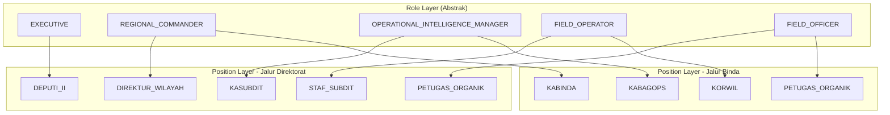
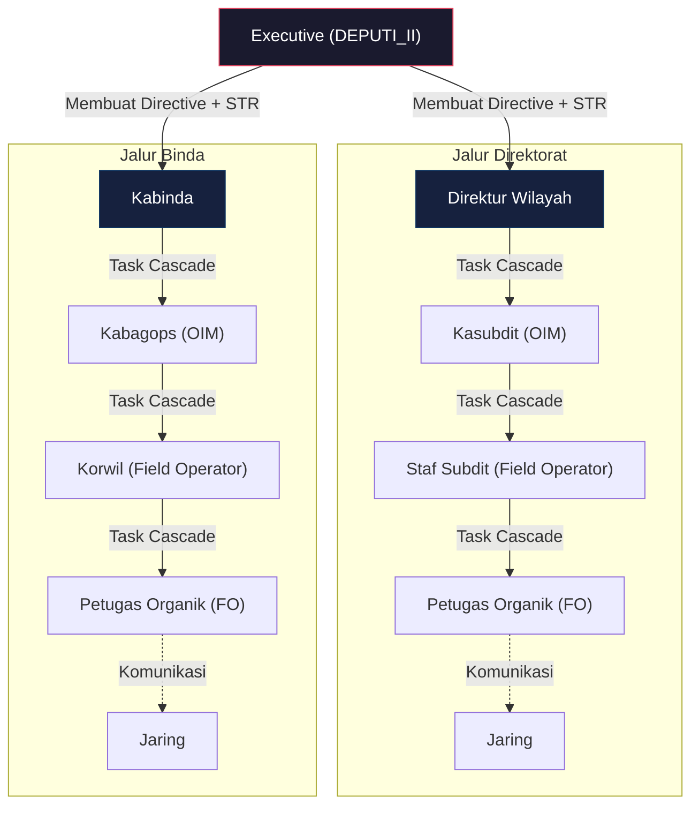
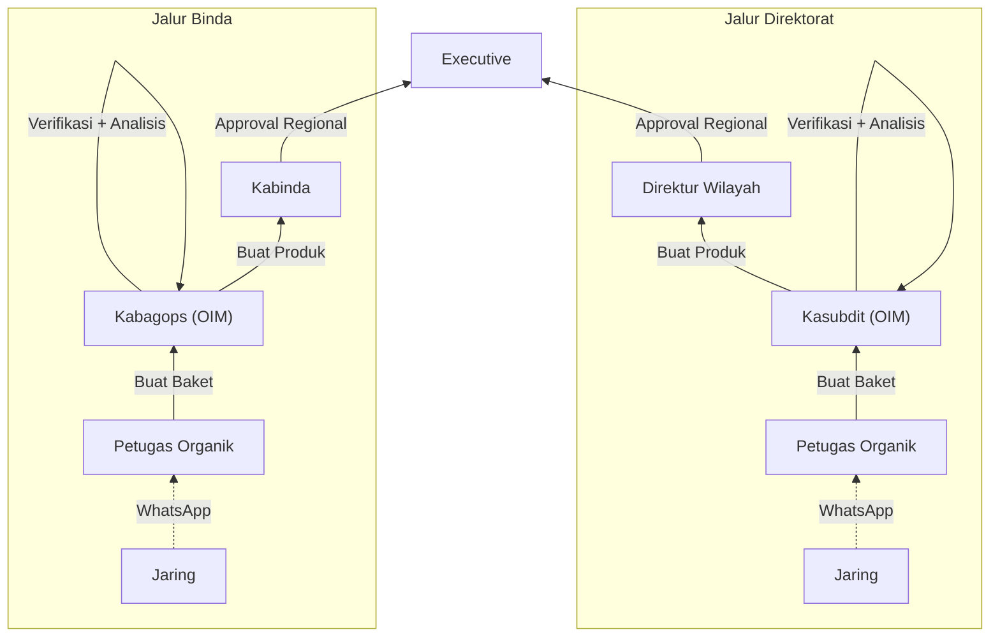
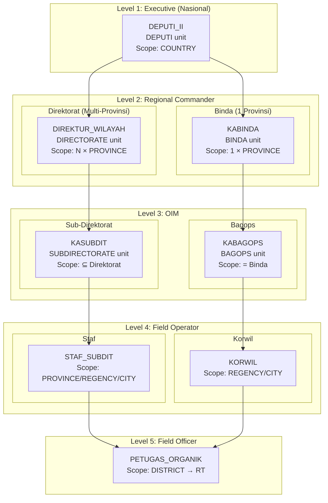

# Analisis Alur Organisasi: Direktorat vs Binda dalam Database

## Ringkasan Temuan

Setelah menganalisis seluruh [database schema v1.1](file:///d:/Aplikasi/Dens-Cakra/docs/DENS_CAKRA_Database_Schema_and_Rules_v1.1.md), schema yang ada **sudah dirancang dengan benar** untuk mendukung pemisahan jalur Direktorat dan Binda. Berikut analisis lengkapnya.

---

## 1. Pemetaan Role → Position → Organization (Sudah Benar ✅)

Schema saat ini sudah memisahkan **role** (level abstrak) dari **position** (jabatan spesifik), sehingga satu role bisa memiliki posisi berbeda di jalur yang berbeda:



| Role | Posisi Direktorat | Posisi Binda | Org Unit |
|------|-------------------|--------------|----------|
| `EXECUTIVE` | `DEPUTI_II` | `DEPUTI_II` | `DEPUTI` |
| `REGIONAL_COMMANDER` | `DIREKTUR_WILAYAH` | `KABINDA` | `DIRECTORATE` / `BINDA` |
| `OPERATIONAL_INTELLIGENCE_MANAGER` | `KASUBDIT` | `KABAGOPS` | `SUBDIRECTORATE` / `BAGOPS` |
| `FIELD_OPERATOR` | `STAF_SUBDIT` | `KORWIL` | `SUBDIRECTORATE` / `BAGOPS`+ |
| `FIELD_OFFICER` | `PETUGAS_ORGANIK` | `PETUGAS_ORGANIK` | Unit di bawah Subdit/Bagops |

---

## 2. Hierarki Organisasi — Dua Jalur Terpisah (Sudah Benar ✅)

Schema `OrganizationUnit` menggunakan self-referencing parent–child hierarchy. Validasi di business rules ([BR-ORG-001](file:///d:/Aplikasi/Dens-Cakra/docs/DENS_CAKRA_Database_Schema_and_Rules_v1.1.md#L1847)) sudah menegaskan:

```
DEPUTI (Executive)
├── DIRECTORATE (Jalur Direktorat)
│   └── SUBDIRECTORATE
│       └── FIELD_COORDINATION_UNIT (optional)
│
└── BINDA (Jalur Binda)
    └── BAGOPS
        └── FIELD_COORDINATION_UNIT (optional)
```

> [!IMPORTANT]
> **Perbedaan kunci Direktorat vs Binda:**
> - **Direktorat** → coverage **1..N provinsi** (bisa memimpin beberapa wilayah)
> - **Binda** → coverage **tepat 1 provinsi** saja
> 
> Ini sudah di-enforce di [BR-COV-001](file:///d:/Aplikasi/Dens-Cakra/docs/DENS_CAKRA_Database_Schema_and_Rules_v1.1.md#L2063) dan [BR-COV-002](file:///d:/Aplikasi/Dens-Cakra/docs/DENS_CAKRA_Database_Schema_and_Rules_v1.1.md#L2067).

---

## 3. Alur Distribusi Informasi — Terpisah tapi Paralel (Sudah Benar ✅)

### Alur Top-Down (Perintah/STR)



### Alur Bottom-Up (Laporan/Baket → Produk)



### Alur Approval Produk Intelijen

Sudah di-define di [BR-APR-001](file:///d:/Aplikasi/Dens-Cakra/docs/DENS_CAKRA_Database_Schema_and_Rules_v1.1.md#L2397) dan [BR-APR-002](file:///d:/Aplikasi/Dens-Cakra/docs/DENS_CAKRA_Database_Schema_and_Rules_v1.1.md#L2405):

| Jalur | Approval Route |
|-------|---------------|
| **Direktorat** | `Kasubdit → Direktur Wilayah → Executive` |
| **Binda** | `Kabagops → Kabinda → Executive` |

---

## 4. Bagaimana Schema Mendukung Pemisahan Ini

### 4.1 Tabel-tabel Kunci

| Tabel | Fungsi Pemisahan |
|-------|-----------------|
| `OrganizationUnit` | `type` enum memisahkan `DIRECTORATE` vs `BINDA` |
| `Position` | `code` enum memisahkan `DIREKTUR_WILAYAH` vs `KABINDA`, dll |
| `Position.reportsToPositionId` | Reporting line mengikuti jalur masing-masing |
| `OrganizationAreaCoverage` | Coverage area per unit (multi-provinsi vs 1 provinsi) |
| `PositionAreaScope` | Scope wilayah per position assignment |
| `DirectiveRecipient` | Target distribusi ke unit/position tertentu |
| `ProductApprovalStep` | Approval route snapshot per workflow |
| `ProductDistribution` | Distribusi final ke target unit/position/user |

### 4.2 Mekanisme Kunci yang Menjamin Pemisahan

```
1. OrganizationUnit.type = DIRECTORATE | BINDA
   → Menentukan jalur organisasi

2. Position.organizationUnitId + Position.code
   → DIREKTUR_WILAYAH hanya di DIRECTORATE
   → KABINDA hanya di BINDA
   (Di-enforce oleh BR-ORG-003)

3. Position.reportsToPositionId
   → Kasubdit reports to Direktur Wilayah
   → Kabagops reports to Kabinda
   (Di-enforce oleh BR-ORG-004)

4. OrganizationAreaCoverage
   → DIRECTORATE: 1..N provinsi (BR-COV-001)
   → BINDA: tepat 1 provinsi (BR-COV-002)

5. Task.ownerUnitId + TaskAssignment
   → Task cascade mengikuti reporting line
   → Area target divalidasi terhadap scope (BR-TASK-003)

6. ProductApprovalWorkflow
   → Route di-snapshot saat workflow dibuat (BR-APR-003)
   → Otomatis mengikuti jalur Direktorat atau Binda
```

---

## 5. Visualisasi Data Flow Lengkap



---

## 6. Kesimpulan & Rekomendasi

### ✅ Yang Sudah Benar
1. **Role abstrak** — Satu `REGIONAL_COMMANDER` role punya 2 position (`DIREKTUR_WILAYAH` / `KABINDA`)
2. **Org unit terpisah** — `DIRECTORATE` ≠ `BINDA`, hierarchy enforced
3. **Coverage rules** — Multi-provinsi vs 1 provinsi sudah di-enforce
4. **Reporting line** — `reportsToPositionId` memastikan alur yang benar
5. **Approval route** — Dua jalur approval sudah ada (BR-APR-001/002)
6. **Area validation** — Coverage descendant validation via closure table

### 📋 Yang Perlu Diperhatikan Saat Implementasi Backend (NestJS)

> [!IMPORTANT]
> Berikut hal-hal yang harus diperhatikan saat implement di NestJS backend:

1. **Validation Guard per Jalur** — Saat assign task atau create Baket, backend harus mendeteksi jalur mana (Direktorat/Binda) berdasarkan `OrganizationUnit.type` dari parent chain
2. **Approval Route Builder** — Service yang membuat `ProductApprovalWorkflow` harus otomatis mendeteksi jalur approval berdasarkan org unit creator
3. **Coverage Enforcement** — Middleware/Guard yang memvalidasi area scope sebelum operasi data
4. **Distribution Scoping** — Distribusi produk ke unit/position harus restricted ke jalur yang sama (kecuali Executive yang lintas jalur)

## Open Questions

> [!IMPORTANT]
> ### Q1: Cross-Jalur Information Sharing
> Apakah ada skenario di mana informasi dari Jalur Direktorat bisa dibagikan ke Jalur Binda (atau sebaliknya) **tanpa** melalui Executive? Misalnya, kalau isu intel di provinsi X (Binda) ternyata relate dengan isu di provinsi Y (Direktorat)?

> [!IMPORTANT]
> ### Q2: Dual Reporting
> Apakah ada kasus di mana satu provinsi bisa di-cover oleh Direktorat DAN Binda secara bersamaan? Atau mereka mutually exclusive — kalau sudah ada Binda di provinsi X, maka Direktorat tidak boleh cover provinsi X?

> [!NOTE]
> ### Q3: Implementasi Backend Sekarang
> Apakah kamu ingin saya langsung memulai implementasi module NestJS untuk organization/role/position management berdasarkan schema ini? Atau masih mau brainstorm lebih dalam tentang business logic tertentu?
