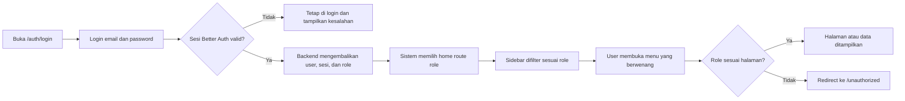
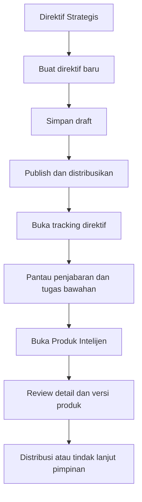
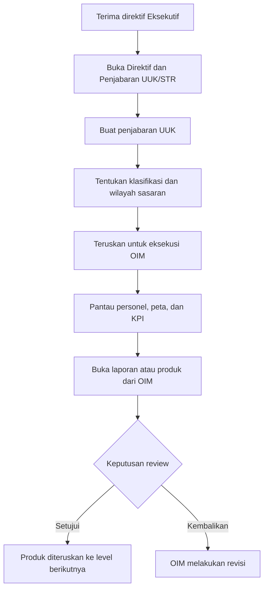
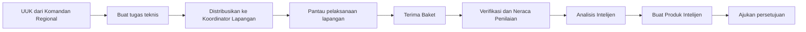
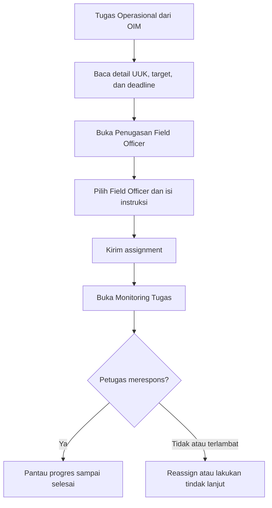
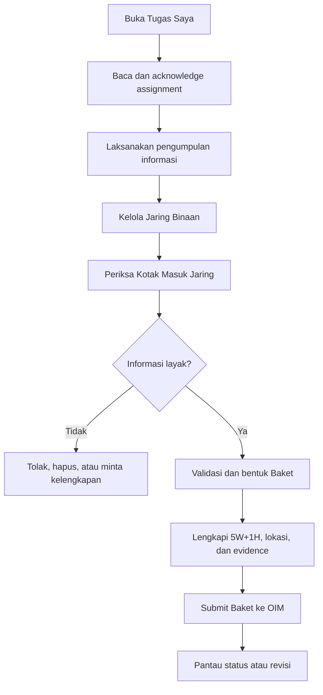
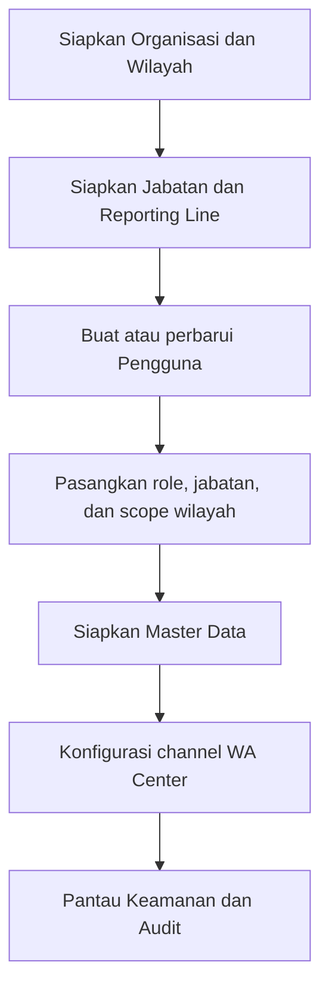
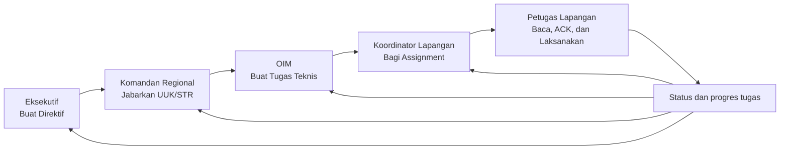
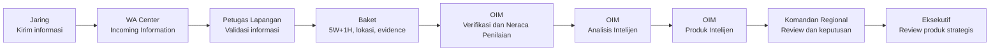
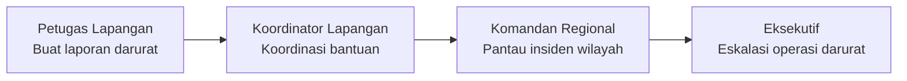

# Laporan Dokumentasi Menu dan Alur Pemeriksaan Sistem DENS CAKRA

| Informasi | Nilai |
|---|---|
| Dokumen | Panduan pemeriksaan menu, akses berbasis role, dan alur lintas-role |
| Produk | DENS CAKRA |
| Versi | 1.0 |
| Tanggal pemetaan | 16 Juli 2026 |
| Sumber pemetaan | Navigasi, App Router, autentikasi, halaman, dan integrasi API pada source code saat ini |
| Sasaran pembaca | User acceptance tester, reviewer sistem, product owner, dan tim operasional |

## 1. Tujuan Dokumen

Dokumen ini digunakan sebagai panduan saat melakukan pengecekan sistem DENS CAKRA. Isinya menjelaskan:

1. akun dan role yang perlu digunakan;
2. menu yang terlihat untuk setiap role;
3. fungsi yang perlu diperiksa pada setiap menu;
4. arah drill-down atau halaman lanjutan dari suatu menu;
5. alur kerja lintas-role dari arahan pimpinan sampai laporan lapangan;
6. status kesiapan halaman agar halaman yang masih `Coming Soon` tidak salah dicatat sebagai bug;
7. checklist hasil pengujian yang dapat langsung diisi.

> **Penting:** status pada dokumen ini merupakan hasil pemetaan source code, bukan berita acara pengujian browser. Pemeriksa tetap perlu menjalankan skenario pada environment yang akan dinilai.

## 2. Ringkasan Sistem

DENS CAKRA menggunakan enam role aplikasi:

| Role | Fungsi utama | Halaman awal |
|---|---|---|
| Eksekutif | Membuat direktif strategis dan memantau hasil nasional | `/dashboard/executive` |
| Komandan Regional | Menjabarkan UUK/STR dan mengendalikan wilayah | `/dashboard/regional-commander` |
| Manajer Intelijen Operasional (OIM) | Mengelola tugas, verifikasi, analisis, dan produk intelijen | `/dashboard/oim` |
| Koordinator Lapangan | Menerima tugas operasional dan membagi tugas ke Field Officer | `/dashboard/field-coordinator` |
| Petugas Lapangan | Menjalankan tugas, mengelola Jaring, dan menyusun Baket | `/dashboard/field-officer` |
| Admin Sistem | Mengelola organisasi, pengguna, jabatan, WA Center, master data, dan audit | `/dashboard/admin-system` |

### 2.1 Arsitektur akses pengguna



## 3. Persiapan Pemeriksaan

### 3.1 Menjalankan aplikasi lokal

Jalankan backend dan frontend pada terminal terpisah.

```powershell
cd D:\Aplikasi\Dens-Cakra\apps\be
npm run start:dev
```

```powershell
cd D:\Aplikasi\Dens-Cakra\apps\fe
npm run dev
```

Konfigurasi contoh frontend menggunakan:

| Komponen | URL |
|---|---|
| Frontend | `http://localhost:3000` |
| Halaman login | `http://localhost:3000/auth/login` |
| Backend | `http://localhost:3001` |

Pastikan database sudah dimigrasikan dan data demo sudah tersedia sebelum memulai pengecekan alur lintas-role.

### 3.2 Akun pemeriksaan Jakarta

Akun berikut mengikuti pola seed role yang aktif. Password default akun demo operasional adalah `DensCakraDemo123!`.

| Role | Contoh akun Jakarta | Keterangan |
|---|---|---|
| Eksekutif | `executive@denscakra.local` | Scope nasional |
| Komandan Regional | `kabinda.31@denscakra.local` | BINDA DKI Jakarta |
| OIM | `kabagops.31@denscakra.local` | Operasional BINDA DKI Jakarta |
| Koordinator Lapangan | `korwil.binda.3171@denscakra.local` | Contoh Korwil pada wilayah kode 3171 |
| Petugas Lapangan | `agent.binda.3171@denscakra.local` | Contoh Field Officer pada wilayah kode 3171 |
| Admin Sistem | `admin@denscakra.local` | Password default contoh environment: `ChangeMe123!` |

> Akun Admin mengikuti `BOOTSTRAP_ADMIN_EMAIL` dan `BOOTSTRAP_ADMIN_PASSWORD`. Jika environment telah mengubah nilainya atau akun pernah dibuat sebelumnya, gunakan kredensial environment aktual. Seed tidak mengganti password akun lama yang sudah ada.

### 3.3 Arti status menu

| Status | Arti bagi pemeriksa |
|---|---|
| **Operasional** | Halaman membaca data backend dan/atau menyediakan aksi yang dikirim ke backend. Perubahan seharusnya tetap ada setelah refresh. |
| **Parsial** | Fungsi utama tersedia, tetapi sebagian halaman detail, edit, ekspor, atau drill-down masih pending. |
| **Pending** | Route tersedia tetapi menampilkan `Coming Soon`. Catat sebagai fitur belum tersedia, bukan kegagalan runtime. |

## 4. Katalog Menu dan Arah Pemeriksaan

### 4.1 Role Eksekutif

| Menu | Route | Yang diperiksa | Arah atau drill-down | Status |
|---|---|---|---|---|
| Beranda Eksekutif | `/dashboard/executive` | Ringkasan eksekutif | Menu strategis lain | **Pending** |
| Peta Kerawanan Nasional | `/dashboard/executive/situasi-nasional/peta-kerawanan` | Boundary wilayah, Baket, personel, filter layer, pencarian lokasi, dan detail titik | Pilih wilayah atau marker untuk melihat ringkasan | **Operasional** |
| Peringatan Dini | `/dashboard/executive/situasi-nasional/peringatan-dini` | Daftar alert dan eskalasi nasional | Detail alert | **Pending** |
| Direktif Strategis | `/dashboard/executive/pusat-komando/direktif` | Daftar, filter, buat, edit draft, publish, distribusi, versi, dan tracking direktif | `baru` -> detail -> tracking/versions | **Operasional** |
| Operasi Darurat | `/dashboard/executive/pusat-komando/operasi-darurat` | Kendali dan eskalasi insiden | Detail insiden | **Pending** |
| Monitoring Nasional | `/dashboard/executive/monitoring-nasional` | Pipeline tugas, laporan, wilayah, dan alert nasional | Drill-down tugas/wilayah | **Pending** |
| Produk Intelijen | `/dashboard/executive/produk-intelijen` | Produk yang tersedia untuk Eksekutif, detail, versi, keputusan, dan distribusi | Detail produk -> versi/distribusi | **Operasional** |
| Personil | `/dashboard/executive/personil` | Daftar personel nasional, filter, scope, status, dan detail | Detail personel | **Operasional** |
| Kinerja & Evaluasi | `/dashboard/executive/kinerja-evaluasi` | KPI nasional dan filter periode | Perbandingan wilayah/unit | **Operasional** |
| Laporan & Briefing | `/dashboard/executive/laporan-briefing` | Paket briefing dan ringkasan pimpinan | Detail briefing | **Pending** |

Alur pemeriksaan utama Eksekutif:



### 4.2 Role Komandan Regional

| Menu | Route | Yang diperiksa | Arah atau drill-down | Status |
|---|---|---|---|---|
| Beranda | `/dashboard/regional-commander` | Ringkasan wilayah | Menu regional lain | **Pending** |
| Komando Regional | `/dashboard/regional-commander/komando-regional` | Supervisi dan quick action wilayah | Unit atau kejadian terkait | **Pending** |
| Direktif & Penjabaran UUK/STR | `/dashboard/regional-commander/direktif-penjabaran-uuk-str` | Daftar direktif, pembuatan penjabaran UUK, klasifikasi, area target, versi, dan penerusan | `baru` -> detail -> edit/versions | **Operasional** |
| Monitoring Tugas | `/dashboard/regional-commander/monitoring-tugas` | Progres tugas lintas unit dan cascade penugasan | Detail/cascade tugas | **Pending** |
| Laporan & Produk Intelijen | `/dashboard/regional-commander/laporan-produk-intelijen` | Produk dari OIM, Baket sumber, analisis, verifikasi, workflow, dan keputusan regional | Detail produk -> versi/workflow | **Operasional** |
| Peta & Peringatan Dini | `/dashboard/regional-commander/peta-peringatan-dini` | Boundary scope regional, Baket, personel, alert, dan insiden | Pilih area atau marker | **Operasional** |
| Personel & Jaring | `/dashboard/regional-commander/personel-jaring` | Personel, Jaring, scope, lokasi, status online/offline, dan detail | Detail personel atau Jaring | **Operasional** |
| KPI & Evaluasi | `/dashboard/regional-commander/kpi-evaluasi` | KPI regional, filter periode, dan evaluasi unit | Perbandingan unit dalam scope | **Operasional** |

Alur pemeriksaan utama Komandan Regional:



### 4.3 Role Manajer Intelijen Operasional (OIM)

| Menu | Route | Yang diperiksa | Arah atau drill-down | Status |
|---|---|---|---|---|
| Beranda | `/dashboard/oim` | Briefing OIM, Baket, verifikasi, analisis, produk, dan indikator kerja | Klik kartu atau daftar terkait | **Operasional** |
| Direktif & Tugas | `/dashboard/oim/direktif-tugas` | Daftar tugas, sumber UUK, buat/edit tugas, pilih penerima, dan distribusi | `baru` -> detail -> edit/penugasan | **Operasional** |
| Laporan Masuk | `/dashboard/oim/laporan-masuk` | Baket berstatus masuk, filter, metadata, evidence, detail, dan versi | Detail Baket -> verifikasi | **Operasional** |
| Analisis Intelijen | `/dashboard/oim/analisis-intelijen` | Daftar kasus, buat analisis, korelasi Baket, edit, detail, dan versi | `baru` -> detail -> edit/versions | **Operasional** |
| Produk Intelijen - Daftar Produk | `/dashboard/oim/produk-intelijen/daftar-produk` | Daftar produk, status, detail, edit, versi, dan workflow | Detail/edit/versions | **Operasional** |
| Produk Intelijen - Buat Produk | `/dashboard/oim/produk-intelijen/buat-produk` | Penyusunan produk dari analisis, evidence, tipe produk, dan klasifikasi | Simpan -> detail produk | **Operasional** |
| Monitoring Lapangan | `/dashboard/oim/monitoring-lapangan` | Progres tugas, Baket, personel, keterlambatan, dan produk | Detail tugas/Baket/personel | **Operasional** |
| Peta Situasi | `/dashboard/oim/peta-situasi` | Peta laporan dan boundary sesuai scope OIM | Detail Baket atau alert | **Operasional** |

Alur pemeriksaan utama OIM:



### 4.4 Role Koordinator Lapangan

| Menu | Route | Yang diperiksa | Arah atau drill-down | Status |
|---|---|---|---|---|
| Beranda | `/dashboard/field-coordinator` | Ringkasan tugas dan personel | Menu tugas lapangan | **Pending** |
| Tugas Operasional | `/dashboard/field-coordinator/tugas-operasional` | Tugas dari OIM, UUK/PIR, target, deadline, status, dan detail | Detail tugas -> assignment | **Operasional** |
| Penugasan Field Officer | `/dashboard/field-coordinator/penugasan-field-officer` | Pemilihan Field Officer, target, instruksi, deadline, assignment, dan reassign | Detail tugas -> form penugasan | **Operasional** |
| Monitoring Tugas | `/dashboard/field-coordinator/monitoring-tugas` | Status `sent`, `read`, `acknowledged`, progres, overdue, dan detail personel | Detail monitoring tugas | **Operasional** |
| Personel Lapangan | `/dashboard/field-coordinator/personel-lapangan` | Ketersediaan, workload, dan assignment personel | Detail personel | **Pending** |
| Peta Lapangan | `/dashboard/field-coordinator/peta-lapangan` | Lokasi personel, tugas, Baket, dan insiden | Detail marker | **Pending** |
| Laporan Darurat | `/dashboard/field-coordinator/laporan-darurat` | Insiden, kebutuhan bantuan, dan timeline respons | Detail insiden | **Pending** |

Alur pemeriksaan utama Koordinator Lapangan:



### 4.5 Role Petugas Lapangan

| Menu | Route | Yang diperiksa | Arah atau drill-down | Status |
|---|---|---|---|---|
| Beranda | `/dashboard/field-officer` | Ringkasan tugas, Jaring, incoming information, Baket, dan insiden | Kartu/daftar menuju modul terkait | **Operasional** |
| Tugas Saya | `/dashboard/field-officer/tugas-saya` | Daftar assignment, detail instruksi, tandai dibaca, acknowledgment, dan perubahan status | Detail assignment | **Operasional** |
| Jaring Binaan | `/dashboard/field-officer/jaring-binaan` | Daftar Jaring dan pengelolaan status | Halaman baru/detail/edit masih pending | **Parsial** |
| Kotak Masuk Jaring | `/dashboard/field-officer/kotak-masuk-jaring` | Informasi masuk, kategori, validasi, hapus, dan pembentukan Baket | Halaman detail pesan masih pending | **Parsial** |
| Buat Baket | `/dashboard/field-officer/buat-baket` | Daftar draft Baket, pembuatan dari incoming, isi 5W+1H, lokasi, evidence, edit, dan submit | Detail/edit Baket -> kirim ke OIM | **Operasional** |
| Peta Agen | `/dashboard/field-officer/peta/agen` | Posisi dan cakupan Jaring/Agen | Pilih marker Agen | **Operasional** |
| Peta Laporan | `/dashboard/field-officer/peta/laporan` | Lokasi Baket/laporan pada peta | Pilih marker laporan | **Operasional** |
| Laporan Darurat | `/dashboard/field-officer/laporan-darurat` | Membuat dan melihat laporan darurat | Halaman detail insiden masih pending | **Parsial** |

Alur pemeriksaan utama Petugas Lapangan:



### 4.6 Role Admin Sistem

| Menu | Route | Yang diperiksa | Arah atau drill-down | Status |
|---|---|---|---|---|
| Dashboard Sistem | `/dashboard/admin-system` | Ringkasan kesehatan dan aktivitas sistem | Modul administrasi | **Pending** |
| Organisasi & Wilayah | `/dashboard/admin-system/organisasi-wilayah` | Daftar, filter, dan pembuatan organisasi/wilayah | Buat tersedia; detail/edit/boundary masih pending | **Parsial** |
| Pengguna | `/dashboard/admin-system/pengguna` | Daftar, pencarian, pagination, tambah, detail, edit metadata, status, dan assignment pengguna | `baru` -> detail -> edit | **Operasional** |
| Jabatan | `/dashboard/admin-system/jabatan-reporting-line` | Daftar, tambah, detail, edit, role jabatan, atasan, dan reporting line | `baru` -> detail -> edit/reporting-line | **Operasional** |
| Integrasi WA Center | `/dashboard/admin-system/integrasi-wa-center` | Daftar channel, tambah/edit, request QR, connect/disconnect, dan hapus channel | Aksi dilakukan di halaman utama; detail route pending | **Parsial** |
| Master Data | `/dashboard/admin-system/master-data` | Klaster Jaring dan kategori laporan: tambah, edit, aktif/nonaktif, pencarian, bulk action, dan soft delete | Form drawer pada halaman yang sama | **Operasional** |
| Keamanan & Audit | `/dashboard/admin-system/keamanan-audit` | Daftar audit, filter, ringkasan sesi, dan aktivitas keamanan | Detail audit dan ekspor masih pending | **Parsial** |
| Konfigurasi Sistem | `/dashboard/admin-system/konfigurasi-sistem` | Pengaturan global sistem | Detail setting | **Pending** |

Alur pemeriksaan utama Admin Sistem:



## 5. Alur Utama Lintas-Role

### 5.1 Alur komando dari atas ke lapangan



Objek yang perlu diikuti saat pengujian:

1. `Directive` dan versinya dibuat oleh Eksekutif.
2. `UUK/STR` dibuat sebagai penjabaran oleh Komandan Regional.
3. `Task` dibuat OIM dengan referensi UUK.
4. `Task Assignment` dibagikan Koordinator Lapangan ke Petugas Lapangan.
5. Status `sent`, `read`, `acknowledged`, `in progress`, dan `completed` dipantau dari level terkait.

### 5.2 Alur informasi dari Jaring menjadi produk intelijen



Validasi yang harus dilakukan sepanjang alur:

- informasi WA tidak langsung menjadi Baket tanpa validasi Petugas Lapangan;
- Baket yang dikirim harus terlihat pada `Laporan Masuk` OIM;
- verifikasi dan analisis harus tetap dapat ditelusuri ke Baket sumber;
- produk intelijen harus memiliki versi dan workflow persetujuan;
- scope wilayah dan role harus membatasi data yang dapat dilihat.

### 5.3 Alur laporan darurat



> Pada snapshot saat ini, sebagian besar halaman detail alur darurat di level Koordinator, Regional, dan Eksekutif masih **Pending**. Uji alur ini sebatas fungsi yang tersedia dan catat gap sebagai fitur belum selesai.

## 6. Skenario Pemeriksaan Terpandu

### 6.1 Skenario A - Login, redirect role, dan pembatasan akses

1. Buka `/auth/login`.
2. Login menggunakan satu akun role.
3. Pastikan `/dashboard` mengarahkan user ke home route role yang benar.
4. Pastikan sidebar hanya menampilkan menu role tersebut.
5. Tekan `Ctrl+J` dan pastikan pencarian hanya menampilkan menu yang diizinkan untuk role aktif.
6. Coba buka URL role lain secara langsung.
7. Pastikan halaman terlindungi mengarahkan user ke `/unauthorized` atau menolak akses.
8. Logout dan pastikan halaman dashboard tidak dapat dibuka tanpa sesi.

Hasil yang diharapkan: sesi, sidebar, pencarian, halaman, dan data mengikuti role yang sedang login.

### 6.2 Skenario B - Direktif sampai assignment Petugas Lapangan

1. Login sebagai **Eksekutif**.
2. Buka `Pusat Komando -> Direktif Strategis`.
3. Buat direktif baru, simpan draft, lalu buka detailnya.
4. Publish dan distribusikan direktif ke target Regional.
5. Login sebagai **Komandan Regional** yang menjadi penerima.
6. Buka `Direktif & Penjabaran UUK/STR`, buat penjabaran, lalu teruskan.
7. Login sebagai **OIM** pada scope yang sama.
8. Buka `Direktif & Tugas`, buat tugas teknis dari UUK, lalu kirim ke Koordinator Lapangan.
9. Login sebagai **Koordinator Lapangan**.
10. Buka `Tugas Operasional`, pastikan tugas muncul, lalu buka detail.
11. Buka `Penugasan Field Officer`, pilih petugas dan kirim assignment.
12. Login sebagai **Petugas Lapangan** terpilih.
13. Buka `Tugas Saya`, tandai dibaca, lakukan acknowledgment, dan ubah progres sesuai aksi yang tersedia.
14. Login kembali sebagai Koordinator dan buka `Monitoring Tugas`.

Hasil yang diharapkan: objek yang sama dapat ditelusuri dari Direktif -> UUK -> Tugas -> Assignment, dengan role dan status yang konsisten.

### 6.3 Skenario C - Informasi Jaring sampai produk intelijen

1. Pastikan channel pada `Admin Sistem -> Integrasi WA Center` sudah aktif jika pengujian memakai pesan WA nyata.
2. Login sebagai **Petugas Lapangan**.
3. Buka `Kotak Masuk Jaring`, pilih informasi yang sesuai, tetapkan kategori, lalu validasi.
4. Bentuk Baket dari informasi tersebut.
5. Lengkapi judul, uraian 5W+1H, urgensi, lokasi administratif, koordinat, dan evidence.
6. Simpan, buka kembali detail Baket, lalu submit ke OIM.
7. Login sebagai **OIM**.
8. Buka `Laporan Masuk` dan pastikan Baket yang sama tampil.
9. Lakukan verifikasi dan Neraca Penilaian.
10. Buat atau hubungkan `Analisis Intelijen`.
11. Buat `Produk Intelijen` dari hasil analisis dan ajukan workflow persetujuan.
12. Login sebagai **Komandan Regional**, lalu buka `Laporan & Produk Intelijen`.
13. Review produk, Baket sumber, analisis, dan versi; lakukan keputusan yang tersedia.
14. Login sebagai **Eksekutif**, lalu buka `Produk Intelijen` dan pastikan produk yang sudah berada pada tahap Eksekutif dapat ditinjau.

Hasil yang diharapkan: lineage informasi dapat ditelusuri dari Incoming Information -> Baket -> Verification -> Analysis -> Product -> Approval.

### 6.4 Skenario D - Peta dan scope wilayah

1. Login sebagai Eksekutif dan buka `Peta Kerawanan Nasional`.
2. Aktifkan/nonaktifkan layer boundary, Baket, personel, alert, dan insiden.
3. Gunakan pencarian lokasi dan ubah level zoom.
4. Pilih boundary serta marker dan periksa panel detail.
5. Login sebagai Komandan Regional dan buka `Peta & Peringatan Dini`.
6. Pastikan data yang tampil dibatasi oleh scope regional.
7. Login sebagai OIM dan buka `Peta Situasi`.
8. Pastikan Baket dan boundary operasional dapat dibuka dari peta.
9. Login sebagai Petugas Lapangan dan periksa `Peta Agen` serta `Peta Laporan`.

Hasil yang diharapkan: layer dapat dimuat tanpa mencampurkan data di luar scope role/wilayah.

### 6.5 Skenario E - Administrasi sistem

Lakukan hanya pada environment development/UAT dengan data uji.

1. Login sebagai Admin Sistem.
2. Buka `Organisasi & Wilayah`, gunakan pencarian/filter, lalu buat satu data uji bila diperlukan.
3. Buka `Jabatan`, buat jabatan uji, tentukan role, unit, dan reporting line.
4. Buka `Pengguna`, buat pengguna uji dan hubungkan ke jabatan/scope yang benar.
5. Edit metadata pengguna lalu buka kembali detail untuk memastikan perubahan tersimpan.
6. Buka `Master Data`, buat kategori laporan atau klaster Jaring dengan awalan `UAT-`.
7. Uji edit, aktif/nonaktif, pencarian, bulk action, dan soft delete pada data uji tersebut.
8. Buka `Integrasi WA Center` dan periksa daftar channel serta aksi koneksi tanpa mengganggu channel aktif produksi.
9. Buka `Keamanan & Audit` dan pastikan aktivitas administrasi dapat ditelusuri bila event tersebut diaudit.

Hasil yang diharapkan: perubahan operasional bertahan setelah refresh dan hanya dapat dilakukan oleh role Admin Sistem.

## 7. Pemeriksaan Fitur Global

Fitur berikut tersedia pada shell dashboard dan perlu diperiksa pada minimal satu akun setiap role:

| Fitur global | Cara memeriksa | Hasil yang diharapkan |
|---|---|---|
| Sidebar | Expand/collapse dan pilih menu | Hanya menu role aktif yang muncul |
| Pencarian menu | Klik `Cari` atau tekan `Ctrl+J` | Hasil berasal dari menu role aktif dan dapat membuka route terkait |
| Preferensi layout | Klik ikon pengaturan | Theme preset, font, mode, layout, navbar, dan sidebar berubah |
| Theme switcher | Klik ikon mode tema | Siklus light, dark, dan system bekerja |
| Notifikasi | Klik ikon lonceng | Dropdown notifikasi terbuka; data saat ini merupakan data dashboard statis |
| Informasi sesi | Periksa header dan menu akun | IP dan label lokasi sesi tampil bila backend menyediakannya |
| Menu akun | Klik avatar | Nama, role, informasi sesi, dan logout tampil |
| Logout | Klik logout | Sesi berakhir dan dashboard kembali terlindungi |

Catatan: tombol `Account`, `Mark all` notifikasi, halaman `View all notifications`, serta beberapa halaman profil masih belum menjadi alur operasional penuh pada snapshot saat ini.

## 8. Batasan Implementasi yang Perlu Diketahui

1. Route `Coming Soon` sengaja tersedia sebagai placeholder dan bukan error 404.
2. Beranda Eksekutif, Komandan Regional, Koordinator Lapangan, dan Admin Sistem masih pending.
3. Beberapa daftar sudah operasional tetapi halaman detail lanjutannya masih pending, khususnya Jaring/Incoming/Darurat Field Officer dan beberapa modul Admin.
4. Monitoring Nasional, Operasi Darurat Eksekutif, Monitoring Tugas Regional, dan Konfigurasi Sistem Admin belum dapat diuji sebagai alur penuh.
5. Dropdown notifikasi menggunakan data lokal/statis; perubahan `Mark all` belum menjadi bukti persistensi backend.
6. Jangan menggunakan kredensial default demo pada environment produksi.
7. Untuk pengujian lintas-role, gunakan akun yang berada dalam rantai wilayah yang sama agar data tidak hilang akibat scope akses yang memang benar.

## 9. Template Hasil Pemeriksaan

Gunakan tabel berikut untuk mencatat hasil UAT.

| No. | Tanggal | Role | Menu/Skenario | Data uji | Hasil yang diharapkan | Hasil aktual | Status | Bukti/Issue |
|---:|---|---|---|---|---|---|---|---|
| 1 |  |  |  |  |  |  | Lulus/Gagal/Blocked |  |
| 2 |  |  |  |  |  |  | Lulus/Gagal/Blocked |  |
| 3 |  |  |  |  |  |  | Lulus/Gagal/Blocked |  |

Klasifikasi temuan yang disarankan:

| Klasifikasi | Penggunaan |
|---|---|
| Bug | Fitur berstatus operasional tidak bekerja sesuai alurnya |
| Data/Seed | Fitur tersedia tetapi data uji atau relasi scope belum tersedia |
| Configuration | URL, environment, channel, storage, atau service pendukung belum benar |
| Access | Role atau scope menampilkan/menolak data secara tidak semestinya |
| Pending Feature | Halaman memang masih `Coming Soon` atau drill-down belum diimplementasikan |
| Improvement | Fitur bekerja, tetapi UX, label, atau informasi perlu ditingkatkan |

## 10. Kriteria Pemeriksaan Selesai

Pemeriksaan sistem dapat dinyatakan selesai apabila:

- keenam role dapat login dan diarahkan ke workspace yang benar;
- menu serta pencarian terfilter sesuai role;
- satu alur komando dapat ditelusuri dari Direktif sampai Assignment Petugas Lapangan;
- satu alur informasi dapat ditelusuri dari Incoming Information sampai Produk Intelijen;
- scope wilayah tervalidasi pada daftar dan peta;
- perubahan pada menu operasional tetap ada setelah refresh;
- akses silang role ditolak;
- seluruh halaman pending dicatat terpisah dari bug runtime;
- bukti pengujian dan issue dicantumkan pada tabel hasil UAT.
