# Use Case & Use Scenario Document — DEN CAKRA

| Field | Value |
|---|---|
| Document | Use Case & Use Scenario Document |
| Product | DEN CAKRA |
| Version | 0.1 |
| Date | 09 Juli 2026 |
| Author | Product Architect |
| Status | Draft |

## Revision History

| Version | Date | Author | Description |
|---|---|---|---|
| 0.1 | 09 Juli 2026 | Product Architect | Initial draft use case, use scenario, and Mermaid chart for MVP planning |

---

# 1. Purpose

Dokumen ini mendefinisikan **Use Case** dan **Use Scenario** untuk aplikasi **DEN CAKRA** berdasarkan role, alur kerja, dan daftar menu yang sudah dipetakan sebelumnya.

Dokumen ini berfungsi sebagai jembatan antara:

1. **Role-Based Menu Catalog**
2. **MVP Scope**
3. **Functional Requirements**
4. **User Stories**
5. **Wireframe / UI Flow**
6. **SRS**

Fokus dokumen ini adalah menggambarkan bagaimana setiap actor berinteraksi dengan sistem dalam alur kerja **top-down command flow** dan **bottom-up intelligence flow**.

---

# 2. Scope

## 2.1 In Scope

Dokumen ini mencakup use case untuk role berikut:

1. Executive
2. Regional Commander
3. Operational Intelligence Manager
4. Field Coordinator
5. Field Officer
6. WA Center / System Intake
7. Admin System
8. Supporting / Extended Role

Dokumen ini juga mencakup alur utama MVP:

```text
Executive creates STR/UUK
→ Regional Commander receives directive
→ OIM creates assignment
→ Field Coordinator distributes field task
→ Field Officer validates information and creates BAKET
→ OIM verifies BAKET and creates Draft Intelligence Report
→ Regional Commander reviews and approves report
→ Executive views Approved Intelligence Report
```

## 2.2 Out of Scope

Hal berikut belum dibahas detail dalam dokumen ini:

1. Detail database schema.
2. API endpoint specification.
3. UI visual design final.
4. Low-fidelity wireframe per screen.
5. Technical architecture.
6. Detailed security implementation.
7. AI model design and algorithm details.

---

# 3. Definitions

| Term | Definition |
|---|---|
| STR | Surat Telegram Rahasia, dokumen/arahan strategis yang menjadi starting object top-down workflow |
| UUK / UKK / KIQ / PIR | Pertanyaan/kebutuhan informasi strategis yang harus dijawab melalui operasi intelijen |
| Directive | Arahan strategis atau operasional yang diturunkan secara berjenjang |
| Assignment | Penugasan dari Operational Intelligence Manager kepada Field Coordinator |
| Field Task | Tugas teknis lapangan yang diberikan Field Coordinator kepada Field Officer |
| Incoming Information | Informasi mentah yang masuk dari Jaring melalui WA Center |
| BAKET | Bahan keterangan yang sudah dicek, divalidasi, dan diformalkan oleh Field Officer |
| Neraca Penilaian | Matriks penilaian sumber A–F dan kebenaran isi informasi 1–6 |
| Draft Intelligence Report | Laporan intelijen yang disusun OIM dan menunggu review Regional Commander |
| Approved Intelligence Report | Laporan yang sudah disetujui Regional Commander dan tersedia untuk Executive |
| RBAC | Role-Based Access Control |
| MFA | Multi-Factor Authentication |

---

# 4. Actors

| Actor ID | Actor | Description |
|---|---|---|
| ACT-001 | Executive | Role strategis yang membuat STR/UUK, memantau dashboard, dan menerima hasil akhir intelijen |
| ACT-002 | Regional Commander | Role wilayah yang menerima direktif, mengendalikan wilayah, dan melakukan approval laporan |
| ACT-003 | Operational Intelligence Manager | Role pengelola assignment, verifikasi BAKET, analisis, dan penyusunan draft laporan |
| ACT-004 | Field Coordinator | Role koordinator lapangan yang membagi tugas ke Field Officer dan memonitor personel |
| ACT-005 | Field Officer | Role pelaksana lapangan yang memvalidasi incoming information dan membuat BAKET |
| ACT-006 | Jaring / External Intelligence Source | Sumber informasi eksternal yang mengirim informasi melalui WA Center |
| ACT-007 | WA Center / System Intake | Gateway sistem untuk menerima informasi mentah dan melakukan routing |
| ACT-008 | Admin System | Role teknis untuk mengelola user, role, permission, security, audit, dan integrasi |
| ACT-009 | Planning & Control Office | Extended role untuk rendalgiatops, evaluasi, administrasi STR, dan monitoring lintas wilayah |
| ACT-010 | Final Intelligence Reviewer | Extended role untuk analisis dan produksi akhir produk intelijen |
| ACT-011 | Emergency Control / Pusdalops | Extended role untuk menerima dan mengoordinasikan panic alert atau kondisi darurat |

---

# 5. Use Case Package Overview

| Package ID | Package Name | Primary Actors |
|---|---|---|
| PKG-001 | Authentication & Security | All Internal Roles, Admin System |
| PKG-002 | Directive & STR Management | Executive, Regional Commander |
| PKG-003 | Assignment & Field Tasking | Regional Commander, OIM, Field Coordinator, Field Officer |
| PKG-004 | WA Center Intake & Incoming Information | Jaring, WA Center, Field Officer |
| PKG-005 | BAKET Management | Field Officer, OIM |
| PKG-006 | Verification & Intelligence Processing | OIM |
| PKG-007 | Report Builder & Approval Workflow | OIM, Regional Commander, Executive |
| PKG-008 | Dashboard & Monitoring | Executive, Regional Commander, OIM, Field Coordinator |
| PKG-009 | Emergency & Panic Alert | Field Officer, Field Coordinator, Regional Commander, Pusdalops |
| PKG-010 | Notification Center | All Internal Roles |
| PKG-011 | Administration & Audit | Admin System |

---

# 6. Global Use Case Diagram

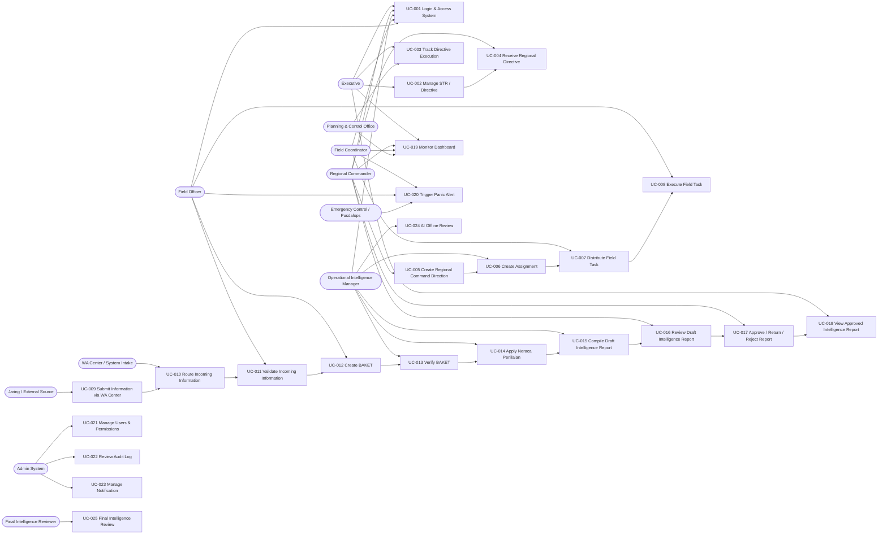
```mermaid
graph LR
    Executive([Executive])
    Regional([Regional Commander])
    OIM([Operational Intelligence Manager])
    FC([Field Coordinator])
    FO([Field Officer])
    Jaring([Jaring / External Source])
    WA([WA Center / System Intake])
    Admin([Admin System])
    PC([Planning & Control Office])
    FIR([Final Intelligence Reviewer])
    Pusdalops([Emergency Control / Pusdalops])

    UC01[UC-001 Login & Access System]
    UC02[UC-002 Manage STR / Directive]
    UC03[UC-003 Track Directive Execution]
    UC04[UC-004 Receive Regional Directive]
    UC05[UC-005 Create Regional Command Direction]
    UC06[UC-006 Create Assignment]
    UC07[UC-007 Distribute Field Task]
    UC08[UC-008 Execute Field Task]
    UC09[UC-009 Submit Information via WA Center]
    UC10[UC-010 Route Incoming Information]
    UC11[UC-011 Validate Incoming Information]
    UC12[UC-012 Create BAKET]
    UC13[UC-013 Verify BAKET]
    UC14[UC-014 Apply Neraca Penilaian]
    UC15[UC-015 Compile Draft Intelligence Report]
    UC16[UC-016 Review Draft Intelligence Report]
    UC17[UC-017 Approve / Return / Reject Report]
    UC18[UC-018 View Approved Intelligence Report]
    UC19[UC-019 Monitor Dashboard]
    UC20[UC-020 Trigger Panic Alert]
    UC21[UC-021 Manage Users & Permissions]
    UC22[UC-022 Review Audit Log]
    UC23[UC-023 Manage Notification]
    UC24[UC-024 AI Offline Review]
    UC25[UC-025 Final Intelligence Review]

    Executive --> UC01
    Executive --> UC02
    Executive --> UC03
    Executive --> UC18
    Executive --> UC19

    Regional --> UC01
    Regional --> UC04
    Regional --> UC05
    Regional --> UC16
    Regional --> UC17
    Regional --> UC19

    OIM --> UC01
    OIM --> UC06
    OIM --> UC13
    OIM --> UC14
    OIM --> UC15
    OIM --> UC24

    FC --> UC01
    FC --> UC07
    FC --> UC19
    FC --> UC20

    FO --> UC01
    FO --> UC08
    FO --> UC11
    FO --> UC12
    FO --> UC20

    Jaring --> UC09
    WA --> UC10

    Admin --> UC21
    Admin --> UC22
    Admin --> UC23

    PC --> UC03
    PC --> UC19

    FIR --> UC25
    Pusdalops --> UC20

    UC02 --> UC04
    UC05 --> UC06
    UC06 --> UC07
    UC07 --> UC08
    UC09 --> UC10
    UC10 --> UC11
    UC11 --> UC12
    UC12 --> UC13
    UC13 --> UC14
    UC14 --> UC15
    UC15 --> UC16
    UC16 --> UC17
    UC17 --> UC18
```

---

# 7. End-to-End MVP Workflow Chart

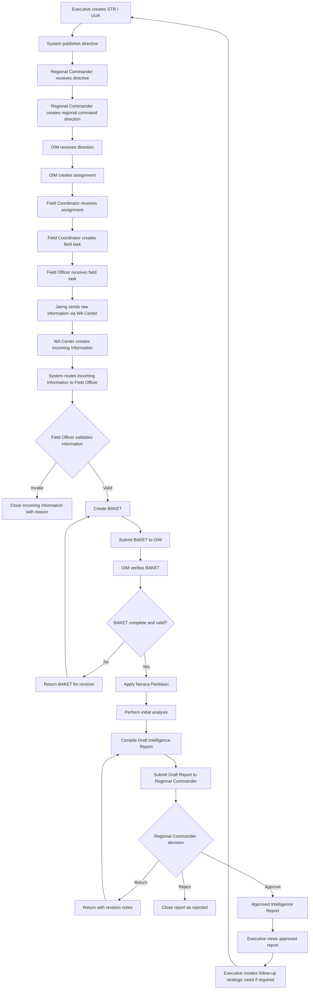
```mermaid
flowchart TD
    A[Executive creates STR / UUK] --> B[System publishes directive]
    B --> C[Regional Commander receives directive]
    C --> D[Regional Commander creates regional command direction]
    D --> E[OIM receives direction]
    E --> F[OIM creates assignment]
    F --> G[Field Coordinator receives assignment]
    G --> H[Field Coordinator creates field task]
    H --> I[Field Officer receives field task]
    I --> J[Jaring sends raw information via WA Center]
    J --> K[WA Center creates Incoming Information]
    K --> L[System routes Incoming Information to Field Officer]
    L --> M{Field Officer validates information}
    M -->|Invalid| N[Close Incoming Information with reason]
    M -->|Valid| O[Create BAKET]
    O --> P[Submit BAKET to OIM]
    P --> Q[OIM verifies BAKET]
    Q --> R{BAKET complete and valid?}
    R -->|No| S[Return BAKET for revision]
    S --> O
    R -->|Yes| T[Apply Neraca Penilaian]
    T --> U[Perform initial analysis]
    U --> V[Compile Draft Intelligence Report]
    V --> W[Submit Draft Report to Regional Commander]
    W --> X{Regional Commander decision}
    X -->|Return| Y[Return with revision notes]
    Y --> V
    X -->|Reject| Z[Close report as rejected]
    X -->|Approve| AA[Approved Intelligence Report]
    AA --> AB[Executive views approved report]
    AB --> AC[Executive creates follow-up strategic need if required]
    AC --> A
```

---

# 8. Use Case List

| UC ID | Use Case Name | Primary Actor | Priority | MVP Candidate |
|---|---|---|---|---|
| UC-001 | Login & Access System | All Internal Roles | Critical | Yes |
| UC-002 | Manage STR / Directive | Executive | Critical | Yes |
| UC-003 | Track Directive Execution | Executive | High | Yes |
| UC-004 | Receive Regional Directive | Regional Commander | Critical | Yes |
| UC-005 | Create Regional Command Direction | Regional Commander | Critical | Yes |
| UC-006 | Create Assignment | OIM | Critical | Yes |
| UC-007 | Distribute Field Task | Field Coordinator | Critical | Yes |
| UC-008 | Execute Field Task | Field Officer | Critical | Yes |
| UC-009 | Submit Information via WA Center | Jaring | Critical | Yes |
| UC-010 | Route Incoming Information | WA Center | Critical | Yes |
| UC-011 | Validate Incoming Information | Field Officer | Critical | Yes |
| UC-012 | Create BAKET | Field Officer | Critical | Yes |
| UC-013 | Verify BAKET | OIM | Critical | Yes |
| UC-014 | Apply Neraca Penilaian | OIM | Critical | Yes |
| UC-015 | Compile Draft Intelligence Report | OIM | Critical | Yes |
| UC-016 | Review Draft Intelligence Report | Regional Commander | Critical | Yes |
| UC-017 | Approve / Return / Reject Report | Regional Commander | Critical | Yes |
| UC-018 | View Approved Intelligence Report | Executive | Critical | Yes |
| UC-019 | Monitor Role-Based Dashboard | Executive / Regional / OIM / FC | High | Yes |
| UC-020 | Trigger Panic Alert | Field Officer | High | Optional MVP |
| UC-021 | Manage Users & Permissions | Admin System | Critical | Yes |
| UC-022 | Review Audit Log | Admin System | Critical | Yes |
| UC-023 | Manage Notifications | Admin System | High | Yes |
| UC-024 | AI Offline Review | OIM | Medium | Soon |
| UC-025 | Final Intelligence Review | Final Intelligence Reviewer | Medium | Soon |

---

# 9. Detailed Use Cases & Use Scenarios

---

## UC-001: Login & Access System

**Package:** Authentication & Security  
**Primary Actor:** All Internal Roles  
**Secondary Actor:** Admin System  
**Priority:** Critical  
**MVP Candidate:** Yes

### Goal

User dapat masuk ke sistem sesuai role dan hanya melihat menu yang sesuai dengan permission.

### Preconditions

1. User sudah terdaftar di sistem.
2. User memiliki role aktif.
3. User memiliki perangkat atau metode autentikasi yang valid.
4. Sistem autentikasi tersedia.

### Trigger

User membuka aplikasi DEN CAKRA dan mengirim kredensial login.

### Main Success Scenario

1. User membuka halaman login.
2. User memasukkan username/password atau metode login yang disediakan.
3. System memvalidasi kredensial.
4. System memeriksa status user.
5. System memeriksa role dan permission user.
6. System memeriksa kebutuhan MFA jika berlaku.
7. User menyelesaikan MFA.
8. System membuat session.
9. System menampilkan dashboard sesuai role.
10. System mencatat aktivitas login ke audit log.

### Alternative Flows

#### A1 — MFA tidak diwajibkan

1. Pada step 6, system mendeteksi role tidak wajib MFA.
2. System langsung membuat session.
3. System menampilkan dashboard sesuai role.

#### A2 — User memiliki lebih dari satu role

1. System menampilkan pilihan role aktif.
2. User memilih role yang akan digunakan.
3. System menampilkan menu sesuai role terpilih.

### Exception Flows

#### E1 — Kredensial salah

1. System menolak login.
2. System menampilkan pesan: `Username atau password tidak valid.`
3. System mencatat percobaan gagal ke audit log.

#### E2 — Akun nonaktif

1. System menolak login.
2. System menampilkan pesan: `Akun tidak aktif. Hubungi administrator.`
3. System mencatat event ke audit log.

#### E3 — Role belum ditentukan

1. System menolak akses dashboard.
2. System menampilkan pesan: `Role pengguna belum dikonfigurasi.`
3. System mengirim notifikasi ke Admin System.

### Postconditions

**Success:**

1. Session user aktif.
2. User melihat dashboard sesuai role.
3. Login tercatat di audit log.

**Failure:**

1. Session tidak dibuat.
2. Event gagal login tercatat di audit log.

### Business Rules

| ID | Rule |
|---|---|
| BR-UC001-001 | System SHALL authenticate user before granting access. |
| BR-UC001-002 | System SHALL display menus based on role and permission. |
| BR-UC001-003 | System SHALL record every login attempt in audit log. |
| BR-UC001-004 | System SHALL require MFA for access to high-classification data. |

### Related Menus

- Login
- Dashboard
- Profile & Security
- Role-Based Sidebar

### Mermaid Scenario

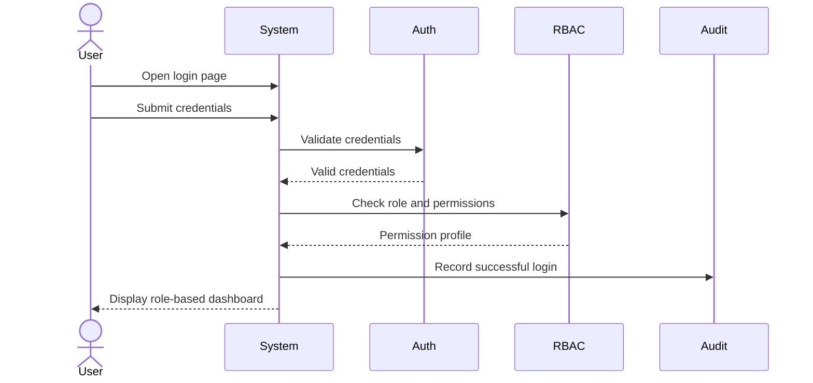
```mermaid
sequenceDiagram
    actor User
    participant System
    participant Auth
    participant RBAC
    participant Audit

    User->>System: Open login page
    User->>System: Submit credentials
    System->>Auth: Validate credentials
    Auth-->>System: Valid credentials
    System->>RBAC: Check role and permissions
    RBAC-->>System: Permission profile
    System->>Audit: Record successful login
    System-->>User: Display role-based dashboard
```

---

## UC-002: Manage STR / Directive

**Package:** Directive & STR Management  
**Primary Actor:** Executive  
**Secondary Actor:** Regional Commander  
**Priority:** Critical  
**MVP Candidate:** Yes

### Goal

Executive dapat membuat, menyimpan, dan menerbitkan STR / Directive yang berisi UUK/KIQ/PIR sebagai starting object top-down workflow.

### Preconditions

1. Executive sudah login.
2. Executive memiliki permission untuk membuat STR.
3. Data penerima direktif tersedia.
4. Klasifikasi keamanan tersedia.

### Trigger

Executive memilih menu **Create STR**.

### Main Success Scenario

1. Executive membuka menu **STR / Directive Management**.
2. Executive memilih **Create STR**.
3. System menampilkan form STR.
4. Executive mengisi judul, nomor, klasifikasi, tujuan, tembusan, UUK/KIQ/PIR, wilayah sasaran, deadline, dan catatan strategis.
5. Executive memilih penerima direktif.
6. System memvalidasi field wajib.
7. Executive menyimpan STR sebagai draft.
8. Executive melakukan review isi STR.
9. Executive menerbitkan STR.
10. System mengubah status STR menjadi `Published`.
11. System mengirim notifikasi ke Regional Commander.
12. System mencatat aktivitas ke audit log.

### Alternative Flows

#### A1 — Simpan sebagai draft

1. Pada step 7, Executive memilih `Save Draft`.
2. System menyimpan STR dengan status `Draft`.
3. STR belum dikirim ke penerima.

#### A2 — Broadcast ke banyak wilayah

1. Executive memilih lebih dari satu wilayah penerima.
2. System membuat daftar distribusi berdasarkan wilayah.
3. System mengirim direktif ke seluruh Regional Commander terkait.

#### A3 — STR dibuat dari Approved Intelligence Report

1. Executive membuka approved report.
2. Executive memilih `Create Follow-up Directive`.
3. System membawa konteks laporan ke form STR baru.

### Exception Flows

#### E1 — Field wajib belum lengkap

1. System menolak penerbitan STR.
2. System menandai field yang belum lengkap.
3. System menampilkan pesan validasi.

#### E2 — Penerima tidak memiliki clearance

1. System mendeteksi penerima tidak memiliki clearance sesuai klasifikasi.
2. System menolak distribusi ke penerima tersebut.
3. System meminta Executive memilih penerima lain atau menurunkan klasifikasi sesuai aturan.

### Postconditions

**Success:**

1. STR terbit dengan status `Published`.
2. Regional Commander menerima notifikasi.
3. Audit trail tercatat.

**Failure:**

1. STR tetap dalam status `Draft`.
2. Tidak ada direktif yang dikirim.

### Business Rules

| ID | Rule |
|---|---|
| BR-UC002-001 | System SHALL require classification before STR publication. |
| BR-UC002-002 | System SHALL require at least one UUK/KIQ/PIR in STR. |
| BR-UC002-003 | System SHALL support directive distribution to one or multiple regions. |
| BR-UC002-004 | System SHALL record STR publication in audit log. |

### Related Menus

- STR / Directive Management
- Create STR
- Directive Tracking
- Follow-up Strategic Need

### Mermaid Scenario

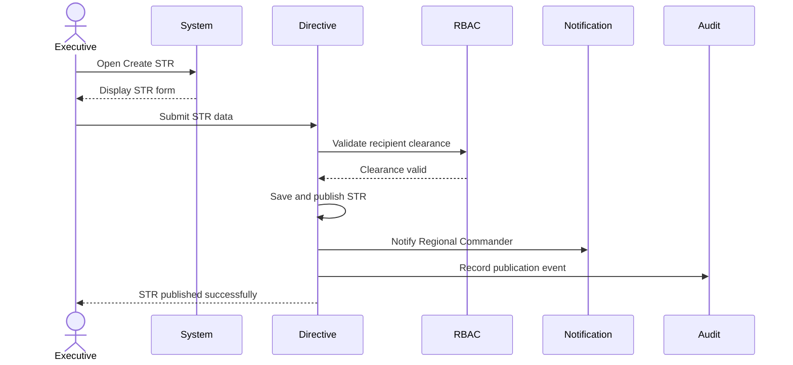
```mermaid
sequenceDiagram
    actor Executive
    participant System
    participant Directive
    participant RBAC
    participant Notification
    participant Audit

    Executive->>System: Open Create STR
    System-->>Executive: Display STR form
    Executive->>Directive: Submit STR data
    Directive->>RBAC: Validate recipient clearance
    RBAC-->>Directive: Clearance valid
    Directive->>Directive: Save and publish STR
    Directive->>Notification: Notify Regional Commander
    Directive->>Audit: Record publication event
    Directive-->>Executive: STR published successfully
```

---

## UC-003: Track Directive Execution

**Package:** Directive & STR Management  
**Primary Actor:** Executive  
**Secondary Actor:** Regional Commander, OIM, Field Coordinator  
**Priority:** High  
**MVP Candidate:** Yes

### Goal

Executive dapat memantau status pelaksanaan direktif secara real-time berdasarkan status turunannya.

### Preconditions

1. Executive sudah login.
2. Minimal satu STR sudah diterbitkan.
3. Assignment atau task turunan sudah dibuat.

### Trigger

Executive membuka menu **Directive Tracking**.

### Main Success Scenario

1. Executive membuka daftar STR aktif.
2. Executive memilih salah satu STR.
3. System menampilkan status distribusi STR.
4. System menampilkan penerima yang sudah membaca direktif.
5. System menampilkan assignment yang dibuat dari STR.
6. System menampilkan progress per wilayah.
7. System menampilkan status laporan atau BAKET yang terkait.
8. Executive melakukan drill-down ke wilayah atau laporan tertentu.
9. System mencatat aktivitas view ke audit log.

### Alternative Flows

#### A1 — Belum ada progress

1. System menampilkan status `No progress yet`.
2. System menampilkan penerima yang belum membaca.
3. Executive dapat mengirim reminder.

#### A2 — Ada overdue

1. System menandai wilayah/task yang melewati deadline.
2. System menampilkan indikator overdue.
3. Executive dapat mengirim arahan lanjutan.

### Exception Flows

#### E1 — Data tracking gagal dimuat

1. System menampilkan pesan error.
2. System menyediakan tombol retry.
3. System mencatat error ke system log.

### Postconditions

**Success:**

1. Executive memahami status eksekusi direktif.
2. Aktivitas view tercatat bila data berklasifikasi tinggi.

### Business Rules

| ID | Rule |
|---|---|
| BR-UC003-001 | System SHALL show directive status by hierarchy. |
| BR-UC003-002 | System SHALL show read receipt for published directive. |
| BR-UC003-003 | System SHALL show overdue indicator when deadline is exceeded. |

### Related Menus

- Directive Tracking
- Executive Dashboard
- Regional Performance Overview

### Mermaid Scenario

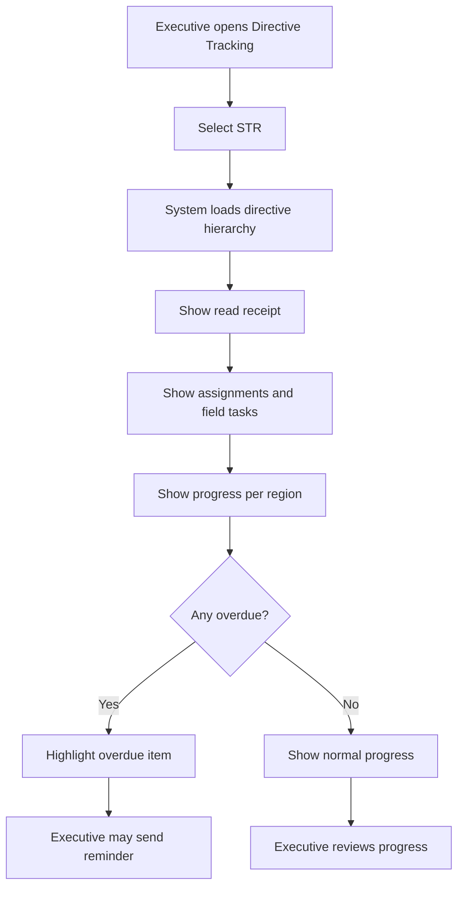
```mermaid
flowchart TD
    A[Executive opens Directive Tracking] --> B[Select STR]
    B --> C[System loads directive hierarchy]
    C --> D[Show read receipt]
    D --> E[Show assignments and field tasks]
    E --> F[Show progress per region]
    F --> G{Any overdue?}
    G -->|Yes| H[Highlight overdue item]
    G -->|No| I[Show normal progress]
    H --> J[Executive may send reminder]
    I --> K[Executive reviews progress]
```

---

## UC-004: Receive Regional Directive

**Package:** Directive & STR Management  
**Primary Actor:** Regional Commander  
**Secondary Actor:** Executive  
**Priority:** Critical  
**MVP Candidate:** Yes

### Goal

Regional Commander menerima STR/UUK dari Executive dan memahami arahan strategis yang harus ditindaklanjuti.

### Preconditions

1. Regional Commander sudah login.
2. STR sudah diterbitkan oleh Executive.
3. Regional Commander termasuk penerima direktif.

### Trigger

System mengirim notifikasi direktif baru ke Regional Commander.

### Main Success Scenario

1. Regional Commander menerima notifikasi direktif baru.
2. Regional Commander membuka **Directive Inbox**.
3. System menampilkan daftar direktif.
4. Regional Commander membuka detail direktif.
5. System menampilkan isi STR, UUK/KIQ/PIR, klasifikasi, deadline, wilayah, dan catatan strategis.
6. Regional Commander menandai direktif sebagai sudah dibaca.
7. System mencatat read receipt.
8. Regional Commander membuat regional command direction.

### Alternative Flows

#### A1 — Regional Commander membutuhkan klarifikasi

1. Regional Commander memilih `Request Clarification`.
2. System menampilkan form catatan.
3. Regional Commander mengirim pertanyaan klarifikasi.
4. System mengirim notifikasi ke Executive.

### Exception Flows

#### E1 — User tidak memiliki akses

1. System menolak akses ke direktif.
2. System menampilkan pesan: `Anda tidak memiliki izin untuk membuka direktif ini.`
3. System mencatat unauthorized access attempt.

### Postconditions

**Success:**

1. Direktif terbaca oleh Regional Commander.
2. Read receipt tercatat.
3. Direktif siap diturunkan menjadi regional command direction.

### Business Rules

| ID | Rule |
|---|---|
| BR-UC004-001 | System SHALL show directive only to assigned recipients. |
| BR-UC004-002 | System SHALL record read receipt when directive is opened. |
| BR-UC004-003 | Regional Commander SHALL NOT edit original STR from Executive. |

### Related Menus

- Directive Inbox
- Regional Command Direction
- Directive Progress

### Mermaid Scenario

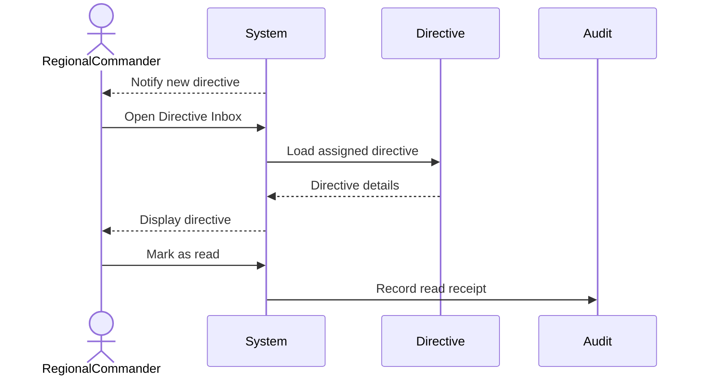
```mermaid
sequenceDiagram
    actor RegionalCommander
    participant System
    participant Directive
    participant Audit

    System-->>RegionalCommander: Notify new directive
    RegionalCommander->>System: Open Directive Inbox
    System->>Directive: Load assigned directive
    Directive-->>System: Directive details
    System-->>RegionalCommander: Display directive
    RegionalCommander->>System: Mark as read
    System->>Audit: Record read receipt
```

---

## UC-005: Create Regional Command Direction

**Package:** Directive & STR Management  
**Primary Actor:** Regional Commander  
**Secondary Actor:** OIM  
**Priority:** Critical  
**MVP Candidate:** Yes

### Goal

Regional Commander dapat menurunkan direktif dari Executive menjadi arahan wilayah untuk OIM.

### Preconditions

1. Regional Commander sudah menerima direktif.
2. Direktif masih aktif.
3. Regional Commander memiliki permission untuk membuat arahan wilayah.

### Trigger

Regional Commander memilih `Create Regional Command Direction`.

### Main Success Scenario

1. Regional Commander membuka detail direktif.
2. Regional Commander memilih `Create Regional Command Direction`.
3. System menampilkan form arahan wilayah.
4. Regional Commander mengisi konteks wilayah, prioritas, batasan, target, deadline, dan catatan pelaksanaan.
5. Regional Commander memilih OIM penerima.
6. System memvalidasi field wajib.
7. Regional Commander menerbitkan arahan wilayah.
8. System mengirim notifikasi ke OIM.
9. System mencatat aktivitas ke audit log.

### Alternative Flows

#### A1 — Arahan wilayah disimpan sebagai draft

1. Regional Commander memilih `Save Draft`.
2. System menyimpan arahan dengan status `Draft`.
3. Arahan belum dikirim ke OIM.

#### A2 — Arahan diturunkan ke beberapa OIM

1. Regional Commander memilih beberapa OIM sesuai wilayah/fungsi.
2. System membuat daftar distribusi.
3. System mengirim arahan ke setiap OIM terkait.

### Exception Flows

#### E1 — OIM belum ditentukan

1. System menolak publikasi.
2. System menampilkan pesan: `Penerima OIM wajib dipilih.`

### Postconditions

**Success:**

1. Regional command direction terbit.
2. OIM menerima notifikasi.
3. Audit trail tercatat.

### Business Rules

| ID | Rule |
|---|---|
| BR-UC005-001 | Regional command direction SHALL reference original STR. |
| BR-UC005-002 | System SHALL notify OIM after direction is published. |
| BR-UC005-003 | System SHALL maintain traceability from STR to regional direction. |

### Related Menus

- Regional Command Direction
- Directive Inbox
- Assignment Overview

### Mermaid Scenario

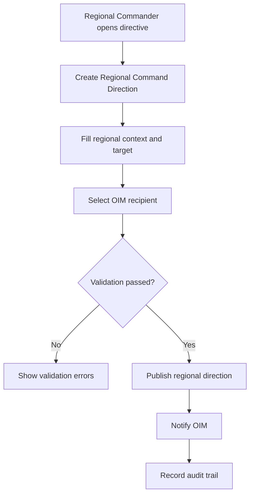
```mermaid
flowchart TD
    A[Regional Commander opens directive] --> B[Create Regional Command Direction]
    B --> C[Fill regional context and target]
    C --> D[Select OIM recipient]
    D --> E{Validation passed?}
    E -->|No| F[Show validation errors]
    E -->|Yes| G[Publish regional direction]
    G --> H[Notify OIM]
    H --> I[Record audit trail]
```

---

## UC-006: Create Assignment

**Package:** Assignment & Field Tasking  
**Primary Actor:** Operational Intelligence Manager  
**Secondary Actor:** Field Coordinator  
**Priority:** Critical  
**MVP Candidate:** Yes

### Goal

OIM dapat membuat assignment berdasarkan arahan dari atas dan meneruskannya kepada Field Coordinator.

### Preconditions

1. OIM sudah login.
2. OIM menerima directive atau regional command direction.
3. Field Coordinator penerima tersedia.
4. OIM memiliki permission membuat assignment.

### Trigger

OIM memilih menu **Create Assignment**.

### Main Success Scenario

1. OIM membuka arahan yang diterima.
2. OIM memilih `Create Assignment`.
3. System menampilkan form assignment.
4. OIM mengisi judul assignment, UUK terkait, wilayah, target, prioritas, deadline, instruksi, dan klasifikasi.
5. OIM memilih Field Coordinator penerima.
6. System memvalidasi field wajib.
7. OIM menerbitkan assignment.
8. System mengirim notifikasi kepada Field Coordinator.
9. System mengubah status assignment menjadi `Assigned`.
10. System mencatat aktivitas ke audit log.

### Alternative Flows

#### A1 — Assignment dibuat tanpa direktif langsung

1. OIM memilih `Create Assignment`.
2. System meminta OIM memilih referensi directive atau alasan assignment mandiri.
3. OIM mengisi alasan.
4. System menyimpan assignment dengan traceability note.

#### A2 — Assignment dikembalikan dari Field Coordinator

1. Field Coordinator mengirim clarification request.
2. System mengembalikan assignment ke OIM.
3. OIM memperbaiki instruksi atau detail assignment.
4. OIM menerbitkan ulang assignment.

### Exception Flows

#### E1 — Field Coordinator tidak dipilih

1. System menolak publikasi assignment.
2. System menampilkan pesan: `Field Coordinator wajib dipilih.`

#### E2 — Deadline melebihi batas direktif

1. System menampilkan warning.
2. OIM harus menyesuaikan deadline atau mengisi justifikasi.

### Postconditions

**Success:**

1. Assignment terkirim ke Field Coordinator.
2. Traceability dari directive ke assignment tercatat.
3. Field Coordinator menerima notifikasi.

### Business Rules

| ID | Rule |
|---|---|
| BR-UC006-001 | OIM SHALL create assignment for Field Coordinator, not directly to Field Officer. |
| BR-UC006-002 | Assignment SHALL reference directive or contain justification. |
| BR-UC006-003 | System SHALL record assignment creation in audit log. |

### Related Menus

- Assignment Management
- Create Assignment
- Assignment Progress

### Mermaid Scenario

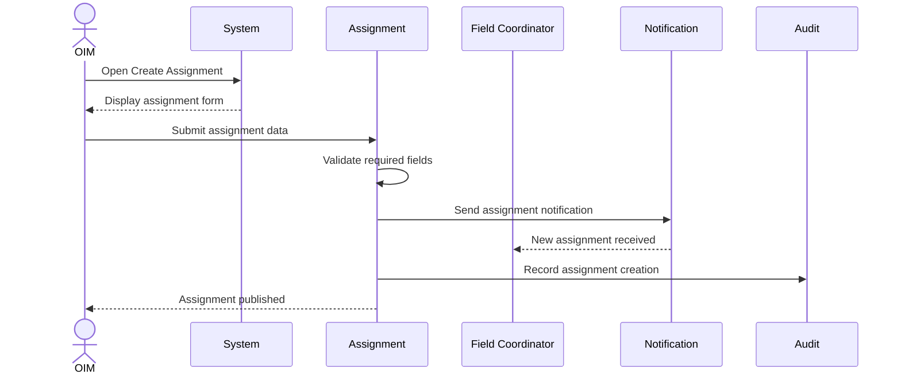
```mermaid
sequenceDiagram
    actor OIM
    participant System
    participant Assignment
    participant FC as Field Coordinator
    participant Notification
    participant Audit

    OIM->>System: Open Create Assignment
    System-->>OIM: Display assignment form
    OIM->>Assignment: Submit assignment data
    Assignment->>Assignment: Validate required fields
    Assignment->>Notification: Send assignment notification
    Notification-->>FC: New assignment received
    Assignment->>Audit: Record assignment creation
    Assignment-->>OIM: Assignment published
```

---

## UC-007: Distribute Field Task

**Package:** Assignment & Field Tasking  
**Primary Actor:** Field Coordinator  
**Secondary Actor:** Field Officer  
**Priority:** Critical  
**MVP Candidate:** Yes

### Goal

Field Coordinator membagi assignment dari OIM menjadi field task spesifik untuk Field Officer.

### Preconditions

1. Field Coordinator sudah login.
2. Assignment dari OIM sudah diterima.
3. Field Officer tersedia dan aktif.
4. Field Coordinator memiliki permission distribusi tugas.

### Trigger

Field Coordinator membuka assignment dan memilih `Create Field Task`.

### Main Success Scenario

1. Field Coordinator membuka **Assignment Inbox**.
2. Field Coordinator membuka detail assignment.
3. Field Coordinator memilih `Create Field Task`.
4. System menampilkan form field task.
5. Field Coordinator mengisi target, lokasi, UUK, deadline, instruksi teknis, prioritas, dan kebutuhan lampiran.
6. Field Coordinator memilih Field Officer penerima.
7. System memvalidasi field wajib.
8. Field Coordinator menerbitkan field task.
9. System mengirim notifikasi ke Field Officer.
10. System mengubah status field task menjadi `Assigned`.
11. System mencatat aktivitas ke audit log.

### Alternative Flows

#### A1 — Satu assignment dibagi ke banyak Field Officer

1. Field Coordinator memilih beberapa Field Officer.
2. System membuat beberapa field task terpisah.
3. System mengirim notifikasi ke masing-masing Field Officer.

#### A2 — Field Officer overload

1. System menampilkan workload Field Officer.
2. Field Coordinator memilih Field Officer lain atau tetap menugaskan dengan justifikasi.

### Exception Flows

#### E1 — Field Officer tidak aktif

1. System menampilkan warning.
2. Field Coordinator harus memilih Field Officer lain atau mengaktifkan override dengan alasan.

#### E2 — Task tidak memiliki UUK

1. System menolak pembuatan task.
2. System menampilkan pesan: `UUK terkait wajib dipilih.`

### Postconditions

**Success:**

1. Field task dibuat.
2. Field Officer menerima notifikasi.
3. Progress task dapat dimonitor.

### Business Rules

| ID | Rule |
|---|---|
| BR-UC007-001 | Field Coordinator SHALL distribute field task to Field Officer. |
| BR-UC007-002 | Field task SHALL reference assignment. |
| BR-UC007-003 | System SHALL track task status from assigned to completed. |

### Related Menus

- Field Task Management
- Create Field Task
- Task Distribution
- Task Progress Monitoring

### Mermaid Scenario

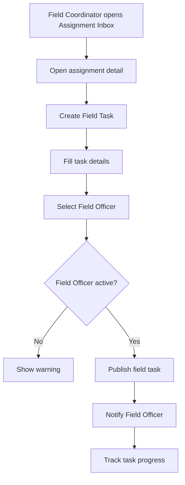
```mermaid
flowchart TD
    A[Field Coordinator opens Assignment Inbox] --> B[Open assignment detail]
    B --> C[Create Field Task]
    C --> D[Fill task details]
    D --> E[Select Field Officer]
    E --> F{Field Officer active?}
    F -->|No| G[Show warning]
    F -->|Yes| H[Publish field task]
    H --> I[Notify Field Officer]
    I --> J[Track task progress]
```

---

## UC-008: Execute Field Task

**Package:** Assignment & Field Tasking  
**Primary Actor:** Field Officer  
**Secondary Actor:** Field Coordinator  
**Priority:** Critical  
**MVP Candidate:** Yes

### Goal

Field Officer dapat menerima, membaca, menjalankan, dan memperbarui status field task.

### Preconditions

1. Field Officer sudah login.
2. Field task sudah ditugaskan.
3. Field Officer memiliki akses ke task tersebut.

### Trigger

Field Officer menerima notifikasi task baru.

### Main Success Scenario

1. Field Officer menerima notifikasi task baru.
2. Field Officer membuka menu **My Tasks**.
3. Field Officer membuka detail task.
4. System menampilkan instruksi, UUK, target, lokasi, deadline, dan kebutuhan lampiran.
5. Field Officer menandai task sebagai `In Progress`.
6. System mencatat perubahan status.
7. Field Officer melakukan pengumpulan informasi di lapangan.
8. Field Officer mengumpulkan data pendukung.
9. Field Officer membuat BAKET atau menunggu incoming information dari Jaring.
10. Field Officer menandai task sebagai `Completed` setelah submission terpenuhi.

### Alternative Flows

#### A1 — Field Officer membutuhkan klarifikasi

1. Field Officer memilih `Request Clarification`.
2. System menampilkan form catatan.
3. Field Coordinator menerima notifikasi klarifikasi.
4. Field Coordinator memberikan jawaban atau memperbarui instruksi.

#### A2 — Field task tidak dapat dilaksanakan

1. Field Officer memilih `Report Constraint`.
2. Field Officer mengisi alasan dan bukti pendukung.
3. Field Coordinator menerima notifikasi kendala.

### Exception Flows

#### E1 — Task sudah expired

1. System menampilkan status `Overdue`.
2. Field Officer tetap dapat mengirim laporan dengan alasan keterlambatan.
3. Field Coordinator menerima notifikasi overdue.

### Postconditions

**Success:**

1. Status task diperbarui.
2. Hasil lapangan dapat dilanjutkan menjadi BAKET.
3. Audit trail tercatat.

### Business Rules

| ID | Rule |
|---|---|
| BR-UC008-001 | Field Officer SHALL only see tasks assigned to them. |
| BR-UC008-002 | System SHALL track task status changes. |
| BR-UC008-003 | Field Officer SHALL provide reason for overdue completion. |

### Related Menus

- My Tasks
- Task Detail
- Update Task Status
- Create BAKET

### Mermaid Scenario

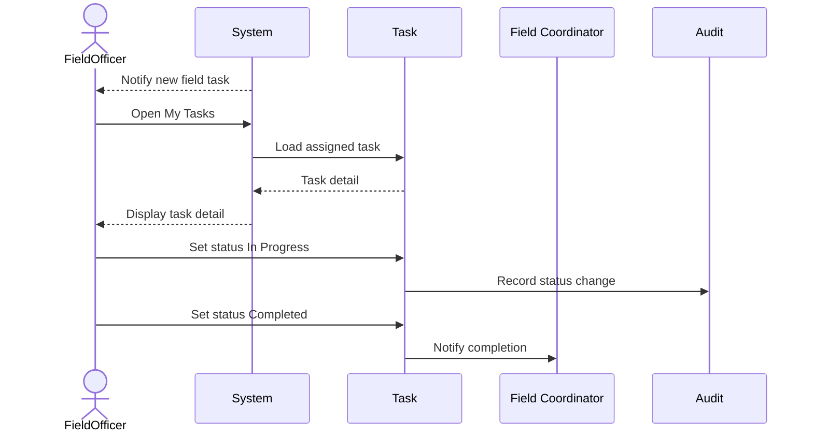
```mermaid
sequenceDiagram
    actor FieldOfficer
    participant System
    participant Task
    participant FC as Field Coordinator
    participant Audit

    System-->>FieldOfficer: Notify new field task
    FieldOfficer->>System: Open My Tasks
    System->>Task: Load assigned task
    Task-->>System: Task detail
    System-->>FieldOfficer: Display task detail
    FieldOfficer->>Task: Set status In Progress
    Task->>Audit: Record status change
    FieldOfficer->>Task: Set status Completed
    Task->>FC: Notify completion
```

---

## UC-009: Submit Information via WA Center

**Package:** WA Center Intake & Incoming Information  
**Primary Actor:** Jaring / External Intelligence Source  
**Secondary Actor:** WA Center / System Intake  
**Priority:** Critical  
**MVP Candidate:** Yes

### Goal

Jaring dapat mengirim informasi mentah melalui WA Center tanpa memiliki akses langsung ke modul internal.

### Preconditions

1. WA Center aktif.
2. Nomor atau identitas sumber dapat dipetakan atau ditandai sebagai unknown source.
3. Kanal komunikasi tersedia.

### Trigger

Jaring mengirim pesan, foto, video, dokumen, atau lokasi ke WA Center.

### Main Success Scenario

1. Jaring mengirim informasi ke WA Center.
2. WA Center menerima pesan.
3. System membaca metadata pesan.
4. System membuat objek **Incoming Information**.
5. System menyimpan raw intake.
6. System mencoba memetakan sumber ke Field Officer pembina.
7. System menandai status sebagai `Pending Routing` atau `Routed`.
8. System mencatat event ke audit log.

### Alternative Flows

#### A1 — Sumber tidak dikenali

1. System gagal memetakan sumber.
2. System menandai informasi sebagai `Unmapped Source`.
3. WA Center operator atau routing rule melakukan pemetaan manual.

#### A2 — Informasi memiliki banyak media

1. System menyimpan seluruh lampiran.
2. System membuat daftar attachment.
3. System menghubungkan attachment dengan Incoming Information.

### Exception Flows

#### E1 — File tidak didukung

1. System menolak file.
2. System menandai lampiran sebagai invalid.
3. System tetap menyimpan metadata pesan.

#### E2 — Kanal WA Center down

1. Pesan tidak dapat diterima.
2. System mencatat status koneksi.
3. Admin menerima notifikasi gangguan integrasi.

### Postconditions

**Success:**

1. Incoming Information dibuat.
2. Raw intake tersimpan.
3. Routing dapat dilakukan ke Field Officer.

### Business Rules

| ID | Rule |
|---|---|
| BR-UC009-001 | Jaring SHALL NOT access internal system menu. |
| BR-UC009-002 | WA Center SHALL create Incoming Information, not BAKET. |
| BR-UC009-003 | System SHALL archive raw intake for audit. |

### Related Menus

- Incoming Queue
- Incoming Detail
- Raw Intake Archive
- Source Mapping

### Mermaid Scenario

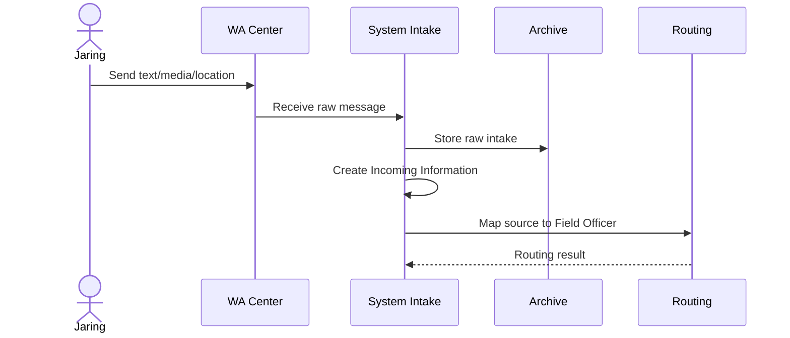
```mermaid
sequenceDiagram
    actor Jaring
    participant WA as WA Center
    participant Intake as System Intake
    participant Archive
    participant Routing

    Jaring->>WA: Send text/media/location
    WA->>Intake: Receive raw message
    Intake->>Archive: Store raw intake
    Intake->>Intake: Create Incoming Information
    Intake->>Routing: Map source to Field Officer
    Routing-->>Intake: Routing result
```

---

## UC-010: Route Incoming Information

**Package:** WA Center Intake & Incoming Information  
**Primary Actor:** WA Center / System Intake  
**Secondary Actor:** Field Officer  
**Priority:** Critical  
**MVP Candidate:** Yes

### Goal

System Intake dapat merouting Incoming Information kepada Field Officer pembina yang tepat.

### Preconditions

1. Incoming Information sudah dibuat.
2. Source mapping tersedia atau dapat dilakukan manual.
3. Field Officer penerima aktif.

### Trigger

Incoming Information baru masuk ke antrian routing.

### Main Success Scenario

1. System mengambil Incoming Information dengan status `Pending Routing`.
2. System membaca identitas sumber, lokasi, metadata, dan aturan routing.
3. System mencari Field Officer pembina.
4. System menetapkan Field Officer penerima.
5. System mengubah status menjadi `Routed`.
6. System mengirim notifikasi ke Field Officer.
7. System mencatat routing event.

### Alternative Flows

#### A1 — Routing manual

1. System tidak menemukan mapping otomatis.
2. WA Center operator membuka `Failed Routing`.
3. Operator memilih Field Officer penerima.
4. System menyimpan mapping baru.

#### A2 — Sumber memiliki lebih dari satu Field Officer terkait

1. System menampilkan kandidat penerima.
2. Operator atau supervisor memilih penerima utama.
3. System mencatat keputusan routing.

### Exception Flows

#### E1 — Field Officer tidak aktif

1. System menampilkan status penerima tidak aktif.
2. System mencari fallback Field Officer atau supervisor.
3. System menandai routing sebagai `Needs Review`.

### Postconditions

**Success:**

1. Incoming Information masuk ke inbox Field Officer.
2. Routing event tercatat.

### Business Rules

| ID | Rule |
|---|---|
| BR-UC010-001 | System SHALL route incoming information to responsible Field Officer. |
| BR-UC010-002 | System SHALL support manual routing when automatic mapping fails. |
| BR-UC010-003 | System SHALL record routing history. |

### Related Menus

- Routing Management
- Failed Routing
- Source Mapping
- Incoming Information Inbox

### Mermaid Scenario

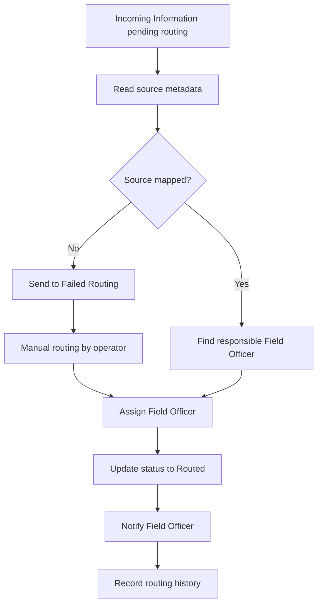
```mermaid
flowchart TD
    A[Incoming Information pending routing] --> B[Read source metadata]
    B --> C{Source mapped?}
    C -->|Yes| D[Find responsible Field Officer]
    C -->|No| E[Send to Failed Routing]
    E --> F[Manual routing by operator]
    F --> G[Assign Field Officer]
    D --> G
    G --> H[Update status to Routed]
    H --> I[Notify Field Officer]
    I --> J[Record routing history]
```

---

## UC-011: Validate Incoming Information

**Package:** WA Center Intake & Incoming Information  
**Primary Actor:** Field Officer  
**Secondary Actor:** WA Center / System Intake  
**Priority:** Critical  
**MVP Candidate:** Yes

### Goal

Field Officer memvalidasi apakah Incoming Information layak diproses menjadi BAKET.

### Preconditions

1. Incoming Information sudah dirouting ke Field Officer.
2. Field Officer memiliki akses ke informasi tersebut.
3. Informasi belum ditutup atau diproses menjadi BAKET.

### Trigger

Field Officer membuka Incoming Information Inbox.

### Main Success Scenario

1. Field Officer membuka **Incoming Information Inbox**.
2. System menampilkan daftar incoming information.
3. Field Officer membuka detail informasi.
4. Field Officer memeriksa isi pesan, lampiran, lokasi, waktu, dan sumber.
5. Field Officer melakukan validasi awal.
6. Field Officer menandai informasi sebagai `Valid`.
7. System mengaktifkan opsi `Create BAKET`.
8. System mencatat status validasi.

### Alternative Flows

#### A1 — Informasi tidak valid

1. Field Officer menandai informasi sebagai `Invalid`.
2. System meminta alasan penutupan.
3. Field Officer mengisi alasan.
4. System mengubah status menjadi `Closed - Invalid`.

#### A2 — Informasi perlu pendalaman

1. Field Officer menandai informasi sebagai `Need Follow-up`.
2. System membuat task follow-up atau catatan pendalaman.
3. Field Officer melakukan pengumpulan data tambahan.

### Exception Flows

#### E1 — Lampiran tidak dapat dibuka

1. System menampilkan pesan error.
2. Field Officer menandai lampiran sebagai bermasalah.
3. System mencatat issue untuk WA Center/Admin.

### Postconditions

**Success:**

1. Incoming Information dinyatakan valid.
2. Field Officer dapat membuat BAKET.

**Failure:**

1. Incoming Information ditutup dengan alasan.
2. Tidak ada BAKET yang dibuat.

### Business Rules

| ID | Rule |
|---|---|
| BR-UC011-001 | Field Officer SHALL validate Incoming Information before creating BAKET. |
| BR-UC011-002 | System SHALL require closure reason for invalid information. |
| BR-UC011-003 | System SHALL preserve raw intake even when information is invalid. |

### Related Menus

- Incoming Information Inbox
- Incoming Information Detail
- Validate Incoming Information
- Close Invalid Information

### Mermaid Scenario

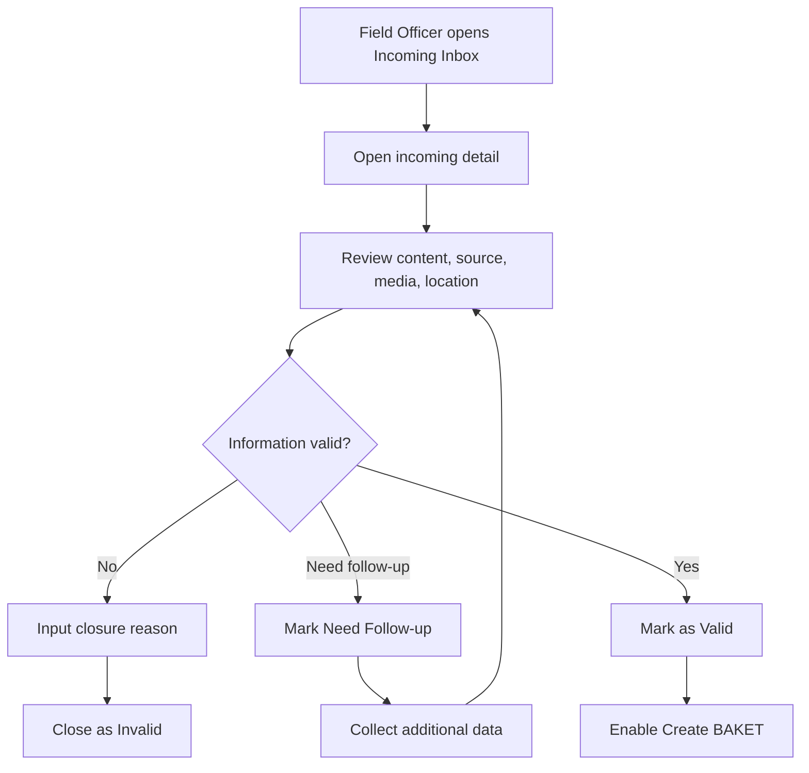
```mermaid
flowchart TD
    A[Field Officer opens Incoming Inbox] --> B[Open incoming detail]
    B --> C[Review content, source, media, location]
    C --> D{Information valid?}
    D -->|No| E[Input closure reason]
    E --> F[Close as Invalid]
    D -->|Need follow-up| G[Mark Need Follow-up]
    G --> H[Collect additional data]
    H --> C
    D -->|Yes| I[Mark as Valid]
    I --> J[Enable Create BAKET]
```

---

## UC-012: Create BAKET

**Package:** BAKET Management  
**Primary Actor:** Field Officer  
**Secondary Actor:** OIM  
**Priority:** Critical  
**MVP Candidate:** Yes

### Goal

Field Officer membuat BAKET dari Incoming Information yang sudah valid atau dari hasil tugas lapangan.

### Preconditions

1. Field Officer sudah login.
2. Incoming Information sudah valid atau field task sudah aktif.
3. Field Officer memiliki permission membuat BAKET.
4. Field Officer memiliki data minimal untuk 5W+1H.

### Trigger

Field Officer memilih `Create BAKET`.

### Main Success Scenario

1. Field Officer memilih Incoming Information valid atau field task terkait.
2. Field Officer memilih `Create BAKET`.
3. System menampilkan form BAKET.
4. Field Officer mengisi fakta 5W+1H.
5. Field Officer mengisi lokasi, waktu kejadian, sumber, kategori isu, dan UUK terkait.
6. Field Officer menambahkan lampiran foto, video, dokumen, atau koordinat GPS jika tersedia.
7. System memvalidasi field wajib.
8. Field Officer menyimpan BAKET sebagai draft.
9. Field Officer melakukan review.
10. Field Officer submit BAKET ke OIM.
11. System mengubah status BAKET menjadi `Submitted`.
12. System mengirim notifikasi ke OIM.
13. System mencatat aktivitas ke audit log.

### Alternative Flows

#### A1 — Simpan draft

1. Field Officer memilih `Save Draft`.
2. System menyimpan BAKET dengan status `Draft`.
3. BAKET belum dikirim ke OIM.

#### A2 — BAKET dibuat dari field task tanpa incoming information

1. Field Officer membuka field task.
2. Field Officer memilih `Create BAKET from Task`.
3. System menautkan BAKET ke field task.
4. Field Officer mengisi form BAKET.

#### A3 — Lampiran tidak tersedia

1. Field Officer mengisi alasan lampiran tidak tersedia.
2. System tetap mengizinkan submit jika field minimum terpenuhi.
3. System menandai BAKET sebagai `Evidence Limited`.

### Exception Flows

#### E1 — 5W+1H belum lengkap

1. System menolak submit.
2. System menandai field yang belum lengkap.
3. Field Officer melengkapi data.

#### E2 — BAKET tidak memiliki UUK terkait

1. System menolak submit.
2. System menampilkan pesan: `UUK terkait wajib dipilih.`

### Postconditions

**Success:**

1. BAKET terkirim ke OIM.
2. BAKET memiliki status `Submitted`.
3. Audit trail tercatat.

### Business Rules

| ID | Rule |
|---|---|
| BR-UC012-001 | BAKET SHALL be created only by Field Officer. |
| BR-UC012-002 | BAKET SHALL contain minimum 5W+1H information. |
| BR-UC012-003 | BAKET SHALL reference Incoming Information or Field Task. |
| BR-UC012-004 | System SHALL notify OIM after BAKET submission. |

### Related Menus

- Create BAKET
- BAKET Form
- Evidence Upload
- Submit BAKET
- BAKET Drafts

### Mermaid Scenario

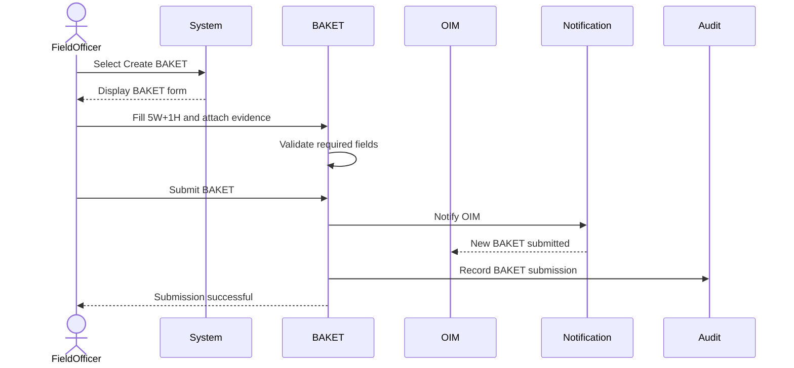
```mermaid
sequenceDiagram
    actor FieldOfficer
    participant System
    participant BAKET
    participant OIM
    participant Notification
    participant Audit

    FieldOfficer->>System: Select Create BAKET
    System-->>FieldOfficer: Display BAKET form
    FieldOfficer->>BAKET: Fill 5W+1H and attach evidence
    BAKET->>BAKET: Validate required fields
    FieldOfficer->>BAKET: Submit BAKET
    BAKET->>Notification: Notify OIM
    Notification-->>OIM: New BAKET submitted
    BAKET->>Audit: Record BAKET submission
    BAKET-->>FieldOfficer: Submission successful
```

---

## UC-013: Verify BAKET

**Package:** Verification & Intelligence Processing  
**Primary Actor:** Operational Intelligence Manager  
**Secondary Actor:** Field Officer  
**Priority:** Critical  
**MVP Candidate:** Yes

### Goal

OIM memeriksa BAKET yang masuk untuk memastikan kelengkapan, relevansi, dan validitas sebelum diproses lebih lanjut.

### Preconditions

1. OIM sudah login.
2. BAKET sudah dikirim oleh Field Officer.
3. OIM memiliki akses ke BAKET berdasarkan wilayah/fungsi.
4. BAKET belum diverifikasi.

### Trigger

OIM menerima notifikasi BAKET baru.

### Main Success Scenario

1. OIM membuka **BAKET Inbox**.
2. System menampilkan daftar BAKET masuk.
3. OIM membuka detail BAKET.
4. OIM memeriksa 5W+1H, lampiran, lokasi, sumber, UUK terkait, dan field task asal.
5. OIM menandai BAKET sebagai `Verified`.
6. System mengubah status BAKET menjadi `Verified`.
7. System mengaktifkan proses Neraca Penilaian.
8. System mencatat aktivitas ke audit log.

### Alternative Flows

#### A1 — BAKET kurang lengkap

1. OIM memilih `Return BAKET`.
2. System meminta catatan revisi.
3. OIM mengisi catatan kekurangan.
4. System mengubah status BAKET menjadi `Returned`.
5. System mengirim notifikasi ke Field Officer.

#### A2 — BAKET tidak relevan dengan UUK

1. OIM menandai BAKET sebagai `Not Relevant`.
2. System meminta alasan.
3. BAKET tidak dilanjutkan ke proses laporan.

### Exception Flows

#### E1 — Lampiran rusak

1. OIM menandai lampiran sebagai invalid.
2. System meminta OIM memilih return atau continue with limitation.
3. Jika return, Field Officer menerima permintaan perbaikan.

### Postconditions

**Success:**

1. BAKET verified.
2. BAKET dapat dinilai menggunakan Neraca Penilaian.

**Failure:**

1. BAKET dikembalikan atau ditutup.
2. Catatan keputusan tersimpan.

### Business Rules

| ID | Rule |
|---|---|
| BR-UC013-001 | OIM SHALL verify BAKET before applying Neraca Penilaian. |
| BR-UC013-002 | System SHALL require revision note when BAKET is returned. |
| BR-UC013-003 | Verified BAKET SHALL be read-only for Field Officer except through revision workflow. |

### Related Menus

- BAKET Inbox
- BAKET Detail
- BAKET Verification
- Return BAKET

### Mermaid Scenario

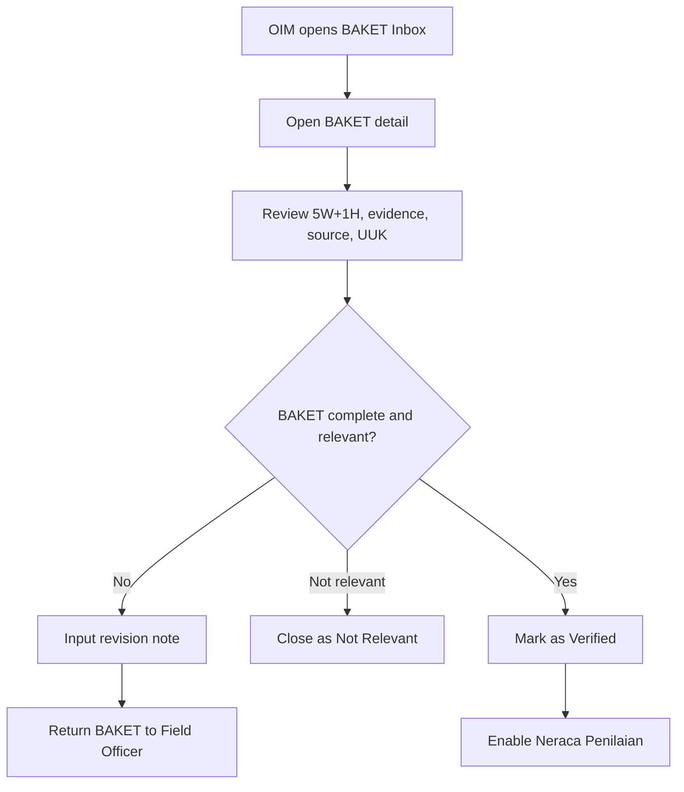
```mermaid
flowchart TD
    A[OIM opens BAKET Inbox] --> B[Open BAKET detail]
    B --> C[Review 5W+1H, evidence, source, UUK]
    C --> D{BAKET complete and relevant?}
    D -->|No| E[Input revision note]
    E --> F[Return BAKET to Field Officer]
    D -->|Not relevant| G[Close as Not Relevant]
    D -->|Yes| H[Mark as Verified]
    H --> I[Enable Neraca Penilaian]
```

---

## UC-014: Apply Neraca Penilaian

**Package:** Verification & Intelligence Processing  
**Primary Actor:** Operational Intelligence Manager  
**Secondary Actor:** None  
**Priority:** Critical  
**MVP Candidate:** Yes

### Goal

OIM memberikan penilaian kepercayaan sumber dan kebenaran isi informasi menggunakan Neraca Penilaian.

### Preconditions

1. BAKET sudah berstatus `Verified`.
2. OIM memiliki permission untuk memberi penilaian.
3. Skala penilaian A–F dan 1–6 tersedia di sistem.

### Trigger

OIM membuka menu **Neraca Penilaian** pada BAKET terverifikasi.

### Main Success Scenario

1. OIM membuka BAKET yang sudah diverifikasi.
2. OIM memilih menu **Neraca Penilaian**.
3. System menampilkan matriks penilaian sumber A–F.
4. OIM memilih nilai kepercayaan sumber.
5. System menampilkan matriks penilaian kebenaran isi 1–6.
6. OIM memilih nilai kebenaran isi.
7. OIM mengisi catatan penilaian.
8. System memvalidasi penilaian.
9. OIM menyimpan hasil penilaian.
10. System mengubah status BAKET menjadi `Assessed`.
11. System mencatat aktivitas ke audit log.

### Alternative Flows

#### A1 — Penilaian belum dapat ditentukan

1. OIM memilih nilai `F` atau `6`.
2. System meminta catatan justifikasi.
3. OIM mengisi alasan penilaian tidak dapat ditentukan.

### Exception Flows

#### E1 — Catatan wajib belum diisi

1. System menolak penyimpanan.
2. System menampilkan pesan: `Catatan penilaian wajib diisi.`

### Postconditions

**Success:**

1. BAKET memiliki Neraca Penilaian.
2. BAKET dapat diproses ke analisis awal dan kompilasi.

### Business Rules

| ID | Rule |
|---|---|
| BR-UC014-001 | OIM SHALL assign source reliability value A-F. |
| BR-UC014-002 | OIM SHALL assign information credibility value 1-6. |
| BR-UC014-003 | System SHALL require assessment note. |
| BR-UC014-004 | System SHALL record assessment changes in audit log. |

### Related Menus

- Neraca Penilaian
- Assessment Matrix
- BAKET Detail

### Mermaid Scenario

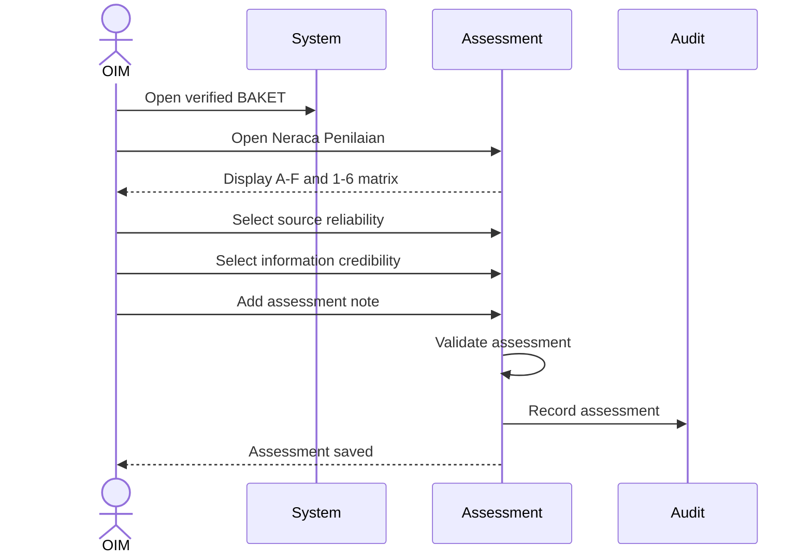
```mermaid
sequenceDiagram
    actor OIM
    participant System
    participant Assessment
    participant Audit

    OIM->>System: Open verified BAKET
    OIM->>Assessment: Open Neraca Penilaian
    Assessment-->>OIM: Display A-F and 1-6 matrix
    OIM->>Assessment: Select source reliability
    OIM->>Assessment: Select information credibility
    OIM->>Assessment: Add assessment note
    Assessment->>Assessment: Validate assessment
    Assessment->>Audit: Record assessment
    Assessment-->>OIM: Assessment saved
```

---

## UC-015: Compile Draft Intelligence Report

**Package:** Report Builder & Approval Workflow  
**Primary Actor:** Operational Intelligence Manager  
**Secondary Actor:** Regional Commander  
**Priority:** Critical  
**MVP Candidate:** Yes

### Goal

OIM menyusun Draft Intelligence Report dari BAKET yang sudah diverifikasi dan dinilai.

### Preconditions

1. OIM sudah login.
2. Minimal satu BAKET sudah berstatus `Assessed`.
3. OIM memiliki permission membuat draft report.
4. Template laporan tersedia.

### Trigger

OIM memilih menu **Draft Report Builder**.

### Main Success Scenario

1. OIM membuka **Draft Report Builder**.
2. OIM memilih jenis laporan.
3. System menampilkan template laporan.
4. OIM memilih BAKET yang akan dijadikan sumber.
5. System menampilkan ringkasan BAKET terpilih.
6. OIM mengisi indikasi/fakta, analisis, dampak, upaya, dan saran tindak sesuai format.
7. OIM menambahkan lampiran pendukung.
8. OIM menyimpan draft.
9. OIM melakukan review isi laporan.
10. OIM memilih `Submit for Approval`.
11. System mengubah status laporan menjadi `Pending Review`.
12. System mengirim notifikasi ke Regional Commander.
13. System mencatat aktivitas ke audit log.

### Alternative Flows

#### A1 — Draft disimpan tanpa submit

1. OIM memilih `Save Draft`.
2. System menyimpan laporan dengan status `Draft`.
3. Regional Commander belum menerima notifikasi.

#### A2 — OIM menggunakan hasil AI offline sebagai referensi

1. OIM membuka panel AI Offline Review.
2. OIM memilih insight yang relevan.
3. System memasukkan insight sebagai referensi yang harus divalidasi manusia.
4. OIM mengedit dan menyetujui konten.

### Exception Flows

#### E1 — Tidak ada BAKET terverifikasi

1. System menolak pembuatan laporan.
2. System menampilkan pesan: `Minimal satu BAKET assessed diperlukan.`

#### E2 — Field wajib laporan belum lengkap

1. System menolak submit.
2. System menandai bagian yang belum lengkap.

### Postconditions

**Success:**

1. Draft Intelligence Report berstatus `Pending Review`.
2. Regional Commander menerima notifikasi.
3. BAKET sumber tertaut ke laporan.

### Business Rules

| ID | Rule |
|---|---|
| BR-UC015-001 | Draft report SHALL reference at least one assessed BAKET. |
| BR-UC015-002 | OIM SHALL submit draft report to Regional Commander. |
| BR-UC015-003 | System SHALL maintain traceability from report to BAKET. |

### Related Menus

- Draft Report Builder
- Compilation Workspace
- Submit for Approval
- AI Offline Review

### Mermaid Scenario

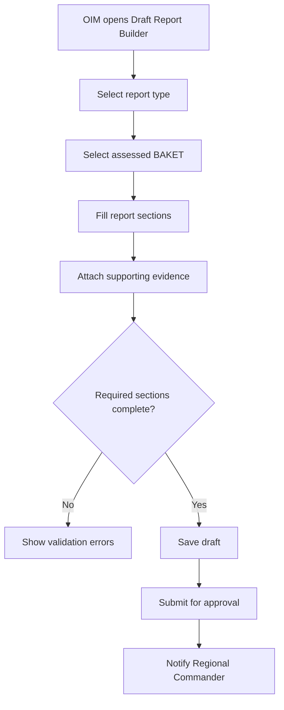
```mermaid
flowchart TD
    A[OIM opens Draft Report Builder] --> B[Select report type]
    B --> C[Select assessed BAKET]
    C --> D[Fill report sections]
    D --> E[Attach supporting evidence]
    E --> F{Required sections complete?}
    F -->|No| G[Show validation errors]
    F -->|Yes| H[Save draft]
    H --> I[Submit for approval]
    I --> J[Notify Regional Commander]
```

---

## UC-016: Review Draft Intelligence Report

**Package:** Report Builder & Approval Workflow  
**Primary Actor:** Regional Commander  
**Secondary Actor:** OIM  
**Priority:** Critical  
**MVP Candidate:** Yes

### Goal

Regional Commander melakukan review terhadap Draft Intelligence Report yang dikirim oleh OIM.

### Preconditions

1. Regional Commander sudah login.
2. Draft report berstatus `Pending Review`.
3. Regional Commander memiliki akses ke report tersebut.

### Trigger

Regional Commander menerima notifikasi draft report baru.

### Main Success Scenario

1. Regional Commander membuka notifikasi.
2. Regional Commander membuka **Draft Intelligence Report Review**.
3. System menampilkan daftar laporan yang menunggu review.
4. Regional Commander membuka detail laporan.
5. System menampilkan isi laporan, sumber BAKET, Neraca Penilaian, lampiran, dan traceability.
6. Regional Commander membaca dan mengevaluasi laporan.
7. Regional Commander membuka panel decision.
8. Regional Commander memilih approve, return, atau reject.

### Alternative Flows

#### A1 — Regional Commander melakukan drill-down ke BAKET

1. Regional Commander memilih salah satu sumber BAKET.
2. System menampilkan detail BAKET sesuai clearance.
3. Regional Commander kembali ke laporan.

#### A2 — Regional Commander memberi catatan tanpa mengubah status

1. Regional Commander menambahkan internal note.
2. System menyimpan catatan.
3. Status laporan tetap `Pending Review`.

### Exception Flows

#### E1 — Report tidak dapat dibuka

1. System menampilkan pesan error.
2. System menyediakan opsi retry.
3. System mencatat error.

### Postconditions

**Success:**

1. Regional Commander memahami isi draft.
2. Laporan siap diputuskan melalui UC-017.

### Business Rules

| ID | Rule |
|---|---|
| BR-UC016-001 | Regional Commander SHALL review draft report before approval. |
| BR-UC016-002 | System SHALL show report traceability to source BAKET. |
| BR-UC016-003 | System SHALL restrict drill-down based on clearance. |

### Related Menus

- Draft Intelligence Report Review
- Report Pipeline
- Approval Workspace

### Mermaid Scenario

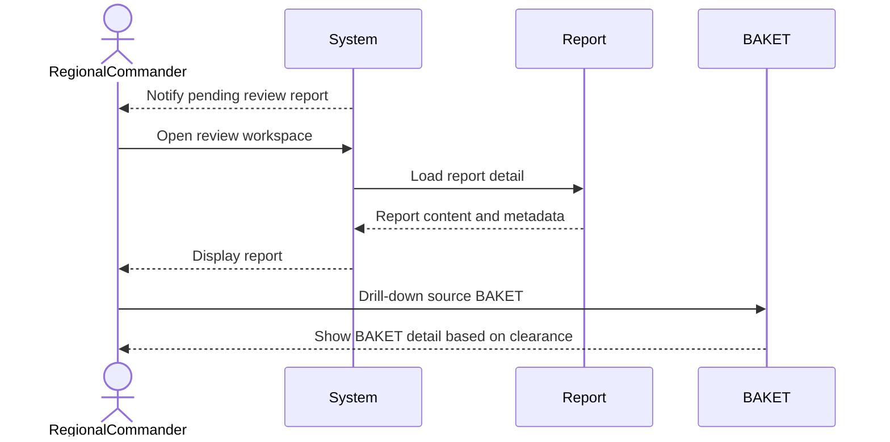
```mermaid
sequenceDiagram
    actor RegionalCommander
    participant System
    participant Report
    participant BAKET

    System-->>RegionalCommander: Notify pending review report
    RegionalCommander->>System: Open review workspace
    System->>Report: Load report detail
    Report-->>System: Report content and metadata
    System-->>RegionalCommander: Display report
    RegionalCommander->>BAKET: Drill-down source BAKET
    BAKET-->>RegionalCommander: Show BAKET detail based on clearance
```

---

## UC-017: Approve / Return / Reject Report

**Package:** Report Builder & Approval Workflow  
**Primary Actor:** Regional Commander  
**Secondary Actor:** OIM, Executive  
**Priority:** Critical  
**MVP Candidate:** Yes

### Goal

Regional Commander memberikan keputusan terhadap Draft Intelligence Report: approve, return, atau reject.

### Preconditions

1. Draft report berstatus `Pending Review`.
2. Regional Commander sudah melakukan review.
3. Regional Commander memiliki permission decision.

### Trigger

Regional Commander membuka panel decision pada laporan.

### Main Success Scenario — Approve

1. Regional Commander membuka laporan.
2. Regional Commander memilih `Approve`.
3. System meminta konfirmasi.
4. Regional Commander mengonfirmasi approval.
5. System mengubah status laporan menjadi `Approved`.
6. System mengirim notifikasi ke OIM.
7. System membuat laporan tersedia untuk Executive.
8. System mencatat approval ke audit log.

### Alternative Flows

#### A1 — Return for Revision

1. Regional Commander memilih `Return`.
2. System meminta catatan revisi.
3. Regional Commander mengisi catatan revisi.
4. System mengubah status laporan menjadi `Returned`.
5. System mengirim notifikasi ke OIM.
6. OIM memperbaiki draft dan submit ulang.

#### A2 — Reject Report

1. Regional Commander memilih `Reject`.
2. System meminta alasan penolakan.
3. Regional Commander mengisi alasan.
4. System mengubah status laporan menjadi `Rejected`.
5. System mengirim notifikasi ke OIM.
6. Laporan tidak dapat diedit kecuali dibuat versi baru.

### Exception Flows

#### E1 — Catatan return/reject kosong

1. System menolak keputusan.
2. System menampilkan pesan: `Catatan wajib diisi untuk Return atau Reject.`

### Postconditions

**Approve Success:**

1. Report berstatus `Approved`.
2. Executive dapat melihat laporan.

**Return Success:**

1. Report berstatus `Returned`.
2. OIM menerima catatan revisi.

**Reject Success:**

1. Report berstatus `Rejected`.
2. Laporan ditutup atau dibuat ulang sesuai kebijakan.

### Business Rules

| ID | Rule |
|---|---|
| BR-UC017-001 | Regional Commander SHALL choose approve, return, or reject. |
| BR-UC017-002 | System SHALL require notes for return and reject. |
| BR-UC017-003 | Approved report SHALL be visible to Executive. |
| BR-UC017-004 | System SHALL record decision event in audit log. |

### Related Menus

- Approval Workspace
- Revision Feedback
- Approved Regional Reports

### Mermaid Scenario

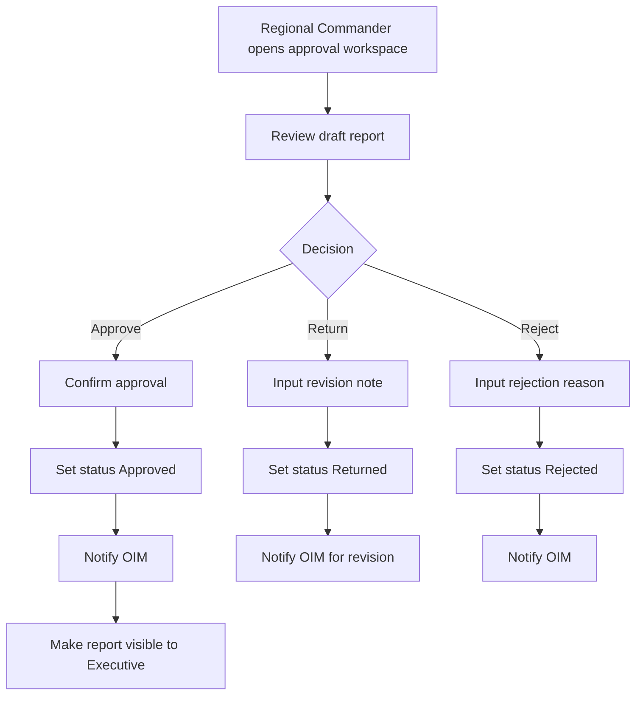
```mermaid
flowchart TD
    A[Regional Commander opens approval workspace] --> B[Review draft report]
    B --> C{Decision}
    C -->|Approve| D[Confirm approval]
    D --> E[Set status Approved]
    E --> F[Notify OIM]
    F --> G[Make report visible to Executive]

    C -->|Return| H[Input revision note]
    H --> I[Set status Returned]
    I --> J[Notify OIM for revision]

    C -->|Reject| K[Input rejection reason]
    K --> L[Set status Rejected]
    L --> M[Notify OIM]
```

---

## UC-018: View Approved Intelligence Report

**Package:** Report Builder & Approval Workflow  
**Primary Actor:** Executive  
**Secondary Actor:** Regional Commander, OIM  
**Priority:** Critical  
**MVP Candidate:** Yes

### Goal

Executive dapat melihat laporan intelijen yang sudah disetujui dan menggunakannya sebagai dasar kebutuhan strategis berikutnya.

### Preconditions

1. Executive sudah login.
2. Minimal satu report sudah berstatus `Approved`.
3. Executive memiliki clearance untuk laporan tersebut.

### Trigger

Executive membuka menu **Approved Intelligence Reports**.

### Main Success Scenario

1. Executive membuka **Approved Intelligence Reports**.
2. System menampilkan daftar laporan approved.
3. Executive menggunakan filter wilayah, periode, isu, klasifikasi, atau status.
4. Executive membuka detail laporan.
5. System menampilkan ringkasan, isi laporan, analisis, dampak, saran tindak, dan lampiran.
6. Executive membaca laporan.
7. Executive dapat melakukan drill-down sesuai clearance.
8. Executive dapat memilih `Create Follow-up Strategic Need`.
9. System mencatat aktivitas view ke audit log.

### Alternative Flows

#### A1 — Executive hanya ingin executive summary

1. Executive memilih mode `Summary`.
2. System menampilkan ringkasan laporan.
3. Detail laporan tetap tersedia melalui drill-down.

#### A2 — Executive membuat follow-up directive

1. Executive memilih `Create Follow-up Strategic Need`.
2. System membuka form STR baru.
3. System membawa konteks laporan sebagai referensi.

### Exception Flows

#### E1 — Clearance tidak cukup

1. System membatasi akses detail tertentu.
2. System menampilkan pesan: `Detail ini membutuhkan clearance lebih tinggi.`
3. System mencatat access attempt.

### Postconditions

**Success:**

1. Executive membaca laporan approved.
2. Follow-up directive dapat dibuat jika diperlukan.

### Business Rules

| ID | Rule |
|---|---|
| BR-UC018-001 | Executive SHALL see approved reports. |
| BR-UC018-002 | System SHALL restrict raw detail based on clearance. |
| BR-UC018-003 | System SHALL allow follow-up directive creation from approved report. |

### Related Menus

- Approved Intelligence Reports
- Executive Briefing
- Report Drill-down
- Follow-up Strategic Need

### Mermaid Scenario

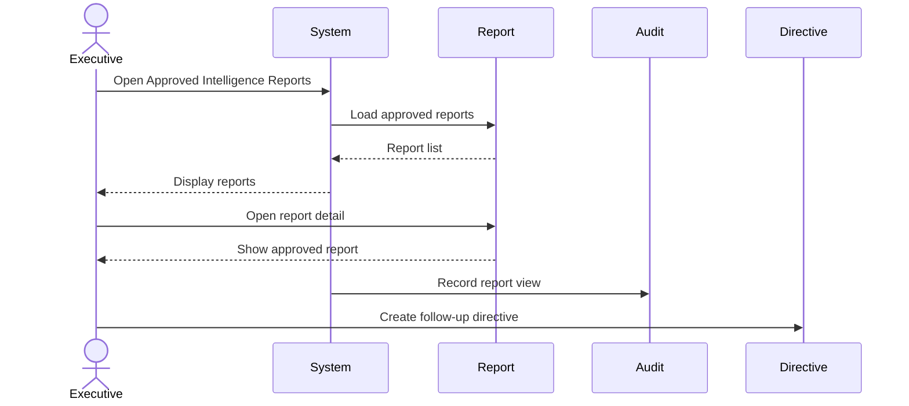
```mermaid
sequenceDiagram
    actor Executive
    participant System
    participant Report
    participant Audit
    participant Directive

    Executive->>System: Open Approved Intelligence Reports
    System->>Report: Load approved reports
    Report-->>System: Report list
    System-->>Executive: Display reports
    Executive->>Report: Open report detail
    Report-->>Executive: Show approved report
    System->>Audit: Record report view
    Executive->>Directive: Create follow-up directive
```

---

## UC-019: Monitor Role-Based Dashboard

**Package:** Dashboard & Monitoring  
**Primary Actor:** Executive / Regional Commander / OIM / Field Coordinator  
**Secondary Actor:** System  
**Priority:** High  
**MVP Candidate:** Yes

### Goal

User dapat melihat dashboard yang sesuai dengan role, tanggung jawab, dan permission.

### Preconditions

1. User sudah login.
2. User memiliki role aktif.
3. Data dashboard tersedia.

### Trigger

User membuka menu **Dashboard**.

### Main Success Scenario

1. User membuka dashboard.
2. System membaca role dan permission user.
3. System mengambil data yang relevan.
4. System menampilkan widget sesuai role.
5. User melihat ringkasan status.
6. User melakukan drill-down ke item tertentu.
7. System menampilkan detail sesuai permission.
8. System mencatat akses jika data berklasifikasi tinggi.

### Role-Based Dashboard View

| Role | Dashboard Focus |
|---|---|
| Executive | Strategic situation awareness, approved reports, early warning, directive progress |
| Regional Commander | Regional risk, report pipeline, assignment progress, approval queue |
| OIM | BAKET inbox, verification queue, draft report status, assignment progress |
| Field Coordinator | Assignment inbox, task distribution, personnel status, panic alert |
| Field Officer | My tasks, incoming information, draft BAKET, revision request |
| Admin System | System health, user activity, security alert, integration status |

### Alternative Flows

#### A1 — Tidak ada data

1. System menampilkan empty state.
2. System menjelaskan data belum tersedia.
3. System menampilkan action sesuai role.

#### A2 — User mengganti filter

1. User memilih filter wilayah/periode/status.
2. System memperbarui data dashboard.
3. System menampilkan filter aktif.

### Exception Flows

#### E1 — Widget gagal dimuat

1. System menampilkan fallback widget error.
2. System tetap menampilkan widget lain.
3. System mencatat error.

### Postconditions

**Success:**

1. User mendapatkan ringkasan operasional sesuai role.
2. Drill-down tersedia sesuai permission.

### Business Rules

| ID | Rule |
|---|---|
| BR-UC019-001 | Dashboard SHALL be role-based. |
| BR-UC019-002 | System SHALL NOT expose data outside user permission. |
| BR-UC019-003 | Dashboard SHALL provide empty state when no data exists. |

### Related Menus

- Executive Dashboard
- Regional Dashboard
- OIM Dashboard
- Field Coordination Dashboard
- My Field Dashboard
- Admin Dashboard

### Mermaid Scenario

```mermaid
flowchart TD
    A[User opens Dashboard] --> B[System checks role]
    B --> C[System checks permissions]
    C --> D[Load role-based widgets]
    D --> E{Data available?}
    E -->|No| F[Show empty state]
    E -->|Yes| G[Display dashboard widgets]
    G --> H[User drill-down]
    H --> I{Permission sufficient?}
    I -->|No| J[Restrict detail]
    I -->|Yes| K[Show detail]
```

---

## UC-020: Trigger Panic Alert

**Package:** Emergency & Panic Alert  
**Primary Actor:** Field Officer  
**Secondary Actor:** Field Coordinator, Regional Commander, Pusdalops  
**Priority:** High  
**MVP Candidate:** Optional MVP

### Goal

Field Officer dapat mengirim sinyal darurat dengan lokasi dan informasi minimum agar atasan dapat merespons cepat.

### Preconditions

1. Field Officer sudah login.
2. Panic Button tersedia.
3. Device memiliki izin lokasi atau Field Officer dapat mengisi lokasi manual.

### Trigger

Field Officer menekan **Panic Button**.

### Main Success Scenario

1. Field Officer membuka menu **Emergency / Panic Button**.
2. Field Officer menekan tombol panic.
3. System meminta konfirmasi cepat.
4. Field Officer mengonfirmasi.
5. System mengambil lokasi GPS jika tersedia.
6. System menampilkan form ringkas: situasi, tindakan, kebutuhan.
7. Field Officer mengisi informasi minimum.
8. System mengirim panic alert.
9. Field Coordinator menerima notifikasi prioritas tinggi.
10. Regional Commander dan/atau Pusdalops menerima eskalasi sesuai aturan.
11. System mencatat timeline emergency.

### Alternative Flows

#### A1 — Lokasi GPS tidak tersedia

1. System meminta Field Officer mengisi lokasi manual.
2. Field Officer mengisi lokasi.
3. System mengirim alert dengan label `Manual Location`.

#### A2 — Alert dikirim otomatis setelah timeout

1. Field Officer menekan panic.
2. Field Officer tidak menyelesaikan form dalam waktu tertentu.
3. System tetap mengirim alert minimum dengan status `Incomplete Emergency Detail`.

### Exception Flows

#### E1 — Koneksi internet terputus

1. System mencoba fallback channel jika tersedia.
2. System menyimpan alert secara lokal.
3. System mengirim saat koneksi pulih.

### Postconditions

**Success:**

1. Panic alert diterima oleh role terkait.
2. Timeline emergency tercatat.
3. Status alert dapat dipantau.

### Business Rules

| ID | Rule |
|---|---|
| BR-UC020-001 | Panic alert SHALL notify Field Coordinator immediately. |
| BR-UC020-002 | System SHOULD include GPS location when available. |
| BR-UC020-003 | System SHALL record emergency timeline. |
| BR-UC020-004 | Panic alert SHALL be treated as high-priority notification. |

### Related Menus

- Panic Button
- Emergency Report
- Panic Alert Center
- Emergency Control Dashboard

### Mermaid Scenario

```mermaid
sequenceDiagram
    actor FieldOfficer
    participant App
    participant Alert
    participant FC as Field Coordinator
    participant RC as Regional Commander
    participant Pusdalops
    participant Timeline

    FieldOfficer->>App: Press Panic Button
    App->>App: Capture GPS / manual location
    FieldOfficer->>App: Submit emergency detail
    App->>Alert: Create panic alert
    Alert-->>FC: High priority notification
    Alert-->>RC: Escalation notification
    Alert-->>Pusdalops: Emergency notification
    Alert->>Timeline: Record emergency event
```

---

## UC-021: Manage Users & Permissions

**Package:** Administration & Audit  
**Primary Actor:** Admin System  
**Secondary Actor:** All Internal Roles  
**Priority:** Critical  
**MVP Candidate:** Yes

### Goal

Admin System dapat mengelola user, role, permission, organization mapping, dan status akun.

### Preconditions

1. Admin sudah login.
2. Admin memiliki permission user management.
3. Role dan organization unit tersedia.

### Trigger

Admin membuka menu **Users** atau **Roles**.

### Main Success Scenario

1. Admin membuka menu **User Management**.
2. Admin memilih `Create User`.
3. System menampilkan form user.
4. Admin mengisi identitas user, unit organisasi, role, clearance, status, dan metode autentikasi.
5. System memvalidasi field wajib.
6. Admin menyimpan user.
7. System membuat user baru.
8. System mencatat aktivitas ke audit log.

### Alternative Flows

#### A1 — Update role user

1. Admin membuka detail user.
2. Admin mengubah role.
3. System meminta konfirmasi.
4. System menyimpan perubahan.
5. User akan mendapatkan menu baru sesuai role pada login berikutnya.

#### A2 — Nonaktifkan user

1. Admin membuka detail user.
2. Admin memilih `Deactivate`.
3. System meminta alasan.
4. System menonaktifkan user.
5. Semua session aktif user dicabut.

### Exception Flows

#### E1 — Role tidak kompatibel dengan clearance

1. System menolak penyimpanan.
2. System menampilkan pesan konfigurasi tidak valid.

### Postconditions

**Success:**

1. User atau permission diperbarui.
2. Audit log tercatat.

### Business Rules

| ID | Rule |
|---|---|
| BR-UC021-001 | Admin SHALL manage user role and permission. |
| BR-UC021-002 | System SHALL record all user management actions. |
| BR-UC021-003 | Admin SHALL NOT automatically access intelligence content unless explicitly permitted. |

### Related Menus

- Users
- Roles
- Permissions
- Organization Mapping
- Security Classification

### Mermaid Scenario

```mermaid
flowchart TD
    A[Admin opens User Management] --> B[Create or edit user]
    B --> C[Set organization unit]
    C --> D[Assign role]
    D --> E[Assign clearance]
    E --> F{Configuration valid?}
    F -->|No| G[Show validation error]
    F -->|Yes| H[Save user]
    H --> I[Record audit log]
```

---

## UC-022: Review Audit Log

**Package:** Administration & Audit  
**Primary Actor:** Admin System  
**Secondary Actor:** Security Auditor / Authorized Leader  
**Priority:** Critical  
**MVP Candidate:** Yes

### Goal

Admin atau role berwenang dapat melihat audit log aktivitas sistem untuk kebutuhan akuntabilitas dan investigasi.

### Preconditions

1. User berwenang sudah login.
2. Audit log tersedia.
3. User memiliki permission melihat audit log.

### Trigger

User membuka menu **Audit Log**.

### Main Success Scenario

1. User membuka menu **Audit Log**.
2. System menampilkan filter waktu, user, role, action, object type, dan severity.
3. User memilih filter.
4. System menampilkan daftar audit event.
5. User membuka detail event.
6. System menampilkan siapa, kapan, tindakan, objek, IP/perangkat, dan hasil tindakan.
7. User dapat export audit report jika memiliki permission.
8. System mencatat aktivitas review audit log.

### Alternative Flows

#### A1 — Filter suspicious activity

1. User memilih filter `Suspicious`.
2. System menampilkan aktivitas mencurigakan.
3. User membuka detail aktivitas.

### Exception Flows

#### E1 — User tidak berwenang

1. System menolak akses.
2. System mencatat unauthorized access attempt.

### Postconditions

**Success:**

1. User melihat audit log.
2. Aktivitas review tercatat.

### Business Rules

| ID | Rule |
|---|---|
| BR-UC022-001 | System SHALL record create, read, update, delete, submit, approve, return, reject actions. |
| BR-UC022-002 | Audit log SHALL be read-only for regular users. |
| BR-UC022-003 | System SHALL record audit log access. |

### Related Menus

- Audit Log
- Immutable Log Review
- Suspicious Access Monitor

### Mermaid Scenario

```mermaid
sequenceDiagram
    actor Admin
    participant System
    participant AuditLog
    participant RBAC

    Admin->>System: Open Audit Log
    System->>RBAC: Check audit permission
    RBAC-->>System: Permission granted
    System->>AuditLog: Query audit events
    AuditLog-->>System: Return events
    System-->>Admin: Display audit log
    System->>AuditLog: Record audit log access
```

---

## UC-023: Manage Notifications

**Package:** Notification Center  
**Primary Actor:** Admin System  
**Secondary Actor:** All Internal Roles  
**Priority:** High  
**MVP Candidate:** Yes

### Goal

Admin dapat mengatur kanal dan aturan notifikasi berbasis role, prioritas, dan event sistem.

### Preconditions

1. Admin sudah login.
2. Admin memiliki permission notification configuration.
3. Kanal notifikasi tersedia.

### Trigger

Admin membuka menu **Notification Channel**.

### Main Success Scenario

1. Admin membuka konfigurasi notifikasi.
2. System menampilkan daftar event notifikasi.
3. Admin memilih event tertentu.
4. Admin menentukan penerima berdasarkan role.
5. Admin menentukan kanal: in-app, WA alert, email, atau SMS fallback.
6. Admin menentukan prioritas.
7. Admin menyimpan konfigurasi.
8. System menerapkan aturan notifikasi.
9. System mencatat perubahan ke audit log.

### Alternative Flows

#### A1 — Nonaktifkan kanal tertentu

1. Admin memilih kanal.
2. Admin menonaktifkan kanal.
3. System memberikan warning jika kanal dipakai untuk emergency.
4. Admin mengonfirmasi perubahan.

### Exception Flows

#### E1 — Kanal tidak tersedia

1. System menolak aktivasi kanal.
2. System menampilkan status integrasi gagal.

### Postconditions

**Success:**

1. Aturan notifikasi diperbarui.
2. Event berikutnya mengikuti aturan baru.

### Business Rules

| ID | Rule |
|---|---|
| BR-UC023-001 | System SHALL send notification based on role and need-to-know. |
| BR-UC023-002 | Sensitive content SHALL NOT be sent through non-secure channels. |
| BR-UC023-003 | Emergency notification SHALL have highest priority. |

### Related Menus

- Notification Center
- Notification Channel
- Intake Alerts
- Strategic Alerts

### Mermaid Scenario

```mermaid
flowchart TD
    A[Admin opens Notification Configuration] --> B[Select notification event]
    B --> C[Select recipient role]
    C --> D[Select channel]
    D --> E[Set priority]
    E --> F{Sensitive content?}
    F -->|Yes| G[Restrict non-secure channel]
    F -->|No| H[Save configuration]
    G --> H
    H --> I[Record audit log]
```

---

## UC-024: AI Offline Review

**Package:** Verification & Intelligence Processing  
**Primary Actor:** Operational Intelligence Manager  
**Secondary Actor:** AI Offline Engine  
**Priority:** Medium  
**MVP Candidate:** Soon

### Goal

OIM dapat melihat hasil analisis AI offline dan melakukan validasi manusia sebelum hasilnya digunakan dalam laporan atau dashboard.

### Preconditions

1. AI Offline Engine tersedia.
2. Data laporan atau BAKET sudah diverifikasi.
3. OIM memiliki permission untuk melihat AI output.

### Trigger

OIM membuka menu **AI Offline Review**.

### Main Success Scenario

1. OIM membuka AI Offline Review.
2. System menampilkan daftar hasil pemrosesan AI.
3. OIM memilih satu hasil analisis.
4. System menampilkan entity extraction, topic cluster, sentiment, anomaly, dan link analysis jika tersedia.
5. OIM memeriksa hasil AI.
6. OIM menandai insight sebagai accepted, edited, atau rejected.
7. System menyimpan keputusan human validation.
8. Insight yang accepted dapat digunakan dalam draft report atau dashboard.

### Alternative Flows

#### A1 — OIM mengedit insight AI

1. OIM memilih insight.
2. OIM mengubah teks atau klasifikasi.
3. System menyimpan versi edit sebagai human-validated insight.

#### A2 — OIM menolak insight

1. OIM memilih `Reject`.
2. System meminta alasan.
3. Insight tidak digunakan dalam laporan.

### Exception Flows

#### E1 — AI output tidak tersedia

1. System menampilkan empty state.
2. System menjelaskan belum ada data yang diproses.

### Postconditions

**Success:**

1. AI insight tervalidasi manusia.
2. Insight dapat dipakai sebagai referensi.

### Business Rules

| ID | Rule |
|---|---|
| BR-UC024-001 | AI output SHALL require human validation before being used as intelligence conclusion. |
| BR-UC024-002 | System SHALL record accept, edit, or reject decisions on AI output. |
| BR-UC024-003 | System SHALL distinguish AI-generated content from human-validated content. |

### Related Menus

- AI Offline Review
- Initial Analysis
- Draft Report Builder
- Strategic Situation Map

### Mermaid Scenario

```mermaid
sequenceDiagram
    actor OIM
    participant System
    participant AI as AI Offline Engine
    participant Report
    participant Audit

    OIM->>System: Open AI Offline Review
    System->>AI: Load AI insights
    AI-->>System: Entity/topic/anomaly/link results
    System-->>OIM: Display AI insights
    OIM->>System: Accept/Edit/Reject insight
    System->>Audit: Record human validation
    System->>Report: Make accepted insight available
```

---

## UC-025: Final Intelligence Review

**Package:** Report Builder & Approval Workflow  
**Primary Actor:** Final Intelligence Reviewer  
**Secondary Actor:** Executive  
**Priority:** Medium  
**MVP Candidate:** Soon

### Goal

Final Intelligence Reviewer melakukan seleksi, integrasi, interpretasi, dan analisis akhir atas produk intelijen yang sudah masuk ke tahap final.

### Preconditions

1. Final Intelligence Reviewer sudah login.
2. Produk intelijen sudah tersedia untuk review akhir.
3. Reviewer memiliki permission sesuai klasifikasi.

### Trigger

Reviewer menerima notifikasi produk intelijen baru.

### Main Success Scenario

1. Reviewer membuka **Intelligence Product Inbox**.
2. System menampilkan daftar produk yang menunggu review akhir.
3. Reviewer membuka detail produk.
4. Reviewer memeriksa ringkasan, isi laporan, lampiran, dan traceability.
5. Reviewer melakukan integrasi dan interpretasi akhir.
6. Reviewer menambahkan catatan analisis akhir.
7. Reviewer menyimpan hasil review.
8. System memperbarui status produk sesuai workflow.
9. System mencatat aktivitas ke audit log.

### Alternative Flows

#### A1 — Produk dikembalikan untuk perbaikan

1. Reviewer memilih `Return`.
2. Reviewer mengisi catatan.
3. System mengirim produk kembali ke originator sesuai alur.

### Exception Flows

#### E1 — Reviewer tidak memiliki clearance

1. System membatasi akses.
2. System mencatat access attempt.

### Postconditions

**Success:**

1. Produk memiliki catatan final review.
2. Status produk diperbarui.

### Business Rules

| ID | Rule |
|---|---|
| BR-UC025-001 | Final review SHALL be restricted by classification and clearance. |
| BR-UC025-002 | System SHALL record final review decision. |
| BR-UC025-003 | System SHALL preserve original report traceability. |

### Related Menus

- Final Review Dashboard
- Intelligence Product Inbox
- Integration & Interpretation
- Product Archive

### Mermaid Scenario

```mermaid
flowchart TD
    A[Final Reviewer opens product inbox] --> B[Open intelligence product]
    B --> C[Review content and traceability]
    C --> D[Perform integration and interpretation]
    D --> E{Decision}
    E -->|Accept| F[Save final review]
    E -->|Return| G[Input revision notes]
    F --> H[Update product status]
    G --> I[Return to originator]
    H --> J[Record audit log]
    I --> J
```

---

# 10. Role-to-Use Case Matrix

| Use Case | Executive | Regional Commander | OIM | Field Coordinator | Field Officer | WA Center | Admin | Extended Role |
|---|---:|---:|---:|---:|---:|---:|---:|---:|
| UC-001 Login & Access System | ✓ | ✓ | ✓ | ✓ | ✓ | ✓ | ✓ | ✓ |
| UC-002 Manage STR / Directive | ✓ |  |  |  |  |  |  |  |
| UC-003 Track Directive Execution | ✓ | ✓ |  |  |  |  |  | ✓ |
| UC-004 Receive Regional Directive |  | ✓ |  |  |  |  |  |  |
| UC-005 Create Regional Command Direction |  | ✓ |  |  |  |  |  |  |
| UC-006 Create Assignment |  |  | ✓ |  |  |  |  |  |
| UC-007 Distribute Field Task |  |  |  | ✓ |  |  |  |  |
| UC-008 Execute Field Task |  |  |  |  | ✓ |  |  |  |
| UC-009 Submit Information via WA Center |  |  |  |  |  |  |  |  |
| UC-010 Route Incoming Information |  |  |  |  |  | ✓ |  |  |
| UC-011 Validate Incoming Information |  |  |  |  | ✓ |  |  |  |
| UC-012 Create BAKET |  |  |  |  | ✓ |  |  |  |
| UC-013 Verify BAKET |  |  | ✓ |  |  |  |  |  |
| UC-014 Apply Neraca Penilaian |  |  | ✓ |  |  |  |  |  |
| UC-015 Compile Draft Intelligence Report |  |  | ✓ |  |  |  |  |  |
| UC-016 Review Draft Intelligence Report |  | ✓ |  |  |  |  |  |  |
| UC-017 Approve / Return / Reject Report |  | ✓ |  |  |  |  |  |  |
| UC-018 View Approved Intelligence Report | ✓ |  |  |  |  |  |  |  |
| UC-019 Monitor Role-Based Dashboard | ✓ | ✓ | ✓ | ✓ | ✓ | ✓ | ✓ | ✓ |
| UC-020 Trigger Panic Alert |  | ✓ |  | ✓ | ✓ |  |  | ✓ |
| UC-021 Manage Users & Permissions |  |  |  |  |  |  | ✓ |  |
| UC-022 Review Audit Log |  |  |  |  |  |  | ✓ | ✓ |
| UC-023 Manage Notifications |  |  |  |  |  |  | ✓ |  |
| UC-024 AI Offline Review |  |  | ✓ |  |  |  |  |  |
| UC-025 Final Intelligence Review |  |  |  |  |  |  |  | ✓ |

---

# 11. MVP Use Case Dependency Map

```mermaid
graph TD
    UC001[UC-001 Login & Access System] --> UC002[UC-002 Manage STR / Directive]
    UC002 --> UC004[UC-004 Receive Regional Directive]
    UC004 --> UC005[UC-005 Create Regional Command Direction]
    UC005 --> UC006[UC-006 Create Assignment]
    UC006 --> UC007[UC-007 Distribute Field Task]
    UC007 --> UC008[UC-008 Execute Field Task]
    UC009[UC-009 Submit Information via WA Center] --> UC010[UC-010 Route Incoming Information]
    UC010 --> UC011[UC-011 Validate Incoming Information]
    UC011 --> UC012[UC-012 Create BAKET]
    UC008 --> UC012
    UC012 --> UC013[UC-013 Verify BAKET]
    UC013 --> UC014[UC-014 Apply Neraca Penilaian]
    UC014 --> UC015[UC-015 Compile Draft Intelligence Report]
    UC015 --> UC016[UC-016 Review Draft Intelligence Report]
    UC016 --> UC017[UC-017 Approve / Return / Reject Report]
    UC017 --> UC018[UC-018 View Approved Intelligence Report]
    UC003[UC-003 Track Directive Execution] -.reads status from.-> UC006
    UC003 -.reads status from.-> UC007
    UC003 -.reads status from.-> UC015
    UC019[UC-019 Monitor Role-Based Dashboard] -.aggregates.-> UC003
    UC019 -.aggregates.-> UC013
    UC019 -.aggregates.-> UC017
```

---

# 12. Use Scenario Summary by Workflow

## 12.1 Top-Down Command Flow

```mermaid
flowchart LR
    A[Executive] -->|Create STR / UUK| B[Regional Commander]
    B -->|Create Regional Direction| C[OIM]
    C -->|Create Assignment| D[Field Coordinator]
    D -->|Distribute Field Task| E[Field Officer]
```

### Scenario Summary

| Step | Actor | Action | System Output |
|---|---|---|---|
| 1 | Executive | Membuat STR / UUK | STR published |
| 2 | Regional Commander | Menerima dan membaca direktif | Read receipt recorded |
| 3 | Regional Commander | Membuat regional command direction | Direction sent to OIM |
| 4 | OIM | Membuat assignment | Assignment sent to Field Coordinator |
| 5 | Field Coordinator | Membuat field task | Field task sent to Field Officer |
| 6 | Field Officer | Melaksanakan tugas | Task progress updated |

---

## 12.2 Bottom-Up Intelligence Flow

```mermaid
flowchart LR
    A[Jaring] -->|Raw info| B[WA Center]
    B -->|Incoming Information| C[Field Officer]
    C -->|Validates and creates BAKET| D[OIM]
    D -->|Verification and assessment| E[Draft Intelligence Report]
    E -->|Review| F[Regional Commander]
    F -->|Approved report| G[Executive]
```

### Scenario Summary

| Step | Actor | Action | System Output |
|---|---|---|---|
| 1 | Jaring | Mengirim informasi via WA Center | Raw intake received |
| 2 | WA Center | Membuat Incoming Information | Incoming Information created |
| 3 | System Intake | Routing ke Field Officer | Incoming Information routed |
| 4 | Field Officer | Validasi informasi | Valid / invalid status |
| 5 | Field Officer | Membuat BAKET | BAKET submitted |
| 6 | OIM | Verifikasi dan Neraca Penilaian | BAKET assessed |
| 7 | OIM | Kompilasi draft report | Draft report submitted |
| 8 | Regional Commander | Review dan approve | Approved report |
| 9 | Executive | Membaca hasil akhir | Strategic insight consumed |

---

## 12.3 Approval Workflow

```mermaid
stateDiagram-v2
    [*] --> Draft
    Draft --> PendingReview: Submit for Approval
    PendingReview --> Approved: Approve
    PendingReview --> Returned: Return with notes
    PendingReview --> Rejected: Reject with reason
    Returned --> Draft: Revise
    Approved --> PublishedToExecutive
    Rejected --> [*]
    PublishedToExecutive --> [*]
```

### Scenario Summary

| Status | Description | Owner |
|---|---|---|
| Draft | Laporan sedang disusun | OIM |
| Pending Review | Laporan menunggu review | Regional Commander |
| Returned | Laporan dikembalikan dengan catatan | OIM |
| Rejected | Laporan ditolak | Regional Commander |
| Approved | Laporan disetujui | Regional Commander |
| Published to Executive | Laporan tersedia untuk Executive | System |

---

## 12.4 BAKET Lifecycle

```mermaid
stateDiagram-v2
    [*] --> Draft
    Draft --> Submitted: Submit BAKET
    Submitted --> Returned: Return for revision
    Returned --> Draft: Revise BAKET
    Submitted --> Verified: Verify BAKET
    Verified --> Assessed: Apply Neraca Penilaian
    Assessed --> UsedInReport: Compile into report
    Submitted --> ClosedNotRelevant: Mark not relevant
    UsedInReport --> [*]
    ClosedNotRelevant --> [*]
```

### Scenario Summary

| Status | Description | Owner |
|---|---|---|
| Draft | BAKET sedang disusun | Field Officer |
| Submitted | BAKET sudah dikirim ke OIM | OIM |
| Returned | BAKET dikembalikan untuk revisi | Field Officer |
| Verified | BAKET lolos pemeriksaan awal | OIM |
| Assessed | BAKET sudah diberi Neraca Penilaian | OIM |
| Used in Report | BAKET digunakan dalam draft report | OIM |
| Closed Not Relevant | BAKET ditutup karena tidak relevan | OIM |

---

## 12.5 Incoming Information Lifecycle

```mermaid
stateDiagram-v2
    [*] --> Received
    Received --> PendingRouting: Create Incoming Information
    PendingRouting --> Routed: Assign to Field Officer
    PendingRouting --> FailedRouting: No mapping found
    FailedRouting --> Routed: Manual routing
    Routed --> UnderValidation: Field Officer opens item
    UnderValidation --> Valid: Mark valid
    UnderValidation --> Invalid: Close with reason
    UnderValidation --> NeedFollowUp: Need more information
    NeedFollowUp --> UnderValidation: Additional info received
    Valid --> ConvertedToBAKET: Create BAKET
    Invalid --> [*]
    ConvertedToBAKET --> [*]
```

---

# 13. Key Edge Cases

| Edge Case ID | Case | Expected System Behavior |
|---|---|---|
| EC-001 | STR diterbitkan tanpa UUK | System blocks publication |
| EC-002 | Regional Commander belum membaca direktif | System shows unread status and allows reminder |
| EC-003 | OIM mencoba assign langsung ke Field Officer | System blocks action and requires Field Coordinator |
| EC-004 | Incoming Information tidak punya source mapping | System sends item to Failed Routing |
| EC-005 | Field Officer menutup informasi valid secara salah | System requires closure reason and records audit |
| EC-006 | BAKET dikirim tanpa 5W+1H lengkap | System blocks submission |
| EC-007 | OIM return BAKET tanpa catatan | System blocks return |
| EC-008 | Regional Commander return/reject report tanpa catatan | System blocks decision |
| EC-009 | Executive mencoba melihat raw data tanpa clearance | System restricts detail and records attempt |
| EC-010 | Panic alert dikirim tanpa GPS | System allows manual location or sends incomplete alert |
| EC-011 | AI output bertentangan dengan analisis manusia | Human validation overrides AI output |
| EC-012 | Admin mencoba membaca konten intelijen tanpa clearance | System blocks access |

---

# 14. Non-Functional Use Case Considerations

| Category | Requirement Consideration |
|---|---|
| Security | Semua akses harus mengikuti RBAC, clearance, need-to-know, dan klasifikasi data |
| Auditability | Semua action penting harus tercatat: create, read, update, submit, approve, return, reject, delete, export |
| Performance | Dashboard utama harus memuat ringkasan dalam waktu yang dapat diterima untuk operasional |
| Reliability | Panic alert dan notifikasi prioritas tinggi harus memiliki mekanisme fallback |
| Usability | Field Officer mobile flow harus singkat, minim input berulang, dan mendukung kondisi lapangan |
| Data Integrity | BAKET, report, STR, assignment, dan audit log harus memiliki traceability end-to-end |
| Access Control | Menu, data, action button, dan drill-down harus disaring berdasarkan role dan permission |
| Offline / Limited Connectivity | Field task, BAKET draft, dan panic alert perlu mempertimbangkan kondisi koneksi terbatas pada fase lanjutan |

---

# 15. Recommended MVP Use Cases

Untuk MVP, use case yang paling penting adalah:

| Priority | Use Case |
|---|---|
| P0 | UC-001 Login & Access System |
| P0 | UC-002 Manage STR / Directive |
| P0 | UC-004 Receive Regional Directive |
| P0 | UC-005 Create Regional Command Direction |
| P0 | UC-006 Create Assignment |
| P0 | UC-007 Distribute Field Task |
| P0 | UC-011 Validate Incoming Information |
| P0 | UC-012 Create BAKET |
| P0 | UC-013 Verify BAKET |
| P0 | UC-014 Apply Neraca Penilaian |
| P0 | UC-015 Compile Draft Intelligence Report |
| P0 | UC-016 Review Draft Intelligence Report |
| P0 | UC-017 Approve / Return / Reject Report |
| P0 | UC-018 View Approved Intelligence Report |
| P1 | UC-003 Track Directive Execution |
| P1 | UC-008 Execute Field Task |
| P1 | UC-009 Submit Information via WA Center |
| P1 | UC-010 Route Incoming Information |
| P1 | UC-019 Monitor Role-Based Dashboard |
| P1 | UC-021 Manage Users & Permissions |
| P1 | UC-022 Review Audit Log |
| P2 | UC-020 Trigger Panic Alert |
| P2 | UC-023 Manage Notifications |
| Soon | UC-024 AI Offline Review |
| Soon | UC-025 Final Intelligence Review |

---

# 16. Conclusion

Use case utama DEN CAKRA harus membuktikan satu siklus end-to-end:

```text
STR / UUK
→ Regional Direction
→ Assignment
→ Field Task
→ Incoming Information
→ BAKET
→ Verification
→ Neraca Penilaian
→ Draft Intelligence Report
→ Approval
→ Approved Intelligence Report
→ Follow-up Strategic Need
```

Untuk mengejar MVP, prioritas implementasi harus difokuskan pada:

1. **Top-down directive flow**
2. **Bottom-up intelligence flow**
3. **BAKET creation and verification**
4. **Neraca Penilaian**
5. **Draft report and approval workflow**
6. **Role-based dashboard dasar**
7. **RBAC dan audit log dasar**

Fitur lanjutan seperti AI offline, entity link analysis, blind spot detection, strategic issue ranking, dan final intelligence review dapat tetap disiapkan sebagai menu **Soon**, tetapi tidak boleh menghambat pembuktian MVP core workflow.

